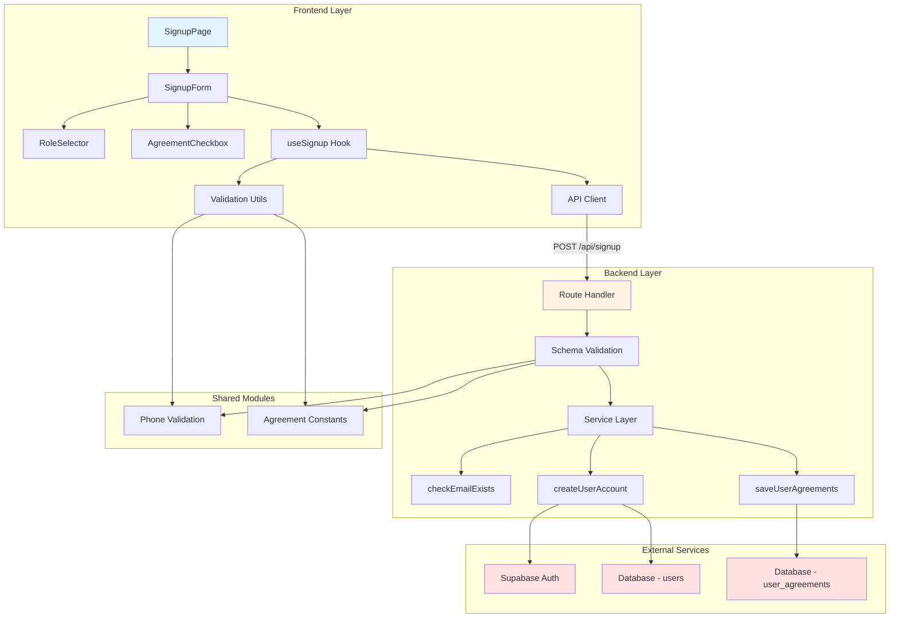

# UC-001 구현 계획: 회원가입 & 역할선택

## 개요

### Backend Modules

| 모듈 | 위치 | 설명 |
|------|------|------|
| Schema | `src/features/signup/backend/schema.ts` | 회원가입 요청/응답 Zod 스키마 정의 |
| Error Codes | `src/features/signup/backend/error.ts` | 회원가입 관련 에러 코드 상수 |
| Service Layer | `src/features/signup/backend/service.ts` | Supabase를 통한 계정 생성 및 프로필 저장 로직 |
| Route Handler | `src/features/signup/backend/route.ts` | POST /api/signup 엔드포인트 정의 |
| Route Registration | `src/backend/hono/app.ts` | Hono 앱에 signup 라우터 등록 (수정) |

### Frontend Modules

| 모듈 | 위치 | 설명 |
|------|------|------|
| Signup Form | `src/features/signup/components/signup-form.tsx` | 기본 정보 입력 폼 컴포넌트 |
| Agreement Checkbox | `src/features/signup/components/agreement-checkbox.tsx` | 재사용 가능한 약관 동의 체크박스 |
| Role Selector | `src/features/signup/components/role-selector.tsx` | 역할 선택 라디오 버튼 그룹 |
| Signup Hook | `src/features/signup/hooks/useSignup.ts` | React Query useMutation 기반 회원가입 훅 |
| DTO Export | `src/features/signup/lib/dto.ts` | 백엔드 스키마 타입 재노출 |
| Validation Utils | `src/features/signup/lib/validation.ts` | 클라이언트 측 폼 검증 유틸리티 |
| Signup Page | `src/app/signup/page.tsx` | 회원가입 페이지 (수정) |

### Shared Modules

| 모듈 | 위치 | 설명 |
|------|------|------|
| Phone Validation | `src/lib/validation/phone.ts` | 휴대폰번호 형식 검증 (한국 형식) |
| Agreement Constants | `src/constants/agreements.ts` | 약관 타입 상수 정의 |

### Database

기존 마이그레이션 `0002_create_main_schema.sql`에서 이미 생성된 테이블 사용:
- `users`: 사용자 기본 정보
- `user_agreements`: 약관 동의 이력

---

## Diagram



---

## Implementation Plan

### 1. Shared Modules

#### 1.1 `src/constants/agreements.ts`
**Purpose**: 약관 타입 상수 정의

**Implementation**:
```typescript
export const AGREEMENT_TYPES = {
  TERMS_OF_SERVICE: 'terms_of_service',
  PRIVACY_POLICY: 'privacy_policy',
  MARKETING: 'marketing',
} as const;

export type AgreementType = (typeof AGREEMENT_TYPES)[keyof typeof AGREEMENT_TYPES];

export const REQUIRED_AGREEMENTS: AgreementType[] = [
  AGREEMENT_TYPES.TERMS_OF_SERVICE,
  AGREEMENT_TYPES.PRIVACY_POLICY,
];
```

#### 1.2 `src/lib/validation/phone.ts`
**Purpose**: 한국 휴대폰번호 형식 검증

**Implementation**:
```typescript
export const PHONE_REGEX = /^01[016789]-?\d{3,4}-?\d{4}$/;

export const isValidPhoneNumber = (phone: string): boolean => {
  return PHONE_REGEX.test(phone.replace(/\s/g, ''));
};

export const formatPhoneNumber = (phone: string): string => {
  const cleaned = phone.replace(/\D/g, '');
  const match = cleaned.match(/^(\d{3})(\d{3,4})(\d{4})$/);

  if (match) {
    return `${match[1]}-${match[2]}-${match[3]}`;
  }

  return phone;
};
```

**Unit Tests**:
- 유효한 휴대폰번호 형식 검증 (010-1234-5678, 01012345678)
- 잘못된 형식 거부 (02-1234-5678, 010-12-34)
- formatPhoneNumber 정규화 테스트

---

### 2. Backend Implementation

#### 2.1 `src/features/signup/backend/error.ts`
**Purpose**: 회원가입 에러 코드 정의

**Implementation**:
```typescript
export const signupErrorCodes = {
  emailAlreadyExists: 'SIGNUP_EMAIL_ALREADY_EXISTS',
  invalidInput: 'SIGNUP_INVALID_INPUT',
  authCreationFailed: 'SIGNUP_AUTH_CREATION_FAILED',
  databaseError: 'SIGNUP_DATABASE_ERROR',
  rateLimitExceeded: 'SIGNUP_RATE_LIMIT_EXCEEDED',
  weakPassword: 'SIGNUP_WEAK_PASSWORD',
  invalidPhone: 'SIGNUP_INVALID_PHONE',
} as const;

type SignupErrorValue = (typeof signupErrorCodes)[keyof typeof signupErrorCodes];

export type SignupServiceError = SignupErrorValue;
```

#### 2.2 `src/features/signup/backend/schema.ts`
**Purpose**: 요청/응답 스키마 정의

**Implementation**:
```typescript
import { z } from 'zod';
import { AGREEMENT_TYPES } from '@/constants/agreements';

// 요청 스키마
export const AgreementInputSchema = z.object({
  type: z.enum([
    AGREEMENT_TYPES.TERMS_OF_SERVICE,
    AGREEMENT_TYPES.PRIVACY_POLICY,
    AGREEMENT_TYPES.MARKETING,
  ]),
  agreed: z.boolean(),
});

export const SignupRequestSchema = z.object({
  name: z.string().min(2, '이름은 최소 2자 이상이어야 합니다.').max(100),
  phone: z.string().regex(/^01[016789]-?\d{3,4}-?\d{4}$/, '올바른 휴대폰번호 형식이 아닙니다.'),
  email: z.string().email('올바른 이메일 형식이 아닙니다.'),
  password: z.string().min(8, '비밀번호는 최소 8자 이상이어야 합니다.'),
  role: z.enum(['influencer', 'advertiser'], {
    errorMap: () => ({ message: '역할은 influencer 또는 advertiser여야 합니다.' }),
  }),
  agreements: z.array(AgreementInputSchema).min(1, '최소 하나의 약관에 동의해야 합니다.'),
});

export type SignupRequest = z.infer<typeof SignupRequestSchema>;
export type AgreementInput = z.infer<typeof AgreementInputSchema>;

// 응답 스키마
export const SignupResponseSchema = z.object({
  userId: z.string().uuid(),
  role: z.enum(['influencer', 'advertiser']),
  requiresEmailVerification: z.boolean(),
  message: z.string(),
});

export type SignupResponse = z.infer<typeof SignupResponseSchema>;

// DB Row 스키마
export const UserRowSchema = z.object({
  id: z.string().uuid(),
  auth_id: z.string().uuid(),
  name: z.string(),
  phone: z.string(),
  email: z.string(),
  role: z.enum(['influencer', 'advertiser']),
  created_at: z.string(),
  updated_at: z.string(),
});

export type UserRow = z.infer<typeof UserRowSchema>;
```

#### 2.3 `src/features/signup/backend/service.ts`
**Purpose**: Supabase를 통한 계정 생성 및 데이터 저장

**Implementation**:
```typescript
import type { SupabaseClient } from '@supabase/supabase-js';
import { failure, success, type HandlerResult } from '@/backend/http/response';
import type { SignupRequest, SignupResponse } from './schema';
import { signupErrorCodes, type SignupServiceError } from './error';
import { formatPhoneNumber } from '@/lib/validation/phone';
import { REQUIRED_AGREEMENTS } from '@/constants/agreements';

const USERS_TABLE = 'users';
const USER_AGREEMENTS_TABLE = 'user_agreements';

export const checkEmailExists = async (
  client: SupabaseClient,
  email: string,
): Promise<HandlerResult<boolean, SignupServiceError, unknown>> => {
  const { data, error } = await client
    .from(USERS_TABLE)
    .select('email')
    .eq('email', email)
    .maybeSingle();

  if (error) {
    return failure(500, signupErrorCodes.databaseError, error.message);
  }

  return success(data !== null);
};

const validateRequiredAgreements = (
  agreements: SignupRequest['agreements'],
): boolean => {
  const agreedTypes = agreements
    .filter((a) => a.agreed)
    .map((a) => a.type);

  return REQUIRED_AGREEMENTS.every((required) =>
    agreedTypes.includes(required),
  );
};

export const createUserAccount = async (
  client: SupabaseClient,
  signupData: SignupRequest,
): Promise<HandlerResult<SignupResponse, SignupServiceError, unknown>> => {
  // 1. 필수 약관 동의 확인
  if (!validateRequiredAgreements(signupData.agreements)) {
    return failure(
      400,
      signupErrorCodes.invalidInput,
      '필수 약관에 모두 동의해야 합니다.',
    );
  }

  // 2. 이메일 중복 확인
  const emailCheckResult = await checkEmailExists(client, signupData.email);

  if (!emailCheckResult.ok) {
    return emailCheckResult as HandlerResult<SignupResponse, SignupServiceError, unknown>;
  }

  if (emailCheckResult.data) {
    return failure(
      400,
      signupErrorCodes.emailAlreadyExists,
      '이미 사용 중인 이메일입니다.',
    );
  }

  // 3. Supabase Auth 계정 생성
  const { data: authData, error: authError } = await client.auth.admin.createUser({
    email: signupData.email,
    password: signupData.password,
    email_confirm: false, // 이메일 인증 필요
  });

  if (authError || !authData.user) {
    return failure(
      500,
      signupErrorCodes.authCreationFailed,
      authError?.message ?? 'Auth 계정 생성에 실패했습니다.',
    );
  }

  const authId = authData.user.id;

  // 4. users 테이블에 프로필 생성
  const formattedPhone = formatPhoneNumber(signupData.phone);

  const { data: userData, error: userError } = await client
    .from(USERS_TABLE)
    .insert({
      auth_id: authId,
      name: signupData.name,
      phone: formattedPhone,
      email: signupData.email,
      role: signupData.role,
    })
    .select('id')
    .single();

  if (userError || !userData) {
    // Rollback: Auth 계정 삭제
    await client.auth.admin.deleteUser(authId);

    return failure(
      500,
      signupErrorCodes.databaseError,
      userError?.message ?? 'users 테이블 생성에 실패했습니다.',
    );
  }

  const userId = userData.id;

  // 5. user_agreements 저장
  const agreementRecords = signupData.agreements
    .filter((a) => a.agreed)
    .map((a) => ({
      user_id: userId,
      agreement_type: a.type,
      agreed: true,
    }));

  if (agreementRecords.length > 0) {
    const { error: agreementError } = await client
      .from(USER_AGREEMENTS_TABLE)
      .insert(agreementRecords);

    if (agreementError) {
      // Rollback은 복잡하므로 로그만 남기고 진행
      console.error('Failed to save agreements:', agreementError.message);
    }
  }

  return success({
    userId,
    role: signupData.role,
    requiresEmailVerification: true,
    message: '회원가입이 완료되었습니다. 이메일 인증 후 로그인해 주세요.',
  });
};
```

**Unit Tests**:
- `checkEmailExists`: 존재하는/존재하지 않는 이메일 테스트
- `createUserAccount`:
  - 정상 회원가입 플로우
  - 필수 약관 미동의 시 실패
  - 이메일 중복 시 실패
  - Auth 생성 실패 시 에러 반환
  - DB 오류 발생 시 Auth 계정 롤백

#### 2.4 `src/features/signup/backend/route.ts`
**Purpose**: POST /api/signup 엔드포인트

**Implementation**:
```typescript
import type { Hono } from 'hono';
import { failure, respond } from '@/backend/http/response';
import { getLogger, getSupabase, type AppEnv } from '@/backend/hono/context';
import { SignupRequestSchema } from './schema';
import { createUserAccount } from './service';

export const registerSignupRoutes = (app: Hono<AppEnv>) => {
  app.post('/signup', async (c) => {
    const body = await c.req.json();
    const parsedBody = SignupRequestSchema.safeParse(body);

    if (!parsedBody.success) {
      return respond(
        c,
        failure(
          400,
          'INVALID_SIGNUP_REQUEST',
          '입력값이 올바르지 않습니다.',
          parsedBody.error.format(),
        ),
      );
    }

    const supabase = getSupabase(c);
    const logger = getLogger(c);

    const result = await createUserAccount(supabase, parsedBody.data);

    if (!result.ok) {
      logger.error('Signup failed', { error: result.error });
    } else {
      logger.info('User signed up successfully', { userId: result.data.userId });
    }

    return respond(c, result);
  });
};
```

#### 2.5 `src/backend/hono/app.ts` (수정)
**Purpose**: signup 라우터 등록

**Changes**:
```typescript
// 추가
import { registerSignupRoutes } from '@/features/signup/backend/route';

// createHonoApp 함수 내부에 추가
registerSignupRoutes(app);
```

---

### 3. Frontend Implementation

#### 3.1 `src/features/signup/lib/dto.ts`
**Purpose**: 백엔드 스키마 재노출

**Implementation**:
```typescript
export {
  SignupRequestSchema,
  SignupResponseSchema,
  AgreementInputSchema,
  type SignupRequest,
  type SignupResponse,
  type AgreementInput,
} from '@/features/signup/backend/schema';
```

#### 3.2 `src/features/signup/lib/validation.ts`
**Purpose**: 클라이언트 측 검증 유틸리티

**Implementation**:
```typescript
import { isValidPhoneNumber } from '@/lib/validation/phone';

export const validateEmail = (email: string): string | null => {
  if (!email.trim()) return '이메일을 입력해주세요.';
  if (!/^[^\s@]+@[^\s@]+\.[^\s@]+$/.test(email)) {
    return '올바른 이메일 형식이 아닙니다.';
  }
  return null;
};

export const validatePassword = (password: string): string | null => {
  if (!password) return '비밀번호를 입력해주세요.';
  if (password.length < 8) return '비밀번호는 최소 8자 이상이어야 합니다.';
  return null;
};

export const validatePhone = (phone: string): string | null => {
  if (!phone.trim()) return '휴대폰번호를 입력해주세요.';
  if (!isValidPhoneNumber(phone)) {
    return '올바른 휴대폰번호 형식이 아닙니다. (예: 010-1234-5678)';
  }
  return null;
};

export const validateName = (name: string): string | null => {
  if (!name.trim()) return '이름을 입력해주세요.';
  if (name.length < 2) return '이름은 최소 2자 이상이어야 합니다.';
  return null;
};
```

#### 3.3 `src/features/signup/components/agreement-checkbox.tsx`
**Purpose**: 재사용 가능한 약관 동의 체크박스

**Implementation**:
```typescript
"use client";

import { Checkbox } from "@/components/ui/checkbox";
import { Label } from "@/components/ui/label";
import type { AgreementType } from "@/constants/agreements";

type AgreementCheckboxProps = {
  type: AgreementType;
  label: string;
  required?: boolean;
  checked: boolean;
  onCheckedChange: (checked: boolean) => void;
};

export const AgreementCheckbox = ({
  type,
  label,
  required = false,
  checked,
  onCheckedChange,
}: AgreementCheckboxProps) => {
  return (
    <div className="flex items-center space-x-2">
      <Checkbox
        id={type}
        checked={checked}
        onCheckedChange={onCheckedChange}
      />
      <Label htmlFor={type} className="text-sm">
        {label}
        {required && <span className="text-rose-500 ml-1">*</span>}
      </Label>
    </div>
  );
};
```

**QA Sheet**:
- [ ] 체크박스 클릭 시 상태 변경 확인
- [ ] 필수 항목에 빨간 별표 표시 확인
- [ ] label 클릭 시에도 체크박스 토글 확인

#### 3.4 `src/features/signup/components/role-selector.tsx`
**Purpose**: 역할 선택 라디오 버튼

**Implementation**:
```typescript
"use client";

import { Label } from "@/components/ui/label";

type Role = "influencer" | "advertiser";

type RoleSelectorProps = {
  value: Role | null;
  onChange: (role: Role) => void;
  error?: string | null;
};

export const RoleSelector = ({ value, onChange, error }: RoleSelectorProps) => {
  return (
    <div className="flex flex-col gap-2">
      <Label className="text-sm font-medium">
        역할 선택 <span className="text-rose-500">*</span>
      </Label>
      <div className="flex gap-4">
        <label className="flex items-center gap-2 cursor-pointer">
          <input
            type="radio"
            name="role"
            value="influencer"
            checked={value === "influencer"}
            onChange={() => onChange("influencer")}
            className="h-4 w-4"
          />
          <span className="text-sm">인플루언서</span>
        </label>
        <label className="flex items-center gap-2 cursor-pointer">
          <input
            type="radio"
            name="role"
            value="advertiser"
            checked={value === "advertiser"}
            onChange={() => onChange("advertiser")}
            className="h-4 w-4"
          />
          <span className="text-sm">광고주</span>
        </label>
      </div>
      {error && <p className="text-sm text-rose-500">{error}</p>}
    </div>
  );
};
```

**QA Sheet**:
- [ ] 라디오 버튼 클릭 시 단일 선택 확인
- [ ] label 클릭 시에도 선택 확인
- [ ] 에러 메시지 표시 확인

#### 3.5 `src/features/signup/hooks/useSignup.ts`
**Purpose**: React Query 회원가입 훅

**Implementation**:
```typescript
"use client";

import { useMutation } from "@tanstack/react-query";
import { apiClient, extractApiErrorMessage } from "@/lib/remote/api-client";
import type { SignupRequest, SignupResponse } from "../lib/dto";
import { SignupResponseSchema } from "../lib/dto";

const signup = async (data: SignupRequest): Promise<SignupResponse> => {
  try {
    const response = await apiClient.post("/api/signup", data);
    return SignupResponseSchema.parse(response.data);
  } catch (error) {
    const message = extractApiErrorMessage(error, "회원가입에 실패했습니다.");
    throw new Error(message);
  }
};

export const useSignup = () => {
  return useMutation({
    mutationFn: signup,
  });
};
```

#### 3.6 `src/features/signup/components/signup-form.tsx`
**Purpose**: 회원가입 폼 컴포넌트

**Implementation**:
```typescript
"use client";

import { useCallback, useState } from "react";
import { useRouter } from "next/navigation";
import { Input } from "@/components/ui/input";
import { Label } from "@/components/ui/label";
import { Button } from "@/components/ui/button";
import { useSignup } from "../hooks/useSignup";
import { AgreementCheckbox } from "./agreement-checkbox";
import { RoleSelector } from "./role-selector";
import { AGREEMENT_TYPES, REQUIRED_AGREEMENTS } from "@/constants/agreements";
import type { AgreementInput } from "../lib/dto";
import {
  validateEmail,
  validatePassword,
  validatePhone,
  validateName,
} from "../lib/validation";

type FormState = {
  name: string;
  phone: string;
  email: string;
  password: string;
  confirmPassword: string;
  role: "influencer" | "advertiser" | null;
  agreements: AgreementInput[];
};

const defaultFormState: FormState = {
  name: "",
  phone: "",
  email: "",
  password: "",
  confirmPassword: "",
  role: null,
  agreements: [],
};

export const SignupForm = () => {
  const router = useRouter();
  const [formState, setFormState] = useState<FormState>(defaultFormState);
  const [errors, setErrors] = useState<Partial<Record<keyof FormState, string>>>({});
  const { mutate, isPending, error: mutationError } = useSignup();

  const updateField = useCallback((field: keyof FormState, value: unknown) => {
    setFormState((prev) => ({ ...prev, [field]: value }));
    setErrors((prev) => ({ ...prev, [field]: undefined }));
  }, []);

  const toggleAgreement = useCallback((type: string, checked: boolean) => {
    setFormState((prev) => {
      const filtered = prev.agreements.filter((a) => a.type !== type);
      if (checked) {
        return {
          ...prev,
          agreements: [...filtered, { type, agreed: true }],
        };
      }
      return { ...prev, agreements: filtered };
    });
  }, []);

  const validate = useCallback((): boolean => {
    const newErrors: Partial<Record<keyof FormState, string>> = {};

    const nameError = validateName(formState.name);
    if (nameError) newErrors.name = nameError;

    const phoneError = validatePhone(formState.phone);
    if (phoneError) newErrors.phone = phoneError;

    const emailError = validateEmail(formState.email);
    if (emailError) newErrors.email = emailError;

    const passwordError = validatePassword(formState.password);
    if (passwordError) newErrors.password = passwordError;

    if (formState.password !== formState.confirmPassword) {
      newErrors.confirmPassword = "비밀번호가 일치하지 않습니다.";
    }

    if (!formState.role) {
      newErrors.role = "역할을 선택해주세요.";
    }

    const agreedTypes = formState.agreements
      .filter((a) => a.agreed)
      .map((a) => a.type);
    const missingRequired = REQUIRED_AGREEMENTS.some(
      (req) => !agreedTypes.includes(req),
    );
    if (missingRequired) {
      newErrors.agreements = "필수 약관에 모두 동의해주세요.";
    }

    setErrors(newErrors);
    return Object.keys(newErrors).length === 0;
  }, [formState]);

  const handleSubmit = useCallback(
    (e: React.FormEvent) => {
      e.preventDefault();

      if (!validate()) return;

      mutate(
        {
          name: formState.name,
          phone: formState.phone,
          email: formState.email,
          password: formState.password,
          role: formState.role!,
          agreements: formState.agreements,
        },
        {
          onSuccess: (data) => {
            if (data.role === "influencer") {
              router.push("/onboarding/influencer");
            } else {
              router.push("/onboarding/advertiser");
            }
          },
        },
      );
    },
    [formState, mutate, router, validate],
  );

  const isAgreementChecked = useCallback(
    (type: string) => {
      return formState.agreements.some((a) => a.type === type && a.agreed);
    },
    [formState.agreements],
  );

  return (
    <form onSubmit={handleSubmit} className="flex flex-col gap-4">
      <div className="flex flex-col gap-2">
        <Label htmlFor="name">
          이름 <span className="text-rose-500">*</span>
        </Label>
        <Input
          id="name"
          type="text"
          value={formState.name}
          onChange={(e) => updateField("name", e.target.value)}
          placeholder="홍길동"
        />
        {errors.name && <p className="text-sm text-rose-500">{errors.name}</p>}
      </div>

      <div className="flex flex-col gap-2">
        <Label htmlFor="phone">
          휴대폰번호 <span className="text-rose-500">*</span>
        </Label>
        <Input
          id="phone"
          type="tel"
          value={formState.phone}
          onChange={(e) => updateField("phone", e.target.value)}
          placeholder="010-1234-5678"
        />
        {errors.phone && <p className="text-sm text-rose-500">{errors.phone}</p>}
      </div>

      <div className="flex flex-col gap-2">
        <Label htmlFor="email">
          이메일 <span className="text-rose-500">*</span>
        </Label>
        <Input
          id="email"
          type="email"
          value={formState.email}
          onChange={(e) => updateField("email", e.target.value)}
          placeholder="example@email.com"
        />
        {errors.email && <p className="text-sm text-rose-500">{errors.email}</p>}
      </div>

      <div className="flex flex-col gap-2">
        <Label htmlFor="password">
          비밀번호 <span className="text-rose-500">*</span>
        </Label>
        <Input
          id="password"
          type="password"
          value={formState.password}
          onChange={(e) => updateField("password", e.target.value)}
          placeholder="최소 8자 이상"
        />
        {errors.password && (
          <p className="text-sm text-rose-500">{errors.password}</p>
        )}
      </div>

      <div className="flex flex-col gap-2">
        <Label htmlFor="confirmPassword">
          비밀번호 확인 <span className="text-rose-500">*</span>
        </Label>
        <Input
          id="confirmPassword"
          type="password"
          value={formState.confirmPassword}
          onChange={(e) => updateField("confirmPassword", e.target.value)}
          placeholder="비밀번호를 다시 입력해주세요"
        />
        {errors.confirmPassword && (
          <p className="text-sm text-rose-500">{errors.confirmPassword}</p>
        )}
      </div>

      <RoleSelector
        value={formState.role}
        onChange={(role) => updateField("role", role)}
        error={errors.role}
      />

      <div className="flex flex-col gap-2 border-t pt-4">
        <Label className="font-medium">약관 동의</Label>
        <AgreementCheckbox
          type={AGREEMENT_TYPES.TERMS_OF_SERVICE}
          label="이용약관 동의"
          required
          checked={isAgreementChecked(AGREEMENT_TYPES.TERMS_OF_SERVICE)}
          onCheckedChange={(checked) =>
            toggleAgreement(AGREEMENT_TYPES.TERMS_OF_SERVICE, checked)
          }
        />
        <AgreementCheckbox
          type={AGREEMENT_TYPES.PRIVACY_POLICY}
          label="개인정보 처리방침 동의"
          required
          checked={isAgreementChecked(AGREEMENT_TYPES.PRIVACY_POLICY)}
          onCheckedChange={(checked) =>
            toggleAgreement(AGREEMENT_TYPES.PRIVACY_POLICY, checked)
          }
        />
        <AgreementCheckbox
          type={AGREEMENT_TYPES.MARKETING}
          label="마케팅 정보 수신 동의 (선택)"
          checked={isAgreementChecked(AGREEMENT_TYPES.MARKETING)}
          onCheckedChange={(checked) =>
            toggleAgreement(AGREEMENT_TYPES.MARKETING, checked)
          }
        />
        {errors.agreements && (
          <p className="text-sm text-rose-500">{errors.agreements}</p>
        )}
      </div>

      {mutationError && (
        <p className="text-sm text-rose-500">{mutationError.message}</p>
      )}

      <Button type="submit" disabled={isPending} className="w-full">
        {isPending ? "회원가입 중..." : "회원가입"}
      </Button>
    </form>
  );
};
```

**QA Sheet**:
- [ ] 모든 필수 입력값 미입력 시 제출 불가 확인
- [ ] 각 필드별 실시간 검증 확인
- [ ] 비밀번호 불일치 시 에러 메시지 표시
- [ ] 역할 미선택 시 에러 메시지 표시
- [ ] 필수 약관 미동의 시 에러 메시지 표시
- [ ] 회원가입 성공 시 역할별 리디렉션 확인 (인플루언서 → /onboarding/influencer, 광고주 → /onboarding/advertiser)
- [ ] 중복 이메일 에러 처리 확인
- [ ] 제출 중 버튼 비활성화 확인

#### 3.7 `src/app/signup/page.tsx` (수정)
**Purpose**: 회원가입 페이지

**Implementation**:
```typescript
"use client";

import { useEffect } from "react";
import Image from "next/image";
import Link from "next/link";
import { useRouter } from "next/navigation";
import { useCurrentUser } from "@/features/auth/hooks/useCurrentUser";
import { SignupForm } from "@/features/signup/components/signup-form";

type SignupPageProps = {
  params: Promise<Record<string, never>>;
};

export default function SignupPage({ params }: SignupPageProps) {
  void params;
  const router = useRouter();
  const { isAuthenticated } = useCurrentUser();

  useEffect(() => {
    if (isAuthenticated) {
      router.replace("/");
    }
  }, [isAuthenticated, router]);

  if (isAuthenticated) {
    return null;
  }

  return (
    <div className="mx-auto flex min-h-screen w-full max-w-4xl flex-col items-center justify-center gap-10 px-6 py-16">
      <header className="flex flex-col items-center gap-3 text-center">
        <h1 className="text-3xl font-semibold">회원가입</h1>
        <p className="text-slate-500">
          블로그 체험단 플랫폼에 오신 것을 환영합니다.
        </p>
      </header>
      <div className="grid w-full gap-8 md:grid-cols-2">
        <div className="rounded-xl border border-slate-200 p-6 shadow-sm">
          <SignupForm />
          <p className="mt-4 text-xs text-slate-500">
            이미 계정이 있으신가요?{" "}
            <Link
              href="/login"
              className="font-medium text-slate-700 underline hover:text-slate-900"
            >
              로그인으로 이동
            </Link>
          </p>
        </div>
        <figure className="overflow-hidden rounded-xl border border-slate-200">
          <Image
            src="https://picsum.photos/seed/signup/640/640"
            alt="회원가입"
            width={640}
            height={640}
            className="h-full w-full object-cover"
            priority
          />
        </figure>
      </div>
    </div>
  );
}
```

**QA Sheet**:
- [ ] 인증된 사용자 접근 시 자동 리디렉션 확인
- [ ] 레이아웃 및 반응형 디자인 확인
- [ ] 이미지 로딩 확인

---

## Additional Notes

### Database Migration
기존 `0002_create_main_schema.sql`에서 필요한 테이블이 이미 생성되어 있으므로 추가 migration 불필요.

### API Endpoint
- `POST /api/signup`: 회원가입 엔드포인트

### Redirect Routes (미구현, 추후 작업)
- `/onboarding/influencer`: 인플루언서 정보 입력 페이지 (UC-002)
- `/onboarding/advertiser`: 광고주 정보 입력 페이지 (UC-003)

### Rate Limiting (Optional, 추후 고려)
현재 구현에서는 레이트 리밋을 포함하지 않음. 프로덕션 환경에서는 IP 기반 레이트 리밋 미들웨어를 추가하는 것을 권장.

### Email Verification
현재 구현에서는 Supabase Auth의 기본 이메일 인증 플로우를 사용. 추후 커스텀 이메일 템플릿 적용 가능.
