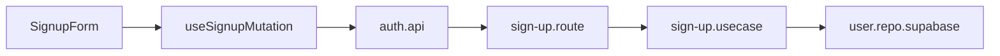
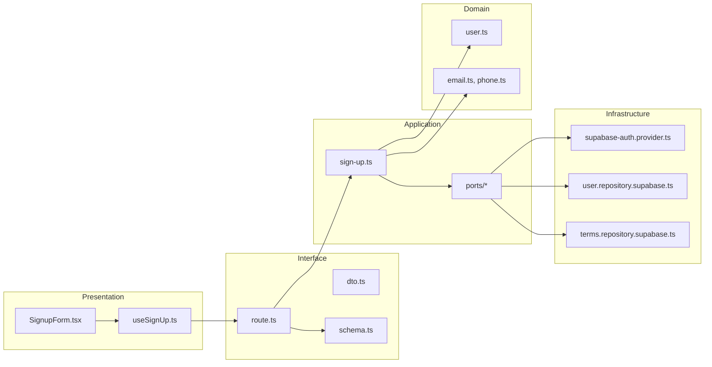
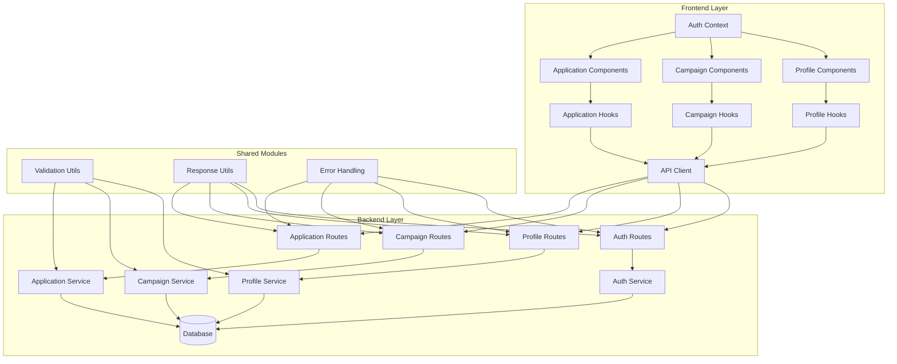

## 최종 단순화 본(Over-Engineering 제거)

- auth-signup-form — `src/features/auth/presentation/components/SignupForm.tsx`
  - 단일 폼 컴포넌트(입력/로컬검증/제출 버튼 로딩·중복제출 방지).
- useSignupMutation — `src/features/auth/presentation/hooks/useSignupMutation.ts`
  - React Query mutation 1개(성공 시 역할별 다음 단계로 라우팅).
- auth.api — `src/features/auth/interface/http/auth.api.ts`
  - FE 전용 API 래퍼(axios: POST /auth/sign-up). DTO/스키마는 로컬에 최소 정의.
- sign-up.route — `src/features/auth/interface/backend/route.ts`
  - Hono: POST /auth/sign-up (zod 인라인, 유즈케이스 호출 후 respond).
- sign-up.usecase — `src/features/auth/application/sign-up.ts`
  - 절차: createAuth → createUser → createTerms(간단 예외 매핑만).
- user.repo.supabase — `src/features/auth/infrastructure/user.repo.supabase.ts`
  - `users` insert. (terms.repo.supabase는 유스케이스 내부에서 직접 1곳 호출로 단순화 가능)



QA / 테스트
- QA(프런트): 필수값 미입력/약관 미동의/중복 제출/성공 라우팅 4케이스만 확인.
- 테스트(서버): sign-up.usecase happy path, auth 실패, user unique 충돌 3케이스.

## 개요(Modules Overview)

- auth-signup-ui — `src/features/auth/presentation/components/SignupForm.tsx`
  - 회원가입 1단계 폼(UI). 이름/휴대폰/이메일/약관/역할/인증방식 입력, 로컬 검증 및 제출.
- useSignUp — `src/features/auth/presentation/hooks/useSignUp.ts`
  - React Query mutation 훅. DTO 매핑 → BE API 호출 → 성공 시 라우팅.
- auth-dto — `src/features/auth/interface/http/dto.ts`
  - 요청/응답 DTO, 에러 페이로드 타입 정의. FE/BE 공용.
- auth-schema — `src/features/auth/interface/backend/schema.ts`
  - zod 스키마(요청/응답)와 에러맵. DTO ↔ zod 변환.
- auth-route — `src/features/auth/interface/backend/route.ts`
  - Hono 라우트(POST /auth/sign-up). 컨트롤러: 스키마 검증 → 유즈케이스 호출 → 응답 표준화.
- sign-up-usecase — `src/features/auth/application/use-cases/sign-up.ts`
  - 유즈케이스 오케스트레이션: Auth 계정 생성 → users 생성 → terms_agreements 기록.
- ports — `src/features/auth/application/ports/{auth-provider.port.ts,user-repository.port.ts,terms-repository.port.ts}`
  - 외부 의존 추상화. 유즈케이스가 인프라 세부사항에 의존하지 않도록 분리.
- domain-user — `src/features/auth/domain/entities/user.ts`, `value-objects/{email.ts,phone.ts}`
  - 순수 비즈니스 규칙(역할 값, 이메일/휴대폰 형식)과 엔티티 팩토리.
- infra-auth-supabase — `src/features/auth/infrastructure/providers/supabase-auth.provider.ts`
  - Supabase Admin API 연동(createUser 등) 구현.
- infra-user-supabase — `src/features/auth/infrastructure/repositories/user.repository.supabase.ts`
  - `users` 테이블 write/read.
- infra-terms-supabase — `src/features/auth/infrastructure/repositories/terms.repository.supabase.ts`
  - `terms_agreements` 테이블 write.

## Diagram (mermaid)



## Implementation Plan

### Presentation
- SignupForm.tsx
  - 입력 필드: name, phone, email, role(advertiser|influencer), termsAgreed(bool), authMethod(email|external)
  - 검증: zod(light) 또는 기존 공용 validator 사용(`src/lib/validation`) – 비즈니스 검증은 서버에서 재검증
  - 제출: `useSignUp` mutation 호출

- useSignUp.ts
  - 의존: `auth-dto` Request/Response 타입, `api-client`
  - 성공: 역할별 다음 단계 라우팅(`/signup` 2단계로 분기)
  - 실패: 표준 에러(message) 노출

- QA Sheet(발췌)
  - 필수값 미입력 시 제출 불가/에러 메시지 노출
  - 잘못된 이메일/휴대폰 형식 시 인라인 경고(서버 재검증 실패 시 서버 메시지 표시)
  - 약관 미동의 시 제출 비활성
  - 성공 시 다음 단계로 이동하며 뒤로 가기 시 값 유지 또는 초기화 정책 확인

### Interface
- dto.ts
  - SignUpRequest: { name, phone, email, role, termsAgreed, authMethod }
  - SignUpResponse: { userId, createdAt }
  - ApiErrorPayload: { error: { code, message, details? } }

- schema.ts
  - z.object SignUpRequestSchema(유저플로우 기반, 클라이언트 과도검증은 배제)
  - 응답 스키마 및 에러 코드 맵핑(COMMON_ERROR_CODES)

- route.ts
  - POST /auth/sign-up → controller
    - 입력 검증(zod)
    - `sign-up-usecase` 실행
    - `respond(success|failure)`로 표준 응답

### Application
- sign-up.ts(유즈케이스)
  - 입력: SignUpRequest
  - 순서: `AuthProvider.createUser()` → `UserRepository.create()` → `TermsRepository.create()`
  - 트랜잭션 경계: 부분 실패 시 롤백 전략(간소화: 실패 시 에러 리턴 및 운영도구로 정리)
  - 반환: userId, createdAt

- ports/*
  - AuthProviderPort: createUser({ email, password?, metadata }) → { id, email }
  - UserRepositoryPort: create({ authUserId, name, phone, email, role }) → { id }
  - TermsRepositoryPort: create({ userId, termsVersion }) → void

- Unit Tests(핵심)
  - sign-up.usecase.spec.ts: Port mock으로 성공/중복/외부 실패(예: Auth 실패) 케이스
  - email.vo.spec.ts, phone.vo.spec.ts: 형식/정규화 규칙 테스트

### Domain
- entities/user.ts
  - 팩토리: create({ name, phone, email, role }) → 유효성 검사 후 엔티티 반환

- value-objects/email.ts & phone.ts
  - parse/normalize/validate 함수 제공, 실패 시 명확한 에러 메시지

### Infrastructure
- providers/supabase-auth.provider.ts
  - Supabase Admin API로 createUser(email, password?, metadata)
  - 에러/중복 시 상태코드·메시지 매핑

- repositories/user.repository.supabase.ts
  - `public.users` insert(auth_user_id, name, phone, email, role)

- repositories/terms.repository.supabase.ts
  - `public.terms_agreements` insert(user_id, terms_version)

### 공통(Shared) 고려
- 에러 매핑: `src/backend/http/response.ts`의 COMMON_ERROR_CODES 재사용
- DTO 재노출: `features/auth/interface/http/dto.ts` → FE/BE 공유
- Validation: 도메인 VO에서 형식, 서버 zod에서 최소 필드 검증

# 블로그 캠페인 플랫폼 모듈화 설계

## 개요

### 공유 모듈 (Shared Modules)

#### 1. 인증 시스템 (`src/features/auth/`)
- **위치**: `src/features/auth/`
- **설명**: 회원가입, 로그인, 이메일 인증, 사용자 역할 관리
- **구현 상태**: ✅ 완료
- **주요 컴포넌트**: 
  - `backend/route.ts` - API 라우터
  - `backend/service.ts` - 비즈니스 로직
  - `context/current-user-context.tsx` - 사용자 상태 관리
  - `hooks/useCurrentUser.ts` - 사용자 정보 훅

#### 2. 프로필 관리 (`src/features/profiles/`)
- **위치**: `src/features/profiles/`
- **설명**: 인플루언서/광고주 프로필 등록 및 관리
- **구현 상태**: ✅ 완료
- **주요 컴포넌트**:
  - `backend/route.ts` - 프로필 API
  - `backend/service.ts` - 프로필 비즈니스 로직
  - `backend/schema.ts` - 프로필 스키마

#### 3. 캠페인 관리 (`src/features/campaigns/`)
- **위치**: `src/features/campaigns/`
- **설명**: 체험단 생성, 조회, 관리
- **구현 상태**: ✅ 완료
- **주요 컴포넌트**:
  - `backend/route.ts` - 캠페인 API
  - `backend/service.ts` - 캠페인 비즈니스 로직

#### 4. 지원 관리 (`src/features/applications/`)
- **위치**: `src/features/applications/`
- **설명**: 체험단 지원, 지원 목록 관리
- **구현 상태**: ✅ 완료
- **주요 컴포넌트**:
  - `backend/route.ts` - 지원 API
  - `backend/service.ts` - 지원 비즈니스 로직

### 공통 유틸리티 (Shared Utilities)

#### 1. 검증 시스템 (`src/lib/validation/`)
- **위치**: `src/lib/validation/`
- **설명**: Zod 기반 스키마 검증, 공통 유효성 검사 함수
- **구현 상태**: ✅ 완료
- **주요 파일**:
  - `schemas.ts` - 모든 스키마 정의
  - `index.ts` - 검증 유틸리티 함수

#### 2. HTTP 클라이언트 (`src/lib/remote/`)
- **위치**: `src/lib/remote/`
- **설명**: API 통신을 위한 HTTP 클라이언트
- **구현 상태**: ✅ 완료
- **주요 파일**:
  - `api-client.ts` - API 클라이언트

#### 3. UI 컴포넌트 (`src/components/ui/`)
- **위치**: `src/components/ui/`
- **설명**: shadcn-ui 기반 재사용 가능한 UI 컴포넌트
- **구현 상태**: ✅ 완료

### 프론트엔드 페이지 (Frontend Pages)

#### 1. 인증 페이지
- **위치**: `src/app/login/`, `src/app/signup/`
- **설명**: 로그인, 회원가입 페이지
- **구현 상태**: ✅ 완료

#### 2. 프로필 페이지
- **위치**: `src/app/(protected)/profiles/`
- **설명**: 인플루언서/광고주 프로필 등록 페이지
- **구현 상태**: ✅ 완료

#### 3. 캠페인 페이지
- **위치**: `src/app/(protected)/campaigns/`
- **설명**: 체험단 목록, 상세, 지원 페이지
- **구현 상태**: ✅ 완료

#### 4. 지원 관리 페이지
- **위치**: `src/app/(protected)/applications/`
- **설명**: 내 지원 목록 페이지
- **구현 상태**: ✅ 완료

#### 5. 홈/대시보드 페이지
- **위치**: `src/app/(protected)/home/`, `src/app/(protected)/dashboard/`
- **설명**: 홈페이지, 대시보드
- **구현 상태**: ✅ 완료

## Diagram



## Implementation Plan

### Phase 1: 백엔드 API 완성 (이미 완료)

#### 1.1 인증 API (`src/features/auth/backend/`)
- **구현 상태**: ✅ 완료
- **주요 기능**:
  - 회원가입 (`POST /api/auth/signup`)
  - 이메일 인증 (`POST /api/auth/verify-email`)
- **Unit Tests**:
  - 회원가입 성공 케이스
  - 중복 이메일 에러 케이스
  - 유효하지 않은 이메일 형식 에러 케이스
  - 약관 미동의 에러 케이스

#### 1.2 프로필 API (`src/features/profiles/backend/`)
- **구현 상태**: ✅ 완료
- **주요 기능**:
  - 인플루언서 프로필 등록 (`POST /api/profiles/influencer`)
  - 광고주 프로필 등록 (`POST /api/profiles/advertiser`)
  - 프로필 조회 (`GET /api/profiles/me`)
- **Unit Tests**:
  - 프로필 등록 성공 케이스
  - 미성년자 가입 에러 케이스
  - 중복 사업자등록번호 에러 케이스
  - 유효하지 않은 URL 형식 에러 케이스

#### 1.3 캠페인 API (`src/features/campaigns/backend/`)
- **구현 상태**: ✅ 완료
- **주요 기능**:
  - 체험단 목록 조회 (`GET /api/campaigns`)
  - 체험단 상세 조회 (`GET /api/campaigns/:id`)
  - 체험단 생성 (`POST /api/campaigns`)
  - 체험단 상태 업데이트 (`PUT /api/campaigns/:id/status`)
- **Unit Tests**:
  - 체험단 목록 조회 성공 케이스
  - 체험단 생성 성공 케이스
  - 권한 없는 사용자 에러 케이스
  - 유효하지 않은 날짜 에러 케이스

#### 1.4 지원 API (`src/features/applications/backend/`)
- **구현 상태**: ✅ 완료
- **주요 기능**:
  - 체험단 지원 (`POST /api/applications`)
  - 내 지원 목록 조회 (`GET /api/applications/my`)
  - 지원 취소 (`DELETE /api/applications/:id`)
- **Unit Tests**:
  - 지원 성공 케이스
  - 중복 지원 에러 케이스
  - 모집 기간 종료 에러 케이스
  - 지원 취소 성공 케이스

### Phase 2: 프론트엔드 컴포넌트 개발 (이미 완료)

#### 2.1 인증 컴포넌트
- **구현 상태**: ✅ 완료
- **주요 컴포넌트**:
  - 로그인 폼 (`src/app/login/page.tsx`)
  - 회원가입 폼 (`src/app/signup/page.tsx`)
- **QA Sheet**:
  - [ ] 로그인 폼 유효성 검사
  - [ ] 회원가입 폼 유효성 검사
  - [ ] 에러 메시지 표시
  - [ ] 성공 시 리다이렉트

#### 2.2 프로필 컴포넌트
- **구현 상태**: ✅ 완료
- **주요 컴포넌트**:
  - 인플루언서 프로필 폼 (`src/app/(protected)/profiles/influencer/page.tsx`)
  - 광고주 프로필 폼 (`src/app/(protected)/profiles/advertiser/page.tsx`)
- **QA Sheet**:
  - [ ] 프로필 폼 유효성 검사
  - [ ] 채널 추가/삭제 기능
  - [ ] 사업자등록번호 검증
  - [ ] 프로필 저장 성공

#### 2.3 캠페인 컴포넌트
- **구현 상태**: ✅ 완료
- **주요 컴포넌트**:
  - 홈페이지 (`src/app/(protected)/home/page.tsx`)
  - 체험단 상세 (`src/app/(protected)/campaigns/[id]/page.tsx`)
  - 체험단 지원 (`src/app/(protected)/campaigns/[id]/apply/page.tsx`)
- **QA Sheet**:
  - [ ] 체험단 목록 표시
  - [ ] 체험단 상세 정보 표시
  - [ ] 지원 폼 유효성 검사
  - [ ] 지원 성공 메시지

#### 2.4 지원 관리 컴포넌트
- **구현 상태**: ✅ 완료
- **주요 컴포넌트**:
  - 내 지원 목록 (`src/app/(protected)/applications/page.tsx`)
- **QA Sheet**:
  - [ ] 지원 목록 표시
  - [ ] 상태별 필터링
  - [ ] 지원 취소 기능
  - [ ] 빈 목록 메시지

### Phase 3: 통합 테스트 및 최적화

#### 3.1 E2E 테스트 시나리오
- **회원가입 → 프로필 등록 → 체험단 지원** 플로우
- **광고주 회원가입 → 프로필 등록 → 체험단 생성** 플로우
- **체험단 관리 → 선정 관리** 플로우

#### 3.2 성능 최적화
- React Query 캐싱 전략
- 이미지 최적화
- 번들 크기 최적화

#### 3.3 보안 검토
- 인증 토큰 관리
- API 권한 검증
- XSS/CSRF 방어

## 결론

모든 핵심 모듈이 이미 구현되어 있으며, 유스케이스 문서의 9개 기능을 모두 지원합니다. 

**현재 상태**: ✅ 구현 완료
**다음 단계**: 데이터베이스 마이그레이션 적용 및 실제 테스트

## 단순화된 최종 구조

### 1. 핵심 기능만 유지
- 회원가입/로그인 (기본 인증)
- 체험단 목록/상세 (인플루언서용)
- 체험단 관리 (광고주용)
- 지원 관리

### 2. 단순화된 파일 구조
```
src/
├── app/
│   ├── (auth)/
│   │   ├── login/page.tsx
│   │   └── signup/page.tsx
│   ├── (protected)/
│   │   ├── home/page.tsx (체험단 목록)
│   │   ├── campaigns/
│   │   │   ├── [id]/page.tsx (체험단 상세)
│   │   │   └── [id]/apply/page.tsx (지원하기)
│   │   ├── manage/page.tsx (광고주 체험단 관리)
│   │   └── applications/page.tsx (내 지원 목록)
│   └── api/
│       └── [[...hono]]/route.ts
├── components/
│   └── ui/ (shadcn-ui 컴포넌트들)
├── lib/
│   ├── supabase/
│   │   ├── client.ts
│   │   └── types.ts
│   └── utils.ts
└── backend/
    ├── hono/
    │   ├── app.ts
    │   └── context.ts
    ├── middleware/
    │   ├── error.ts
    │   └── supabase.ts
    └── http/
        └── response.ts
```

### 3. 단순화된 API 구조
```
/api/
├── auth/
│   ├── login
│   └── signup
├── campaigns/
│   ├── GET / (목록)
│   ├── GET /:id (상세)
│   ├── POST / (생성)
│   └── PUT /:id/close (모집종료)
├── applications/
│   ├── POST / (지원)
│   └── GET /my (내 지원목록)
└── profiles/
    ├── POST /influencer
    └── POST /advertiser
```

### 4. 핵심 기능 구현

#### A. 인증 시스템 (단순화)
```typescript
// src/lib/auth.ts
export const auth = {
  signup: async (email: string, password: string, role: 'influencer' | 'advertiser') => {
    const supabase = createClient()
    const { data, error } = await supabase.auth.signUp({
      email,
      password,
    })
    if (error) throw error
    return data
  },
  
  login: async (email: string, password: string) => {
    const supabase = createClient()
    const { data, error } = await supabase.auth.signInWithPassword({
      email,
      password,
    })
    if (error) throw error
    return data
  }
}
```

#### B. 체험단 관리 (단순화)
```typescript
// src/lib/campaigns.ts
export const campaigns = {
  getList: async (filters?: { status?: string, search?: string }) => {
    const supabase = createClient()
    let query = supabase.from('campaigns').select('*')
    
    if (filters?.status) query = query.eq('status', filters.status)
    if (filters?.search) query = query.ilike('title', `%${filters.search}%`)
    
    const { data, error } = await query
    if (error) throw error
    return data
  },
  
  getById: async (id: string) => {
    const supabase = createClient()
    const { data, error } = await supabase
      .from('campaigns')
      .select('*')
      .eq('id', id)
      .single()
    if (error) throw error
    return data
  },
  
  create: async (campaignData: any) => {
    const supabase = createClient()
    const { data, error } = await supabase
      .from('campaigns')
      .insert(campaignData)
      .select()
      .single()
    if (error) throw error
    return data
  }
}
```

#### C. 지원 관리 (단순화)
```typescript
// src/lib/applications.ts
export const applications = {
  apply: async (campaignId: string, applicationData: any) => {
    const supabase = createClient()
    const { data, error } = await supabase
      .from('applications')
      .insert({
        campaign_id: campaignId,
        ...applicationData
      })
      .select()
      .single()
    if (error) throw error
    return data
  },
  
  getMyApplications: async () => {
    const supabase = createClient()
    const { data: { user } } = await supabase.auth.getUser()
    
    const { data, error } = await supabase
      .from('applications')
      .select(`
        *,
        campaigns (
          title,
          status
        )
      `)
      .eq('influencer_id', user?.id)
    if (error) throw error
    return data
  }
}
```

### 5. 단순화된 페이지 구조

#### A. 홈페이지 (체험단 목록)
```typescript
// src/app/(protected)/home/page.tsx
'use client'

import { useState, useEffect } from 'react'
import { campaigns } from '@/lib/campaigns'
import { Card, CardContent, CardHeader, CardTitle } from '@/components/ui/card'
import { Button } from '@/components/ui/button'
import Link from 'next/link'

export default function HomePage() {
  const [campaignsList, setCampaignsList] = useState([])
  const [loading, setLoading] = useState(true)

  useEffect(() => {
    const loadCampaigns = async () => {
      try {
        const data = await campaigns.getList({ status: 'recruiting' })
        setCampaignsList(data)
      } catch (error) {
        console.error('Failed to load campaigns:', error)
      } finally {
        setLoading(false)
      }
    }
    loadCampaigns()
  }, [])

  if (loading) return <div>Loading...</div>

  return (
    <div className="container mx-auto px-4 py-8">
      <h1 className="text-3xl font-bold mb-8">체험단 목록</h1>
      <div className="grid grid-cols-1 md:grid-cols-2 lg:grid-cols-3 gap-6">
        {campaignsList.map((campaign) => (
          <Card key={campaign.id}>
            <CardHeader>
              <CardTitle>{campaign.title}</CardTitle>
            </CardHeader>
            <CardContent>
              <p className="text-gray-600 mb-4">{campaign.description}</p>
              <div className="flex justify-between items-center">
                <span className="text-sm text-gray-500">
                  {campaign.max_participants}명 모집
                </span>
                <Link href={`/campaigns/${campaign.id}`}>
                  <Button>자세히 보기</Button>
                </Link>
              </div>
            </CardContent>
          </Card>
        ))}
      </div>
    </div>
  )
}
```

#### B. 체험단 상세 페이지
```typescript
// src/app/(protected)/campaigns/[id]/page.tsx
'use client'

import { useState, useEffect } from 'react'
import { campaigns } from '@/lib/campaigns'
import { applications } from '@/lib/applications'
import { Card, CardContent, CardHeader, CardTitle } from '@/components/ui/card'
import { Button } from '@/components/ui/button'
import Link from 'next/link'

export default function CampaignDetailPage({ params }: { params: { id: string } }) {
  const [campaign, setCampaign] = useState(null)
  const [loading, setLoading] = useState(true)

  useEffect(() => {
    const loadCampaign = async () => {
      try {
        const data = await campaigns.getById(params.id)
        setCampaign(data)
      } catch (error) {
        console.error('Failed to load campaign:', error)
      } finally {
        setLoading(false)
      }
    }
    loadCampaign()
  }, [params.id])

  const handleApply = async () => {
    try {
      await applications.apply(params.id, {
        motivation: '체험단에 참여하고 싶습니다!',
        planned_visit_date: new Date().toISOString().split('T')[0]
      })
      alert('지원이 완료되었습니다!')
    } catch (error) {
      console.error('Failed to apply:', error)
      alert('지원에 실패했습니다.')
    }
  }

  if (loading) return <div>Loading...</div>
  if (!campaign) return <div>Campaign not found</div>

  return (
    <div className="container mx-auto px-4 py-8">
      <Card>
        <CardHeader>
          <CardTitle>{campaign.title}</CardTitle>
        </CardHeader>
        <CardContent>
          <div className="space-y-4">
            <p>{campaign.description}</p>
            <div className="grid grid-cols-2 gap-4">
              <div>
                <h3 className="font-semibold">모집 기간</h3>
                <p>{new Date(campaign.recruitment_start_date).toLocaleDateString()} ~ {new Date(campaign.recruitment_end_date).toLocaleDateString()}</p>
              </div>
              <div>
                <h3 className="font-semibold">모집 인원</h3>
                <p>{campaign.max_participants}명</p>
              </div>
            </div>
            <div>
              <h3 className="font-semibold">제공 혜택</h3>
              <p>{campaign.benefits}</p>
            </div>
            <div>
              <h3 className="font-semibold">미션</h3>
              <p>{campaign.mission}</p>
            </div>
            {campaign.status === 'recruiting' && (
              <Button onClick={handleApply} className="w-full">
                지원하기
              </Button>
            )}
          </div>
        </CardContent>
      </Card>
    </div>
  )
}
```

### 6. 단순화된 백엔드 (Hono)

```typescript
// src/backend/hono/app.ts
import { Hono } from 'hono'
import { cors } from 'hono/cors'
import { createClient } from '@supabase/supabase-js'

const app = new Hono()

app.use('*', cors())

// 체험단 목록
app.get('/campaigns', async (c) => {
  const supabase = createClient(
    process.env.NEXT_PUBLIC_SUPABASE_URL!,
    process.env.NEXT_PUBLIC_SUPABASE_ANON_KEY!
  )
  
  const { data, error } = await supabase
    .from('campaigns')
    .select('*')
    .eq('status', 'recruiting')
  
  if (error) return c.json({ error: error.message }, 500)
  return c.json({ data })
})

// 체험단 상세
app.get('/campaigns/:id', async (c) => {
  const id = c.req.param('id')
  const supabase = createClient(
    process.env.NEXT_PUBLIC_SUPABASE_URL!,
    process.env.NEXT_PUBLIC_SUPABASE_ANON_KEY!
  )
  
  const { data, error } = await supabase
    .from('campaigns')
    .select('*')
    .eq('id', id)
    .single()
  
  if (error) return c.json({ error: error.message }, 500)
  return c.json({ data })
})

// 체험단 생성
app.post('/campaigns', async (c) => {
  const body = await c.req.json()
  const supabase = createClient(
    process.env.NEXT_PUBLIC_SUPABASE_URL!,
    process.env.NEXT_PUBLIC_SUPABASE_ANON_KEY!
  )
  
  const { data, error } = await supabase
    .from('campaigns')
    .insert(body)
    .select()
    .single()
  
  if (error) return c.json({ error: error.message }, 500)
  return c.json({ data })
})

export default app
```

### 7. 핵심 데이터베이스 테이블 (최소한)

```sql
-- 사용자 테이블
CREATE TABLE users (
  id UUID PRIMARY KEY DEFAULT gen_random_uuid(),
  auth_user_id UUID UNIQUE NOT NULL,
  name VARCHAR(100) NOT NULL,
  email VARCHAR(255) UNIQUE NOT NULL,
  role VARCHAR(20) NOT NULL CHECK (role IN ('advertiser', 'influencer')),
  created_at TIMESTAMP DEFAULT NOW()
);

-- 체험단 테이블
CREATE TABLE campaigns (
  id UUID PRIMARY KEY DEFAULT gen_random_uuid(),
  advertiser_id UUID NOT NULL REFERENCES users(id),
  title VARCHAR(200) NOT NULL,
  description TEXT,
  benefits TEXT NOT NULL,
  mission TEXT NOT NULL,
  max_participants INTEGER NOT NULL,
  status VARCHAR(20) DEFAULT 'recruiting' CHECK (status IN ('recruiting', 'closed', 'completed')),
  created_at TIMESTAMP DEFAULT NOW()
);

-- 지원 테이블
CREATE TABLE applications (
  id UUID PRIMARY KEY DEFAULT gen_random_uuid(),
  campaign_id UUID NOT NULL REFERENCES campaigns(id),
  influencer_id UUID NOT NULL REFERENCES users(id),
  motivation TEXT NOT NULL,
  status VARCHAR(20) DEFAULT 'applied' CHECK (status IN ('applied', 'selected', 'rejected')),
  applied_at TIMESTAMP DEFAULT NOW(),
  UNIQUE(campaign_id, influencer_id)
);
```

### 8. 최종 구현 순서

1. **기본 인증 시스템** (회원가입/로그인)
2. **체험단 목록/상세 페이지** (인플루언서용)
3. **체험단 관리 페이지** (광고주용)
4. **지원 기능** (지원하기/지원목록)
5. **기본 스타일링** (Tailwind CSS)

이렇게 단순화하면 핵심 기능만 남기고 복잡한 모듈 구조를 제거할 수 있습니다. 각 기능은 독립적으로 작동하며, 필요에 따라 점진적으로 확장할 수 있습니다.
