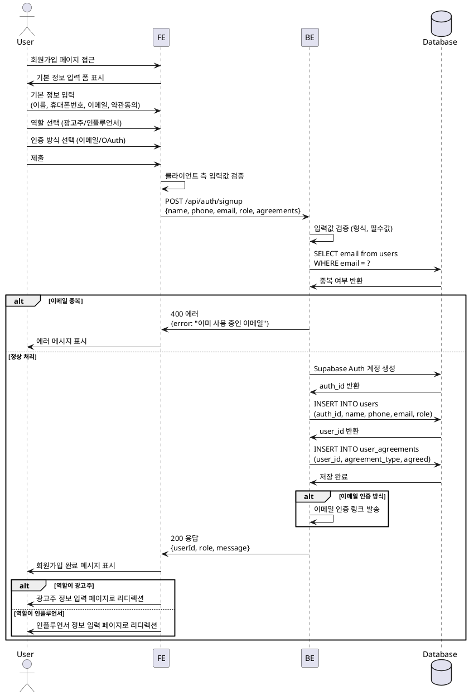

# UC-001: 회원가입 & 역할선택

## Primary Actor
- 신규 사용자 (광고주 또는 인플루언서)

## Precondition
- 사용자가 서비스에 가입하지 않은 상태
- 유효한 이메일 주소 보유

## Trigger
- 사용자가 회원가입 페이지에 접근하여 가입 프로세스 시작

## Main Scenario

1. 사용자가 회원가입 페이지 접근
2. 시스템이 기본 정보 입력 폼 표시 (이름, 휴대폰번호, 이메일, 약관동의)
3. 사용자가 기본 정보 입력 및 약관 동의
4. 사용자가 역할 선택 (광고주 / 인플루언서)
5. 사용자가 인증 방식 선택 (이메일 / 외부 OAuth)
6. 시스템이 입력값 검증 (형식, 필수값, 중복 여부)
7. 시스템이 Supabase Auth 계정 생성
8. 시스템이 users 테이블에 프로필 레코드 생성
9. 시스템이 user_agreements 테이블에 약관 동의 이력 저장
10. 시스템이 이메일 인증 링크 발송 (이메일 인증 방식인 경우)
11. 시스템이 회원가입 완료 피드백 표시
12. 시스템이 역할별 추가 정보 등록 페이지로 리디렉션
    - 광고주: 업체명, 위치, 카테고리, 사업자등록번호 입력 페이지
    - 인플루언서: 생년월일, SNS 채널 정보 입력 페이지

## Edge Cases

### E1. 중복 이메일
- **조건**: 입력한 이메일이 이미 가입된 경우
- **처리**: 에러 메시지 표시 ("이미 사용 중인 이메일입니다")

### E2. 약관 미동의
- **조건**: 필수 약관에 동의하지 않은 경우
- **처리**: 제출 버튼 비활성화 또는 에러 메시지 표시

### E3. 형식 오류
- **조건**: 이메일, 휴대폰번호 형식이 올바르지 않은 경우
- **처리**: 실시간 필드 검증 및 에러 메시지 표시

### E4. 레이트 리밋 초과
- **조건**: 동일 IP에서 짧은 시간 내 과도한 가입 시도
- **처리**: 일시적 차단 및 재시도 대기 메시지 표시

### E5. 이메일 인증 실패
- **조건**: 이메일 발송 실패 또는 인증 링크 만료
- **처리**: 재발송 옵션 제공

### E6. OAuth 인증 실패
- **조건**: 외부 OAuth 제공자 연동 실패
- **처리**: 에러 메시지 표시 및 재시도 옵션 제공

## Business Rules

### BR1. 필수 입력 정보
- 이름, 휴대폰번호, 이메일, 역할, 필수 약관 동의는 필수 입력

### BR2. 이메일 유일성
- 동일 이메일로 중복 가입 불가

### BR3. 역할 고정
- 회원가입 시 선택한 역할은 이후 변경 불가 (광고주 ↔ 인플루언서 전환 불가)

### BR4. 약관 동의 이력
- 약관 동의 일시 및 내용은 감사 목적으로 저장

### BR5. 이메일 인증
- 이메일 인증 완료 전까지 일부 기능 제한 가능

### BR6. 레이트 리밋
- 동일 IP에서 10분 내 5회 이상 가입 시도 시 일시 차단 (10분)

### BR7. 봇 방지
- reCAPTCHA 또는 유사 봇 방지 메커니즘 적용 권장

### BR8. 프로필 완성도
- 기본 회원가입 완료 후 역할별 추가 정보 미입력 시 체험단 지원/등록 제한

---

## Sequence Diagram

