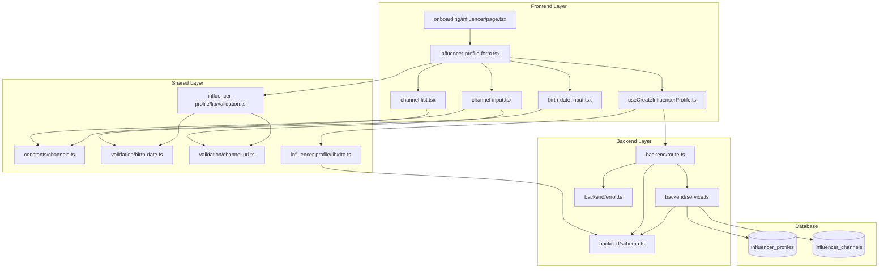

# UC-002: 인플루언서 정보 등록 - Implementation Plan

## 개요

인플루언서가 회원가입 후 프로필 정보(생년월일, SNS 채널)를 등록하는 기능을 구현합니다.

### 주요 모듈

| 모듈 | 위치 | 설명 |
|------|------|------|
| **Backend API** | `src/features/influencer-profile/backend/` | 프로필 생성 및 채널 저장 API |
| **Frontend Page** | `src/app/onboarding/influencer/` | 인플루언서 온보딩 페이지 |
| **Components** | `src/features/influencer-profile/components/` | 폼 컴포넌트 (생년월일, 채널 관리) |
| **Hooks** | `src/features/influencer-profile/hooks/` | React Query 훅 |
| **Shared Constants** | `src/constants/channels.ts` | 채널 유형, URL 패턴 정의 |
| **Shared Validation** | `src/lib/validation/` | 생년월일, 채널 URL 검증 로직 |

---

## Architecture Diagram



---

## Implementation Plan

### 1. Shared Layer

#### 1.1. `src/constants/channels.ts`

**목적**: 채널 유형 및 URL 패턴 정의

**구현 내용**:
```typescript
// 채널 유형 정의
export const CHANNEL_TYPES = {
  NAVER: 'naver',
  YOUTUBE: 'youtube',
  INSTAGRAM: 'instagram',
  THREADS: 'threads',
} as const;

// URL 패턴 정의
export const CHANNEL_URL_PATTERNS = {
  [CHANNEL_TYPES.NAVER]: /^https:\/\/blog\.naver\.com\/.+/,
  [CHANNEL_TYPES.YOUTUBE]: /^https:\/\/(www\.youtube\.com\/@|www\.youtube\.com\/c\/).+/,
  [CHANNEL_TYPES.INSTAGRAM]: /^https:\/\/www\.instagram\.com\/.+/,
  [CHANNEL_TYPES.THREADS]: /^https:\/\/www\.threads\.net\/@.+/,
} as const;

// 채널 표시명
export const CHANNEL_LABELS = {
  [CHANNEL_TYPES.NAVER]: '네이버 블로그',
  [CHANNEL_TYPES.YOUTUBE]: '유튜브',
  [CHANNEL_TYPES.INSTAGRAM]: '인스타그램',
  [CHANNEL_TYPES.THREADS]: '스레드',
} as const;
```

**Unit Test**:
- [ ] `CHANNEL_TYPES` 각 값이 유효한 문자열인지 확인
- [ ] `CHANNEL_URL_PATTERNS` 각 패턴이 올바른 정규식인지 확인

---

#### 1.2. `src/lib/validation/birth-date.ts`

**목적**: 생년월일 검증 로직

**구현 내용**:
```typescript
import { differenceInYears } from 'date-fns';

export const MIN_AGE = 14;

export const validateBirthDate = (birthDate: string | Date): string | null => {
  const date = typeof birthDate === 'string' ? new Date(birthDate) : birthDate;

  if (isNaN(date.getTime())) {
    return '올바른 날짜 형식이 아닙니다.';
  }

  if (date > new Date()) {
    return '생년월일은 오늘 이전 날짜여야 합니다.';
  }

  const age = differenceInYears(new Date(), date);
  if (age < MIN_AGE) {
    return `만 ${MIN_AGE}세 이상만 가입 가능합니다.`;
  }

  return null;
};

export const isValidBirthDate = (birthDate: string | Date): boolean => {
  return validateBirthDate(birthDate) === null;
};
```

**Unit Test**:
- [ ] 만 14세 이상인 경우 `null` 반환
- [ ] 만 14세 미만인 경우 에러 메시지 반환
- [ ] 미래 날짜인 경우 에러 메시지 반환
- [ ] 잘못된 날짜 형식인 경우 에러 메시지 반환

---

#### 1.3. `src/lib/validation/channel-url.ts`

**목적**: 채널별 URL 패턴 검증

**구현 내용**:
```typescript
import { CHANNEL_TYPES, CHANNEL_URL_PATTERNS } from '@/constants/channels';
import type { ChannelType } from '@/constants/channels';

export const validateChannelUrl = (
  channelType: ChannelType,
  url: string,
): string | null => {
  const pattern = CHANNEL_URL_PATTERNS[channelType];

  if (!pattern) {
    return '지원하지 않는 채널 유형입니다.';
  }

  if (!pattern.test(url)) {
    return `올바른 ${channelType} URL 형식이 아닙니다.`;
  }

  return null;
};

export const isValidChannelUrl = (
  channelType: ChannelType,
  url: string,
): boolean => {
  return validateChannelUrl(channelType, url) === null;
};
```

**Unit Test**:
- [ ] 네이버 블로그: `https://blog.naver.com/example` → 통과
- [ ] 네이버 블로그: `https://blog.naver.com/` → 실패
- [ ] 유튜브: `https://www.youtube.com/@example` → 통과
- [ ] 유튜브: `https://www.youtube.com/c/example` → 통과
- [ ] 유튜브: `https://www.youtube.com/watch?v=xxx` → 실패
- [ ] 인스타그램: `https://www.instagram.com/example` → 통과
- [ ] 스레드: `https://www.threads.net/@example` → 통과

---

### 2. Backend Layer

#### 2.1. `src/features/influencer-profile/backend/error.ts`

**목적**: 에러 코드 정의

**구현 내용**:
```typescript
export const influencerProfileErrorCodes = {
  invalidInput: 'INFLUENCER_PROFILE_INVALID_INPUT',
  databaseError: 'INFLUENCER_PROFILE_DATABASE_ERROR',
  profileAlreadyExists: 'INFLUENCER_PROFILE_ALREADY_EXISTS',
  invalidBirthDate: 'INFLUENCER_PROFILE_INVALID_BIRTH_DATE',
  invalidChannelUrl: 'INFLUENCER_PROFILE_INVALID_CHANNEL_URL',
  minChannelRequired: 'INFLUENCER_PROFILE_MIN_CHANNEL_REQUIRED',
  duplicateChannelUrl: 'INFLUENCER_PROFILE_DUPLICATE_CHANNEL_URL',
} as const;

type InfluencerProfileErrorValue = (typeof influencerProfileErrorCodes)[keyof typeof influencerProfileErrorCodes];

export type InfluencerProfileServiceError = InfluencerProfileErrorValue;
```

---

#### 2.2. `src/features/influencer-profile/backend/schema.ts`

**목적**: 요청/응답 Zod 스키마 정의

**구현 내용**:
```typescript
import { z } from 'zod';
import { CHANNEL_TYPES } from '@/constants/channels';

// 채널 입력 스키마
export const ChannelInputSchema = z.object({
  channelType: z.enum([
    CHANNEL_TYPES.NAVER,
    CHANNEL_TYPES.YOUTUBE,
    CHANNEL_TYPES.INSTAGRAM,
    CHANNEL_TYPES.THREADS,
  ]),
  channelName: z.string().min(1, '채널명을 입력해주세요.').max(255),
  channelUrl: z.string().url('올바른 URL 형식이 아닙니다.'),
});

export type ChannelInput = z.infer<typeof ChannelInputSchema>;

// 요청 스키마
export const CreateInfluencerProfileRequestSchema = z.object({
  userId: z.string().uuid('올바른 사용자 ID가 아닙니다.'),
  birthDate: z.string().regex(/^\d{4}-\d{2}-\d{2}$/, '올바른 날짜 형식이 아닙니다.'),
  channels: z.array(ChannelInputSchema).min(1, '최소 1개 이상의 채널을 등록해주세요.'),
});

export type CreateInfluencerProfileRequest = z.infer<typeof CreateInfluencerProfileRequestSchema>;

// 응답 스키마
export const CreateInfluencerProfileResponseSchema = z.object({
  profileId: z.string().uuid(),
  message: z.string(),
});

export type CreateInfluencerProfileResponse = z.infer<typeof CreateInfluencerProfileResponseSchema>;
```

**Unit Test**:
- [ ] 유효한 요청 데이터 파싱 성공
- [ ] 빈 채널 배열인 경우 실패
- [ ] 잘못된 UUID인 경우 실패
- [ ] 잘못된 날짜 형식인 경우 실패

---

#### 2.3. `src/features/influencer-profile/backend/service.ts`

**목적**: 프로필 생성 및 채널 저장 비즈니스 로직

**구현 내용**:
```typescript
import type { SupabaseClient } from '@supabase/supabase-js';
import { failure, success, type HandlerResult } from '@/backend/http/response';
import type { CreateInfluencerProfileRequest, CreateInfluencerProfileResponse } from './schema';
import { influencerProfileErrorCodes, type InfluencerProfileServiceError } from './error';
import { validateBirthDate } from '@/lib/validation/birth-date';
import { validateChannelUrl } from '@/lib/validation/channel-url';

const INFLUENCER_PROFILES_TABLE = 'influencer_profiles';
const INFLUENCER_CHANNELS_TABLE = 'influencer_channels';

// 1. 프로필 존재 확인
export const checkProfileExists = async (
  client: SupabaseClient,
  userId: string,
): Promise<HandlerResult<boolean, InfluencerProfileServiceError, unknown>> => {
  const { data, error } = await client
    .from(INFLUENCER_PROFILES_TABLE)
    .select('id')
    .eq('user_id', userId)
    .maybeSingle();

  if (error) {
    return failure(500, influencerProfileErrorCodes.databaseError, error.message);
  }

  return success(data !== null);
};

// 2. 생년월일 검증
const validateBirthDateInput = (birthDate: string): string | null => {
  return validateBirthDate(new Date(birthDate));
};

// 3. 채널 URL 중복 확인
const checkDuplicateChannelUrls = (channels: CreateInfluencerProfileRequest['channels']): boolean => {
  const urls = channels.map(c => c.channelUrl);
  return new Set(urls).size !== urls.length;
};

// 4. 프로필 생성
export const createInfluencerProfile = async (
  client: SupabaseClient,
  profileData: CreateInfluencerProfileRequest,
): Promise<HandlerResult<CreateInfluencerProfileResponse, InfluencerProfileServiceError, unknown>> => {
  // 1. 생년월일 검증
  const birthDateError = validateBirthDateInput(profileData.birthDate);
  if (birthDateError) {
    return failure(400, influencerProfileErrorCodes.invalidBirthDate, birthDateError);
  }

  // 2. 채널 URL 패턴 검증
  for (const channel of profileData.channels) {
    const urlError = validateChannelUrl(channel.channelType, channel.channelUrl);
    if (urlError) {
      return failure(400, influencerProfileErrorCodes.invalidChannelUrl, urlError);
    }
  }

  // 3. 중복 채널 URL 확인
  if (checkDuplicateChannelUrls(profileData.channels)) {
    return failure(400, influencerProfileErrorCodes.duplicateChannelUrl, '이미 등록된 채널이 있습니다.');
  }

  // 4. 프로필 존재 확인
  const existsResult = await checkProfileExists(client, profileData.userId);
  if (!existsResult.ok) {
    return existsResult as HandlerResult<CreateInfluencerProfileResponse, InfluencerProfileServiceError, unknown>;
  }
  if (existsResult.data) {
    return failure(400, influencerProfileErrorCodes.profileAlreadyExists, '이미 프로필이 등록되어 있습니다.');
  }

  // 5. influencer_profiles 테이블에 프로필 생성
  const { data: profileRow, error: profileError } = await client
    .from(INFLUENCER_PROFILES_TABLE)
    .insert({
      user_id: profileData.userId,
      birth_date: profileData.birthDate,
      is_verified: false,
    })
    .select('id')
    .single();

  if (profileError || !profileRow) {
    return failure(
      500,
      influencerProfileErrorCodes.databaseError,
      profileError?.message ?? 'influencer_profiles 테이블 생성에 실패했습니다.',
    );
  }

  const profileId = profileRow.id;

  // 6. influencer_channels 테이블에 채널 저장
  const channelRecords = profileData.channels.map(channel => ({
    influencer_id: profileId,
    channel_type: channel.channelType,
    channel_name: channel.channelName,
    channel_url: channel.channelUrl,
    verification_status: 'pending' as const,
  }));

  const { error: channelsError } = await client
    .from(INFLUENCER_CHANNELS_TABLE)
    .insert(channelRecords);

  if (channelsError) {
    // Rollback은 복잡하므로 로그만 남기고 진행
    console.error('Failed to save channels:', channelsError.message);
  }

  return success({
    profileId,
    message: '인플루언서 정보가 등록되었습니다.',
  });
};
```

**Unit Test**:
- [ ] 유효한 프로필 데이터로 생성 성공
- [ ] 만 14세 미만인 경우 실패 (invalidBirthDate)
- [ ] 잘못된 채널 URL 형식인 경우 실패 (invalidChannelUrl)
- [ ] 중복 채널 URL인 경우 실패 (duplicateChannelUrl)
- [ ] 이미 프로필이 존재하는 경우 실패 (profileAlreadyExists)
- [ ] 데이터베이스 에러 시 실패 (databaseError)

---

#### 2.4. `src/features/influencer-profile/backend/route.ts`

**목적**: Hono 라우터 정의

**구현 내용**:
```typescript
import type { Hono } from 'hono';
import { failure, respond, type ErrorResult } from '@/backend/http/response';
import { getLogger, getSupabase, type AppEnv } from '@/backend/hono/context';
import { CreateInfluencerProfileRequestSchema } from './schema';
import { createInfluencerProfile } from './service';
import { type InfluencerProfileServiceError } from './error';

export const registerInfluencerProfileRoutes = (app: Hono<AppEnv>) => {
  app.post('/influencer/profile', async (c) => {
    const body = await c.req.json();
    const parsedBody = CreateInfluencerProfileRequestSchema.safeParse(body);

    if (!parsedBody.success) {
      return respond(
        c,
        failure(
          400,
          'INVALID_INFLUENCER_PROFILE_REQUEST',
          '입력값이 올바르지 않습니다.',
          parsedBody.error.format(),
        ),
      );
    }

    const supabase = getSupabase(c);
    const logger = getLogger(c);

    const result = await createInfluencerProfile(supabase, parsedBody.data);

    if (!result.ok) {
      const errorResult = result as ErrorResult<InfluencerProfileServiceError, unknown>;
      logger.error('Influencer profile creation failed', { error: errorResult.error.code });
    } else {
      logger.info('Influencer profile created successfully', { profileId: result.data.profileId });
    }

    return respond(c, result);
  });
};
```

---

### 3. Frontend Layer

#### 3.1. `src/features/influencer-profile/lib/dto.ts`

**목적**: 백엔드 스키마를 프론트엔드에서 재사용

**구현 내용**:
```typescript
export {
  ChannelInputSchema,
  CreateInfluencerProfileRequestSchema,
  CreateInfluencerProfileResponseSchema,
  type ChannelInput,
  type CreateInfluencerProfileRequest,
  type CreateInfluencerProfileResponse,
} from '../backend/schema';
```

---

#### 3.2. `src/features/influencer-profile/lib/validation.ts`

**목적**: 클라이언트 측 검증 함수

**구현 내용**:
```typescript
import { validateBirthDate } from '@/lib/validation/birth-date';
import { validateChannelUrl } from '@/lib/validation/channel-url';
import type { ChannelType } from '@/constants/channels';

export const validateBirthDateInput = (birthDate: string): string | null => {
  if (!birthDate) {
    return '생년월일을 입력해주세요.';
  }
  return validateBirthDate(new Date(birthDate));
};

export const validateChannelUrlInput = (channelType: ChannelType, url: string): string | null => {
  if (!url) {
    return 'URL을 입력해주세요.';
  }
  return validateChannelUrl(channelType, url);
};

export const validateChannelName = (name: string): string | null => {
  if (!name || name.trim().length === 0) {
    return '채널명을 입력해주세요.';
  }
  if (name.length > 255) {
    return '채널명은 255자 이하여야 합니다.';
  }
  return null;
};
```

**QA Sheet**:
- [ ] 생년월일 미입력 시 에러 메시지 표시
- [ ] 채널 URL 미입력 시 에러 메시지 표시
- [ ] 채널명 미입력 시 에러 메시지 표시
- [ ] 채널명 255자 초과 시 에러 메시지 표시

---

#### 3.3. `src/features/influencer-profile/hooks/useCreateInfluencerProfile.ts`

**목적**: React Query 훅

**구현 내용**:
```typescript
import { useMutation } from '@tanstack/react-query';
import { apiClient } from '@/lib/remote/api-client';
import type { CreateInfluencerProfileRequest, CreateInfluencerProfileResponse } from '../lib/dto';

export const useCreateInfluencerProfile = () => {
  return useMutation({
    mutationFn: async (data: CreateInfluencerProfileRequest) => {
      const response = await apiClient.post<CreateInfluencerProfileResponse>(
        '/influencer/profile',
        data,
      );
      return response;
    },
  });
};
```

**QA Sheet**:
- [ ] 성공 시 `profileId`와 `message` 반환
- [ ] 실패 시 에러 메시지 표시

---

#### 3.4. `src/features/influencer-profile/components/birth-date-input.tsx`

**목적**: 생년월일 입력 컴포넌트

**구현 내용**:
```typescript
"use client";

import { Input } from "@/components/ui/input";
import { Label } from "@/components/ui/label";

type BirthDateInputProps = {
  value: string;
  onChange: (value: string) => void;
  error?: string;
};

export const BirthDateInput = ({ value, onChange, error }: BirthDateInputProps) => {
  return (
    <div className="flex flex-col gap-2">
      <Label htmlFor="birthDate">
        생년월일 <span className="text-rose-500">*</span>
      </Label>
      <Input
        id="birthDate"
        type="date"
        value={value}
        onChange={(e) => onChange(e.target.value)}
      />
      {error && <p className="text-sm text-rose-500">{error}</p>}
    </div>
  );
};
```

**QA Sheet**:
- [ ] 날짜 선택 시 `onChange` 호출
- [ ] 에러 메시지 표시
- [ ] 필수 표시 (`*`) 렌더링

---

#### 3.5. `src/features/influencer-profile/components/channel-input.tsx`

**목적**: 채널 입력 폼 컴포넌트

**구현 내용**:
```typescript
"use client";

import { useState } from "react";
import { Input } from "@/components/ui/input";
import { Label } from "@/components/ui/label";
import { Button } from "@/components/ui/button";
import { Select, SelectContent, SelectItem, SelectTrigger, SelectValue } from "@/components/ui/select";
import { CHANNEL_TYPES, CHANNEL_LABELS } from "@/constants/channels";
import type { ChannelInput } from "../lib/dto";
import { validateChannelName, validateChannelUrlInput } from "../lib/validation";
import type { ChannelType } from "@/constants/channels";

type ChannelInputProps = {
  onAdd: (channel: ChannelInput) => void;
};

export const ChannelInputComponent = ({ onAdd }: ChannelInputProps) => {
  const [channelType, setChannelType] = useState<ChannelType | null>(null);
  const [channelName, setChannelName] = useState("");
  const [channelUrl, setChannelUrl] = useState("");
  const [errors, setErrors] = useState<{ name?: string; url?: string; type?: string }>({});

  const handleAdd = () => {
    const newErrors: { name?: string; url?: string; type?: string } = {};

    if (!channelType) {
      newErrors.type = "채널 유형을 선택해주세요.";
    }

    const nameError = validateChannelName(channelName);
    if (nameError) newErrors.name = nameError;

    if (channelType) {
      const urlError = validateChannelUrlInput(channelType, channelUrl);
      if (urlError) newErrors.url = urlError;
    }

    if (Object.keys(newErrors).length > 0) {
      setErrors(newErrors);
      return;
    }

    onAdd({ channelType: channelType!, channelName, channelUrl });
    setChannelType(null);
    setChannelName("");
    setChannelUrl("");
    setErrors({});
  };

  return (
    <div className="flex flex-col gap-4 border p-4 rounded">
      <div className="flex flex-col gap-2">
        <Label>채널 유형 <span className="text-rose-500">*</span></Label>
        <Select value={channelType || ""} onValueChange={(value) => setChannelType(value as ChannelType)}>
          <SelectTrigger>
            <SelectValue placeholder="채널 유형 선택" />
          </SelectTrigger>
          <SelectContent>
            <SelectItem value={CHANNEL_TYPES.NAVER}>{CHANNEL_LABELS[CHANNEL_TYPES.NAVER]}</SelectItem>
            <SelectItem value={CHANNEL_TYPES.YOUTUBE}>{CHANNEL_LABELS[CHANNEL_TYPES.YOUTUBE]}</SelectItem>
            <SelectItem value={CHANNEL_TYPES.INSTAGRAM}>{CHANNEL_LABELS[CHANNEL_TYPES.INSTAGRAM]}</SelectItem>
            <SelectItem value={CHANNEL_TYPES.THREADS}>{CHANNEL_LABELS[CHANNEL_TYPES.THREADS]}</SelectItem>
          </SelectContent>
        </Select>
        {errors.type && <p className="text-sm text-rose-500">{errors.type}</p>}
      </div>

      <div className="flex flex-col gap-2">
        <Label htmlFor="channelName">채널명 <span className="text-rose-500">*</span></Label>
        <Input
          id="channelName"
          type="text"
          value={channelName}
          onChange={(e) => setChannelName(e.target.value)}
          placeholder="채널명을 입력해주세요"
        />
        {errors.name && <p className="text-sm text-rose-500">{errors.name}</p>}
      </div>

      <div className="flex flex-col gap-2">
        <Label htmlFor="channelUrl">채널 URL <span className="text-rose-500">*</span></Label>
        <Input
          id="channelUrl"
          type="url"
          value={channelUrl}
          onChange={(e) => setChannelUrl(e.target.value)}
          placeholder="https://..."
        />
        {errors.url && <p className="text-sm text-rose-500">{errors.url}</p>}
      </div>

      <Button type="button" onClick={handleAdd} variant="secondary">
        채널 추가
      </Button>
    </div>
  );
};
```

**QA Sheet**:
- [ ] 채널 유형 선택 가능
- [ ] 채널명 입력 가능
- [ ] 채널 URL 입력 가능
- [ ] "채널 추가" 버튼 클릭 시 검증 후 `onAdd` 호출
- [ ] 검증 실패 시 에러 메시지 표시
- [ ] 채널 추가 후 입력 폼 초기화

---

#### 3.6. `src/features/influencer-profile/components/channel-list.tsx`

**목적**: 채널 리스트 관리 컴포넌트

**구현 내용**:
```typescript
"use client";

import { Button } from "@/components/ui/button";
import { CHANNEL_LABELS } from "@/constants/channels";
import type { ChannelInput } from "../lib/dto";

type ChannelListProps = {
  channels: ChannelInput[];
  onRemove: (index: number) => void;
};

export const ChannelList = ({ channels, onRemove }: ChannelListProps) => {
  if (channels.length === 0) {
    return (
      <div className="text-sm text-gray-500">
        등록된 채널이 없습니다. 최소 1개 이상의 채널을 추가해주세요.
      </div>
    );
  }

  return (
    <div className="flex flex-col gap-2">
      {channels.map((channel, index) => (
        <div key={index} className="flex items-center justify-between border p-3 rounded">
          <div className="flex flex-col gap-1">
            <p className="font-medium">{CHANNEL_LABELS[channel.channelType]}</p>
            <p className="text-sm text-gray-600">{channel.channelName}</p>
            <p className="text-xs text-gray-400 truncate max-w-md">{channel.channelUrl}</p>
          </div>
          <Button type="button" variant="destructive" size="sm" onClick={() => onRemove(index)}>
            삭제
          </Button>
        </div>
      ))}
    </div>
  );
};
```

**QA Sheet**:
- [ ] 채널 목록이 비어있을 때 안내 메시지 표시
- [ ] 채널 정보 (유형, 이름, URL) 표시
- [ ] "삭제" 버튼 클릭 시 `onRemove` 호출

---

#### 3.7. `src/features/influencer-profile/components/influencer-profile-form.tsx`

**목적**: 메인 폼 컴포넌트

**구현 내용**:
```typescript
"use client";

import { useCallback, useState } from "react";
import { useRouter } from "next/navigation";
import { Button } from "@/components/ui/button";
import { BirthDateInput } from "./birth-date-input";
import { ChannelInputComponent } from "./channel-input";
import { ChannelList } from "./channel-list";
import { useCreateInfluencerProfile } from "../hooks/useCreateInfluencerProfile";
import { validateBirthDateInput } from "../lib/validation";
import type { ChannelInput } from "../lib/dto";

type InfluencerProfileFormProps = {
  userId: string;
};

export const InfluencerProfileForm = ({ userId }: InfluencerProfileFormProps) => {
  const router = useRouter();
  const [birthDate, setBirthDate] = useState("");
  const [channels, setChannels] = useState<ChannelInput[]>([]);
  const [errors, setErrors] = useState<{ birthDate?: string; channels?: string }>({});
  const { mutate, isPending, error: mutationError } = useCreateInfluencerProfile();

  const handleAddChannel = useCallback((channel: ChannelInput) => {
    // 중복 URL 확인
    setChannels((prev) => {
      if (prev.some((c) => c.channelUrl === channel.channelUrl)) {
        setErrors((e) => ({ ...e, channels: "이미 등록된 채널입니다." }));
        return prev;
      }
      setErrors((e) => ({ ...e, channels: undefined }));
      return [...prev, channel];
    });
  }, []);

  const handleRemoveChannel = useCallback((index: number) => {
    setChannels((prev) => prev.filter((_, i) => i !== index));
  }, []);

  const validate = useCallback((): boolean => {
    const newErrors: { birthDate?: string; channels?: string } = {};

    const birthDateError = validateBirthDateInput(birthDate);
    if (birthDateError) newErrors.birthDate = birthDateError;

    if (channels.length === 0) {
      newErrors.channels = "최소 1개 이상의 채널을 등록해주세요.";
    }

    setErrors(newErrors);
    return Object.keys(newErrors).length === 0;
  }, [birthDate, channels]);

  const handleSubmit = useCallback(
    (e: React.FormEvent) => {
      e.preventDefault();

      if (!validate()) return;

      mutate(
        {
          userId,
          birthDate,
          channels,
        },
        {
          onSuccess: () => {
            router.push("/campaigns");
          },
        },
      );
    },
    [birthDate, channels, mutate, router, userId, validate],
  );

  return (
    <form onSubmit={handleSubmit} className="flex flex-col gap-6">
      <BirthDateInput
        value={birthDate}
        onChange={setBirthDate}
        error={errors.birthDate}
      />

      <div className="flex flex-col gap-4">
        <h3 className="font-medium">SNS 채널 관리</h3>
        <ChannelInputComponent onAdd={handleAddChannel} />
        <ChannelList channels={channels} onRemove={handleRemoveChannel} />
        {errors.channels && <p className="text-sm text-rose-500">{errors.channels}</p>}
      </div>

      {mutationError && (
        <p className="text-sm text-rose-500">{mutationError.message}</p>
      )}

      <Button type="submit" disabled={isPending} className="w-full">
        {isPending ? "등록 중..." : "제출"}
      </Button>
    </form>
  );
};
```

**QA Sheet**:
- [ ] 생년월일 입력 가능
- [ ] 채널 추가 가능
- [ ] 채널 삭제 가능
- [ ] 중복 채널 URL 추가 시 에러 메시지 표시
- [ ] 생년월일 미입력 시 제출 불가
- [ ] 채널 0개 시 제출 불가
- [ ] 제출 성공 시 체험단 목록 페이지로 리디렉션
- [ ] 제출 실패 시 에러 메시지 표시

---

#### 3.8. `src/app/onboarding/influencer/page.tsx`

**목적**: 인플루언서 온보딩 페이지

**구현 내용**:
```typescript
"use client";

import { InfluencerProfileForm } from "@/features/influencer-profile/components/influencer-profile-form";

export default async function OnboardingInfluencerPage() {
  // TODO: 실제로는 세션에서 userId를 가져와야 함
  const userId = "temporary-user-id";

  return (
    <div className="container max-w-2xl mx-auto py-8">
      <h1 className="text-2xl font-bold mb-6">인플루언서 정보 등록</h1>
      <p className="text-gray-600 mb-8">
        체험단에 지원하기 위해 인플루언서 정보를 등록해주세요.
      </p>
      <InfluencerProfileForm userId={userId} />
    </div>
  );
}
```

**QA Sheet**:
- [ ] 페이지 제목 표시
- [ ] 안내 문구 표시
- [ ] 인플루언서 프로필 폼 렌더링
- [ ] 세션에서 `userId` 가져오기 (TODO)

---

### 4. Integration

#### 4.1. Hono App 라우터 등록

**파일**: `src/backend/hono/app.ts`

**변경 내용**:
```typescript
import { registerInfluencerProfileRoutes } from '@/features/influencer-profile/backend/route';

// ...

registerInfluencerProfileRoutes(app);
```

---

## Testing Checklist

### Backend Unit Tests
- [ ] `src/constants/channels.ts`: 채널 유형 및 패턴 검증
- [ ] `src/lib/validation/birth-date.ts`: 생년월일 검증
- [ ] `src/lib/validation/channel-url.ts`: 채널 URL 검증
- [ ] `src/features/influencer-profile/backend/schema.ts`: 요청/응답 스키마 파싱
- [ ] `src/features/influencer-profile/backend/service.ts`: 프로필 생성 로직

### Frontend QA
- [ ] `src/features/influencer-profile/lib/validation.ts`: 클라이언트 검증
- [ ] `src/features/influencer-profile/components/birth-date-input.tsx`: 생년월일 입력
- [ ] `src/features/influencer-profile/components/channel-input.tsx`: 채널 입력
- [ ] `src/features/influencer-profile/components/channel-list.tsx`: 채널 리스트
- [ ] `src/features/influencer-profile/components/influencer-profile-form.tsx`: 메인 폼
- [ ] `src/app/onboarding/influencer/page.tsx`: 온보딩 페이지

### Integration Tests
- [ ] API 엔드포인트 `/influencer/profile` 호출 성공
- [ ] 프로필 생성 후 DB에 정상 저장
- [ ] 채널 목록 DB에 정상 저장
- [ ] 에러 케이스 처리 (만 14세 미만, 중복 URL 등)

---

## Edge Cases Handling

| Edge Case | Handling |
|-----------|----------|
| E1. 나이 제한 미달 | `validateBirthDate`에서 만 14세 미만 검증 → 400 에러 |
| E2. 생년월일 미래 날짜 | `validateBirthDate`에서 미래 날짜 검증 → 400 에러 |
| E3. URL 형식 오류 | `validateChannelUrl`에서 패턴 검증 → 실시간 에러 메시지 표시 |
| E4. 최소 채널 수 미충족 | `CreateInfluencerProfileRequestSchema`에서 `.min(1)` 검증 |
| E5. 중복 채널 URL | `checkDuplicateChannelUrls`에서 검증 → 400 에러 |
| E6. 채널 검증 실패 | (Optional) 비동기 검증 작업 예약 (향후 구현) |
| E7. 임시저장 실패 | (Optional) 로컬 스토리지 활용 (향후 구현) |

---

## Future Enhancements

1. **비동기 채널 검증**: 채널 실제 존재 여부 확인 (Optional)
2. **임시저장 기능**: 로컬 스토리지 활용 (Optional)
3. **프로필 수정 기능**: 등록 후 수정 가능하도록 (BR7)
4. **세션 관리**: 실제 사용자 세션에서 `userId` 추출
5. **체험단 지원 가드**: 인플루언서 프로필 등록 여부 확인 (BR8)
