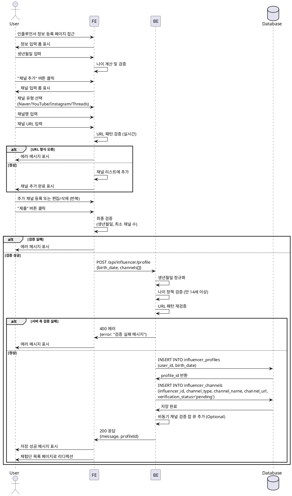

# UC-002: 인플루언서 정보 등록

## Primary Actor
- 인플루언서 (회원가입 완료 사용자)

## Precondition
- 회원가입 완료 상태
- 역할이 'influencer'로 설정됨
- 아직 인플루언서 프로필을 등록하지 않은 상태

## Trigger
- 회원가입 완료 후 자동 리디렉션
- 또는 직접 인플루언서 정보 등록 페이지 접근

## Main Scenario

1. 사용자가 인플루언서 정보 등록 페이지 접근
2. 시스템이 정보 입력 폼 표시 (생년월일, SNS 채널 관리)
3. 사용자가 생년월일 입력
4. 사용자가 SNS 채널 추가 버튼 클릭
5. 시스템이 채널 입력 폼 표시 (채널 유형, 채널명, URL)
6. 사용자가 채널 정보 입력 (Naver, YouTube, Instagram, Threads 중 선택)
7. 사용자가 "추가" 버튼 클릭
8. 시스템이 URL 형식 검증 및 채널 리스트에 추가
9. 사용자가 추가 채널 등록 또는 기존 채널 편집/삭제 (반복 가능)
10. 사용자가 "제출" 버튼 클릭
11. 시스템이 입력값 검증 (생년월일, 최소 채널 수, URL 형식)
12. 시스템이 influencer_profiles 테이블에 프로필 생성
13. 시스템이 influencer_channels 테이블에 채널 목록 저장 (상태=검증대기)
14. 시스템이 저장 성공 피드백 표시
15. 시스템이 비동기 채널 검증 작업 예약 (Optional)
16. 시스템이 체험단 목록 페이지로 리디렉션

## Edge Cases

### E1. 나이 제한 미달
- **조건**: 생년월일 기준 만 14세 미만
- **처리**: 에러 메시지 표시 ("만 14세 이상만 가입 가능합니다")

### E2. 생년월일 미래 날짜
- **조건**: 생년월일이 오늘 이후 날짜
- **처리**: 에러 메시지 표시 ("올바른 생년월일을 입력해주세요")

### E3. URL 형식 오류
- **조건**: 입력한 URL이 해당 채널 유형의 패턴과 불일치
- **처리**: 실시간 에러 메시지 표시 (예: "올바른 YouTube URL 형식이 아닙니다")

### E4. 최소 채널 수 미충족
- **조건**: 채널을 하나도 등록하지 않은 경우
- **처리**: 제출 버튼 비활성화 또는 에러 메시지 표시 ("최소 1개 이상의 채널을 등록해주세요")

### E5. 중복 채널 URL
- **조건**: 이미 추가한 채널 URL을 다시 추가하려는 경우
- **처리**: 에러 메시지 표시 ("이미 등록된 채널입니다")

### E6. 채널 검증 실패
- **조건**: 비동기 검증 시 채널이 존재하지 않거나 접근 불가
- **처리**: 채널 상태를 'failed'로 업데이트, 사용자에게 알림 (마이페이지 등)

### E7. 임시저장 실패
- **조건**: 임시저장 중 네트워크 오류 또는 서버 에러
- **처리**: 에러 메시지 표시, 로컬 스토리지에 임시 보관 (Optional)

## Business Rules

### BR1. 필수 입력 정보
- 생년월일: 필수
- SNS 채널: 최소 1개 이상 등록

### BR2. 나이 제한
- 만 14세 이상만 인플루언서로 등록 가능
- 생년월일 기준으로 나이 계산

### BR3. 지원 채널 유형
- Naver (네이버 블로그)
- YouTube (유튜브)
- Instagram (인스타그램)
- Threads (스레드)

### BR4. URL 패턴 검증
- **Naver**: `https://blog.naver.com/*` 형식
- **YouTube**: `https://www.youtube.com/@*` 또는 `https://www.youtube.com/c/*` 형식
- **Instagram**: `https://www.instagram.com/*` 형식
- **Threads**: `https://www.threads.net/@*` 형식

### BR5. 채널 상태 관리
- 초기 저장 시 상태: `pending` (검증대기)
- 비동기 검증 성공 시: `success`
- 비동기 검증 실패 시: `failed`

### BR6. 임시저장 기능 (Optional)
- 사용자가 작성 중인 내용을 임시저장 가능
- 다음 접속 시 임시저장된 내용 자동 로드

### BR7. 프로필 수정 제한
- 프로필 등록 완료 후에도 수정 가능
- 단, 채널 검증 상태는 재검증 필요

### BR8. 체험단 지원 가드
- 인플루언서 정보 등록이 완료되어야 체험단 지원 가능
- 최소 1개 이상의 채널이 등록되어 있어야 함

---

## Sequence Diagram

