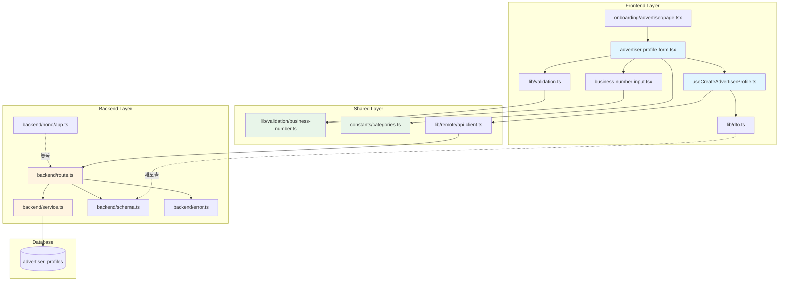

# 광고주 정보 등록 - 구현 계획

## 개요

### 목표
광고주가 회원가입 후 업체 정보를 등록하여 체험단 생성 권한을 획득하는 기능 구현

### 모듈 구성

#### 1. Backend Layer
- **`src/features/advertiser-profile/backend/schema.ts`**
  - Zod 스키마 정의 (요청/응답)
  - 사업자등록번호 형식 검증
  - 카테고리 enum 정의

- **`src/features/advertiser-profile/backend/error.ts`**
  - 에러 코드 상수 정의
  - 중복, 검증 실패 등 에러 타입

- **`src/features/advertiser-profile/backend/service.ts`**
  - 사업자등록번호 중복 확인
  - 광고주 프로필 생성
  - 트랜잭션 처리

- **`src/features/advertiser-profile/backend/route.ts`**
  - POST `/advertiser/profile` 라우터
  - 요청 검증 및 응답 처리

#### 2. Shared Utilities
- **`src/lib/validation/business-number.ts`** (신규)
  - 사업자등록번호 형식 검증
  - 하이픈 제거/포맷팅
  - 재사용 가능한 유틸리티

- **`src/constants/categories.ts`** (신규)
  - 업체 카테고리 상수 정의
  - 타입 안정성 보장

#### 3. Frontend Layer
- **`src/features/advertiser-profile/lib/dto.ts`**
  - Backend 스키마 재노출
  - 프론트엔드 타입 정의

- **`src/features/advertiser-profile/hooks/useCreateAdvertiserProfile.ts`**
  - React Query mutation hook
  - API 호출 및 상태 관리

- **`src/features/advertiser-profile/components/advertiser-profile-form.tsx`**
  - 업체 정보 입력 폼
  - react-hook-form 기반 검증
  - 사업자등록번호 실시간 포맷팅

- **`src/features/advertiser-profile/components/business-number-input.tsx`** (신규)
  - 사업자등록번호 전용 입력 컴포넌트
  - 자동 하이픈 포맷팅
  - 재사용 가능한 UI 컴포넌트

- **`src/features/advertiser-profile/lib/validation.ts`**
  - 클라이언트 측 검증 로직
  - 사업자등록번호, 업체명 등 검증

#### 4. Page & Integration
- **`src/app/onboarding/advertiser/page.tsx`**
  - 광고주 온보딩 페이지
  - 인증 상태 확인
  - 폼 컴포넌트 통합

#### 5. Backend Integration
- **`src/backend/hono/app.ts`** (수정)
  - `registerAdvertiserProfileRoutes(app)` 추가

---

## Architecture Diagram



---

## Implementation Plan

### Phase 1: Shared Utilities

#### 1.1 `src/constants/categories.ts`

**목적**: 업체 카테고리 상수 정의

**구현 내용**:
```typescript
export const ADVERTISER_CATEGORIES = {
  RESTAURANT: 'restaurant',
  CAFE: 'cafe',
  BEAUTY: 'beauty',
  FASHION: 'fashion',
  LIFESTYLE: 'lifestyle',
  ELECTRONICS: 'electronics',
  EDUCATION: 'education',
  TRAVEL: 'travel',
  FITNESS: 'fitness',
  ETC: 'etc',
} as const;

export type AdvertiserCategory = (typeof ADVERTISER_CATEGORIES)[keyof typeof ADVERTISER_CATEGORIES];

export const CATEGORY_LABELS: Record<AdvertiserCategory, string> = {
  restaurant: '음식점',
  cafe: '카페',
  beauty: '뷰티/미용',
  fashion: '패션',
  lifestyle: '생활용품',
  electronics: '전자기기',
  education: '교육',
  travel: '여행/숙박',
  fitness: '헬스/피트니스',
  etc: '기타',
};
```

**테스트 케이스**:
- 모든 카테고리 키가 CATEGORY_LABELS에 매핑되는지 확인
- 타입 추론이 정확한지 확인

---

#### 1.2 `src/lib/validation/business-number.ts`

**목적**: 사업자등록번호 검증 및 포맷팅 유틸리티

**구현 내용**:
```typescript
const BUSINESS_NUMBER_REGEX = /^\d{10}$/;
const BUSINESS_NUMBER_WITH_HYPHEN_REGEX = /^\d{3}-\d{2}-\d{5}$/;

export const isValidBusinessNumber = (value: string): boolean => {
  const cleaned = value.replace(/-/g, '');
  return BUSINESS_NUMBER_REGEX.test(cleaned);
};

export const formatBusinessNumber = (value: string): string => {
  const cleaned = value.replace(/\D/g, '');
  const match = cleaned.match(/^(\d{3})(\d{2})(\d{5})$/);
  
  if (match) {
    return `${match[1]}-${match[2]}-${match[3]}`;
  }
  
  return value;
};

export const cleanBusinessNumber = (value: string): string => {
  return value.replace(/\D/g, '');
};
```

**Unit Tests**:
```typescript
describe('business-number validation', () => {
  test('isValidBusinessNumber - 유효한 형식', () => {
    expect(isValidBusinessNumber('1234567890')).toBe(true);
    expect(isValidBusinessNumber('123-45-67890')).toBe(true);
  });

  test('isValidBusinessNumber - 무효한 형식', () => {
    expect(isValidBusinessNumber('12345')).toBe(false);
    expect(isValidBusinessNumber('abc1234567')).toBe(false);
    expect(isValidBusinessNumber('')).toBe(false);
  });

  test('formatBusinessNumber - 자동 하이픈 삽입', () => {
    expect(formatBusinessNumber('1234567890')).toBe('123-45-67890');
    expect(formatBusinessNumber('123-45-67890')).toBe('123-45-67890');
  });

  test('cleanBusinessNumber - 하이픈 제거', () => {
    expect(cleanBusinessNumber('123-45-67890')).toBe('1234567890');
    expect(cleanBusinessNumber('1234567890')).toBe('1234567890');
  });
});
```

---

### Phase 2: Backend Layer

#### 2.1 `src/features/advertiser-profile/backend/error.ts`

**구현 내용**:
```typescript
export const advertiserProfileErrorCodes = {
  businessNumberDuplicate: 'ADVERTISER_BUSINESS_NUMBER_DUPLICATE',
  businessNumberInvalid: 'ADVERTISER_BUSINESS_NUMBER_INVALID',
  invalidInput: 'ADVERTISER_INVALID_INPUT',
  databaseError: 'ADVERTISER_DATABASE_ERROR',
  profileAlreadyExists: 'ADVERTISER_PROFILE_ALREADY_EXISTS',
  userNotFound: 'ADVERTISER_USER_NOT_FOUND',
} as const;

type AdvertiserProfileErrorValue = (typeof advertiserProfileErrorCodes)[keyof typeof advertiserProfileErrorCodes];

export type AdvertiserProfileServiceError = AdvertiserProfileErrorValue;
```

---

#### 2.2 `src/features/advertiser-profile/backend/schema.ts`

**구현 내용**:
```typescript
import { z } from 'zod';
import { ADVERTISER_CATEGORIES } from '@/constants/categories';

export const CreateAdvertiserProfileRequestSchema = z.object({
  userId: z.string().uuid(),
  companyName: z.string().min(2, '업체명은 최소 2자 이상이어야 합니다.').max(255),
  location: z.string().min(1, '위치를 입력해주세요.').max(500),
  category: z.enum([
    ADVERTISER_CATEGORIES.RESTAURANT,
    ADVERTISER_CATEGORIES.CAFE,
    ADVERTISER_CATEGORIES.BEAUTY,
    ADVERTISER_CATEGORIES.FASHION,
    ADVERTISER_CATEGORIES.LIFESTYLE,
    ADVERTISER_CATEGORIES.ELECTRONICS,
    ADVERTISER_CATEGORIES.EDUCATION,
    ADVERTISER_CATEGORIES.TRAVEL,
    ADVERTISER_CATEGORIES.FITNESS,
    ADVERTISER_CATEGORIES.ETC,
  ]),
  businessRegistrationNumber: z.string().regex(/^\d{10}$/, '사업자등록번호는 10자리 숫자여야 합니다.'),
});

export type CreateAdvertiserProfileRequest = z.infer<typeof CreateAdvertiserProfileRequestSchema>;

export const CreateAdvertiserProfileResponseSchema = z.object({
  profileId: z.string().uuid(),
  message: z.string(),
});

export type CreateAdvertiserProfileResponse = z.infer<typeof CreateAdvertiserProfileResponseSchema>;

export const AdvertiserProfileRowSchema = z.object({
  id: z.string().uuid(),
  user_id: z.string().uuid(),
  company_name: z.string(),
  location: z.string(),
  category: z.string(),
  business_registration_number: z.string(),
  is_verified: z.boolean(),
  created_at: z.string(),
  updated_at: z.string(),
});

export type AdvertiserProfileRow = z.infer<typeof AdvertiserProfileRowSchema>;
```

---

#### 2.3 `src/features/advertiser-profile/backend/service.ts`

**목적**: 비즈니스 로직 구현

**구현 내용**:
```typescript
import type { SupabaseClient } from '@supabase/supabase-js';
import { failure, success, type HandlerResult } from '@/backend/http/response';
import type { CreateAdvertiserProfileRequest, CreateAdvertiserProfileResponse } from './schema';
import { advertiserProfileErrorCodes, type AdvertiserProfileServiceError } from './error';

const ADVERTISER_PROFILES_TABLE = 'advertiser_profiles';
const USERS_TABLE = 'users';

export const checkBusinessNumberExists = async (
  client: SupabaseClient,
  businessNumber: string,
): Promise<HandlerResult<boolean, AdvertiserProfileServiceError, unknown>> => {
  const { data, error } = await client
    .from(ADVERTISER_PROFILES_TABLE)
    .select('business_registration_number')
    .eq('business_registration_number', businessNumber)
    .maybeSingle();

  if (error) {
    return failure(500, advertiserProfileErrorCodes.databaseError, error.message);
  }

  return success(data !== null);
};

export const checkProfileExists = async (
  client: SupabaseClient,
  userId: string,
): Promise<HandlerResult<boolean, AdvertiserProfileServiceError, unknown>> => {
  const { data, error } = await client
    .from(ADVERTISER_PROFILES_TABLE)
    .select('id')
    .eq('user_id', userId)
    .maybeSingle();

  if (error) {
    return failure(500, advertiserProfileErrorCodes.databaseError, error.message);
  }

  return success(data !== null);
};

export const createAdvertiserProfile = async (
  client: SupabaseClient,
  profileData: CreateAdvertiserProfileRequest,
): Promise<HandlerResult<CreateAdvertiserProfileResponse, AdvertiserProfileServiceError, unknown>> => {
  // 1. 사용자 존재 확인
  const { data: user, error: userError } = await client
    .from(USERS_TABLE)
    .select('id, role')
    .eq('id', profileData.userId)
    .maybeSingle();

  if (userError) {
    return failure(500, advertiserProfileErrorCodes.databaseError, userError.message);
  }

  if (!user) {
    return failure(404, advertiserProfileErrorCodes.userNotFound, '사용자를 찾을 수 없습니다.');
  }

  if (user.role !== 'advertiser') {
    return failure(400, advertiserProfileErrorCodes.invalidInput, '광고주 역할이 아닙니다.');
  }

  // 2. 기존 프로필 존재 확인
  const profileExistsResult = await checkProfileExists(client, profileData.userId);

  if (!profileExistsResult.ok) {
    return profileExistsResult as HandlerResult<CreateAdvertiserProfileResponse, AdvertiserProfileServiceError, unknown>;
  }

  if (profileExistsResult.data) {
    return failure(
      400,
      advertiserProfileErrorCodes.profileAlreadyExists,
      '이미 광고주 프로필이 존재합니다.',
    );
  }

  // 3. 사업자등록번호 중복 확인
  const businessNumberExistsResult = await checkBusinessNumberExists(
    client,
    profileData.businessRegistrationNumber,
  );

  if (!businessNumberExistsResult.ok) {
    return businessNumberExistsResult as HandlerResult<CreateAdvertiserProfileResponse, AdvertiserProfileServiceError, unknown>;
  }

  if (businessNumberExistsResult.data) {
    return failure(
      400,
      advertiserProfileErrorCodes.businessNumberDuplicate,
      '이미 등록된 사업자등록번호입니다.',
    );
  }

  // 4. 광고주 프로필 생성
  const { data: profile, error: profileError } = await client
    .from(ADVERTISER_PROFILES_TABLE)
    .insert({
      user_id: profileData.userId,
      company_name: profileData.companyName,
      location: profileData.location,
      category: profileData.category,
      business_registration_number: profileData.businessRegistrationNumber,
      is_verified: false,
    })
    .select('id')
    .single();

  if (profileError || !profile) {
    return failure(
      500,
      advertiserProfileErrorCodes.databaseError,
      profileError?.message ?? '광고주 프로필 생성에 실패했습니다.',
    );
  }

  return success({
    profileId: profile.id,
    message: '광고주 정보가 등록되었습니다.',
  });
};
```

**Unit Tests**:
```typescript
describe('advertiser-profile service', () => {
  describe('checkBusinessNumberExists', () => {
    test('중복된 사업자등록번호 존재', async () => {
      // Mock Supabase client
      // Assert: data = true
    });

    test('중복 없음', async () => {
      // Mock Supabase client
      // Assert: data = false
    });

    test('DB 에러 처리', async () => {
      // Mock error
      // Assert: error code = databaseError
    });
  });

  describe('createAdvertiserProfile', () => {
    test('정상 프로필 생성', async () => {
      // Mock all checks pass
      // Assert: success with profileId
    });

    test('사용자 없음', async () => {
      // Mock user not found
      // Assert: error code = userNotFound
    });

    test('사업자등록번호 중복', async () => {
      // Mock duplicate business number
      // Assert: error code = businessNumberDuplicate
    });

    test('이미 프로필 존재', async () => {
      // Mock profile exists
      // Assert: error code = profileAlreadyExists
    });
  });
});
```

---

#### 2.4 `src/features/advertiser-profile/backend/route.ts`

**구현 내용**:
```typescript
import type { Hono } from 'hono';
import { failure, respond, type ErrorResult } from '@/backend/http/response';
import { getLogger, getSupabase, type AppEnv } from '@/backend/hono/context';
import { CreateAdvertiserProfileRequestSchema } from './schema';
import { createAdvertiserProfile } from './service';
import { type AdvertiserProfileServiceError } from './error';

export const registerAdvertiserProfileRoutes = (app: Hono<AppEnv>) => {
  app.post('/advertiser/profile', async (c) => {
    const body = await c.req.json();
    const parsedBody = CreateAdvertiserProfileRequestSchema.safeParse(body);

    if (!parsedBody.success) {
      return respond(
        c,
        failure(
          400,
          'INVALID_ADVERTISER_PROFILE_REQUEST',
          '입력값이 올바르지 않습니다.',
          parsedBody.error.format(),
        ),
      );
    }

    const supabase = getSupabase(c);
    const logger = getLogger(c);

    const result = await createAdvertiserProfile(supabase, parsedBody.data);

    if (!result.ok) {
      const errorResult = result as ErrorResult<AdvertiserProfileServiceError, unknown>;
      logger.error('Advertiser profile creation failed', { error: errorResult.error.code });
    } else {
      logger.info('Advertiser profile created successfully', { profileId: result.data.profileId });
    }

    return respond(c, result);
  });
};
```

---

#### 2.5 `src/backend/hono/app.ts` (수정)

**변경 내용**:
```typescript
// import 추가
import { registerAdvertiserProfileRoutes } from '@/features/advertiser-profile/backend/route';

// registerRoutes 함수 내부에 추가
registerAdvertiserProfileRoutes(app);
```

---

### Phase 3: Frontend Layer

#### 3.1 `src/features/advertiser-profile/lib/dto.ts`

**구현 내용**:
```typescript
export {
  CreateAdvertiserProfileRequestSchema,
  CreateAdvertiserProfileResponseSchema,
  type CreateAdvertiserProfileRequest,
  type CreateAdvertiserProfileResponse,
} from '../backend/schema';
```

---

#### 3.2 `src/features/advertiser-profile/lib/validation.ts`

**목적**: 클라이언트 측 검증 로직

**구현 내용**:
```typescript
import { isValidBusinessNumber } from '@/lib/validation/business-number';

export const validateCompanyName = (value: string): string | undefined => {
  const trimmed = value.trim();
  
  if (trimmed.length === 0) {
    return '업체명을 입력해주세요.';
  }
  
  if (trimmed.length < 2) {
    return '업체명은 최소 2자 이상이어야 합니다.';
  }
  
  if (trimmed.length > 255) {
    return '업체명은 최대 255자까지 가능합니다.';
  }
  
  return undefined;
};

export const validateLocation = (value: string): string | undefined => {
  const trimmed = value.trim();
  
  if (trimmed.length === 0) {
    return '위치를 입력해주세요.';
  }
  
  if (trimmed.length > 500) {
    return '위치는 최대 500자까지 가능합니다.';
  }
  
  return undefined;
};

export const validateBusinessNumberInput = (value: string): string | undefined => {
  if (!value || value.trim().length === 0) {
    return '사업자등록번호를 입력해주세요.';
  }
  
  if (!isValidBusinessNumber(value)) {
    return '올바른 사업자등록번호 형식이 아닙니다 (000-00-00000).';
  }
  
  return undefined;
};
```

---

#### 3.3 `src/features/advertiser-profile/hooks/useCreateAdvertiserProfile.ts`

**구현 내용**:
```typescript
import { useMutation } from '@tanstack/react-query';
import { apiClient } from '@/lib/remote/api-client';
import {
  CreateAdvertiserProfileRequestSchema,
  CreateAdvertiserProfileResponseSchema,
  type CreateAdvertiserProfileRequest,
  type CreateAdvertiserProfileResponse,
} from '../lib/dto';

const createAdvertiserProfile = async (
  data: CreateAdvertiserProfileRequest,
): Promise<CreateAdvertiserProfileResponse> => {
  try {
    const response = await apiClient.post('/advertiser/profile', data);
    return CreateAdvertiserProfileResponseSchema.parse(response.data);
  } catch (error) {
    throw error;
  }
};

export const useCreateAdvertiserProfile = () => {
  return useMutation({
    mutationFn: createAdvertiserProfile,
  });
};
```

---

#### 3.4 `src/features/advertiser-profile/components/business-number-input.tsx`

**목적**: 사업자등록번호 전용 입력 컴포넌트

**구현 내용**:
```typescript
'use client';

import { useCallback, useState } from 'react';
import { Input } from '@/components/ui/input';
import { Label } from '@/components/ui/label';
import { formatBusinessNumber } from '@/lib/validation/business-number';

type BusinessNumberInputProps = {
  value: string;
  onChange: (value: string) => void;
  error?: string;
  disabled?: boolean;
};

export const BusinessNumberInput = ({
  value,
  onChange,
  error,
  disabled,
}: BusinessNumberInputProps) => {
  const [displayValue, setDisplayValue] = useState(formatBusinessNumber(value));

  const handleChange = useCallback(
    (e: React.ChangeEvent<HTMLInputElement>) => {
      const input = e.target.value;
      const cleaned = input.replace(/\D/g, '');
      
      if (cleaned.length <= 10) {
        const formatted = formatBusinessNumber(cleaned);
        setDisplayValue(formatted);
        onChange(cleaned);
      }
    },
    [onChange],
  );

  return (
    <div className="space-y-2">
      <Label htmlFor="business-number">
        사업자등록번호 <span className="text-red-500">*</span>
      </Label>
      <Input
        id="business-number"
        type="text"
        placeholder="000-00-00000"
        value={displayValue}
        onChange={handleChange}
        disabled={disabled}
        aria-invalid={!!error}
        aria-describedby={error ? 'business-number-error' : undefined}
        maxLength={12}
      />
      {error && (
        <p id="business-number-error" className="text-sm text-red-500" role="alert">
          {error}
        </p>
      )}
    </div>
  );
};
```

**QA Sheet**:
| 테스트 시나리오 | 입력 | 예상 결과 | 통과 여부 |
|----------------|------|----------|----------|
| 숫자 입력 시 자동 포맷팅 | `1234567890` | `123-45-67890` | ⬜ |
| 하이픈 포함 입력 | `123-45-67890` | `123-45-67890` | ⬜ |
| 10자리 초과 입력 차단 | `12345678901` | `123-45-67890` (10자리까지만) | ⬜ |
| 문자 입력 필터링 | `abc123` | `123` | ⬜ |
| 에러 메시지 표시 | error prop 전달 | 빨간색 에러 메시지 표시 | ⬜ |
| disabled 상태 | disabled=true | 입력 비활성화 | ⬜ |

---

#### 3.5 `src/features/advertiser-profile/components/advertiser-profile-form.tsx`

**목적**: 광고주 정보 등록 폼

**구현 내용**:
```typescript
'use client';

import { useCallback, useState } from 'react';
import { useRouter } from 'next/navigation';
import { Button } from '@/components/ui/button';
import { Input } from '@/components/ui/input';
import { Label } from '@/components/ui/label';
import { Select, SelectContent, SelectItem, SelectTrigger, SelectValue } from '@/components/ui/select';
import { BusinessNumberInput } from './business-number-input';
import { useCreateAdvertiserProfile } from '../hooks/useCreateAdvertiserProfile';
import { validateCompanyName, validateLocation, validateBusinessNumberInput } from '../lib/validation';
import { cleanBusinessNumber } from '@/lib/validation/business-number';
import { ADVERTISER_CATEGORIES, CATEGORY_LABELS } from '@/constants/categories';
import { useToast } from '@/hooks/use-toast';

type AdvertiserProfileFormProps = {
  userId: string;
};

type FormData = {
  companyName: string;
  location: string;
  category: string;
  businessRegistrationNumber: string;
};

type FormErrors = {
  companyName?: string;
  location?: string;
  category?: string;
  businessRegistrationNumber?: string;
};

export const AdvertiserProfileForm = ({ userId }: AdvertiserProfileFormProps) => {
  const router = useRouter();
  const { toast } = useToast();
  const [formData, setFormData] = useState<FormData>({
    companyName: '',
    location: '',
    category: '',
    businessRegistrationNumber: '',
  });
  const [errors, setErrors] = useState<FormErrors>({});
  const { mutate, isPending } = useCreateAdvertiserProfile();

  const validate = useCallback((): boolean => {
    const newErrors: FormErrors = {};

    const companyNameError = validateCompanyName(formData.companyName);
    if (companyNameError) newErrors.companyName = companyNameError;

    const locationError = validateLocation(formData.location);
    if (locationError) newErrors.location = locationError;

    if (!formData.category) {
      newErrors.category = '카테고리를 선택해주세요.';
    }

    const businessNumberError = validateBusinessNumberInput(formData.businessRegistrationNumber);
    if (businessNumberError) newErrors.businessRegistrationNumber = businessNumberError;

    setErrors(newErrors);
    return Object.keys(newErrors).length === 0;
  }, [formData]);

  const handleSubmit = useCallback(
    (e: React.FormEvent) => {
      e.preventDefault();

      if (!validate()) {
        return;
      }

      mutate(
        {
          userId,
          companyName: formData.companyName.trim(),
          location: formData.location.trim(),
          category: formData.category,
          businessRegistrationNumber: cleanBusinessNumber(formData.businessRegistrationNumber),
        },
        {
          onSuccess: (data) => {
            toast({
              title: '등록 완료',
              description: data.message,
            });
            setTimeout(() => {
              router.push('/dashboard');
            }, 2000);
          },
          onError: (error: any) => {
            const message = error?.response?.data?.error?.message || '광고주 정보 등록에 실패했습니다.';
            toast({
              title: '오류',
              description: message,
              variant: 'destructive',
            });
          },
        },
      );
    },
    [validate, mutate, userId, formData, router, toast],
  );

  return (
    <form onSubmit={handleSubmit} className="space-y-6">
      <div className="space-y-2">
        <Label htmlFor="company-name">
          업체명 <span className="text-red-500">*</span>
        </Label>
        <Input
          id="company-name"
          type="text"
          placeholder="카페 블루밍"
          value={formData.companyName}
          onChange={(e) => setFormData({ ...formData, companyName: e.target.value })}
          disabled={isPending}
          aria-invalid={!!errors.companyName}
        />
        {errors.companyName && (
          <p className="text-sm text-red-500" role="alert">
            {errors.companyName}
          </p>
        )}
      </div>

      <div className="space-y-2">
        <Label htmlFor="location">
          위치 <span className="text-red-500">*</span>
        </Label>
        <Input
          id="location"
          type="text"
          placeholder="서울특별시 강남구 테헤란로 123"
          value={formData.location}
          onChange={(e) => setFormData({ ...formData, location: e.target.value })}
          disabled={isPending}
          aria-invalid={!!errors.location}
        />
        {errors.location && (
          <p className="text-sm text-red-500" role="alert">
            {errors.location}
          </p>
        )}
      </div>

      <div className="space-y-2">
        <Label htmlFor="category">
          카테고리 <span className="text-red-500">*</span>
        </Label>
        <Select
          value={formData.category}
          onValueChange={(value) => setFormData({ ...formData, category: value })}
          disabled={isPending}
        >
          <SelectTrigger id="category">
            <SelectValue placeholder="카테고리를 선택하세요" />
          </SelectTrigger>
          <SelectContent>
            {Object.entries(CATEGORY_LABELS).map(([key, label]) => (
              <SelectItem key={key} value={key}>
                {label}
              </SelectItem>
            ))}
          </SelectContent>
        </Select>
        {errors.category && (
          <p className="text-sm text-red-500" role="alert">
            {errors.category}
          </p>
        )}
      </div>

      <BusinessNumberInput
        value={formData.businessRegistrationNumber}
        onChange={(value) => setFormData({ ...formData, businessRegistrationNumber: value })}
        error={errors.businessRegistrationNumber}
        disabled={isPending}
      />

      <Button type="submit" className="w-full" disabled={isPending}>
        {isPending ? '등록 중...' : '제출'}
      </Button>
    </form>
  );
};
```

**QA Sheet**:
| 테스트 시나리오 | 입력 | 예상 결과 | 통과 여부 |
|----------------|------|----------|----------|
| 모든 필드 정상 입력 | 유효한 값 | API 호출 성공, 대시보드 이동 | ⬜ |
| 업체명 누락 | companyName="" | "업체명을 입력해주세요." 에러 | ⬜ |
| 업체명 1자 입력 | companyName="a" | "최소 2자 이상" 에러 | ⬜ |
| 위치 누락 | location="" | "위치를 입력해주세요." 에러 | ⬜ |
| 카테고리 미선택 | category="" | "카테고리를 선택해주세요." 에러 | ⬜ |
| 사업자번호 형식 오류 | businessNumber="123" | "올바른 형식이 아닙니다" 에러 | ⬜ |
| 사업자번호 중복 | 서버에서 중복 반환 | "이미 등록된 사업자등록번호" 에러 | ⬜ |
| 제출 버튼 연속 클릭 방지 | 빠른 연속 클릭 | 버튼 비활성화, 1회만 제출 | ⬜ |
| 성공 후 리다이렉트 | 성공 응답 | Toast 표시 → 2초 후 /dashboard 이동 | ⬜ |
| 네트워크 오류 | 서버 연결 실패 | 에러 Toast 표시 | ⬜ |

---

#### 3.6 `src/app/onboarding/advertiser/page.tsx`

**구현 내용**:
```typescript
'use client';

import { useEffect } from 'react';
import { useRouter } from 'next/navigation';
import { useCurrentUser } from '@/features/auth/hooks/useCurrentUser';
import { AdvertiserProfileForm } from '@/features/advertiser-profile/components/advertiser-profile-form';

type AdvertiserOnboardingPageProps = {
  params: Promise<Record<string, never>>;
};

export default function AdvertiserOnboardingPage({ params }: AdvertiserOnboardingPageProps) {
  void params;
  const router = useRouter();
  const { isAuthenticated, user } = useCurrentUser();

  useEffect(() => {
    if (!isAuthenticated) {
      router.replace('/login');
    }
  }, [isAuthenticated, router]);

  if (!isAuthenticated || !user) {
    return null;
  }

  return (
    <div className="container max-w-2xl mx-auto py-8">
      <h1 className="text-2xl font-bold mb-6">광고주 정보 등록</h1>
      <p className="text-gray-600 mb-8">
        체험단을 등록하고 관리하기 위해 광고주 정보를 등록해주세요.
      </p>
      <AdvertiserProfileForm userId={user.id} />
    </div>
  );
}
```

**QA Sheet**:
| 테스트 시나리오 | 조건 | 예상 결과 | 통과 여부 |
|----------------|------|----------|----------|
| 미인증 사용자 접근 | isAuthenticated=false | /login으로 리다이렉트 | ⬜ |
| 인증된 사용자 접근 | isAuthenticated=true | 폼 표시 | ⬜ |
| userId 전달 | user.id 존재 | AdvertiserProfileForm에 userId prop 전달 | ⬜ |

---

## Implementation Order

### 1단계: Shared Utilities (독립 모듈)
1. `src/constants/categories.ts`
2. `src/lib/validation/business-number.ts` + Unit Tests

### 2단계: Backend Layer (API 구현)
1. `src/features/advertiser-profile/backend/error.ts`
2. `src/features/advertiser-profile/backend/schema.ts`
3. `src/features/advertiser-profile/backend/service.ts` + Unit Tests
4. `src/features/advertiser-profile/backend/route.ts`
5. `src/backend/hono/app.ts` 수정

### 3단계: Frontend Utilities (프론트엔드 준비)
1. `src/features/advertiser-profile/lib/dto.ts`
2. `src/features/advertiser-profile/lib/validation.ts`
3. `src/features/advertiser-profile/hooks/useCreateAdvertiserProfile.ts`

### 4단계: UI Components (컴포넌트 구현)
1. `src/features/advertiser-profile/components/business-number-input.tsx` + QA
2. `src/features/advertiser-profile/components/advertiser-profile-form.tsx` + QA

### 5단계: Page Integration (페이지 통합)
1. `src/app/onboarding/advertiser/page.tsx` + QA

### 6단계: E2E Testing (통합 테스트)
- 전체 플로우 테스트
- 에러 케이스 검증
- 접근성 테스트

---

## Dependencies & Prerequisites

### NPM Packages (이미 설치됨)
- `zod`: 스키마 검증
- `@tanstack/react-query`: 서버 상태 관리
- `react-hook-form`: 폼 관리 (선택적)
- `hono`: 백엔드 라우팅
- `@supabase/supabase-js`: DB 접근

### Shadcn-ui Components (설치 필요)
```bash
npx shadcn@latest add select
```

### Database
- `advertiser_profiles` 테이블이 이미 `0002_create_main_schema.sql`에 정의됨
- 마이그레이션 적용 완료 필요

---

## Testing Strategy

### Unit Tests
- `business-number.ts` 유틸리티 함수
- `service.ts` 비즈니스 로직

### Component QA
- `business-number-input.tsx`: 입력 포맷팅, 검증
- `advertiser-profile-form.tsx`: 폼 제출, 에러 처리
- `page.tsx`: 인증 가드, 라우팅

### Integration Tests
- API 엔드포인트 호출
- DB 트랜잭션 검증
- 에러 핸들링

### E2E Tests
- 회원가입 → 광고주 온보딩 → 대시보드 플로우
- 중복 방지 시나리오
- 네트워크 오류 시나리오

---

## Rollout Plan

### Phase 1: Core Implementation (1-2일)
- Backend API 구현
- 기본 UI 컴포넌트

### Phase 2: Validation & Error Handling (1일)
- 클라이언트 검증 강화
- 에러 메시지 개선

### Phase 3: Testing & QA (1일)
- Unit Tests 작성
- QA Sheet 검증

### Phase 4: Polish & Deploy (0.5일)
- 접근성 개선
- 성능 최적화
- 배포

---

## Risk & Mitigation

### Risk 1: 사업자등록번호 검증 로직 복잡도
**완화 방안**: 유틸리티 함수 분리, 충분한 테스트 케이스 작성

### Risk 2: 카테고리 확장성
**완화 방안**: 상수 파일로 중앙 관리, 타입 안정성 보장

### Risk 3: 중복 제출 방지
**완화 방안**: 버튼 비활성화 + React Query의 자동 중복 방지

### Risk 4: 사용자 경험 (에러 메시지)
**완화 방안**: 명확하고 친절한 에러 메시지, 인라인 검증

---

## Success Metrics

- ✅ 모든 Unit Tests 통과
- ✅ QA Sheet 100% 통과
- ✅ API 응답 시간 < 500ms
- ✅ 클라이언트 검증으로 불필요한 API 호출 90% 감소
- ✅ 접근성 점수 (Lighthouse) > 95
- ✅ 에러 발생 시 사용자에게 명확한 피드백 제공

