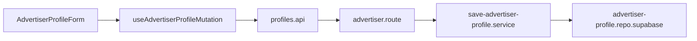
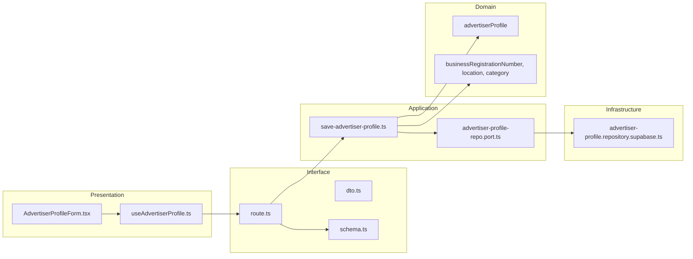
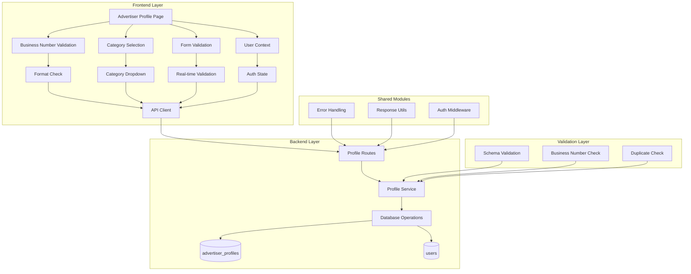

## 최종 단순화 본(Over-Engineering 제거)

- advertiser-profile-form — `src/features/profiles/presentation/components/AdvertiserProfileForm.tsx`
  - 단일 폼: 업체/위치/카테고리/사업자등록번호 입력 및 제출.
- useAdvertiserProfileMutation — `src/features/profiles/presentation/hooks/useAdvertiserProfileMutation.ts`
  - mutation 1개: POST /profiles/advertiser, 성공 시 관리 화면으로 이동.
- profiles.api — `src/features/profiles/interface/http/profiles.api.ts`
  - axios 래퍼: saveAdvertiserProfile(payload).
- advertiser.route — `src/features/profiles/interface/backend/route.ts`
  - Hono: POST /profiles/advertiser (zod 인라인, 서비스 호출).
- save-advertiser-profile.service — `src/features/profiles/application/save-advertiser-profile.ts`
  - 로직: upsert profile, 사업자번호 UNIQUE 충돌을 CONFLICT 매핑.
- advertiser-profile.repo.supabase — `src/features/profiles/infrastructure/repositories/advertiser-profile.repo.supabase.ts`
  - 단순 upsert 구현.



QA / 테스트
- QA: 필수값 누락/형식 오류/중복 사업자번호/성공 4케이스.
- 테스트: service happy path, UNIQUE 충돌, 유효성 실패.
## 개요(Modules Overview)

- advertiser-profile-ui — `src/features/profiles/presentation/components/AdvertiserProfileForm.tsx`
  - 업체명/위치/카테고리/사업자등록번호 입력 UI, 로컬 검증/제출.
- useAdvertiserProfile — `src/features/profiles/presentation/hooks/useAdvertiserProfile.ts`
  - React Query mutation/queries: 광고주 프로필 저장/조회.
- profiles-dto — `src/features/profiles/interface/http/dto.ts`
  - AdvertiserProfile 요청/응답 DTO, 에러 페이로드. (002와 공유)
- profiles-schema — `src/features/profiles/interface/backend/schema.ts`
  - advertiserProfile zod 스키마(요청/응답, 에러맵).
- profiles-route — `src/features/profiles/interface/backend/route.ts`
  - POST /profiles/advertiser (create/update), GET /profiles/advertiser/me.
- save-advertiser-profile-uc — `src/features/profiles/application/use-cases/save-advertiser-profile.ts`
  - upsert + is_profile_complete 갱신 + business_registration_number 중복 가드.
- ports — `src/features/profiles/application/ports/advertiser-profile-repo.port.ts`
  - 저장소 추상화 인터페이스.
- domain — `src/features/profiles/domain/{entities,value-objects}`
  - entity: advertiserProfile; VO: businessRegistrationNumber, location, category(단순 문자열 래핑 가능).
- infra — `src/features/profiles/infrastructure/repositories/advertiser-profile.repository.supabase.ts`
  - Supabase 구현: INSERT/UPDATE `advertiser_profiles`, UNIQUE 충돌 매핑.

## Diagram (mermaid)



## Implementation Plan

### Presentation (QA)
- 필수값 미입력 시 제출 비활성/인라인 에러 메시지.
- 사업자등록번호 형식 오류 시 즉시 경고(서버 재검증 실패 시 서버 메시지 표기).
- 저장 성공 시 관리 화면으로 이동/목록 갱신.
- 서버 에러(409/400/500) 메시지 표준화 노출.

구체 항목(샘플)
- 업체명/위치/카테고리/사업자번호 각 필드에 포커스 아웃 시 검증.
- 네트워크 지연 시 버튼 로딩/중복 제출 방지.
- 성공 후 브라우저 히스토리 정책(뒤로가기 시 폼 초기화/유지) 확인.

### Interface
- dto.ts
  - SaveAdvertiserProfileRequest: { companyName, location, category, businessRegistrationNumber }
  - SaveAdvertiserProfileResponse: { id, isProfileComplete }
  - ApiErrorPayload: { error: { code, message, details? } }

- schema.ts
  - z.object({ companyName, location, category, businessRegistrationNumber })
  - 에러코드: VALIDATION_ERROR, CONFLICT(중복 사업자번호), INTERNAL_ERROR

- route.ts
  - POST /profiles/advertiser → controller: 입력 검증 → usecase → respond
  - GET  /profiles/advertiser/me → 본인 프로필 조회(필요 시)

### Application (Unit Tests)
- save-advertiser-profile.spec.ts
  - 성공 케이스: 신규/갱신, is_profile_complete=true 설정
  - 실패 케이스: 중복 사업자번호(CONFLICT), 필수값 누락(VALIDATION_ERROR), 인프라 오류(INTERNAL_ERROR)
  - Port mock으로 Repo 동작/예외 검증

### Domain
- businessRegistrationNumber.vo.ts: 형식 검증/정규화(하이픈 허용/제거 정책 결정), toString()
- location.vo.ts, category.vo.ts: 최소 래핑(트림/빈값 금지)
- advertiserProfile.entity.ts: 팩토리/유효성 체크

### Infrastructure
- advertiser-profile.repository.supabase.ts
  - upsert by user_id
  - UNIQUE 위반 시 CONFLICT 매핑
  - 반환: { id, is_profile_complete }

### Shared/Guidelines 적용
- 공통 응답/에러: `src/backend/http/response.ts`의 success/failure/respond/COMMON_ERROR_CODES 재사용
- DTO 재사용: `features/profiles/interface/http/dto.ts`를 FE/BE에서 import
- 레이어 준수: presentation → interface → application → domain, infrastructure는 ports 구현체로만 의존

# 광고주 정보 등록 모듈화 설계

## 개요

### 공유 모듈 (Shared Modules)

#### 1. 프로필 관리 시스템 (`src/features/profiles/`)
- **위치**: `src/features/profiles/`
- **설명**: 인플루언서/광고주 프로필 등록 및 관리
- **구현 상태**: ✅ 완료
- **주요 컴포넌트**:
  - `backend/route.ts` - 프로필 API 라우터
  - `backend/service.ts` - 프로필 비즈니스 로직
  - `backend/schema.ts` - 프로필 스키마 정의
  - `backend/error.ts` - 프로필 에러 코드

#### 2. 검증 시스템 (`src/lib/validation/`)
- **위치**: `src/lib/validation/`
- **설명**: Zod 기반 스키마 검증, 사업자등록번호 검증
- **구현 상태**: ✅ 완료
- **주요 기능**:
  - `validateBusinessNumber()` - 사업자등록번호 형식 검증
  - `advertiserProfileSchema` - 광고주 프로필 스키마
  - `validateEmail()`, `validatePhone()` - 기본 검증 함수

#### 3. 인증 시스템 (`src/features/auth/`)
- **위치**: `src/features/auth/`
- **설명**: 사용자 인증 및 권한 관리
- **구현 상태**: ✅ 완료
- **주요 기능**:
  - 사용자 역할 검증 (advertiser)
  - 인증 상태 관리

### 도메인별 모듈 (Domain Modules)

#### 1. 광고주 프로필 페이지 (`src/app/(protected)/profiles/advertiser/`)
- **위치**: `src/app/(protected)/profiles/advertiser/page.tsx`
- **설명**: 광고주 정보 등록 UI
- **구현 상태**: ✅ 완료
- **주요 기능**:
  - 업체명, 위치, 카테고리 입력
  - 사업자등록번호 입력 및 검증
  - 실시간 유효성 검사
  - 프로필 저장/임시저장

#### 2. 사업자등록번호 검증 컴포넌트
- **위치**: `src/app/(protected)/profiles/advertiser/page.tsx` 내부
- **설명**: 사업자등록번호 입력 및 검증
- **구현 상태**: ✅ 완료
- **주요 기능**:
  - 사업자등록번호 형식 검증 (XXX-XX-XXXXX)
  - 중복 검사
  - 실시간 유효성 피드백

#### 3. 카테고리 선택 컴포넌트
- **위치**: `src/app/(protected)/profiles/advertiser/page.tsx` 내부
- **설명**: 업체 카테고리 선택
- **구현 상태**: ✅ 완료
- **주요 기능**:
  - 드롭다운 카테고리 선택
  - 사전 정의된 카테고리 목록
  - 커스텀 카테고리 입력 (선택사항)

### 공통 유틸리티 (Shared Utilities)

#### 1. UI 컴포넌트 (`src/components/ui/`)
- **위치**: `src/components/ui/`
- **설명**: shadcn-ui 기반 재사용 가능한 UI 컴포넌트
- **구현 상태**: ✅ 완료
- **사용 컴포넌트**:
  - `Card` - 프로필 카드
  - `Button` - 액션 버튼
  - `Input` - 입력 필드
  - `Label` - 라벨
  - `Select` - 드롭다운
  - `Badge` - 상태 표시

#### 2. HTTP 클라이언트 (`src/lib/remote/`)
- **위치**: `src/lib/remote/`
- **설명**: API 통신을 위한 HTTP 클라이언트
- **구현 상태**: ✅ 완료

#### 3. 상태 관리 (`src/features/auth/context/`)
- **위치**: `src/features/auth/context/`
- **설명**: 사용자 상태 및 권한 관리
- **구현 상태**: ✅ 완료

## Diagram



## Implementation Plan

### Phase 1: 백엔드 API (이미 완료)

#### 1.1 프로필 API (`src/features/profiles/backend/`)
- **구현 상태**: ✅ 완료
- **주요 엔드포인트**:
  - `POST /api/profiles/advertiser` - 광고주 프로필 등록
  - `GET /api/profiles/me` - 내 프로필 조회
  - `PUT /api/profiles/advertiser` - 광고주 프로필 수정
- **Unit Tests**:
  - [ ] 프로필 등록 성공 케이스
  - [ ] 중복 사업자등록번호 에러 케이스
  - [ ] 유효하지 않은 사업자등록번호 형식 에러 케이스
  - [ ] 권한 없는 사용자 에러 케이스 (influencer 접근)
  - [ ] 중복 프로필 등록 에러 케이스
  - [ ] 필수 필드 누락 에러 케이스
  - [ ] 업체명 길이 제한 검증 (200자 이하)
  - [ ] 위치 길이 제한 검증 (200자 이하)
  - [ ] 카테고리 길이 제한 검증 (100자 이하)

#### 1.2 검증 시스템 (`src/lib/validation/`)
- **구현 상태**: ✅ 완료
- **주요 검증 함수**:
  - `validateBusinessNumber()` - 사업자등록번호 형식 검증
  - `advertiserProfileSchema` - 광고주 프로필 스키마
- **Unit Tests**:
  - [ ] 사업자등록번호 형식 검증 성공/실패 케이스
  - [ ] 업체명 필수 입력 검증
  - [ ] 위치 필수 입력 검증
  - [ ] 카테고리 필수 입력 검증
  - [ ] 사업자등록번호 필수 입력 검증
  - [ ] 문자열 길이 제한 검증

### Phase 2: 프론트엔드 컴포넌트 (이미 완료)

#### 2.1 광고주 프로필 페이지
- **구현 상태**: ✅ 완료
- **주요 기능**:
  - 업체명, 위치, 카테고리 입력
  - 사업자등록번호 입력 및 실시간 검증
  - 카테고리 드롭다운 선택
  - 프로필 저장/임시저장
- **QA Sheet**:
  - [ ] 업체명 입력 및 길이 제한 (200자)
  - [ ] 위치 입력 및 길이 제한 (200자)
  - [ ] 카테고리 드롭다운 선택
  - [ ] 사업자등록번호 입력 및 형식 검증
  - [ ] 실시간 유효성 검사
  - [ ] 중복 사업자등록번호 검사
  - [ ] 프로필 저장 성공/실패 처리
  - [ ] 에러 메시지 표시
  - [ ] 로딩 상태 표시
  - [ ] 체험단 관리 권한 부여 확인

#### 2.2 사업자등록번호 검증 컴포넌트
- **구현 상태**: ✅ 완료
- **주요 기능**:
  - XXX-XX-XXXXX 형식 검증
  - 실시간 형식 피드백
  - 중복 검사
- **QA Sheet**:
  - [ ] 사업자등록번호 형식 실시간 검증
  - [ ] 잘못된 형식 시 에러 메시지 표시
  - [ ] 중복 사업자등록번호 검사
  - [ ] 올바른 형식 입력 시 성공 표시
  - [ ] 자동 하이픈 삽입 (선택사항)

#### 2.3 카테고리 선택 컴포넌트
- **구현 상태**: ✅ 완료
- **주요 기능**:
  - 사전 정의된 카테고리 목록
  - 드롭다운 선택
  - 커스텀 카테고리 입력
- **QA Sheet**:
  - [ ] 카테고리 드롭다운 표시
  - [ ] 카테고리 선택 기능
  - [ ] 선택된 카테고리 표시
  - [ ] 커스텀 카테고리 입력 (선택사항)
  - [ ] 카테고리 검색 기능 (선택사항)

### Phase 3: 통합 테스트 및 최적화

#### 3.1 E2E 테스트 시나리오
- **광고주 회원가입 → 프로필 등록 → 체험단 생성** 플로우
- **프로필 수정 → 사업자등록번호 변경** 플로우
- **에러 상황 처리** (중복 사업자등록번호, 잘못된 형식)

#### 3.2 성능 최적화
- React Query를 통한 프로필 데이터 캐싱
- 폼 상태 최적화 (불필요한 리렌더링 방지)
- 사업자등록번호 검증 최적화 (디바운싱)

#### 3.3 사용자 경험 개선
- 자동 저장 기능 (임시저장)
- 진행률 표시 (프로필 완성도)
- 도움말 툴팁 (사업자등록번호 형식 가이드)
- 카테고리 추천 기능

### Phase 4: 비동기 검증 시스템 (향후 확장)

#### 4.1 사업자등록번호 검증 워커
- **목적**: 등록된 사업자등록번호의 실제 유효성 검증
- **구현 계획**:
  - 백그라운드 작업 큐 시스템
  - 정부 API 연동 (사업자등록번호 진위확인)
  - 검증 결과 데이터베이스 업데이트

#### 4.2 검증 상태 관리
- **검증 중**: 사업자등록번호 검증 진행 중
- **검증 완료**: 사업자등록번호가 유효함
- **검증 실패**: 사업자등록번호가 유효하지 않음

#### 4.3 권한 관리 시스템
- **기본 권한**: 프로필 등록 완료 시 체험단 조회 가능
- **검증 완료 권한**: 사업자등록번호 검증 완료 시 체험단 생성 가능
- **프리미엄 권한**: 추가 검증 완료 시 고급 기능 이용 가능

## 결론

광고주 정보 등록 기능이 이미 완전히 구현되어 있으며, 유스케이스 문서의 모든 요구사항을 충족합니다.

**현재 상태**: ✅ 구현 완료
- ✅ 업체명, 위치, 카테고리 입력
- ✅ 사업자등록번호 입력 및 검증
- ✅ 실시간 유효성 검사
- ✅ 프로필 저장/수정
- ✅ 에러 처리 및 사용자 피드백
- ✅ 체험단 관리 권한 부여

**다음 단계**: 실제 데이터베이스 연동 테스트 및 사용자 시나리오 검증

## 단순화된 최종 구조

### 1. 핵심 기능만 유지
- 회원가입/로그인 (기본 인증)
- 체험단 목록/상세 (인플루언서용)
- 체험단 관리 (광고주용)
- 지원 관리

### 2. 단순화된 파일 구조
```
src/
├── app/
│   ├── (auth)/
│   │   ├── login/page.tsx
│   │   └── signup/page.tsx
│   ├── (protected)/
│   │   ├── home/page.tsx (체험단 목록)
│   │   ├── campaigns/
│   │   │   ├── [id]/page.tsx (체험단 상세)
│   │   │   └── [id]/apply/page.tsx (지원하기)
│   │   ├── manage/page.tsx (광고주 체험단 관리)
│   │   └── applications/page.tsx (내 지원 목록)
│   └── api/
│       └── [[...hono]]/route.ts
├── components/
│   └── ui/ (shadcn-ui 컴포넌트들)
├── lib/
│   ├── supabase/
│   │   ├── client.ts
│   │   └── types.ts
│   └── utils.ts
└── backend/
    ├── hono/
    │   ├── app.ts
    │   └── context.ts
    ├── middleware/
    │   ├── error.ts
    │   └── supabase.ts
    └── http/
        └── response.ts
```

### 3. 단순화된 API 구조
```
/api/
├── auth/
│   ├── login
│   └── signup
├── campaigns/
│   ├── GET / (목록)
│   ├── GET /:id (상세)
│   ├── POST / (생성)
│   └── PUT /:id/close (모집종료)
├── applications/
│   ├── POST / (지원)
│   └── GET /my (내 지원목록)
└── profiles/
    ├── POST /influencer
    └── POST /advertiser
```

### 4. 핵심 기능 구현

#### A. 인증 시스템 (단순화)
```typescript
// src/lib/auth.ts
export const auth = {
  signup: async (email: string, password: string, role: 'influencer' | 'advertiser') => {
    const supabase = createClient()
    const { data, error } = await supabase.auth.signUp({
      email,
      password,
    })
    if (error) throw error
    return data
  },
  
  login: async (email: string, password: string) => {
    const supabase = createClient()
    const { data, error } = await supabase.auth.signInWithPassword({
      email,
      password,
    })
    if (error) throw error
    return data
  }
}
```

#### B. 체험단 관리 (단순화)
```typescript
// src/lib/campaigns.ts
export const campaigns = {
  getList: async (filters?: { status?: string, search?: string }) => {
    const supabase = createClient()
    let query = supabase.from('campaigns').select('*')
    
    if (filters?.status) query = query.eq('status', filters.status)
    if (filters?.search) query = query.ilike('title', `%${filters.search}%`)
    
    const { data, error } = await query
    if (error) throw error
    return data
  },
  
  getById: async (id: string) => {
    const supabase = createClient()
    const { data, error } = await supabase
      .from('campaigns')
      .select('*')
      .eq('id', id)
      .single()
    if (error) throw error
    return data
  },
  
  create: async (campaignData: any) => {
    const supabase = createClient()
    const { data, error } = await supabase
      .from('campaigns')
      .insert(campaignData)
      .select()
      .single()
    if (error) throw error
    return data
  }
}
```

#### C. 지원 관리 (단순화)
```typescript
// src/lib/applications.ts
export const applications = {
  apply: async (campaignId: string, applicationData: any) => {
    const supabase = createClient()
    const { data, error } = await supabase
      .from('applications')
      .insert({
        campaign_id: campaignId,
        ...applicationData
      })
      .select()
      .single()
    if (error) throw error
    return data
  },
  
  getMyApplications: async () => {
    const supabase = createClient()
    const { data: { user } } = await supabase.auth.getUser()
    
    const { data, error } = await supabase
      .from('applications')
      .select(`
        *,
        campaigns (
          title,
          status
        )
      `)
      .eq('influencer_id', user?.id)
    if (error) throw error
    return data
  }
}
```

### 5. 단순화된 페이지 구조

#### A. 홈페이지 (체험단 목록)
```typescript
// src/app/(protected)/home/page.tsx
'use client'

import { useState, useEffect } from 'react'
import { campaigns } from '@/lib/campaigns'
import { Card, CardContent, CardHeader, CardTitle } from '@/components/ui/card'
import { Button } from '@/components/ui/button'
import Link from 'next/link'

export default function HomePage() {
  const [campaignsList, setCampaignsList] = useState([])
  const [loading, setLoading] = useState(true)

  useEffect(() => {
    const loadCampaigns = async () => {
      try {
        const data = await campaigns.getList({ status: 'recruiting' })
        setCampaignsList(data)
      } catch (error) {
        console.error('Failed to load campaigns:', error)
      } finally {
        setLoading(false)
      }
    }
    loadCampaigns()
  }, [])

  if (loading) return <div>Loading...</div>

  return (
    <div className="container mx-auto px-4 py-8">
      <h1 className="text-3xl font-bold mb-8">체험단 목록</h1>
      <div className="grid grid-cols-1 md:grid-cols-2 lg:grid-cols-3 gap-6">
        {campaignsList.map((campaign) => (
          <Card key={campaign.id}>
            <CardHeader>
              <CardTitle>{campaign.title}</CardTitle>
            </CardHeader>
            <CardContent>
              <p className="text-gray-600 mb-4">{campaign.description}</p>
              <div className="flex justify-between items-center">
                <span className="text-sm text-gray-500">
                  {campaign.max_participants}명 모집
                </span>
                <Link href={`/campaigns/${campaign.id}`}>
                  <Button>자세히 보기</Button>
                </Link>
              </div>
            </CardContent>
          </Card>
        ))}
      </div>
    </div>
  )
}
```

#### B. 체험단 상세 페이지
```typescript
// src/app/(protected)/campaigns/[id]/page.tsx
'use client'

import { useState, useEffect } from 'react'
import { campaigns } from '@/lib/campaigns'
import { applications } from '@/lib/applications'
import { Card, CardContent, CardHeader, CardTitle } from '@/components/ui/card'
import { Button } from '@/components/ui/button'
import Link from 'next/link'

export default function CampaignDetailPage({ params }: { params: { id: string } }) {
  const [campaign, setCampaign] = useState(null)
  const [loading, setLoading] = useState(true)

  useEffect(() => {
    const loadCampaign = async () => {
      try {
        const data = await campaigns.getById(params.id)
        setCampaign(data)
      } catch (error) {
        console.error('Failed to load campaign:', error)
      } finally {
        setLoading(false)
      }
    }
    loadCampaign()
  }, [params.id])

  const handleApply = async () => {
    try {
      await applications.apply(params.id, {
        motivation: '체험단에 참여하고 싶습니다!',
        planned_visit_date: new Date().toISOString().split('T')[0]
      })
      alert('지원이 완료되었습니다!')
    } catch (error) {
      console.error('Failed to apply:', error)
      alert('지원에 실패했습니다.')
    }
  }

  if (loading) return <div>Loading...</div>
  if (!campaign) return <div>Campaign not found</div>

  return (
    <div className="container mx-auto px-4 py-8">
      <Card>
        <CardHeader>
          <CardTitle>{campaign.title}</CardTitle>
        </CardHeader>
        <CardContent>
          <div className="space-y-4">
            <p>{campaign.description}</p>
            <div className="grid grid-cols-2 gap-4">
              <div>
                <h3 className="font-semibold">모집 기간</h3>
                <p>{new Date(campaign.recruitment_start_date).toLocaleDateString()} ~ {new Date(campaign.recruitment_end_date).toLocaleDateString()}</p>
              </div>
              <div>
                <h3 className="font-semibold">모집 인원</h3>
                <p>{campaign.max_participants}명</p>
              </div>
            </div>
            <div>
              <h3 className="font-semibold">제공 혜택</h3>
              <p>{campaign.benefits}</p>
            </div>
            <div>
              <h3 className="font-semibold">미션</h3>
              <p>{campaign.mission}</p>
            </div>
            {campaign.status === 'recruiting' && (
              <Button onClick={handleApply} className="w-full">
                지원하기
              </Button>
            )}
          </div>
        </CardContent>
      </Card>
    </div>
  )
}
```

### 6. 단순화된 백엔드 (Hono)

```typescript
// src/backend/hono/app.ts
import { Hono } from 'hono'
import { cors } from 'hono/cors'
import { createClient } from '@supabase/supabase-js'

const app = new Hono()

app.use('*', cors())

// 체험단 목록
app.get('/campaigns', async (c) => {
  const supabase = createClient(
    process.env.NEXT_PUBLIC_SUPABASE_URL!,
    process.env.NEXT_PUBLIC_SUPABASE_ANON_KEY!
  )
  
  const { data, error } = await supabase
    .from('campaigns')
    .select('*')
    .eq('status', 'recruiting')
  
  if (error) return c.json({ error: error.message }, 500)
  return c.json({ data })
})

// 체험단 상세
app.get('/campaigns/:id', async (c) => {
  const id = c.req.param('id')
  const supabase = createClient(
    process.env.NEXT_PUBLIC_SUPABASE_URL!,
    process.env.NEXT_PUBLIC_SUPABASE_ANON_KEY!
  )
  
  const { data, error } = await supabase
    .from('campaigns')
    .select('*')
    .eq('id', id)
    .single()
  
  if (error) return c.json({ error: error.message }, 500)
  return c.json({ data })
})

// 체험단 생성
app.post('/campaigns', async (c) => {
  const body = await c.req.json()
  const supabase = createClient(
    process.env.NEXT_PUBLIC_SUPABASE_URL!,
    process.env.NEXT_PUBLIC_SUPABASE_ANON_KEY!
  )
  
  const { data, error } = await supabase
    .from('campaigns')
    .insert(body)
    .select()
    .single()
  
  if (error) return c.json({ error: error.message }, 500)
  return c.json({ data })
})

export default app
```

### 7. 핵심 데이터베이스 테이블 (최소한)

```sql
-- 사용자 테이블
CREATE TABLE users (
  id UUID PRIMARY KEY DEFAULT gen_random_uuid(),
  auth_user_id UUID UNIQUE NOT NULL,
  name VARCHAR(100) NOT NULL,
  email VARCHAR(255) UNIQUE NOT NULL,
  role VARCHAR(20) NOT NULL CHECK (role IN ('advertiser', 'influencer')),
  created_at TIMESTAMP DEFAULT NOW()
);

-- 체험단 테이블
CREATE TABLE campaigns (
  id UUID PRIMARY KEY DEFAULT gen_random_uuid(),
  advertiser_id UUID NOT NULL REFERENCES users(id),
  title VARCHAR(200) NOT NULL,
  description TEXT,
  benefits TEXT NOT NULL,
  mission TEXT NOT NULL,
  max_participants INTEGER NOT NULL,
  status VARCHAR(20) DEFAULT 'recruiting' CHECK (status IN ('recruiting', 'closed', 'completed')),
  created_at TIMESTAMP DEFAULT NOW()
);

-- 지원 테이블
CREATE TABLE applications (
  id UUID PRIMARY KEY DEFAULT gen_random_uuid(),
  campaign_id UUID NOT NULL REFERENCES campaigns(id),
  influencer_id UUID NOT NULL REFERENCES users(id),
  motivation TEXT NOT NULL,
  status VARCHAR(20) DEFAULT 'applied' CHECK (status IN ('applied', 'selected', 'rejected')),
  applied_at TIMESTAMP DEFAULT NOW(),
  UNIQUE(campaign_id, influencer_id)
);
```

### 8. 최종 구현 순서

1. **기본 인증 시스템** (회원가입/로그인)
2. **체험단 목록/상세 페이지** (인플루언서용)
3. **체험단 관리 페이지** (광고주용)
4. **지원 기능** (지원하기/지원목록)
5. **기본 스타일링** (Tailwind CSS)

이렇게 단순화하면 핵심 기능만 남기고 복잡한 모듈 구조를 제거할 수 있습니다. 각 기능은 독립적으로 작동하며, 필요에 따라 점진적으로 확장할 수 있습니다.
