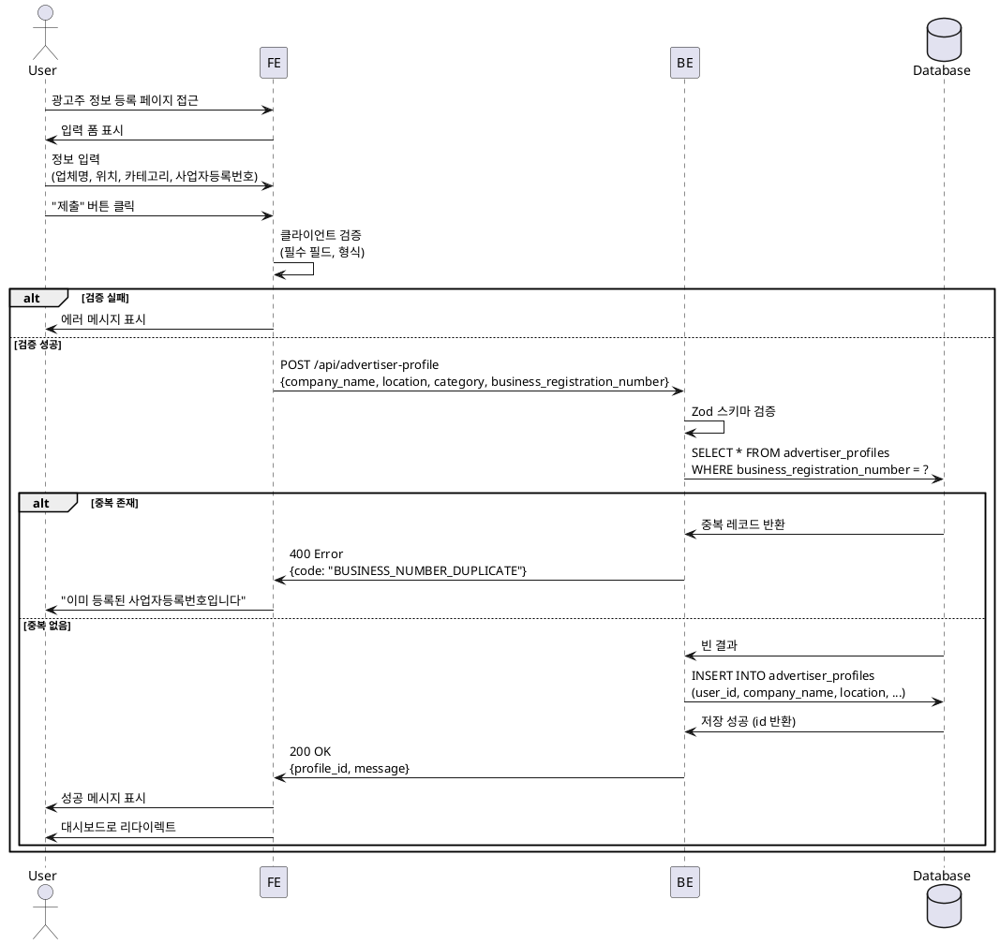

# 광고주 정보 등록 - 상세 유스케이스

## Use Case: 광고주 정보 등록

### Primary Actor
광고주 (Advertiser)

### Precondition
- 회원가입 완료 및 로그인 상태
- 역할로 '광고주' 선택 완료
- 광고주 프로필 미등록 상태

### Trigger
회원가입 후 광고주 온보딩 페이지(`/onboarding/advertiser`) 진입

### Main Scenario

1. 사용자가 광고주 정보 등록 페이지에 접근
2. 시스템이 입력 폼 표시 (업체명, 위치, 카테고리, 사업자등록번호)
3. 사용자가 필수 정보 입력
   - 업체명 (최소 2자)
   - 위치 (주소)
   - 카테고리 (드롭다운 선택)
   - 사업자등록번호 (10자리, 하이픈 자동 포맷)
4. 사용자가 "제출" 버튼 클릭
5. 시스템이 입력값 검증 (클라이언트)
6. 백엔드가 사업자등록번호 중복 확인
7. 백엔드가 `advertiser_profiles` 테이블에 데이터 저장
8. 시스템이 저장 성공 메시지 표시
9. 사용자를 대시보드(`/dashboard`) 페이지로 리다이렉트

### Alternative Scenarios

#### A1. 사업자등록번호 중복
- 6단계에서 이미 등록된 사업자등록번호 감지
- 에러 메시지 표시: "이미 등록된 사업자등록번호입니다"
- 사용자가 정보 수정 후 재제출

#### A2. 필수 필드 누락
- 5단계에서 필수 필드 누락 감지
- 해당 필드에 인라인 에러 메시지 표시
- 사용자가 누락 정보 입력 후 재제출

#### A3. 네트워크 오류
- 7단계에서 서버 연결 실패
- 에러 메시지 표시: "네트워크 오류가 발생했습니다. 다시 시도해 주세요"
- 사용자가 재제출

### Edge Cases

**입력 검증**
- 업체명: 특수문자/이모지 포함 시 허용 여부 확인
- 위치: 빈 문자열 또는 공백만 입력 시 차단
- 사업자등록번호: 숫자 외 문자 입력 시 자동 제거

**중복 등록 방어**
- 동일 `user_id`로 이미 `advertiser_profiles` 존재 시 수정 모드로 전환
- 빠른 연속 클릭으로 인한 중복 제출 방지 (버튼 비활성화)

**데이터 무결성**
- DB 저장 실패 시 롤백 처리
- 필수 NOT NULL 제약 위반 시 500 에러가 아닌 400 에러 반환

### Business Rules

**BR-001: 사업자등록번호 유일성**
- 하나의 사업자등록번호는 하나의 광고주 계정에만 연결 가능
- UNIQUE 제약으로 DB 레벨에서 보장

**BR-002: 프로필 등록 필수**
- 광고주는 프로필 등록 완료 후에만 체험단 생성 가능
- `is_verified: false` 상태에서도 체험단 등록 허용 (추후 검증)

**BR-003: 카테고리 제한**
- 사전 정의된 카테고리 목록에서만 선택 가능
- 목록: 음식점, 카페, 뷰티/미용, 패션, 생활용품, 전자기기, 교육, 여행/숙박, 헬스/피트니스, 기타

**BR-004: 사업자등록번호 형식**
- 10자리 숫자만 허용 (000-00-00000)
- 하이픈은 표시용으로만 사용, DB 저장 시 제거

**BR-005: 데이터 보관**
- 회원 탈퇴 시 광고주 프로필도 CASCADE 삭제
- 단, 등록한 체험단은 히스토리 보관 (advertiser_id만 NULL 처리 고려)

---

## Sequence Diagram



---

## API Specification

### POST /api/advertiser-profile

**Request Body**
```json
{
  "company_name": "카페 블루밍",
  "location": "서울특별시 강남구 테헤란로 123",
  "category": "카페",
  "business_registration_number": "1234567890"
}
```

**Response (Success - 200)**
```json
{
  "ok": true,
  "data": {
    "profile_id": "uuid",
    "message": "광고주 정보가 등록되었습니다."
  }
}
```

**Response (Error - 400)**
```json
{
  "ok": false,
  "error": {
    "code": "BUSINESS_NUMBER_DUPLICATE",
    "message": "이미 등록된 사업자등록번호입니다."
  }
}
```

---

## UI/UX Notes

**입력 필드 순서**
1. 업체명 (텍스트 입력)
2. 위치 (텍스트 입력 or 주소 검색 API 연동)
3. 카테고리 (Select 드롭다운)
4. 사업자등록번호 (텍스트 입력, 자동 하이픈 포맷)

**UX 고려사항**
- 사업자등록번호 입력 시 실시간 하이픈 포맷팅
- 제출 버튼 클릭 시 로딩 인디케이터 표시
- 에러 메시지는 필드 하단에 빨간색으로 표시
- 성공 시 Toast 알림 + 2초 후 자동 리다이렉트

**접근성**
- 모든 필드에 적절한 label과 aria-label 제공
- 에러 메시지는 screen reader로 읽을 수 있도록 role="alert" 설정
- 키보드 네비게이션 지원 (Tab, Enter)

