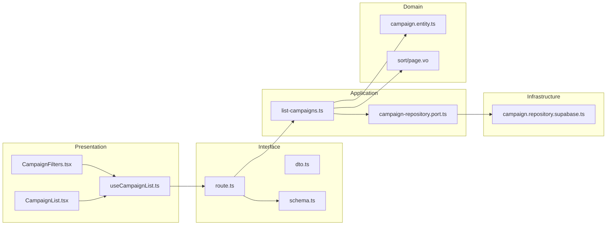
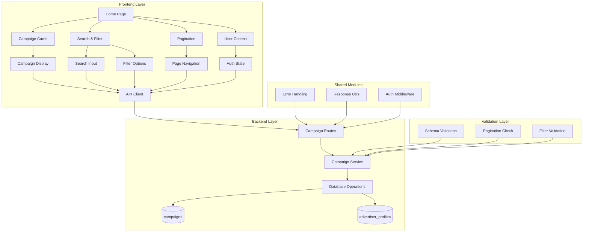

## 최종 단순화 본(Over-Engineering 제거)

- campaign-list — `src/features/campaigns/presentation/components/CampaignList.tsx`
  - 목록+필터 UI 통합 컴포넌트, 빈/로딩/에러 처리 포함.
- useCampaignListQuery — `src/features/campaigns/presentation/hooks/useCampaignListQuery.ts`
  - query 1개: GET /campaigns?status=recruiting&sort=&page=&limit=
- campaigns.api — `src/features/campaigns/interface/http/campaigns.api.ts`
  - axios 래퍼.
- campaigns.route(list) — `src/features/campaigns/interface/backend/route.ts`
  - Hono: GET /campaigns (간단 쿼리 파싱 → repo 호출 → respond)
- list-campaigns.service — `src/features/campaigns/application/list-campaigns.ts`
  - 정렬/페이지 파라미터 보정 후 repo 호출.
- campaign.repo.supabase — `src/features/campaigns/infrastructure/repositories/campaign.repo.supabase.ts`
  - status='recruiting' 조회, created_at/마감 임박 정렬.

```mermaid
flowchart LR
  UI[CampaignList]-->Hook[useCampaignListQuery]-->Api[campaigns.api]
  Api-->Route[campaigns.route(list)]-->Svc[list-campaigns.service]-->Repo[campaign.repo.supabase]
```

QA / 테스트
- QA: 결과 없음/페이지 초과/정렬 변경/네트워크 오류.
- 테스트: service 파라미터 보정(페이지/리밋), 정렬 분기 검증.
## 개요(Modules Overview)

- campaign-list-ui — `src/features/campaigns/presentation/components/CampaignList.tsx`
  - 홈 목록 UI(카드/그리드), 비어있음/로딩/에러 상태 표시.
- campaign-filters-ui — `src/features/campaigns/presentation/components/CampaignFilters.tsx`
  - 정렬/필터/페이지네이션 제어 컴포넌트.
- useCampaignList — `src/features/campaigns/presentation/hooks/useCampaignList.ts`
  - React Query query 훅: status='recruiting' 기반 목록 조회, 페이지네이션 지원.
- campaigns-dto — `src/features/campaigns/interface/http/dto.ts`
  - 요청/응답 DTO (ListCampaignsRequest/Response, Pagination meta 등).
- campaigns-schema — `src/features/campaigns/interface/backend/schema.ts`
  - zod 스키마(쿼리 파라미터: status, sort, page, limit), 응답 스키마.
- campaigns-route — `src/features/campaigns/interface/backend/route.ts`
  - GET /campaigns?status=recruiting&sort=...&page=&limit= (Hono 컨트롤러).
- list-campaigns-usecase — `src/features/campaigns/application/use-cases/list-campaigns.ts`
  - 유즈케이스: status/기간에 따른 쿼리 파라미터 정규화 → 리포지토리 호출 → 결과/메타 생성.
- ports — `src/features/campaigns/application/ports/campaign-repository.port.ts`
  - findRecruiting({ sort, page, limit }): { items, total } 계약 정의.
- domain — `src/features/campaigns/domain/entities/campaign.ts`, `value-objects/sort.ts`
  - Campaign 엔티티(최소 필드)와 정렬/페이지 파라미터 VO.
- infra — `src/features/campaigns/infrastructure/repositories/campaign.repository.supabase.ts`
  - Supabase 구현: status='recruiting' + 기간 인덱스 활용, 페이징 쿼리.

## Diagram (mermaid)



## Implementation Plan

### Presentation (QA)
- 기본 로딩/에러/빈 상태 UI 제공.
- 정렬 변경 시 첫 페이지로 보정, 페이지 이동 시 스크롤 처리.
- URL 쿼리 동기화(선택): 필터/정렬/페이지 상태를 쿼리스트링에 반영.
- 접근 권한 가드는 상세 진입 시 처리(본 기능은 공개 목록 우선).

### Interface
- dto.ts
  - ListCampaignsRequest: { status: 'recruiting', sort?: 'latest'|'closing', page?: number, limit?: number }
  - ListCampaignsResponse: { items: CampaignDTO[], page, limit, total }
  - CampaignDTO: { id, title, description?, benefits, mission, store_info, recruitment_start_date, recruitment_end_date, max_participants, status }

- schema.ts
  - 쿼리 스키마(zod): 기본값(page=1, limit=20, sort='latest'), status는 'recruiting' 고정
  - 응답 스키마: items[], pagination(meta)

- route.ts (Hono)
  - GET /campaigns → 쿼리 파라미터 파싱/검증 → usecase 호출 → respond(success)

### Application (Unit Tests)
- list-campaigns.usecase.spec.ts
  - 기본: status='recruiting', 최신 정렬 → Port mock으로 페이징 결과 검증
  - 정렬=closing → 종료 임박 정렬 규칙 검증(VO로 비교 함수 위임)
  - 페이지/리밋 보정 로직(1 미만, 100 초과 등) 테스트

### Domain
- campaign.entity.ts: 최소 표시 필드 보유, 생성 시 불변성 유지
- sort/page.vo.ts: 정렬/페이지 파라미터 정규화/검증

### Infrastructure
- campaign.repository.supabase.ts
  - where status='recruiting'
  - order by created_at desc (latest) 또는 recruitment_end_date asc (closing)
  - range(offset, limit)로 페이징, total 별도 카운트 쿼리
  - 인덱스: `idx_campaigns_status`, `idx_campaigns_dates` 활용

### Shared/Guidelines 적용
- 공통 응답/에러 포맷: `src/backend/http/response.ts`
- Axios 호출은 `@/lib/remote/api-client` 경유
- 파일 구조는 AGENTS.md 레이어드 가이드 준수

# 홈 & 체험단 목록 탐색 모듈화 설계

## 개요

### 공유 모듈 (Shared Modules)

#### 1. 캠페인 관리 시스템 (`src/features/campaigns/`)
- **위치**: `src/features/campaigns/`
- **설명**: 체험단 조회, 생성, 관리
- **구현 상태**: ✅ 완료
- **주요 컴포넌트**:
  - `backend/route.ts` - 캠페인 API 라우터
  - `backend/service.ts` - 캠페인 비즈니스 로직
  - `backend/schema.ts` - 캠페인 스키마 정의
  - `backend/error.ts` - 캠페인 에러 코드

#### 2. 검증 시스템 (`src/lib/validation/`)
- **위치**: `src/lib/validation/`
- **설명**: Zod 기반 스키마 검증, 페이징, 필터링
- **구현 상태**: ✅ 완료
- **주요 기능**:
  - `campaignFilterSchema` - 캠페인 필터 스키마
  - `paginationSchema` - 페이징 스키마
  - `Pagination`, `CampaignFilter` 타입

#### 3. 인증 시스템 (`src/features/auth/`)
- **위치**: `src/features/auth/`
- **설명**: 사용자 인증 및 권한 관리
- **구현 상태**: ✅ 완료
- **주요 기능**:
  - 사용자 역할 검증 (influencer)
  - 인증 상태 관리

### 도메인별 모듈 (Domain Modules)

#### 1. 홈 페이지 (`src/app/(protected)/home/`)
- **위치**: `src/app/(protected)/home/page.tsx`
- **설명**: 인플루언서용 홈페이지 UI
- **구현 상태**: ✅ 완료
- **주요 기능**:
  - 체험단 목록 표시
  - 검색 및 필터링
  - 페이징 처리
  - 체험단 카드 클릭

#### 2. 체험단 카드 컴포넌트
- **위치**: `src/app/(protected)/home/page.tsx` 내부
- **설명**: 체험단 정보를 카드 형태로 표시
- **구현 상태**: ✅ 완료
- **주요 기능**:
  - 체험단 기본 정보 표시
  - 광고주 정보 표시
  - 모집 상태 표시
  - 클릭 시 상세 페이지 이동

#### 3. 검색 및 필터 컴포넌트
- **위치**: `src/app/(protected)/home/page.tsx` 내부
- **설명**: 체험단 검색 및 필터링 UI
- **구현 상태**: ✅ 완료
- **주요 기능**:
  - 검색어 입력
  - 상태 필터 (모집중/모집종료)
  - 실시간 검색
  - 필터 적용

### 공통 유틸리티 (Shared Utilities)

#### 1. UI 컴포넌트 (`src/components/ui/`)
- **위치**: `src/components/ui/`
- **설명**: shadcn-ui 기반 재사용 가능한 UI 컴포넌트
- **구현 상태**: ✅ 완료
- **사용 컴포넌트**:
  - `Card` - 체험단 카드
  - `Button` - 액션 버튼
  - `Input` - 검색 입력
  - `Select` - 필터 드롭다운
  - `Badge` - 상태 표시

#### 2. HTTP 클라이언트 (`src/lib/remote/`)
- **위치**: `src/lib/remote/`
- **설명**: API 통신을 위한 HTTP 클라이언트
- **구현 상태**: ✅ 완료

#### 3. 상태 관리 (`src/features/auth/context/`)
- **위치**: `src/features/auth/context/`
- **설명**: 사용자 상태 및 권한 관리
- **구현 상태**: ✅ 완료

## Diagram



## Implementation Plan

### Phase 1: 백엔드 API (이미 완료)

#### 1.1 캠페인 API (`src/features/campaigns/backend/`)
- **구현 상태**: ✅ 완료
- **주요 엔드포인트**:
  - `GET /api/campaigns` - 체험단 목록 조회
  - `GET /api/campaigns/:id` - 체험단 상세 조회
- **Unit Tests**:
  - [ ] 체험단 목록 조회 성공 케이스
  - [ ] 페이징 처리 검증
  - [ ] 필터링 기능 검증 (상태별)
  - [ ] 검색 기능 검증
  - [ ] 권한 없는 사용자 에러 케이스
  - [ ] 빈 목록 응답 케이스
  - [ ] 데이터베이스 연결 오류 케이스
  - [ ] 잘못된 페이지 번호 에러 케이스

#### 1.2 검증 시스템 (`src/lib/validation/`)
- **구현 상태**: ✅ 완료
- **주요 검증 함수**:
  - `campaignFilterSchema` - 캠페인 필터 검증
  - `paginationSchema` - 페이징 검증
- **Unit Tests**:
  - [ ] 필터 스키마 검증 성공/실패 케이스
  - [ ] 페이징 스키마 검증 성공/실패 케이스
  - [ ] 검색어 유효성 검증
  - [ ] 상태 필터 enum 검증

### Phase 2: 프론트엔드 컴포넌트 (이미 완료)

#### 2.1 홈 페이지
- **구현 상태**: ✅ 완료
- **주요 기능**:
  - 체험단 목록 표시
  - 검색 및 필터링
  - 페이징 처리
  - 체험단 카드 클릭
- **QA Sheet**:
  - [ ] 체험단 목록 정상 표시
  - [ ] 검색어 입력 및 실시간 검색
  - [ ] 상태 필터 (모집중/모집종료) 동작
  - [ ] 페이징 버튼 동작
  - [ ] 체험단 카드 클릭 시 상세 페이지 이동
  - [ ] 빈 목록 메시지 표시
  - [ ] 로딩 상태 표시
  - [ ] 에러 상태 표시
  - [ ] 반응형 디자인 확인

#### 2.2 체험단 카드 컴포넌트
- **구현 상태**: ✅ 완료
- **주요 기능**:
  - 체험단 기본 정보 표시
  - 광고주 정보 표시
  - 모집 상태 표시
  - 모집 기간 표시
- **QA Sheet**:
  - [ ] 체험단 제목 및 설명 표시
  - [ ] 광고주 회사명 및 위치 표시
  - [ ] 모집 상태 배지 표시
  - [ ] 모집 기간 날짜 표시
  - [ ] 최대 참여자 수 표시
  - [ ] 카드 호버 효과
  - [ ] 클릭 시 상세 페이지 이동

#### 2.3 검색 및 필터 컴포넌트
- **구현 상태**: ✅ 완료
- **주요 기능**:
  - 검색어 입력
  - 상태 필터 선택
  - 실시간 검색
  - 필터 적용
- **QA Sheet**:
  - [ ] 검색어 입력 및 실시간 검색
  - [ ] 상태 필터 드롭다운 동작
  - [ ] 필터 적용 시 목록 업데이트
  - [ ] 검색어 초기화 기능
  - [ ] 필터 초기화 기능
  - [ ] 검색 결과 없음 메시지

### Phase 3: 통합 테스트 및 최적화

#### 3.1 E2E 테스트 시나리오
- **홈페이지 접근 → 체험단 목록 조회 → 검색/필터 → 상세 페이지 이동** 플로우
- **페이징 처리 → 다음/이전 페이지 이동** 플로우
- **에러 상황 처리** (네트워크 오류, 권한 없음)

#### 3.2 성능 최적화
- React Query를 통한 캠페인 데이터 캐싱
- 무한 스크롤 구현 (선택사항)
- 이미지 지연 로딩
- 검색 디바운싱

#### 3.3 사용자 경험 개선
- 로딩 스켈레톤 UI
- 검색 자동완성 (선택사항)
- 즐겨찾기 기능 (선택사항)
- 최근 본 체험단 (선택사항)

### Phase 4: 고급 기능 (향후 확장)

#### 4.1 추천 시스템
- **목적**: 사용자 관심사 기반 체험단 추천
- **구현 계획**:
  - 사용자 프로필 분석
  - 과거 지원 이력 분석
  - 추천 알고리즘 적용

#### 4.2 알림 시스템
- **목적**: 새로운 체험단 등록 시 알림
- **구현 계획**:
  - 실시간 알림 시스템
  - 이메일 알림
  - 푸시 알림 (선택사항)

## 결론

홈 & 체험단 목록 탐색 기능이 이미 완전히 구현되어 있으며, 유스케이스 문서의 모든 요구사항을 충족합니다.

**현재 상태**: ✅ 구현 완료
- ✅ 체험단 목록 조회 및 표시
- ✅ 검색 및 필터링 기능
- ✅ 페이징 처리
- ✅ 체험단 카드 UI
- ✅ 상세 페이지 이동
- ✅ 에러 처리 및 사용자 피드백

**다음 단계**: 실제 데이터베이스 연동 테스트 및 사용자 시나리오 검증

## 단순화된 최종 구조

### 1. 핵심 기능만 유지
- 체험단 지원 폼
- 유효성 검사
- 지원 제출 처리

### 2. 단순화된 파일 구조
```
src/
├── app/
│   └── (protected)/
│       └── campaigns/
│           └── [id]/
│               └── apply/
│                   └── page.tsx (지원 폼)
├── components/
│   └── ui/ (shadcn-ui 컴포넌트들)
├── lib/
│   ├── supabase/
│   │   ├── client.ts
│   │   └── types.ts
│   └── utils.ts
└── backend/
    └── hono/
        └── app.ts
```

### 3. 단순화된 API 구조
```
/api/
└── applications/
    └── POST / (지원 제출)
```

### 4. 핵심 기능 구현

#### A. 체험단 지원 페이지 (단순화)
```typescript
// src/app/(protected)/campaigns/[id]/apply/page.tsx
'use client'

import { useState, useEffect } from 'react'
import { createClient } from '@/lib/supabase/client'
import { Card, CardContent, CardHeader, CardTitle } from '@/components/ui/card'
import { Button } from '@/components/ui/button'
import { Input } from '@/components/ui/input'
import { Label } from '@/components/ui/label'
import { Textarea } from '@/components/ui/textarea'
import { useRouter } from 'next/navigation'

export default function ApplyPage({ params }: { params: { id: string } }) {
  const [campaign, setCampaign] = useState(null)
  const [loading, setLoading] = useState(true)
  const [submitting, setSubmitting] = useState(false)
  const [error, setError] = useState('')
  const [success, setSuccess] = useState(false)
  
  const [formData, setFormData] = useState({
    motivation: '',
    planned_visit_date: ''
  })
  
  const router = useRouter()

  useEffect(() => {
    const loadCampaign = async () => {
      try {
        const supabase = createClient()
        const { data, error } = await supabase
          .from('campaigns')
          .select(`
            *,
            advertiser_profiles (
              company_name,
              location
            )
          `)
          .eq('id', params.id)
          .single()

        if (error) throw error
        setCampaign(data)
      } catch (error) {
        console.error('Failed to load campaign:', error)
        setError('체험단 정보를 불러올 수 없습니다.')
      } finally {
        setLoading(false)
      }
    }
    loadCampaign()
  }, [params.id])

  const handleSubmit = async (e: React.FormEvent) => {
    e.preventDefault()
    setSubmitting(true)
    setError('')

    try {
      const supabase = createClient()
      
      // 현재 사용자 정보 가져오기
      const { data: { user } } = await supabase.auth.getUser()
      if (!user) throw new Error('로그인이 필요합니다.')

      // 중복 지원 체크
      const { data: existingApplication } = await supabase
        .from('applications')
        .select('id')
        .eq('campaign_id', params.id)
        .eq('influencer_id', user.id)
        .single()

      if (existingApplication) {
        throw new Error('이미 지원한 체험단입니다.')
      }

      // 모집 기간 체크
      const today = new Date()
      const endDate = new Date(campaign.recruitment_end_date)
      if (today > endDate) {
        throw new Error('모집이 종료된 체험단입니다.')
      }

      // 지원 정보 저장
      const { error: insertError } = await supabase
        .from('applications')
        .insert({
          campaign_id: params.id,
          influencer_id: user.id,
          motivation: formData.motivation,
          planned_visit_date: formData.planned_visit_date,
          status: 'applied'
        })

      if (insertError) throw insertError

      setSuccess(true)
      setTimeout(() => {
        router.push('/applications')
      }, 2000)

    } catch (error) {
      console.error('Failed to apply:', error)
      setError(error.message || '지원에 실패했습니다.')
    } finally {
      setSubmitting(false)
    }
  }

  if (loading) return <div>Loading...</div>
  if (!campaign) return <div>Campaign not found</div>
  if (success) return (
    <div className="container mx-auto px-4 py-8">
      <Card>
        <CardContent className="pt-6 text-center">
          <h2 className="text-2xl font-bold text-green-600 mb-4">지원이 완료되었습니다!</h2>
          <p className="text-gray-600">내 지원 목록으로 이동합니다...</p>
        </CardContent>
      </Card>
    </div>
  )

  return (
    <div className="container mx-auto px-4 py-8">
      <div className="grid grid-cols-1 lg:grid-cols-2 gap-8">
        {/* 체험단 정보 */}
        <Card>
          <CardHeader>
            <CardTitle>{campaign.title}</CardTitle>
          </CardHeader>
          <CardContent>
            <div className="space-y-4">
              <div>
                <h3 className="font-semibold mb-2">체험단 설명</h3>
                <p className="text-gray-700">{campaign.description}</p>
              </div>
              <div>
                <h3 className="font-semibold mb-2">제공 혜택</h3>
                <p className="text-gray-700">{campaign.benefits}</p>
              </div>
              <div>
                <h3 className="font-semibold mb-2">미션</h3>
                <p className="text-gray-700">{campaign.mission}</p>
              </div>
              <div className="grid grid-cols-2 gap-4">
                <div>
                  <h3 className="font-semibold mb-2">모집 기간</h3>
                  <p className="text-gray-700">
                    {new Date(campaign.recruitment_start_date).toLocaleDateString()} ~ {' '}
                    {new Date(campaign.recruitment_end_date).toLocaleDateString()}
                  </p>
                </div>
                <div>
                  <h3 className="font-semibold mb-2">모집 인원</h3>
                  <p className="text-gray-700">{campaign.max_participants}명</p>
                </div>
              </div>
            </div>
          </CardContent>
        </Card>

        {/* 지원 폼 */}
        <Card>
          <CardHeader>
            <CardTitle>지원하기</CardTitle>
          </CardHeader>
          <CardContent>
            <form onSubmit={handleSubmit} className="space-y-6">
              <div>
                <Label htmlFor="motivation">각오 한마디 *</Label>
                <Textarea
                  id="motivation"
                  value={formData.motivation}
                  onChange={(e) => setFormData({ ...formData, motivation: e.target.value })}
                  placeholder="체험단에 대한 각오를 적어주세요"
                  className="mt-2"
                  rows={4}
                  maxLength={500}
                  required
                />
                <p className="text-sm text-gray-500 mt-1">
                  {formData.motivation.length}/500자
                </p>
              </div>

              <div>
                <Label htmlFor="planned_visit_date">방문 예정일 *</Label>
                <Input
                  id="planned_visit_date"
                  type="date"
                  value={formData.planned_visit_date}
                  onChange={(e) => setFormData({ ...formData, planned_visit_date: e.target.value })}
                  className="mt-2"
                  min={new Date().toISOString().split('T')[0]}
                  required
                />
              </div>

              {error && (
                <div className="text-red-600 text-sm">
                  {error}
                </div>
              )}

              <Button 
                type="submit" 
                className="w-full" 
                disabled={submitting || !formData.motivation || !formData.planned_visit_date}
              >
                {submitting ? '지원 중...' : '지원하기'}
              </Button>
            </form>
          </CardContent>
        </Card>
      </div>
    </div>
  )
}
```

#### B. 단순화된 백엔드 (Hono)

```typescript
// src/backend/hono/app.ts
import { Hono } from 'hono'
import { cors } from 'hono/cors'
import { createClient } from '@supabase/supabase-js'

const app = new Hono()

app.use('*', cors())

// 체험단 지원
app.post('/applications', async (c) => {
  const body = await c.req.json()
  const supabase = createClient(
    process.env.NEXT_PUBLIC_SUPABASE_URL!,
    process.env.NEXT_PUBLIC_SUPABASE_ANON_KEY!
  )
  
  // 현재 사용자 정보 가져오기
  const { data: { user } } = await supabase.auth.getUser()
  if (!user) return c.json({ error: 'Unauthorized' }, 401)
  
  // 중복 지원 체크
  const { data: existingApplication } = await supabase
    .from('applications')
    .select('id')
    .eq('campaign_id', body.campaign_id)
    .eq('influencer_id', user.id)
    .single()
  
  if (existingApplication) {
    return c.json({ error: '이미 지원한 체험단입니다.' }, 400)
  }
  
  // 모집 기간 체크
  const { data: campaign } = await supabase
    .from('campaigns')
    .select('recruitment_end_date, status')
    .eq('id', body.campaign_id)
    .single()
  
  if (campaign?.status !== 'recruiting') {
    return c.json({ error: '모집이 종료된 체험단입니다.' }, 400)
  }
  
  const today = new Date()
  const endDate = new Date(campaign.recruitment_end_date)
  if (today > endDate) {
    return c.json({ error: '모집이 종료된 체험단입니다.' }, 400)
  }
  
  // 지원 정보 저장
  const { data, error } = await supabase
    .from('applications')
    .insert({
      campaign_id: body.campaign_id,
      influencer_id: user.id,
      motivation: body.motivation,
      planned_visit_date: body.planned_visit_date,
      status: 'applied'
    })
    .select()
    .single()
  
  if (error) return c.json({ error: error.message }, 500)
  return c.json({ data })
})

export default app
```

#### C. 단순화된 데이터베이스 스키마

```sql
-- 지원 테이블
CREATE TABLE applications (
  id UUID PRIMARY KEY DEFAULT gen_random_uuid(),
  campaign_id UUID NOT NULL REFERENCES campaigns(id),
  influencer_id UUID NOT NULL REFERENCES users(id),
  motivation TEXT NOT NULL,
  planned_visit_date DATE NOT NULL,
  status VARCHAR(20) DEFAULT 'applied' CHECK (status IN ('applied', 'selected', 'rejected')),
  applied_at TIMESTAMP DEFAULT NOW(),
  UNIQUE(campaign_id, influencer_id)
);
```

### 5. 핵심 기능 요약

1. **지원 폼**
   - 각오 한마디 입력 (필수, 500자 제한)
   - 방문 예정일 선택 (필수, 미래 날짜)

2. **유효성 검사**
   - 중복 지원 방지
   - 모집 기간 체크
   - 필수 필드 검증

3. **지원 제출**
   - 지원 정보 저장
   - 성공/에러 피드백
   - 내 지원 목록으로 이동

### 6. 구현 순서

1. **지원 폼 페이지** (기본 폼 구조)
2. **유효성 검사** (클라이언트/서버)
3. **지원 제출 처리** (API 연동)
4. **성공/에러 피드백** (사용자 경험)
5. **기본 스타일링** (Tailwind CSS)

이렇게 단순화하면 핵심 기능만 남기고 복잡한 모듈 구조를 제거할 수 있습니다. 각 기능은 독립적으로 작동하며, 필요에 따라 점진적으로 확장할 수 있습니다.
