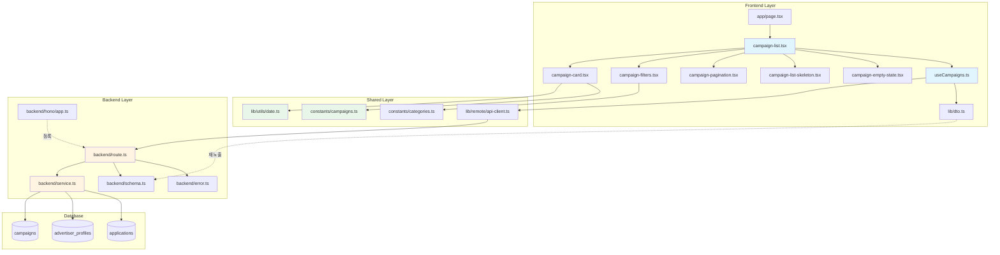

# 체험단 목록 조회 및 탐색 - 구현 계획

## 개요

### 목표
방문자가 모집 중인 체험단을 탐색하고 필터링/정렬하여 관심 체험단을 찾을 수 있는 기능 구현

### 모듈 구성

#### 1. Backend Layer
- **`src/features/campaigns/backend/schema.ts`**
  - Zod 스키마 정의 (query params, 응답, DTO)
  - 필터/정렬 옵션 enum 정의
  - 페이지네이션 스키마

- **`src/features/campaigns/backend/error.ts`**
  - 에러 코드 상수 정의
  - 조회 실패, 유효하지 않은 파라미터 등

- **`src/features/campaigns/backend/service.ts`**
  - 체험단 목록 조회 (필터, 정렬, 페이지네이션)
  - 지원자 수 집계
  - JOIN 쿼리 (advertiser_profiles)

- **`src/features/campaigns/backend/route.ts`**
  - GET `/campaigns` 라우터
  - Query params 검증 및 응답 처리

#### 2. Shared Utilities
- **`src/lib/utils/date.ts`** (신규)
  - D-day 계산
  - 날짜 포맷팅
  - 마감 임박 여부 판단
  - 재사용 가능한 날짜 유틸리티

- **`src/constants/campaigns.ts`** (신규)
  - 체험단 상태 상수 (RECRUITING, CLOSED, COMPLETED)
  - 정렬 옵션 상수 (LATEST, DEADLINE, POPULAR)
  - 기본 페이지네이션 설정

#### 3. Frontend Layer
- **`src/features/campaigns/lib/dto.ts`**
  - Backend 스키마 재노출
  - 프론트엔드 타입 정의

- **`src/features/campaigns/hooks/useCampaigns.ts`**
  - React Query query hook
  - 필터/정렬/페이지네이션 상태 관리
  - API 호출 및 캐싱

- **`src/features/campaigns/components/campaign-card.tsx`**
  - 개별 체험단 카드 컴포넌트
  - 썸네일, 제목, 업체명, 모집 정보 표시
  - D-day 배지, 인기 배지

- **`src/features/campaigns/components/campaign-list.tsx`**
  - 체험단 목록 컨테이너
  - 그리드 레이아웃
  - 로딩/빈 상태 처리

- **`src/features/campaigns/components/campaign-filters.tsx`**
  - 필터/정렬 UI
  - 카테고리 다중 선택
  - 정렬 옵션 선택

- **`src/features/campaigns/components/campaign-pagination.tsx`**
  - 페이지네이션 컴포넌트
  - 이전/다음 버튼
  - 페이지 번호 표시

- **`src/features/campaigns/components/campaign-list-skeleton.tsx`**
  - 로딩 중 스켈레톤 UI
  - 카드 형태의 placeholder

- **`src/features/campaigns/components/campaign-empty-state.tsx`**
  - 빈 상태 UI
  - 메시지 + 액션 버튼

#### 4. Page & Integration
- **`src/app/page.tsx`** (수정)
  - 홈 페이지를 체험단 목록 페이지로 변경
  - CampaignList 컴포넌트 통합

#### 5. Backend Integration
- **`src/backend/hono/app.ts`** (수정)
  - `registerCampaignRoutes(app)` 추가

---

## Architecture Diagram



---

## Implementation Plan

### Phase 1: Shared Utilities

#### 1.1 `src/constants/campaigns.ts`

**목적**: 체험단 관련 상수 정의

**구현 내용**:
```typescript
export const CAMPAIGN_STATUS = {
  RECRUITING: 'recruiting',
  CLOSED: 'closed',
  COMPLETED: 'completed',
} as const;

export type CampaignStatus = (typeof CAMPAIGN_STATUS)[keyof typeof CAMPAIGN_STATUS];

export const CAMPAIGN_SORT = {
  LATEST: 'latest',
  DEADLINE: 'deadline',
  POPULAR: 'popular',
} as const;

export type CampaignSort = (typeof CAMPAIGN_SORT)[keyof typeof CAMPAIGN_SORT];

export const PAGINATION_DEFAULTS = {
  DEFAULT_PAGE: 1,
  DEFAULT_LIMIT: 12,
  MAX_LIMIT: 100,
  MAX_PAGES: 100,
} as const;
```

**테스트 케이스**:
- 모든 상수가 올바르게 정의되는지 확인
- 타입 추론이 정확한지 확인

---

#### 1.2 `src/lib/utils/date.ts`

**목적**: 날짜 관련 유틸리티 함수

**구현 내용**:
```typescript
import { differenceInDays, format, parseISO } from 'date-fns';
import { ko } from 'date-fns/locale';

export const calculateDday = (targetDate: string | Date): number => {
  const today = new Date();
  today.setHours(0, 0, 0, 0);
  
  const target = typeof targetDate === 'string' ? parseISO(targetDate) : targetDate;
  target.setHours(0, 0, 0, 0);
  
  return differenceInDays(target, today);
};

export const formatDday = (dday: number): string => {
  if (dday === 0) return '오늘 마감';
  if (dday < 0) return '마감';
  return `D-${dday}`;
};

export const isDeadlineNear = (dday: number, threshold: number = 3): boolean => {
  return dday >= 0 && dday <= threshold;
};

export const formatDateRange = (
  startDate: string | Date,
  endDate: string | Date,
): string => {
  const start = typeof startDate === 'string' ? parseISO(startDate) : startDate;
  const end = typeof endDate === 'string' ? parseISO(endDate) : endDate;
  
  return `${format(start, 'M월 d일', { locale: ko })} ~ ${format(end, 'M월 d일', { locale: ko })}`;
};

export const formatDate = (date: string | Date, formatStr: string = 'yyyy-MM-dd'): string => {
  const dateObj = typeof date === 'string' ? parseISO(date) : date;
  return format(dateObj, formatStr, { locale: ko });
};
```

**Unit Tests**:
```typescript
describe('date utils', () => {
  describe('calculateDday', () => {
    test('오늘 날짜는 D-0', () => {
      const today = new Date().toISOString();
      expect(calculateDday(today)).toBe(0);
    });

    test('내일 날짜는 D-1', () => {
      const tomorrow = new Date();
      tomorrow.setDate(tomorrow.getDate() + 1);
      expect(calculateDday(tomorrow)).toBe(1);
    });

    test('과거 날짜는 음수', () => {
      const yesterday = new Date();
      yesterday.setDate(yesterday.getDate() - 1);
      expect(calculateDday(yesterday)).toBe(-1);
    });
  });

  describe('formatDday', () => {
    test('D-0는 "오늘 마감"', () => {
      expect(formatDday(0)).toBe('오늘 마감');
    });

    test('양수는 "D-n"', () => {
      expect(formatDday(3)).toBe('D-3');
    });

    test('음수는 "마감"', () => {
      expect(formatDday(-1)).toBe('마감');
    });
  });

  describe('isDeadlineNear', () => {
    test('D-3 이내는 true', () => {
      expect(isDeadlineNear(0)).toBe(true);
      expect(isDeadlineNear(3)).toBe(true);
    });

    test('D-4 이상은 false', () => {
      expect(isDeadlineNear(4)).toBe(false);
    });

    test('음수는 false', () => {
      expect(isDeadlineNear(-1)).toBe(false);
    });
  });
});
```

---

### Phase 2: Backend Layer

#### 2.1 `src/features/campaigns/backend/error.ts`

**구현 내용**:
```typescript
export const campaignErrorCodes = {
  fetchError: 'CAMPAIGNS_FETCH_ERROR',
  invalidQueryParams: 'CAMPAIGNS_INVALID_QUERY_PARAMS',
  databaseError: 'CAMPAIGNS_DATABASE_ERROR',
  notFound: 'CAMPAIGN_NOT_FOUND',
} as const;

type CampaignErrorValue = (typeof campaignErrorCodes)[keyof typeof campaignErrorCodes];

export type CampaignServiceError = CampaignErrorValue;
```

---

#### 2.2 `src/features/campaigns/backend/schema.ts`

**구현 내용**:
```typescript
import { z } from 'zod';
import { CAMPAIGN_STATUS, CAMPAIGN_SORT, PAGINATION_DEFAULTS } from '@/constants/campaigns';

export const GetCampaignsQuerySchema = z.object({
  status: z.enum([
    CAMPAIGN_STATUS.RECRUITING,
    CAMPAIGN_STATUS.CLOSED,
    CAMPAIGN_STATUS.COMPLETED,
  ]).optional().default(CAMPAIGN_STATUS.RECRUITING),
  category: z.string().optional(),
  page: z.coerce.number().int().positive().optional().default(PAGINATION_DEFAULTS.DEFAULT_PAGE),
  limit: z.coerce.number().int().positive().max(PAGINATION_DEFAULTS.MAX_LIMIT).optional().default(PAGINATION_DEFAULTS.DEFAULT_LIMIT),
  sort: z.enum([
    CAMPAIGN_SORT.LATEST,
    CAMPAIGN_SORT.DEADLINE,
    CAMPAIGN_SORT.POPULAR,
  ]).optional().default(CAMPAIGN_SORT.LATEST),
});

export type GetCampaignsQuery = z.infer<typeof GetCampaignsQuerySchema>;

export const CampaignWithAdvertiserSchema = z.object({
  id: z.string().uuid(),
  title: z.string(),
  description: z.string().nullable(),
  benefits: z.string(),
  recruitment_count: z.number(),
  recruitment_start_date: z.string(),
  recruitment_end_date: z.string(),
  status: z.string(),
  created_at: z.string(),
  advertiser: z.object({
    id: z.string().uuid(),
    company_name: z.string(),
    category: z.string(),
    location: z.string(),
  }),
  applications_count: z.number(),
});

export type CampaignWithAdvertiser = z.infer<typeof CampaignWithAdvertiserSchema>;

export const PaginationMetaSchema = z.object({
  total: z.number(),
  page: z.number(),
  limit: z.number(),
  total_pages: z.number(),
});

export type PaginationMeta = z.infer<typeof PaginationMetaSchema>;

export const GetCampaignsResponseSchema = z.object({
  data: z.array(CampaignWithAdvertiserSchema),
  pagination: PaginationMetaSchema,
});

export type GetCampaignsResponse = z.infer<typeof GetCampaignsResponseSchema>;
```

---

#### 2.3 `src/features/campaigns/backend/service.ts`

**목적**: 비즈니스 로직 구현

**구현 내용**:
```typescript
import type { SupabaseClient } from '@supabase/supabase-js';
import { failure, success, type HandlerResult } from '@/backend/http/response';
import type { GetCampaignsQuery, GetCampaignsResponse } from './schema';
import { campaignErrorCodes, type CampaignServiceError } from './error';
import { CAMPAIGN_SORT } from '@/constants/campaigns';

const CAMPAIGNS_TABLE = 'campaigns';
const ADVERTISER_PROFILES_TABLE = 'advertiser_profiles';
const APPLICATIONS_TABLE = 'applications';

export const getCampaigns = async (
  client: SupabaseClient,
  query: GetCampaignsQuery,
): Promise<HandlerResult<GetCampaignsResponse, CampaignServiceError, unknown>> => {
  const { status, category, page, limit, sort } = query;
  const offset = (page - 1) * limit;

  let baseQuery = client
    .from(CAMPAIGNS_TABLE)
    .select(`
      id,
      title,
      description,
      benefits,
      recruitment_count,
      recruitment_start_date,
      recruitment_end_date,
      status,
      created_at,
      advertiser:advertiser_profiles!inner(
        id,
        company_name,
        category,
        location
      )
    `, { count: 'exact' })
    .eq('status', status)
    .gte('recruitment_end_date', new Date().toISOString().split('T')[0]);

  if (category) {
    baseQuery = baseQuery.eq('advertiser.category', category);
  }

  switch (sort) {
    case CAMPAIGN_SORT.LATEST:
      baseQuery = baseQuery.order('created_at', { ascending: false });
      break;
    case CAMPAIGN_SORT.DEADLINE:
      baseQuery = baseQuery.order('recruitment_end_date', { ascending: true });
      break;
    case CAMPAIGN_SORT.POPULAR:
      break;
  }

  const { data: campaigns, error: campaignsError, count } = await baseQuery
    .range(offset, offset + limit - 1);

  if (campaignsError) {
    return failure(500, campaignErrorCodes.databaseError, campaignsError.message);
  }

  if (!campaigns) {
    return failure(500, campaignErrorCodes.fetchError, '체험단 목록을 불러올 수 없습니다.');
  }

  const campaignIds = campaigns.map((c: any) => c.id);
  
  const { data: applicationCounts, error: countsError } = await client
    .from(APPLICATIONS_TABLE)
    .select('campaign_id')
    .in('campaign_id', campaignIds);

  if (countsError) {
    console.error('Failed to fetch application counts:', countsError);
  }

  const countMap = (applicationCounts || []).reduce((acc: Record<string, number>, app: any) => {
    acc[app.campaign_id] = (acc[app.campaign_id] || 0) + 1;
    return acc;
  }, {});

  const campaignsWithCounts = campaigns.map((campaign: any) => ({
    ...campaign,
    advertiser: Array.isArray(campaign.advertiser) ? campaign.advertiser[0] : campaign.advertiser,
    applications_count: countMap[campaign.id] || 0,
  }));

  if (sort === CAMPAIGN_SORT.POPULAR) {
    campaignsWithCounts.sort((a: any, b: any) => b.applications_count - a.applications_count);
  }

  const totalPages = Math.ceil((count || 0) / limit);

  return success({
    data: campaignsWithCounts,
    pagination: {
      total: count || 0,
      page,
      limit,
      total_pages: totalPages,
    },
  });
};
```

**Unit Tests**:
```typescript
describe('campaigns service', () => {
  describe('getCampaigns', () => {
    test('기본 조회 성공', async () => {
      // Mock Supabase client
      // Assert: success with data and pagination
    });

    test('카테고리 필터 적용', async () => {
      // Mock with category filter
      // Assert: filtered results
    });

    test('정렬 옵션 적용', async () => {
      // Mock with sort option
      // Assert: sorted results
    });

    test('페이지네이션 적용', async () => {
      // Mock pagination
      // Assert: correct offset and limit
    });

    test('빈 결과', async () => {
      // Mock empty result
      // Assert: empty array with pagination
    });

    test('DB 에러 처리', async () => {
      // Mock error
      // Assert: error code = databaseError
    });
  });
});
```

---

#### 2.4 `src/features/campaigns/backend/route.ts`

**구현 내용**:
```typescript
import type { Hono } from 'hono';
import { failure, respond, type ErrorResult } from '@/backend/http/response';
import { getLogger, getSupabase, type AppEnv } from '@/backend/hono/context';
import { GetCampaignsQuerySchema } from './schema';
import { getCampaigns } from './service';
import { type CampaignServiceError } from './error';

export const registerCampaignRoutes = (app: Hono<AppEnv>) => {
  app.get('/campaigns', async (c) => {
    const queryParams = c.req.query();
    const parsedQuery = GetCampaignsQuerySchema.safeParse(queryParams);

    if (!parsedQuery.success) {
      return respond(
        c,
        failure(
          400,
          'INVALID_CAMPAIGNS_QUERY',
          '잘못된 쿼리 파라미터입니다.',
          parsedQuery.error.format(),
        ),
      );
    }

    const supabase = getSupabase(c);
    const logger = getLogger(c);

    const result = await getCampaigns(supabase, parsedQuery.data);

    if (!result.ok) {
      const errorResult = result as ErrorResult<CampaignServiceError, unknown>;
      logger.error('Campaigns fetch failed', { error: errorResult.error.code });
    } else {
      logger.info('Campaigns fetched successfully', { 
        count: result.data.data.length,
        page: result.data.pagination.page,
      });
    }

    return respond(c, result);
  });
};
```

---

### Phase 3: Frontend Layer

#### 3.1 `src/features/campaigns/lib/dto.ts`

**구현 내용**:
```typescript
export {
  GetCampaignsQuerySchema,
  GetCampaignsResponseSchema,
  type GetCampaignsQuery,
  type GetCampaignsResponse,
  type CampaignWithAdvertiser,
  type PaginationMeta,
} from '../backend/schema';
```

---

#### 3.2 `src/features/campaigns/hooks/useCampaigns.ts`

**구현 내용**:
```typescript
import { useQuery } from '@tanstack/react-query';
import { apiClient } from '@/lib/remote/api-client';
import {
  GetCampaignsResponseSchema,
  type GetCampaignsQuery,
  type GetCampaignsResponse,
} from '../lib/dto';

const fetchCampaigns = async (
  params: GetCampaignsQuery,
): Promise<GetCampaignsResponse> => {
  const response = await apiClient.get('/campaigns', { params });
  return GetCampaignsResponseSchema.parse(response.data);
};

export const useCampaigns = (params: GetCampaignsQuery) => {
  return useQuery({
    queryKey: ['campaigns', params],
    queryFn: () => fetchCampaigns(params),
    staleTime: 5 * 60 * 1000,
    gcTime: 10 * 60 * 1000,
  });
};
```

---

#### 3.3 `src/features/campaigns/components/campaign-card.tsx`

**목적**: 개별 체험단 카드 컴포넌트

**구현 내용**:
```typescript
'use client';

import Image from 'next/image';
import Link from 'next/link';
import { Badge } from '@/components/ui/badge';
import { Card, CardContent, CardFooter, CardHeader } from '@/components/ui/card';
import { calculateDday, formatDday, isDeadlineNear, formatDateRange } from '@/lib/utils/date';
import { CATEGORY_LABELS } from '@/constants/categories';
import type { CampaignWithAdvertiser } from '../lib/dto';

type CampaignCardProps = {
  campaign: CampaignWithAdvertiser;
};

export const CampaignCard = ({ campaign }: CampaignCardProps) => {
  const dday = calculateDday(campaign.recruitment_end_date);
  const isNearDeadline = isDeadlineNear(dday);
  const dateRange = formatDateRange(
    campaign.recruitment_start_date,
    campaign.recruitment_end_date,
  );

  return (
    <Link href={`/campaigns/${campaign.id}`}>
      <Card className="overflow-hidden transition-all hover:shadow-lg hover:scale-[1.02] cursor-pointer">
        <CardHeader className="p-0">
          <div className="relative aspect-video">
            <Image
              src={`https://picsum.photos/seed/${campaign.id}/960/540`}
              alt={campaign.title}
              fill
              className="object-cover"
            />
            <div className="absolute top-2 left-2 flex gap-2">
              <Badge variant="secondary">
                {CATEGORY_LABELS[campaign.advertiser.category as keyof typeof CATEGORY_LABELS]}
              </Badge>
              {isNearDeadline && (
                <Badge variant="destructive">
                  {formatDday(dday)}
                </Badge>
              )}
              {campaign.applications_count > 20 && (
                <Badge variant="default">인기</Badge>
              )}
            </div>
          </div>
        </CardHeader>
        <CardContent className="p-4">
          <h3 className="font-semibold text-lg line-clamp-2 mb-2">
            {campaign.title}
          </h3>
          <p className="text-sm text-gray-600 mb-1">
            {campaign.advertiser.company_name}
          </p>
          <p className="text-xs text-gray-500">
            {dateRange}
          </p>
        </CardContent>
        <CardFooter className="p-4 pt-0 flex justify-between text-sm">
          <span className="text-gray-600">
            모집 {campaign.recruitment_count}명
          </span>
          <span className="text-blue-600">
            {campaign.applications_count}명 지원
          </span>
        </CardFooter>
      </Card>
    </Link>
  );
};
```

**QA Sheet**:
| 테스트 시나리오 | 입력 | 예상 결과 | 통과 여부 |
|----------------|------|----------|----------|
| 일반 카드 렌더링 | campaign 데이터 | 모든 정보 표시 | ⬜ |
| 마감 임박 배지 | D-3 이내 | "마감 임박" 빨간 배지 | ⬜ |
| 오늘 마감 배지 | D-0 | "오늘 마감" 빨간 배지 | ⬜ |
| 인기 배지 | 지원자 20명 초과 | "인기" 배지 표시 | ⬜ |
| 이미지 로딩 | 썸네일 URL | Next Image로 최적화 로딩 | ⬜ |
| 카드 호버 | 마우스 오버 | 그림자 + scale 효과 | ⬜ |
| 카드 클릭 | 클릭 | 상세 페이지 이동 | ⬜ |
| 제목 말줄임 | 긴 제목 | 2줄까지 표시 + ... | ⬜ |

---

#### 3.4 `src/features/campaigns/components/campaign-list-skeleton.tsx`

**구현 내용**:
```typescript
'use client';

import { Card, CardContent, CardFooter, CardHeader } from '@/components/ui/card';
import { Skeleton } from '@/components/ui/skeleton';

type CampaignListSkeletonProps = {
  count?: number;
};

export const CampaignListSkeleton = ({ count = 12 }: CampaignListSkeletonProps) => {
  return (
    <div className="grid grid-cols-1 md:grid-cols-2 lg:grid-cols-3 gap-6">
      {Array.from({ length: count }).map((_, index) => (
        <Card key={index} className="overflow-hidden">
          <CardHeader className="p-0">
            <Skeleton className="aspect-video w-full" />
          </CardHeader>
          <CardContent className="p-4">
            <Skeleton className="h-6 w-3/4 mb-2" />
            <Skeleton className="h-4 w-1/2 mb-1" />
            <Skeleton className="h-3 w-2/3" />
          </CardContent>
          <CardFooter className="p-4 pt-0 flex justify-between">
            <Skeleton className="h-4 w-20" />
            <Skeleton className="h-4 w-20" />
          </CardFooter>
        </Card>
      ))}
    </div>
  );
};
```

---

#### 3.5 `src/features/campaigns/components/campaign-empty-state.tsx`

**구현 내용**:
```typescript
'use client';

import { Button } from '@/components/ui/button';

type CampaignEmptyStateProps = {
  hasFilters: boolean;
  onReset?: () => void;
};

export const CampaignEmptyState = ({ hasFilters, onReset }: CampaignEmptyStateProps) => {
  return (
    <div className="flex flex-col items-center justify-center py-16 px-4">
      <div className="text-center space-y-4">
        <h3 className="text-xl font-semibold text-gray-900">
          {hasFilters ? '조건에 맞는 체험단이 없습니다' : '현재 모집 중인 체험단이 없습니다'}
        </h3>
        <p className="text-gray-600 max-w-md">
          {hasFilters
            ? '다른 조건으로 검색해 보세요.'
            : '곧 새로운 체험단이 등록될 예정입니다.'}
        </p>
        {hasFilters && onReset && (
          <Button onClick={onReset} variant="outline">
            필터 초기화
          </Button>
        )}
      </div>
    </div>
  );
};
```

---

#### 3.6 `src/features/campaigns/components/campaign-filters.tsx`

**구현 내용**:
```typescript
'use client';

import { Select, SelectContent, SelectItem, SelectTrigger, SelectValue } from '@/components/ui/select';
import { CATEGORY_LABELS } from '@/constants/categories';
import { CAMPAIGN_SORT } from '@/constants/campaigns';

type CampaignFiltersProps = {
  category?: string;
  sort: string;
  onCategoryChange: (category: string) => void;
  onSortChange: (sort: string) => void;
};

const SORT_LABELS = {
  [CAMPAIGN_SORT.LATEST]: '최신순',
  [CAMPAIGN_SORT.DEADLINE]: '마감임박순',
  [CAMPAIGN_SORT.POPULAR]: '인기순',
};

export const CampaignFilters = ({
  category,
  sort,
  onCategoryChange,
  onSortChange,
}: CampaignFiltersProps) => {
  return (
    <div className="flex gap-4 mb-6">
      <Select value={category || 'all'} onValueChange={onCategoryChange}>
        <SelectTrigger className="w-[180px]">
          <SelectValue placeholder="카테고리" />
        </SelectTrigger>
        <SelectContent>
          <SelectItem value="all">전체 카테고리</SelectItem>
          {Object.entries(CATEGORY_LABELS).map(([key, label]) => (
            <SelectItem key={key} value={key}>
              {label}
            </SelectItem>
          ))}
        </SelectContent>
      </Select>

      <Select value={sort} onValueChange={onSortChange}>
        <SelectTrigger className="w-[150px]">
          <SelectValue placeholder="정렬" />
        </SelectTrigger>
        <SelectContent>
          {Object.entries(SORT_LABELS).map(([key, label]) => (
            <SelectItem key={key} value={key}>
              {label}
            </SelectItem>
          ))}
        </SelectContent>
      </Select>
    </div>
  );
};
```

---

#### 3.7 `src/features/campaigns/components/campaign-pagination.tsx`

**구현 내용**:
```typescript
'use client';

import { Button } from '@/components/ui/button';
import { ChevronLeft, ChevronRight } from 'lucide-react';
import type { PaginationMeta } from '../lib/dto';

type CampaignPaginationProps = {
  pagination: PaginationMeta;
  onPageChange: (page: number) => void;
};

export const CampaignPagination = ({
  pagination,
  onPageChange,
}: CampaignPaginationProps) => {
  const { page, total_pages } = pagination;

  if (total_pages <= 1) return null;

  const canGoPrevious = page > 1;
  const canGoNext = page < total_pages;

  return (
    <div className="flex items-center justify-center gap-2 mt-8">
      <Button
        variant="outline"
        size="icon"
        onClick={() => onPageChange(page - 1)}
        disabled={!canGoPrevious}
      >
        <ChevronLeft className="h-4 w-4" />
      </Button>

      <span className="text-sm text-gray-600 px-4">
        {page} / {total_pages}
      </span>

      <Button
        variant="outline"
        size="icon"
        onClick={() => onPageChange(page + 1)}
        disabled={!canGoNext}
      >
        <ChevronRight className="h-4 w-4" />
      </Button>
    </div>
  );
};
```

---

#### 3.8 `src/features/campaigns/components/campaign-list.tsx`

**구현 내용**:
```typescript
'use client';

import { useState } from 'react';
import { CampaignCard } from './campaign-card';
import { CampaignFilters } from './campaign-filters';
import { CampaignPagination } from './campaign-pagination';
import { CampaignListSkeleton } from './campaign-list-skeleton';
import { CampaignEmptyState } from './campaign-empty-state';
import { useCampaigns } from '../hooks/useCampaigns';
import { CAMPAIGN_STATUS, CAMPAIGN_SORT, PAGINATION_DEFAULTS } from '@/constants/campaigns';

export const CampaignList = () => {
  const [category, setCategory] = useState<string | undefined>();
  const [sort, setSort] = useState<string>(CAMPAIGN_SORT.LATEST);
  const [page, setPage] = useState(PAGINATION_DEFAULTS.DEFAULT_PAGE);

  const { data, isLoading, error } = useCampaigns({
    status: CAMPAIGN_STATUS.RECRUITING,
    category,
    sort: sort as any,
    page,
    limit: PAGINATION_DEFAULTS.DEFAULT_LIMIT,
  });

  const handleCategoryChange = (value: string) => {
    setCategory(value === 'all' ? undefined : value);
    setPage(1);
  };

  const handleSortChange = (value: string) => {
    setSort(value);
    setPage(1);
  };

  const handlePageChange = (newPage: number) => {
    setPage(newPage);
    window.scrollTo({ top: 0, behavior: 'smooth' });
  };

  const handleResetFilters = () => {
    setCategory(undefined);
    setSort(CAMPAIGN_SORT.LATEST);
    setPage(1);
  };

  if (error) {
    return (
      <div className="text-center py-16">
        <p className="text-red-600">체험단 목록을 불러오는데 실패했습니다.</p>
        <Button onClick={() => window.location.reload()} className="mt-4">
          다시 시도
        </Button>
      </div>
    );
  }

  return (
    <div className="container mx-auto py-8">
      <h1 className="text-3xl font-bold mb-8">모집 중인 체험단</h1>

      <CampaignFilters
        category={category}
        sort={sort}
        onCategoryChange={handleCategoryChange}
        onSortChange={handleSortChange}
      />

      {isLoading && <CampaignListSkeleton />}

      {!isLoading && data && data.data.length === 0 && (
        <CampaignEmptyState
          hasFilters={!!category}
          onReset={handleResetFilters}
        />
      )}

      {!isLoading && data && data.data.length > 0 && (
        <>
          <div className="grid grid-cols-1 md:grid-cols-2 lg:grid-cols-3 gap-6">
            {data.data.map((campaign) => (
              <CampaignCard key={campaign.id} campaign={campaign} />
            ))}
          </div>

          <CampaignPagination
            pagination={data.pagination}
            onPageChange={handlePageChange}
          />
        </>
      )}
    </div>
  );
};
```

**QA Sheet**:
| 테스트 시나리오 | 조건 | 예상 결과 | 통과 여부 |
|----------------|------|----------|----------|
| 초기 로딩 | 페이지 진입 | 스켈레톤 UI 표시 | ⬜ |
| 목록 표시 | 데이터 로드 완료 | 12개 카드 그리드 표시 | ⬜ |
| 빈 상태 | 결과 0건 | EmptyState 표시 | ⬜ |
| 카테고리 필터 | 카페 선택 | 카페 카테고리만 표시 | ⬜ |
| 정렬 변경 | 마감임박순 선택 | 마감일 가까운 순 정렬 | ⬜ |
| 페이지네이션 | 다음 페이지 클릭 | 2페이지 데이터 표시 + 상단 스크롤 | ⬜ |
| 필터 초기화 | 초기화 버튼 | 모든 필터 리셋 + 1페이지 이동 | ⬜ |
| 에러 처리 | API 실패 | 에러 메시지 + 재시도 버튼 | ⬜ |

---

### Phase 4: Page Integration

#### 4.1 `src/app/page.tsx` (수정)

**변경 내용**:
현재 홈 페이지를 체험단 목록 페이지로 변경

**구현 내용**:
```typescript
import { CampaignList } from '@/features/campaigns/components/campaign-list';

export default function HomePage() {
  return <CampaignList />;
}
```

---

### Phase 5: Backend Integration

#### 5.1 `src/backend/hono/app.ts` (수정)

**변경 내용**:
```typescript
// import 추가
import { registerCampaignRoutes } from '@/features/campaigns/backend/route';

// registerRoutes 함수 내부에 추가
registerCampaignRoutes(app);

// console.log 업데이트
console.log('Hono routes registered:', {
  exampleRoutes: true,
  signupRoutes: true,
  influencerProfileRoutes: true,
  advertiserProfileRoutes: true,
  campaignRoutes: true,
});
```

---

## Implementation Order

### 1단계: Shared Utilities (독립 모듈)
1. `src/constants/campaigns.ts`
2. `src/lib/utils/date.ts` + Unit Tests

### 2단계: Backend Layer (API 구현)
1. `src/features/campaigns/backend/error.ts`
2. `src/features/campaigns/backend/schema.ts`
3. `src/features/campaigns/backend/service.ts` + Unit Tests
4. `src/features/campaigns/backend/route.ts`
5. `src/backend/hono/app.ts` 수정

### 3단계: Frontend Utilities (프론트엔드 준비)
1. `src/features/campaigns/lib/dto.ts`
2. `src/features/campaigns/hooks/useCampaigns.ts`

### 4단계: UI Components (컴포넌트 구현)
1. `src/features/campaigns/components/campaign-list-skeleton.tsx`
2. `src/features/campaigns/components/campaign-empty-state.tsx`
3. `src/features/campaigns/components/campaign-card.tsx` + QA
4. `src/features/campaigns/components/campaign-filters.tsx`
5. `src/features/campaigns/components/campaign-pagination.tsx`
6. `src/features/campaigns/components/campaign-list.tsx` + QA

### 5단계: Page Integration (페이지 통합)
1. `src/app/page.tsx` 수정

### 6단계: E2E Testing (통합 테스트)
- 전체 플로우 테스트
- 필터/정렬 테스트
- 페이지네이션 테스트

---

## Dependencies & Prerequisites

### NPM Packages (이미 설치됨)
- `zod`: 스키마 검증
- `@tanstack/react-query`: 서버 상태 관리
- `hono`: 백엔드 라우팅
- `@supabase/supabase-js`: DB 접근
- `date-fns`: 날짜 처리

### Shadcn-ui Components (설치 필요)
```bash
npx shadcn@latest add card
npx shadcn@latest add skeleton
```

### Database
- `campaigns` 테이블이 이미 `0002_create_main_schema.sql`에 정의됨
- `advertiser_profiles` 테이블 존재
- `applications` 테이블 존재
- 마이그레이션 적용 완료 필요

---

## Testing Strategy

### Unit Tests
- `date.ts` 유틸리티 함수
- `service.ts` 비즈니스 로직

### Component QA
- `campaign-card.tsx`: 배지 표시, 날짜 계산
- `campaign-list.tsx`: 필터, 정렬, 페이지네이션

### Integration Tests
- API 엔드포인트 호출
- JOIN 쿼리 검증
- 페이지네이션 정확성

### E2E Tests
- 홈 접근 → 목록 표시 → 필터 → 카드 클릭 플로우
- 빈 상태 시나리오
- 에러 핸들링

---

## Rollout Plan

### Phase 1: Core Implementation (1-2일)
- Backend API 구현
- 기본 UI 컴포넌트

### Phase 2: Advanced Features (1일)
- 필터/정렬 기능
- 페이지네이션

### Phase 3: UX Enhancement (1일)
- 스켈레톤 UI
- 빈 상태 처리
- 에러 처리

### Phase 4: Testing & QA (1일)
- Unit Tests 작성
- QA Sheet 검증

### Phase 5: Polish & Deploy (0.5일)
- 성능 최적화
- 접근성 개선
- 배포

---

## Risk & Mitigation

### Risk 1: JOIN 쿼리 성능
**완화 방안**: advertiser_profiles에 인덱스 확인, 필요시 쿼리 최적화

### Risk 2: 지원자 수 집계 성능
**완화 방안**: 캐싱 전략, applications 테이블에 인덱스 추가

### Risk 3: 이미지 로딩 시간
**완화 방안**: Next.js Image 최적화, Lazy loading, placeholder

### Risk 4: 페이지네이션 OFFSET 성능
**완화 방안**: 최대 100페이지 제한, 추후 cursor 기반 페이지네이션 고려

---

## Success Metrics

- ✅ 모든 Unit Tests 통과
- ✅ QA Sheet 100% 통과
- ✅ API 응답 시간 < 500ms
- ✅ 첫 페이지 로딩 시간 < 2초
- ✅ React Query 캐싱으로 불필요한 API 호출 90% 감소
- ✅ 접근성 점수 (Lighthouse) > 90
- ✅ 스켈레톤 UI로 체감 성능 개선

