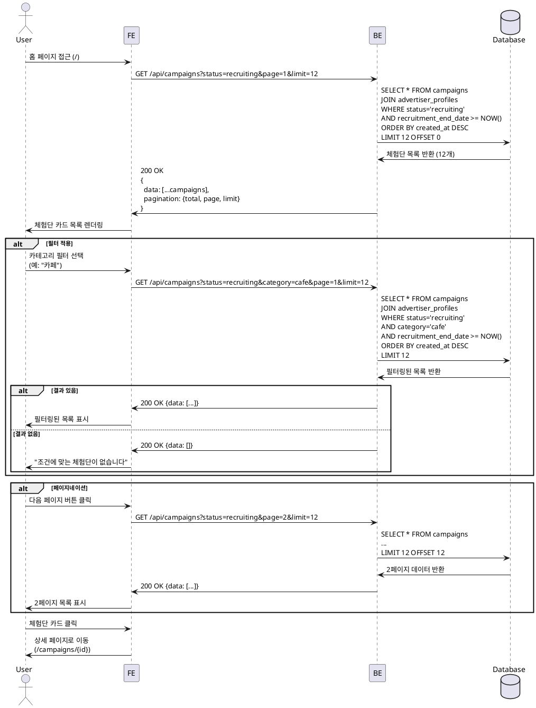

# 홈 & 체험단 목록 탐색 - 상세 유스케이스

## Use Case: 체험단 목록 조회 및 탐색

### Primary Actor
방문자 (인플루언서 또는 비로그인 사용자)

### Precondition
- 홈페이지 접근 가능
- 브라우저 환경

### Trigger
사용자가 홈페이지(`/`) 접근 또는 체험단 목록 페이지 진입

### Main Scenario

1. 사용자가 홈 페이지에 접근
2. 시스템이 모집 중인 체험단 목록 조회
   - 상태: `recruiting`
   - 정렬: 최신순 (created_at DESC)
   - 기본 페이지 크기: 12개
3. 시스템이 각 체험단 카드 정보 표시
   - 체험단명 (title)
   - 업체명 (advertiser.company_name)
   - 카테고리 (category)
   - 모집 기간 (recruitment_start_date ~ recruitment_end_date)
   - 모집 인원 (recruitment_count)
   - 썸네일 이미지 (선택)
4. 사용자가 필터/정렬 옵션 선택 (선택)
   - 카테고리 필터
   - 지역 필터
   - 정렬: 최신순, 마감임박순, 인기순
5. 시스템이 필터 조건에 맞는 체험단 목록 재조회
6. 사용자가 페이지네이션으로 다음 페이지 이동 (선택)
7. 사용자가 관심 있는 체험단 카드 클릭
8. 시스템이 해당 체험단 상세 페이지로 이동

### Alternative Scenarios

#### A1. 모집 중인 체험단이 없는 경우
- 2단계에서 결과가 0건
- 빈 상태 메시지 표시: "현재 모집 중인 체험단이 없습니다"
- 추천 행동: "곧 새로운 체험단이 등록될 예정입니다"

#### A2. 네트워크 오류
- 2단계 또는 5단계에서 API 호출 실패
- 에러 메시지 표시: "체험단 목록을 불러오는데 실패했습니다"
- 재시도 버튼 제공

#### A3. 필터 적용 결과가 없는 경우
- 5단계에서 필터 조건에 맞는 결과 0건
- 메시지 표시: "조건에 맞는 체험단이 없습니다"
- 필터 초기화 버튼 제공

### Edge Cases

**데이터 로딩**
- 초기 로딩: 스켈레톤 UI 표시
- 무한 스크롤 vs 페이지네이션: 페이지네이션 사용
- 캐싱: React Query로 5분간 캐싱

**이미지 처리**
- 썸네일 없는 경우: 기본 플레이스홀더 이미지
- 이미지 로딩 실패: 폴백 이미지 표시
- Lazy loading 적용

**날짜 표시**
- 모집 마감 임박 (D-3 이내): 빨간색 강조
- 오늘 마감: "오늘 마감" 배지
- 기간 계산: 서버 시간 기준

**성능 최적화**
- 첫 페이지만 SSR/SSG (선택)
- 이후 페이지는 CSR
- 이미지 최적화 (Next.js Image)

### Business Rules

**BR-001: 모집 중 상태 정의**
- `status = 'recruiting'`인 체험단만 표시
- `recruitment_end_date >= TODAY()`인 체험단만 포함
- 모집 종료된 체험단은 자동 숨김

**BR-002: 정렬 우선순위**
- 기본: 최신순 (created_at DESC)
- 마감임박순: recruitment_end_date ASC
- 인기순: 지원자 수 기준 (applications count DESC)

**BR-003: 페이지네이션**
- 페이지당 기본 12개 항목
- 최대 100페이지까지 표시
- OFFSET 방식 사용

**BR-004: 카테고리 필터**
- advertiser_profiles.category 기준
- 다중 선택 가능
- 선택 없음 = 전체 표시

**BR-005: 접근 권한**
- 비로그인 사용자도 목록 조회 가능
- 상세 페이지 접근은 제한 없음
- 지원하기는 로그인 + 인플루언서 프로필 필수

**BR-006: 데이터 노출**
- 광고주 연락처는 목록에서 숨김
- 상세 정보는 상세 페이지에서만 표시
- 지원자 정보는 목록에 노출 안 함

---

## Sequence Diagram



---

## API Specification

### GET /api/campaigns

**Query Parameters**
| Parameter | Type | Required | Default | Description |
|-----------|------|----------|---------|-------------|
| status | string | No | recruiting | 모집 상태 필터 |
| category | string | No | - | 카테고리 필터 |
| page | number | No | 1 | 페이지 번호 |
| limit | number | No | 12 | 페이지당 항목 수 |
| sort | string | No | latest | 정렬 방식 (latest, deadline, popular) |

**Response (Success - 200)**
```json
{
  "ok": true,
  "data": [
    {
      "id": "uuid",
      "title": "강남 신규 카페 체험단 모집",
      "description": "...",
      "benefits": "음료 2잔 + 디저트 1개 무료 제공",
      "recruitment_count": 5,
      "recruitment_start_date": "2024-01-01",
      "recruitment_end_date": "2024-01-15",
      "status": "recruiting",
      "created_at": "2024-01-01T00:00:00Z",
      "advertiser": {
        "id": "uuid",
        "company_name": "카페 블루밍",
        "category": "cafe",
        "location": "서울특별시 강남구"
      },
      "applications_count": 12
    }
  ],
  "pagination": {
    "total": 48,
    "page": 1,
    "limit": 12,
    "total_pages": 4
  }
}
```

**Response (Error - 500)**
```json
{
  "ok": false,
  "error": {
    "code": "CAMPAIGNS_FETCH_ERROR",
    "message": "체험단 목록을 불러오는데 실패했습니다."
  }
}
```

---

## UI/UX Notes

**레이아웃**
- 그리드: 3열 (데스크탑), 2열 (태블릿), 1열 (모바일)
- 카드 간격: 24px
- 상단: 필터 바 (카테고리, 정렬)
- 하단: 페이지네이션

**체험단 카드 구성**
1. 썸네일 이미지 (16:9 비율)
2. 카테고리 배지
3. 체험단명 (최대 2줄, 말줄임)
4. 업체명
5. 모집 기간 (D-day 강조)
6. 모집 인원 (예: 5명 모집 중)
7. 지원자 수 (예: 12명 지원)

**상태 표시**
- 마감 임박 (D-3): 빨간색 "마감 임박" 배지
- 오늘 마감: "오늘 마감" 배지
- 인기: 지원자 많을 경우 "인기" 배지

**인터랙션**
- 카드 호버: 그림자 효과 + 약간의 scale
- 카드 클릭: 상세 페이지 이동
- 필터 변경: 부드러운 전환 효과
- 로딩: 스켈레톤 UI

**빈 상태**
- 일러스트레이션 + 메시지
- 필터 초기화 버튼 (필터 적용 시)
- 홈으로 돌아가기 버튼

**접근성**
- 카드는 `<article>` 태그 사용
- 이미지에 적절한 alt 텍스트
- 키보드 네비게이션 지원
- 페이지네이션 aria-label
- 로딩 상태 aria-live 영역

---

## Performance Considerations

**데이터 페칭**
- React Query로 서버 상태 관리
- 5분간 캐싱
- staleTime: 5분, cacheTime: 10분
- 백그라운드 자동 재검증

**이미지 최적화**
- Next.js Image 컴포넌트 사용
- Lazy loading 적용
- Placeholder blur 효과
- WebP 포맷 우선

**렌더링 최적화**
- 카드 컴포넌트 memo 처리
- 가상 스크롤 고려 (항목 많을 경우)
- CSS contain 속성 활용

**SEO**
- 홈 페이지는 SSR 또는 SSG
- 메타 태그 최적화
- Open Graph 이미지
- 구조화된 데이터 (JSON-LD)

---

## Related Use Cases

- **UC-005**: 체험단 상세 조회
- **UC-006**: 체험단 지원
- **UC-008**: 광고주 체험단 등록 (역방향)

