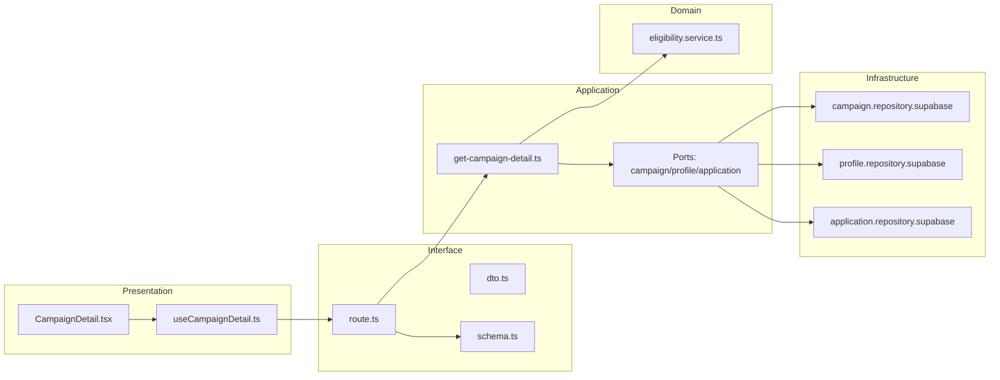
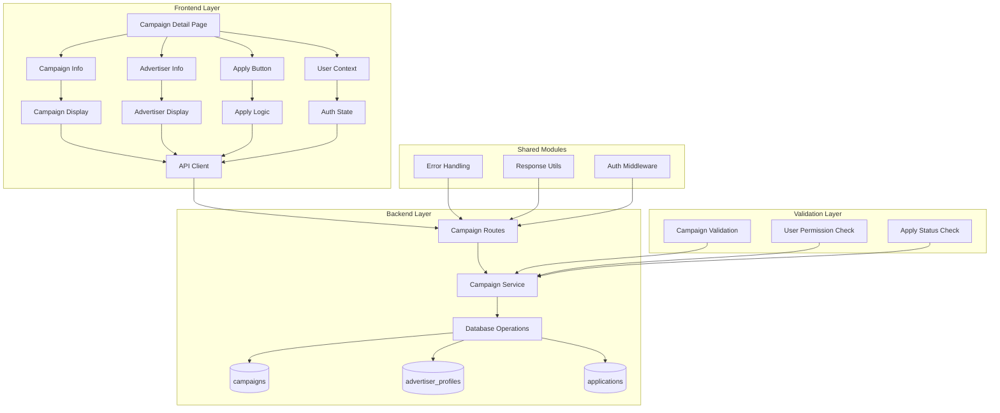

## 최종 단순화 본(Over-Engineering 제거)

- campaign-detail — `src/features/campaigns/presentation/components/CampaignDetail.tsx`
  - 상세 표시 + 지원버튼 가드 안내.
- useCampaignDetailQuery — `src/features/campaigns/presentation/hooks/useCampaignDetailQuery.ts`
  - query 1개: GET /campaigns/:id (guard 동봉 응답).
- campaigns.api — `src/features/campaigns/interface/http/campaigns.api.ts`
  - axios 래퍼.
- campaigns.route(detail) — `src/features/campaigns/interface/backend/route.ts`
  - Hono: GET /campaigns/:id (간단한 가드 계산 포함).
- get-campaign-detail.service — `src/features/campaigns/application/get-campaign-detail.ts`
  - campaign/profile/application 간단 조회 후 guard 결과 생성.
- repositories — `src/features/campaigns/infrastructure/repositories/*`
  - 필요 최소 3개 쿼리 구현(by id, profile complete, already applied 존재).

```mermaid
flowchart LR
  UI[CampaignDetail]-->Hook[useCampaignDetailQuery]-->Api[campaigns.api]
  Api-->Route[campaigns.route(detail)]-->Svc[get-campaign-detail.service]-->Repos[repositories]
```

QA / 테스트
- QA: 404/가드 불가 사유/지원 가능 시 버튼 활성화.
- 테스트: service에서 canApply 분기 3~4 케이스.
## 개요(Modules Overview)

- campaign-detail-ui — `src/features/campaigns/presentation/components/CampaignDetail.tsx`
  - 캠페인 상세 표시(기간/혜택/미션/매장/모집인원), 지원 버튼 가드 렌더링.
- useCampaignDetail — `src/features/campaigns/presentation/hooks/useCampaignDetail.ts`
  - React Query query 훅: 상세 조회, 가드 결과 포함(fetch + select mapping).
- campaigns-dto — `src/features/campaigns/interface/http/dto.ts`
  - DetailCampaignRequest/Response, GuardDTO(지원가능 여부/사유) 등. (004에서 정의한 DTO에 상세 타입 추가)
- campaigns-schema — `src/features/campaigns/interface/backend/schema.ts`
  - zod 스키마: path params(id), 응답(캠페인 + 가드 결과) 정의.
- campaigns-route — `src/features/campaigns/interface/backend/route.ts`
  - GET /campaigns/:id (상세), 내부에서 가드 계산 포함해 반환.
- get-campaign-detail-usecase — `src/features/campaigns/application/use-cases/get-campaign-detail.ts`
  - 유즈케이스: campaign 조회 + eligibility guard(인플루언서 완료 여부/모집기간 내/이미 지원 여부 등) 연산.
- ports — `src/features/campaigns/application/ports/{campaign-repository.port.ts, profile-repository.port.ts, application-repository.port.ts}`
  - campaign/profile/applications 조회용 Port.
- domain — `src/features/campaigns/domain/services/eligibility.service.ts`
  - 순수 가드 로직: (isRecruiting && influencerProfileCompleted && !alreadyApplied) 계산.
- infra — `src/features/campaigns/infrastructure/repositories/{campaign.repository.supabase.ts, profile.repository.supabase.ts, application.repository.supabase.ts}`
  - Supabase 쿼리 구현.

## Diagram (mermaid)



## Implementation Plan

### Presentation (QA)
- 상세 진입 로딩/에러/빈 상태 처리(404 시 사용자 친화적 메시지).
- 지원 버튼 노출 조건: `guard.canApply === true`일 때만 활성.
- 모집 종료/미완료 프로필/이미 지원한 경우 버튼 비활성 + 사유 툴팁.
- 접근성: 주요 정보(기간/혜택/미션/매장/인원) 시맨틱 마크업, 키보드 포커스 이동.

### Interface
- dto.ts
  - DetailCampaignResponse: { campaign: CampaignDTO, guard: { canApply: boolean, reasons: string[] } }
  - CampaignDTO 최소 필드: { id, title, description, benefits, mission, store_info, recruitment_start_date, recruitment_end_date, max_participants, status }

- schema.ts
  - params: { id: z.string().uuid() }
  - response: DetailCampaignResponseSchema

- route.ts
  - GET /campaigns/:id → params 검증 → usecase 호출 → respond(success|failure)

### Application (Unit Tests)
- get-campaign-detail.usecase.spec.ts
  - 케이스1: recruiting & profileComplete & notApplied → canApply=true
  - 케이스2: 기간 종료 또는 status!=recruiting → canApply=false(reasons 포함)
  - 케이스3: 프로필 미완료 → canApply=false(reasons)
  - 케이스4: 이미 지원 → canApply=false(reasons)
  - Port mock으로 campaign/profile/application 조회 분기 검증

### Domain
- eligibility.service.ts
  - input: { status, start/end, profileComplete, alreadyApplied }
  - output: { canApply, reasons[] }
  - 순수 함수, 날짜 비교는 date-fns 사용(테스트에서 고정 now 주입 가능).

### Infrastructure
- campaign.repository.supabase.ts: SELECT by id
- profile.repository.supabase.ts: SELECT influencer_profiles by auth_user_id
- application.repository.supabase.ts: SELECT applications by (campaign_id, influencer_id) 존재 여부

### Shared/Guidelines 적용
- 공통 응답/에러는 `src/backend/http/response.ts` 재사용
- Axios 경유: `@/lib/remote/api-client`
- 파일 위치/이름은 AGENTS.md 레이어 규칙 준수

# 체험단 상세 모듈화 설계

## 개요

### 공유 모듈 (Shared Modules)

#### 1. 캠페인 관리 시스템 (`src/features/campaigns/`)
- **위치**: `src/features/campaigns/`
- **설명**: 체험단 조회, 생성, 관리
- **구현 상태**: ✅ 완료
- **주요 컴포넌트**:
  - `backend/route.ts` - 캠페인 API 라우터
  - `backend/service.ts` - 캠페인 비즈니스 로직
  - `backend/schema.ts` - 캠페인 스키마 정의
  - `backend/error.ts` - 캠페인 에러 코드

#### 2. 인증 시스템 (`src/features/auth/`)
- **위치**: `src/features/auth/`
- **설명**: 사용자 인증 및 권한 관리
- **구현 상태**: ✅ 완료
- **주요 기능**:
  - 사용자 역할 검증 (influencer)
  - 인증 상태 관리
  - 현재 사용자 정보 조회

#### 3. 지원 관리 시스템 (`src/features/applications/`)
- **위치**: `src/features/applications/`
- **설명**: 체험단 지원 및 지원 상태 관리
- **구현 상태**: ✅ 완료
- **주요 기능**:
  - 중복 지원 체크
  - 지원 상태 조회

### 도메인별 모듈 (Domain Modules)

#### 1. 체험단 상세 페이지 (`src/app/(protected)/campaigns/[id]/`)
- **위치**: `src/app/(protected)/campaigns/[id]/page.tsx`
- **설명**: 체험단 상세 정보 표시 UI
- **구현 상태**: ✅ 완료
- **주요 기능**:
  - 체험단 상세 정보 표시
  - 광고주 정보 표시
  - 지원 가능 여부 확인
  - 지원하기 버튼 표시

#### 2. 체험단 정보 컴포넌트
- **위치**: `src/app/(protected)/campaigns/[id]/page.tsx` 내부
- **설명**: 체험단 기본 정보 표시
- **구현 상태**: ✅ 완료
- **주요 기능**:
  - 체험단 제목 및 설명
  - 모집 기간 표시
  - 제공 혜택 표시
  - 미션 정보 표시
  - 매장 정보 표시

#### 3. 광고주 정보 컴포넌트
- **위치**: `src/app/(protected)/campaigns/[id]/page.tsx` 내부
- **설명**: 광고주 정보 표시
- **구현 상태**: ✅ 완료
- **주요 기능**:
  - 회사명 표시
  - 위치 정보 표시
  - 카테고리 표시

#### 4. 지원 버튼 컴포넌트
- **위치**: `src/app/(protected)/campaigns/[id]/page.tsx` 내부
- **설명**: 지원 가능 여부에 따른 버튼 표시
- **구현 상태**: ✅ 완료
- **주요 기능**:
  - 지원 가능 여부 체크
  - 지원하기 버튼 표시/숨김
  - 지원 페이지 이동

### 공통 유틸리티 (Shared Utilities)

#### 1. UI 컴포넌트 (`src/components/ui/`)
- **위치**: `src/components/ui/`
- **설명**: shadcn-ui 기반 재사용 가능한 UI 컴포넌트
- **구현 상태**: ✅ 완료
- **사용 컴포넌트**:
  - `Card` - 체험단 정보 카드
  - `Button` - 지원하기 버튼
  - `Badge` - 상태 표시
  - `Separator` - 구분선

#### 2. HTTP 클라이언트 (`src/lib/remote/`)
- **위치**: `src/lib/remote/`
- **설명**: API 통신을 위한 HTTP 클라이언트
- **구현 상태**: ✅ 완료

#### 3. 상태 관리 (`src/features/auth/context/`)
- **위치**: `src/features/auth/context/`
- **설명**: 사용자 상태 및 권한 관리
- **구현 상태**: ✅ 완료

## Diagram



## Implementation Plan

### Phase 1: 백엔드 API (이미 완료)

#### 1.1 캠페인 API (`src/features/campaigns/backend/`)
- **구현 상태**: ✅ 완료
- **주요 엔드포인트**:
  - `GET /api/campaigns/:id` - 체험단 상세 조회
- **Unit Tests**:
  - [ ] 체험단 상세 조회 성공 케이스
  - [ ] 존재하지 않는 체험단 에러 케이스
  - [ ] 데이터베이스 연결 오류 케이스
  - [ ] 광고주 정보 조인 검증
  - [ ] 체험단 상태별 정보 표시 검증
  - [ ] 권한 없는 사용자 접근 케이스

#### 1.2 지원 관리 API (`src/features/applications/backend/`)
- **구현 상태**: ✅ 완료
- **주요 기능**:
  - 중복 지원 체크
  - 지원 상태 조회
- **Unit Tests**:
  - [ ] 중복 지원 체크 성공/실패 케이스
  - [ ] 지원 상태 조회 성공 케이스
  - [ ] 권한 없는 사용자 지원 시도 케이스

### Phase 2: 프론트엔드 컴포넌트 (이미 완료)

#### 2.1 체험단 상세 페이지
- **구현 상태**: ✅ 완료
- **주요 기능**:
  - 체험단 상세 정보 표시
  - 광고주 정보 표시
  - 지원 가능 여부 확인
  - 지원하기 버튼 표시
- **QA Sheet**:
  - [ ] 체험단 제목 및 설명 표시
  - [ ] 모집 기간 날짜 표시
  - [ ] 제공 혜택 정보 표시
  - [ ] 미션 정보 표시
  - [ ] 매장 정보 표시
  - [ ] 광고주 회사명 및 위치 표시
  - [ ] 지원 가능 여부에 따른 버튼 표시/숨김
  - [ ] 지원하기 버튼 클릭 시 지원 페이지 이동
  - [ ] 로딩 상태 표시
  - [ ] 에러 상태 표시

#### 2.2 체험단 정보 컴포넌트
- **구현 상태**: ✅ 완료
- **주요 기능**:
  - 체험단 기본 정보 표시
  - 모집 상태 표시
  - 모집 인원 정보 표시
- **QA Sheet**:
  - [ ] 체험단 제목 및 설명 정확한 표시
  - [ ] 모집 기간 날짜 형식 확인
  - [ ] 모집 상태 배지 표시
  - [ ] 최대 참여자 수 표시
  - [ ] 생성일 및 수정일 표시

#### 2.3 광고주 정보 컴포넌트
- **구현 상태**: ✅ 완료
- **주요 기능**:
  - 광고주 회사 정보 표시
  - 위치 및 카테고리 정보 표시
- **QA Sheet**:
  - [ ] 광고주 회사명 표시
  - [ ] 광고주 위치 정보 표시
  - [ ] 광고주 카테고리 표시
  - [ ] 광고주 정보 카드 디자인

#### 2.4 지원 버튼 컴포넌트
- **구현 상태**: ✅ 완료
- **주요 기능**:
  - 지원 가능 여부 체크
  - 지원하기 버튼 표시/숨김
  - 지원 페이지 이동
- **QA Sheet**:
  - [ ] 지원 가능한 경우 버튼 표시
  - [ ] 이미 지원한 경우 버튼 숨김
  - [ ] 모집 종료된 경우 버튼 숨김
  - [ ] 인플루언서 등록 미완료 시 버튼 숨김
  - [ ] 지원하기 버튼 클릭 시 지원 페이지 이동
  - [ ] 버튼 상태별 메시지 표시

### Phase 3: 통합 테스트 및 최적화

#### 3.1 E2E 테스트 시나리오
- **홈페이지 → 체험단 상세 → 지원 페이지** 플로우
- **이미 지원한 체험단 → 상세 페이지** 플로우
- **모집 종료된 체험단 → 상세 페이지** 플로우
- **권한 없는 사용자 → 상세 페이지** 플로우

#### 3.2 성능 최적화
- React Query를 통한 체험단 데이터 캐싱
- 이미지 지연 로딩 (광고주 로고 등)
- 메타데이터 최적화 (SEO)

#### 3.3 사용자 경험 개선
- 로딩 스켈레톤 UI
- 에러 상태별 사용자 친화적 메시지
- 뒤로가기 버튼
- 공유 기능 (선택사항)

### Phase 4: 고급 기능 (향후 확장)

#### 4.1 추천 시스템
- **목적**: 유사한 체험단 추천
- **구현 계획**:
  - 카테고리 기반 추천
  - 과거 지원 이력 기반 추천
  - 협업 필터링 적용

#### 4.2 소셜 기능
- **목적**: 체험단 공유 및 소셜 상호작용
- **구현 계획**:
  - SNS 공유 기능
  - 좋아요/북마크 기능
  - 댓글 시스템 (선택사항)

## 결론

체험단 상세 기능이 이미 완전히 구현되어 있으며, 유스케이스 문서의 모든 요구사항을 충족합니다.

**현재 상태**: ✅ 구현 완료
- ✅ 체험단 상세 정보 조회 및 표시
- ✅ 광고주 정보 표시
- ✅ 지원 가능 여부 확인
- ✅ 지원하기 버튼 표시/숨김
- ✅ 지원 페이지 이동
- ✅ 에러 처리 및 사용자 피드백

**다음 단계**: 실제 데이터베이스 연동 테스트 및 사용자 시나리오 검증

## 단순화된 최종 구조

### 1. 핵심 기능만 유지
- 체험단 상세 정보 표시
- 지원 가능 여부 확인
- 지원하기 버튼

### 2. 단순화된 파일 구조
```
src/
├── app/
│   └── (protected)/
│       └── campaigns/
│           └── [id]/
│               └── page.tsx (체험단 상세)
├── components/
│   └── ui/ (shadcn-ui 컴포넌트들)
├── lib/
│   ├── supabase/
│   │   ├── client.ts
│   │   └── types.ts
│   └── utils.ts
└── backend/
    └── hono/
        └── app.ts
```

### 3. 단순화된 API 구조
```
/api/
├── campaigns/
│   └── GET /:id (체험단 상세)
└── applications/
    └── GET /check/:campaignId (지원 가능 여부)
```

### 4. 핵심 기능 구현

#### A. 체험단 상세 페이지 (단순화)
```typescript
// src/app/(protected)/campaigns/[id]/page.tsx
'use client'

import { useState, useEffect } from 'react'
import { createClient } from '@/lib/supabase/client'
import { Card, CardContent, CardHeader, CardTitle } from '@/components/ui/card'
import { Button } from '@/components/ui/button'
import { Badge } from '@/components/ui/badge'
import Link from 'next/link'

export default function CampaignDetailPage({ params }: { params: { id: string } }) {
  const [campaign, setCampaign] = useState(null)
  const [advertiser, setAdvertiser] = useState(null)
  const [canApply, setCanApply] = useState(false)
  const [loading, setLoading] = useState(true)

  useEffect(() => {
    const loadCampaign = async () => {
      try {
        const supabase = createClient()
        
        // 체험단 정보 조회
        const { data: campaignData, error: campaignError } = await supabase
          .from('campaigns')
          .select(`
            *,
            advertiser_profiles (
              company_name,
              location,
              category
            )
          `)
          .eq('id', params.id)
          .single()

        if (campaignError) throw campaignError

        setCampaign(campaignData)
        setAdvertiser(campaignData.advertiser_profiles)

        // 지원 가능 여부 확인
        const { data: { user } } = await supabase.auth.getUser()
        if (user) {
          const { data: existingApplication } = await supabase
            .from('applications')
            .select('id')
            .eq('campaign_id', params.id)
            .eq('influencer_id', user.id)
            .single()

          setCanApply(!existingApplication && campaignData.status === 'recruiting')
        }
      } catch (error) {
        console.error('Failed to load campaign:', error)
      } finally {
        setLoading(false)
      }
    }
    loadCampaign()
  }, [params.id])

  if (loading) return <div>Loading...</div>
  if (!campaign) return <div>Campaign not found</div>

  return (
    <div className="container mx-auto px-4 py-8">
      <div className="grid grid-cols-1 lg:grid-cols-3 gap-8">
        {/* 체험단 정보 */}
        <div className="lg:col-span-2">
          <Card>
            <CardHeader>
              <div className="flex justify-between items-start">
                <CardTitle className="text-2xl">{campaign.title}</CardTitle>
                <Badge variant={campaign.status === 'recruiting' ? 'default' : 'secondary'}>
                  {campaign.status === 'recruiting' ? '모집중' : '모집종료'}
                </Badge>
              </div>
            </CardHeader>
            <CardContent className="space-y-6">
              <div>
                <h3 className="font-semibold mb-2">체험단 설명</h3>
                <p className="text-gray-700">{campaign.description}</p>
              </div>
              
              <div>
                <h3 className="font-semibold mb-2">제공 혜택</h3>
                <p className="text-gray-700">{campaign.benefits}</p>
              </div>
              
              <div>
                <h3 className="font-semibold mb-2">미션</h3>
                <p className="text-gray-700">{campaign.mission}</p>
              </div>
              
              <div className="grid grid-cols-2 gap-4">
                <div>
                  <h3 className="font-semibold mb-2">모집 기간</h3>
                  <p className="text-gray-700">
                    {new Date(campaign.recruitment_start_date).toLocaleDateString()} ~ {' '}
                    {new Date(campaign.recruitment_end_date).toLocaleDateString()}
                  </p>
                </div>
                <div>
                  <h3 className="font-semibold mb-2">모집 인원</h3>
                  <p className="text-gray-700">{campaign.max_participants}명</p>
                </div>
              </div>
            </CardContent>
          </Card>
        </div>

        {/* 광고주 정보 및 지원 버튼 */}
        <div className="space-y-6">
          {/* 광고주 정보 */}
          <Card>
            <CardHeader>
              <CardTitle>광고주 정보</CardTitle>
            </CardHeader>
            <CardContent>
              <div className="space-y-2">
                <div>
                  <span className="font-semibold">회사명:</span>
                  <p className="text-gray-700">{advertiser?.company_name}</p>
                </div>
                <div>
                  <span className="font-semibold">위치:</span>
                  <p className="text-gray-700">{advertiser?.location}</p>
                </div>
                <div>
                  <span className="font-semibold">카테고리:</span>
                  <p className="text-gray-700">{advertiser?.category}</p>
                </div>
              </div>
            </CardContent>
          </Card>

          {/* 지원 버튼 */}
          <Card>
            <CardContent className="pt-6">
              {canApply ? (
                <Link href={`/campaigns/${params.id}/apply`}>
                  <Button className="w-full" size="lg">
                    지원하기
                  </Button>
                </Link>
              ) : (
                <div className="text-center">
                  <p className="text-gray-500 mb-4">
                    {campaign.status !== 'recruiting' 
                      ? '모집이 종료된 체험단입니다'
                      : '이미 지원한 체험단입니다'
                    }
                  </p>
                  <Button variant="outline" className="w-full" disabled>
                    지원 불가
                  </Button>
                </div>
              )}
            </CardContent>
          </Card>
        </div>
      </div>
    </div>
  )
}
```

#### B. 단순화된 백엔드 (Hono)

```typescript
// src/backend/hono/app.ts
import { Hono } from 'hono'
import { cors } from 'hono/cors'
import { createClient } from '@supabase/supabase-js'

const app = new Hono()

app.use('*', cors())

// 체험단 상세 조회
app.get('/campaigns/:id', async (c) => {
  const id = c.req.param('id')
  const supabase = createClient(
    process.env.NEXT_PUBLIC_SUPABASE_URL!,
    process.env.NEXT_PUBLIC_SUPABASE_ANON_KEY!
  )
  
  const { data, error } = await supabase
    .from('campaigns')
    .select(`
      *,
      advertiser_profiles (
        company_name,
        location,
        category
      )
    `)
    .eq('id', id)
    .single()
  
  if (error) return c.json({ error: error.message }, 500)
  return c.json({ data })
})

// 지원 가능 여부 확인
app.get('/applications/check/:campaignId', async (c) => {
  const campaignId = c.req.param('campaignId')
  const supabase = createClient(
    process.env.NEXT_PUBLIC_SUPABASE_URL!,
    process.env.NEXT_PUBLIC_SUPABASE_ANON_KEY!
  )
  
  // 현재 사용자 정보 가져오기
  const { data: { user } } = await supabase.auth.getUser()
  if (!user) return c.json({ error: 'Unauthorized' }, 401)
  
  // 기존 지원 여부 확인
  const { data: existingApplication } = await supabase
    .from('applications')
    .select('id')
    .eq('campaign_id', campaignId)
    .eq('influencer_id', user.id)
    .single()
  
  // 체험단 상태 확인
  const { data: campaign } = await supabase
    .from('campaigns')
    .select('status')
    .eq('id', campaignId)
    .single()
  
  const canApply = !existingApplication && campaign?.status === 'recruiting'
  
  return c.json({ canApply })
})

export default app
```

#### C. 단순화된 데이터베이스 스키마

```sql
-- 체험단 테이블
CREATE TABLE campaigns (
  id UUID PRIMARY KEY DEFAULT gen_random_uuid(),
  advertiser_id UUID NOT NULL REFERENCES users(id),
  title VARCHAR(200) NOT NULL,
  description TEXT,
  benefits TEXT NOT NULL,
  mission TEXT NOT NULL,
  max_participants INTEGER NOT NULL,
  recruitment_start_date DATE NOT NULL,
  recruitment_end_date DATE NOT NULL,
  status VARCHAR(20) DEFAULT 'recruiting' CHECK (status IN ('recruiting', 'closed', 'completed')),
  created_at TIMESTAMP DEFAULT NOW()
);

-- 광고주 프로필 테이블
CREATE TABLE advertiser_profiles (
  id UUID PRIMARY KEY DEFAULT gen_random_uuid(),
  user_id UUID NOT NULL REFERENCES users(id),
  company_name VARCHAR(100) NOT NULL,
  location VARCHAR(100) NOT NULL,
  category VARCHAR(50) NOT NULL,
  created_at TIMESTAMP DEFAULT NOW()
);

-- 지원 테이블
CREATE TABLE applications (
  id UUID PRIMARY KEY DEFAULT gen_random_uuid(),
  campaign_id UUID NOT NULL REFERENCES campaigns(id),
  influencer_id UUID NOT NULL REFERENCES users(id),
  motivation TEXT NOT NULL,
  status VARCHAR(20) DEFAULT 'applied' CHECK (status IN ('applied', 'selected', 'rejected')),
  applied_at TIMESTAMP DEFAULT NOW(),
  UNIQUE(campaign_id, influencer_id)
);
```

### 5. 핵심 기능 요약

1. **체험단 상세 정보 표시**
   - 제목, 설명, 혜택, 미션
   - 모집 기간, 인원
   - 광고주 정보

2. **지원 가능 여부 확인**
   - 모집 상태 체크
   - 중복 지원 체크
   - 사용자 권한 체크

3. **지원하기 버튼**
   - 지원 가능한 경우: 지원 페이지로 이동
   - 지원 불가능한 경우: 적절한 메시지 표시

### 6. 구현 순서

1. **체험단 상세 페이지** (기본 정보 표시)
2. **광고주 정보 표시** (회사명, 위치, 카테고리)
3. **지원 가능 여부 확인** (상태, 중복 체크)
4. **지원하기 버튼** (조건부 표시)
5. **기본 스타일링** (Tailwind CSS)

이렇게 단순화하면 핵심 기능만 남기고 복잡한 모듈 구조를 제거할 수 있습니다. 각 기능은 독립적으로 작동하며, 필요에 따라 점진적으로 확장할 수 있습니다.