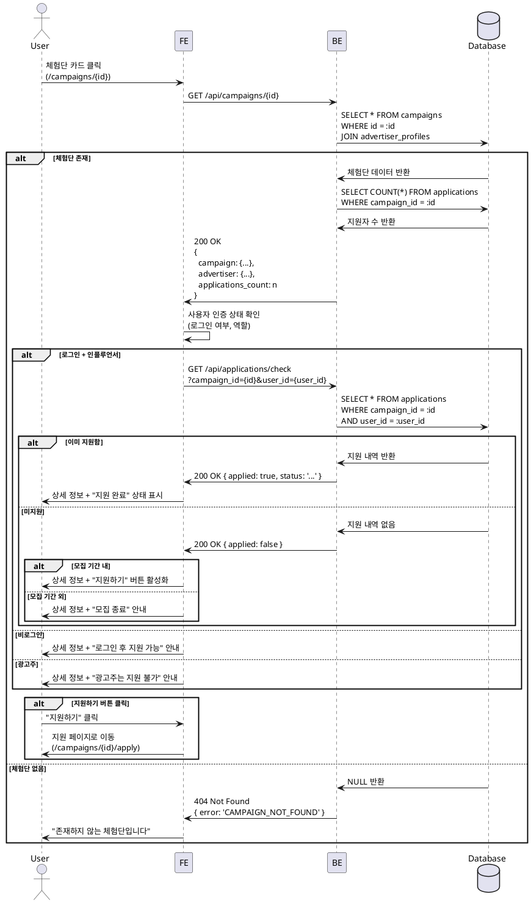

# 체험단 상세 조회 - 상세 유스케이스

## Use Case: 체험단 상세 정보 조회 및 지원 권한 확인

### Primary Actor
방문자 (비로그인 사용자, 인플루언서, 광고주 모두 포함)

### Precondition
- 체험단 목록 페이지에서 특정 체험단 카드 클릭
- 유효한 체험단 ID

### Trigger
사용자가 체험단 카드를 클릭하여 상세 페이지(`/campaigns/{id}`)로 진입

### Main Scenario

1. 사용자가 체험단 목록에서 관심 있는 체험단 카드 클릭
2. 시스템이 체험단 ID로 상세 정보 조회
   - 체험단명, 설명
   - 모집 기간 (시작일 ~ 종료일)
   - 모집 인원
   - 제공 혜택
   - 미션 내용
   - 매장 정보
   - 현재 지원자 수
   - 광고주 정보 (업체명, 위치, 카테고리)
   - 체험단 상태 (모집중/모집종료/완료)
3. 시스템이 사용자 인증 상태 확인
   - 비로그인: 상세 정보만 표시
   - 로그인 + 인플루언서: 지원 버튼 활성화
   - 로그인 + 광고주: 지원 불가 안내
4. 시스템이 지원 가능 여부 판단
   - 모집 기간 내인지 확인
   - 이미 지원했는지 확인
   - 모집 인원이 마감되었는지 확인
5. 시스템이 적절한 액션 버튼 표시
   - 지원 가능: "지원하기" 버튼
   - 이미 지원: "지원 완료" 상태 표시
   - 모집 종료: "모집 종료" 안내
   - 비로그인: "로그인 후 지원 가능" 안내
   - 광고주: "광고주는 지원할 수 없습니다" 안내
6. 사용자가 "지원하기" 버튼 클릭 (지원 가능한 경우)
7. 시스템이 체험단 지원 페이지로 이동

### Alternative Scenarios

#### A1. 존재하지 않는 체험단
- 2단계에서 체험단 ID가 유효하지 않음
- 404 에러 페이지 표시
- "존재하지 않는 체험단입니다" 메시지
- 홈으로 돌아가기 버튼 제공

#### A2. 삭제된 체험단
- 2단계에서 체험단이 삭제됨
- "더 이상 존재하지 않는 체험단입니다" 메시지
- 목록으로 돌아가기 버튼 제공

#### A3. 인플루언서 프로필 미등록
- 3단계에서 로그인했지만 인플루언서 프로필 없음
- "인플루언서 정보를 먼저 등록해주세요" 메시지
- 인플루언서 등록 페이지로 이동 버튼 제공

#### A4. 모집 기간 외
- 4단계에서 모집 기간이 아님
- "모집 기간이 아닙니다" 메시지
- 지원 버튼 비활성화
- 모집 기간 정보 강조 표시

#### A5. 이미 지원한 체험단
- 4단계에서 중복 지원 감지
- "이미 지원한 체험단입니다" 메시지
- 지원 상태 표시 (대기중/선정/반려)
- "내 지원 목록" 이동 버튼 제공

### Edge Cases

**데이터 로딩**
- 초기 로딩: 스켈레톤 UI 표시
- 로딩 실패: 에러 메시지 + 재시도 버튼
- 느린 네트워크: 타임아웃 처리 (10초)

**이미지 처리**
- 체험단 이미지 없음: 기본 플레이스홀더
- 이미지 로딩 실패: 폴백 이미지
- 여러 이미지: 갤러리 형태로 표시

**권한 체크**
- 세션 만료: 로그인 페이지로 리다이렉트
- 권한 확인 실패: 기본값으로 처리 (비로그인)
- 동시 접근: 낙관적 업데이트

**상태 변경**
- 조회 중 모집 종료: 상태 실시간 반영
- 조회 중 삭제: 적절한 에러 메시지
- 다른 탭에서 지원: 페이지 새로고침 시 상태 업데이트

### Business Rules

**BR-001: 조회 권한**
- 모든 사용자(비로그인 포함)가 체험단 상세 정보 조회 가능
- 광고주 연락처는 선정된 인플루언서에게만 노출 (상세 페이지에서는 숨김)

**BR-002: 지원 권한**
- 로그인 + 인플루언서 프로필 등록 완료 필수
- 광고주는 체험단 지원 불가
- 본인이 등록한 체험단은 지원 불가 (광고주)

**BR-003: 지원 가능 조건**
- 체험단 상태 = 'recruiting'
- 현재 날짜 >= 모집 시작일
- 현재 날짜 <= 모집 종료일
- 중복 지원 불가 (1인 1회)

**BR-004: 상태 표시**
- 모집중: 초록색 배지
- 모집종료: 회색 배지
- 완료: 파란색 배지
- D-day 계산: 서버 시간 기준

**BR-005: 지원자 수 표시**
- 실시간 지원자 수 표시
- 모집 인원 대비 지원자 수 표시 (예: 12명 지원 / 5명 모집)
- 모집 인원 초과 가능 (선착순 아님, 선정 단계에서 결정)

**BR-006: 데이터 보안**
- 지원자 목록은 광고주에게만 노출
- 지원자 개인정보는 상세 페이지에 노출 안 함
- 광고주 연락처는 선정 후 노출

---

## Sequence Diagram



---

## API Specification

### GET /api/campaigns/{id}

**Path Parameters**
| Parameter | Type | Required | Description |
|-----------|------|----------|-------------|
| id | UUID | Yes | 체험단 고유 ID |

**Response (Success - 200)**
```json
{
  "ok": true,
  "data": {
    "id": "uuid",
    "title": "강남 신규 카페 체험단 모집",
    "description": "2024년 1월 오픈한 신규 카페입니다...",
    "benefits": "음료 2잔 + 디저트 1개 무료 제공",
    "mission": "방문 후 24시간 내 블로그 리뷰 작성",
    "store_info": "서울특별시 강남구 테헤란로 123\n영업시간: 10:00-22:00\n주차 가능",
    "recruitment_count": 5,
    "recruitment_start_date": "2024-01-01",
    "recruitment_end_date": "2024-01-15",
    "status": "recruiting",
    "created_at": "2024-01-01T00:00:00Z",
    "advertiser": {
      "id": "uuid",
      "company_name": "카페 블루밍",
      "category": "cafe",
      "location": "서울특별시 강남구"
    },
    "applications_count": 12
  }
}
```

**Response (Error - 404)**
```json
{
  "ok": false,
  "error": {
    "code": "CAMPAIGN_NOT_FOUND",
    "message": "존재하지 않는 체험단입니다."
  }
}
```

---

### GET /api/applications/check

**Query Parameters**
| Parameter | Type | Required | Description |
|-----------|------|----------|-------------|
| campaign_id | UUID | Yes | 체험단 ID |
| user_id | UUID | Yes | 사용자 ID |

**Response (Success - 200)**
```json
{
  "ok": true,
  "data": {
    "applied": true,
    "application": {
      "id": "uuid",
      "status": "pending",
      "created_at": "2024-01-05T10:00:00Z"
    }
  }
}
```

**Response (Success - Not Applied)**
```json
{
  "ok": true,
  "data": {
    "applied": false,
    "application": null
  }
}
```

---

## UI/UX Notes

**레이아웃**
- 컨테이너: 최대 너비 1024px
- 좌측: 체험단 이미지 갤러리 (40%)
- 우측: 상세 정보 (60%)
- 모바일: 세로 스택 레이아웃

**정보 섹션 구성**
1. 헤더
   - 체험단명 (H1)
   - 상태 배지 (모집중/모집종료/완료)
   - 카테고리 배지
2. 메타 정보
   - 광고주명 + 위치
   - 모집 기간 (D-day 강조)
   - 모집 인원 / 지원자 수
3. 상세 내용
   - 체험단 설명
   - 제공 혜택 (아이콘 + 텍스트)
   - 미션 내용 (체크리스트 형태)
   - 매장 정보 (지도 링크 포함)
4. 액션 영역
   - 지원하기 버튼 (큰 CTA)
   - 공유하기 버튼
   - 북마크 버튼 (선택)

**상태별 버튼**
- 지원 가능: 초록색 "지원하기" 버튼
- 지원 완료: 회색 "지원 완료" 버튼 (비활성화) + 상태 표시
- 모집 종료: 회색 "모집 종료" 버튼 (비활성화)
- 비로그인: 파란색 "로그인하고 지원하기" 버튼
- 광고주: 안내 메시지만 표시

**인터랙션**
- 이미지 갤러리: 클릭 시 확대 모달
- 매장 정보: 지도 아이콘 클릭 시 카카오맵/구글맵 연동
- 공유하기: 링크 복사 또는 SNS 공유
- 스크롤: 긴 내용은 부드러운 스크롤

**로딩 상태**
- 전체 스켈레톤 UI
- 이미지는 블러 플레이스홀더
- 버튼은 로딩 후 활성화

**빈 상태**
- 이미지 없음: 기본 패턴 이미지
- 설명 없음: "상세 정보가 등록되지 않았습니다"

**접근성**
- 제목에 적절한 heading 구조
- 이미지에 alt 텍스트
- 버튼에 aria-label
- 키보드 네비게이션 지원
- 상태 변경 시 screen reader 안내

---

## Performance Considerations

**데이터 페칭**
- 체험단 상세 + 지원자 수를 한 번에 조회
- React Query로 캐싱 (5분)
- 지원 여부는 별도 쿼리 (로그인 시에만)

**이미지 최적화**
- Next.js Image 컴포넌트
- 반응형 이미지 (srcset)
- Lazy loading
- WebP 포맷 우선

**SEO**
- 동적 메타 태그 (title, description, og:image)
- 구조화된 데이터 (JSON-LD)
- Open Graph 태그
- 서버 사이드 렌더링 고려

**실시간 업데이트**
- 지원자 수는 페이지 포커스 시 재검증
- 상태 변경은 30초마다 폴링 (선택)
- WebSocket 고려 (실시간성이 중요한 경우)

---

## Related Use Cases

- **UC-004**: 체험단 목록 조회 (이전 단계)
- **UC-006**: 체험단 지원 (다음 단계)
- **UC-007**: 내 지원 목록 (지원 후)
- **UC-009**: 광고주 체험단 상세 (광고주 관점)

