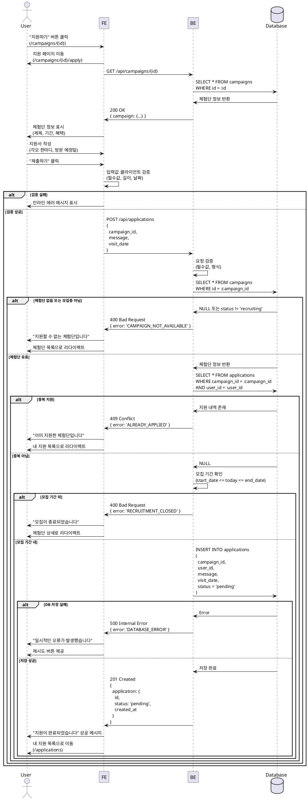

# 체험단 지원 - 상세 유스케이스

## Use Case: 체험단 지원서 작성 및 제출

### Primary Actor
인플루언서 (로그인 + 프로필 등록 완료)

### Precondition
- 체험단 상세 페이지에서 "지원하기" 버튼 클릭
- 인플루언서로 로그인되어 있음
- 인플루언서 프로필이 등록되어 있음
- 해당 체험단에 아직 지원하지 않음
- 체험단 모집 기간 내

### Trigger
사용자가 체험단 상세 페이지에서 "지원하기" 버튼을 클릭하여 지원 페이지(`/campaigns/{id}/apply`)로 진입

### Main Scenario

1. 사용자가 체험단 상세 페이지에서 "지원하기" 버튼 클릭
2. 시스템이 지원 페이지로 이동
3. 시스템이 체험단 정보를 표시 (체험단명, 모집 기간, 혜택 요약)
4. 사용자가 지원서 작성
   - 각오 한마디 입력 (필수, 최대 500자)
   - 방문 예정일자 선택 (필수, 캘린더 UI)
5. 사용자가 "제출하기" 버튼 클릭
6. 시스템이 입력값 검증
   - 각오 한마디: 공백 아님, 500자 이하
   - 방문 예정일자: 미래 날짜, 체험단 기간 내
7. 시스템이 지원 가능 여부 최종 확인
   - 중복 지원 확인 (UNIQUE constraint)
   - 모집 기간 내 여부 확인
   - 체험단 상태 확인 (status = 'recruiting')
8. 시스템이 지원서를 DB에 저장
   - applications 테이블에 INSERT
   - status = 'pending'으로 설정
9. 시스템이 성공 메시지 표시 및 "내 지원 목록"으로 이동

### Edge Cases

**E1. 중복 지원 감지**
- 7단계에서 이미 지원한 내역 발견
- "이미 지원한 체험단입니다" 에러 메시지
- "내 지원 목록" 페이지로 리다이렉트

**E2. 모집 종료**
- 7단계에서 모집 기간 종료 확인
- "모집이 종료되었습니다" 에러 메시지
- 체험단 상세 페이지로 리다이렉트

**E3. 체험단 삭제/상태 변경**
- 2단계에서 체험단이 존재하지 않거나 모집중이 아님
- "지원할 수 없는 체험단입니다" 에러 메시지
- 체험단 목록 페이지로 리다이렉트

**E4. 입력값 검증 실패**
- 6단계에서 필드 검증 실패
- 해당 필드에 인라인 에러 메시지 표시
- 제출 차단

**E5. 네트워크 에러**
- 8단계에서 DB 저장 실패
- "일시적인 오류가 발생했습니다. 다시 시도해주세요" 에러 메시지
- 재시도 버튼 제공

**E6. 권한 없음**
- 비로그인 사용자가 URL 직접 접근 시도
- 로그인 페이지로 리다이렉트 (returnUrl 포함)

**E7. 프로필 미등록**
- 인플루언서 프로필이 없는 사용자
- "인플루언서 프로필을 먼저 등록해주세요" 메시지
- 프로필 등록 페이지로 리다이렉트

**E8. 광고주 접근**
- 광고주가 지원 시도
- "광고주는 체험단에 지원할 수 없습니다" 메시지
- 체험단 상세 페이지로 리다이렉트

**E9. 방문 예정일자 유효성**
- 과거 날짜 선택
- "방문 예정일은 오늘 이후여야 합니다" 에러 메시지
- 모집 기간 외 날짜 선택
- "모집 기간 내 날짜를 선택해주세요" 에러 메시지

### Business Rules

**BR-001: 지원 자격**
- 로그인한 인플루언서만 지원 가능
- 인플루언서 프로필 등록 완료 필수
- 광고주는 지원 불가

**BR-002: 중복 지원 방지**
- 1인 1회만 지원 가능
- DB UNIQUE constraint로 강제 (campaign_id, user_id)

**BR-003: 모집 기간 검증**
- 현재 날짜가 모집 시작일 이상, 종료일 이하
- 체험단 status = 'recruiting'

**BR-004: 입력값 제약**
- 각오 한마디: 1자 이상 500자 이하
- 방문 예정일자: 필수, 미래 날짜

**BR-005: 지원 상태**
- 지원 직후 status = 'pending' (대기중)
- 이후 광고주가 'selected' 또는 'rejected'로 변경

**BR-006: 알림 (선택적 구현)**
- 지원 완료 시 인플루언서에게 확인 알림
- 광고주에게 신규 지원자 알림

---

## Sequence Diagram



---

## API Specification

### POST /api/applications

**Request Headers**
```
Authorization: Bearer {access_token}
Content-Type: application/json
```

**Request Body**
```json
{
  "campaign_id": "uuid",
  "message": "각오 한마디 내용",
  "visit_date": "2024-12-31"
}
```

**Response (Success - 201)**
```json
{
  "ok": true,
  "data": {
    "id": "uuid",
    "campaign_id": "uuid",
    "user_id": "uuid",
    "message": "각오 한마디 내용",
    "visit_date": "2024-12-31",
    "status": "pending",
    "created_at": "2024-01-01T10:00:00Z"
  }
}
```

**Response (Error - 400)**
```json
{
  "ok": false,
  "error": {
    "code": "INVALID_INPUT",
    "message": "잘못된 입력값입니다.",
    "details": {
      "message": "각오 한마디는 1자 이상 500자 이하여야 합니다."
    }
  }
}
```

**Response (Error - 409)**
```json
{
  "ok": false,
  "error": {
    "code": "ALREADY_APPLIED",
    "message": "이미 지원한 체험단입니다."
  }
}
```

**Error Codes**
- `INVALID_INPUT`: 입력값 검증 실패
- `CAMPAIGN_NOT_FOUND`: 체험단을 찾을 수 없음
- `CAMPAIGN_NOT_AVAILABLE`: 지원 불가 상태 (모집 종료, 삭제됨 등)
- `ALREADY_APPLIED`: 중복 지원
- `RECRUITMENT_CLOSED`: 모집 기간 종료
- `UNAUTHORIZED`: 로그인 필요
- `FORBIDDEN`: 권한 없음 (광고주, 프로필 미등록 등)
- `DATABASE_ERROR`: 데이터베이스 오류

---

## UI/UX Notes

### 페이지 레이아웃
- 상단: 체험단 정보 요약 (제목, 모집 기간, 혜택)
- 중간: 지원서 폼
- 하단: 제출 버튼

### 폼 필드

**각오 한마디**
- Label: "각오 한마디 *"
- Type: Textarea
- Placeholder: "이 체험단에 지원하는 이유와 각오를 작성해주세요"
- 최대 길이: 500자
- 글자 수 카운터 표시 (예: 0/500)
- 필수 입력

**방문 예정일자**
- Label: "방문 예정일자 *"
- Type: Date Picker
- 최소 날짜: 오늘
- 최대 날짜: 체험단 종료일
- 기본값: 없음 (사용자가 직접 선택)
- 필수 입력

### 인터랙션

**제출 버튼**
- Label: "지원하기"
- 색상: Primary (파란색)
- 크기: Large
- 로딩 중: 스피너 + "제출 중..." 텍스트
- 비활성화 조건: 필수 입력값 미입력 또는 제출 중

**뒤로가기**
- 상단에 "< 체험단 상세로 돌아가기" 링크 제공

### 에러 표시
- 필드별 인라인 에러 (빨간색 텍스트)
- 전체 에러는 폼 상단에 Alert 박스로 표시

### 성공 처리
- Toast 메시지: "지원이 완료되었습니다"
- 3초 후 "내 지원 목록" 페이지로 자동 이동

### 접근성
- 모든 필드에 label 연결
- 에러 메시지는 aria-live로 스크린 리더에 전달
- 키보드 네비게이션 지원

---

## Performance Considerations

- 체험단 정보는 React Query로 캐싱 (5분)
- 지원서 제출은 낙관적 업데이트 고려 (선택적)
- 네트워크 에러 시 재시도 로직

---

## Security Considerations

- 인증 토큰 검증 (서버 사이드)
- 사용자 권한 확인 (인플루언서만 허용)
- XSS 방지 (입력값 이스케이프)
- SQL Injection 방지 (ORM 사용)
- Rate limiting (동일 사용자가 짧은 시간에 여러 번 지원 시도 방지)
