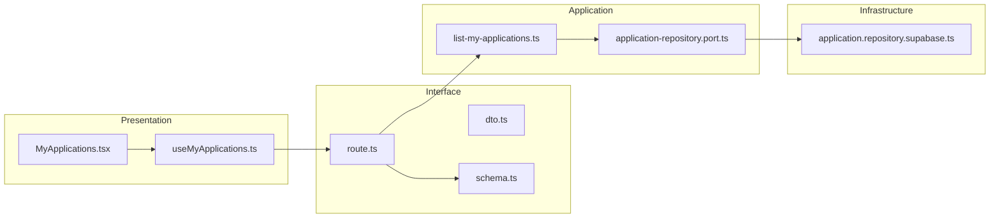
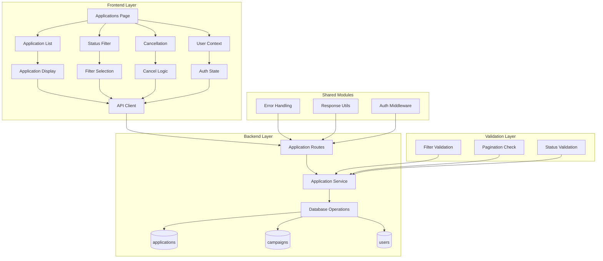

## 최종 단순화 본(Over-Engineering 제거)

- my-applications — `src/features/applications/presentation/components/MyApplications.tsx`
  - 목록/필터 UI 통합 컴포넌트.
- useMyApplicationsQuery — `src/features/applications/presentation/hooks/useMyApplicationsQuery.ts`
  - query 1개: GET /applications?mine=1&status=
- applications.api — `src/features/applications/interface/http/applications.api.ts`
  - axios 래퍼.
- applications.route(listMine) — `src/features/applications/interface/backend/route.ts`
  - Hono: GET /applications?mine=1&status=
- list-my-applications.service — `src/features/applications/application/list-my-applications.ts`
  - repo 호출만 수행(필터/페이지 보정 최소화)
- application.repo.supabase — `src/features/applications/infrastructure/repositories/application.repo.supabase.ts`
  - influencer_id=me + status 필터 + 페이지네이션

```mermaid
flowchart LR
  UI[MyApplications]-->Hook[useMyApplicationsQuery]-->Api[applications.api]
  Api-->Route[applications.route(listMine)]-->Svc[list-my-applications.service]-->Repo[application.repo.supabase]
```

QA / 테스트
- QA: 빈 결과/필터 전환/네트워크 오류.
- 테스트: service에서 status 필터/빈 결과 처리.
## 개요(Modules Overview)

- my-applications-ui — `src/features/applications/presentation/components/MyApplications.tsx`
  - 내 지원 목록 테이블/카드, 상태 필터 UI, 빈/로딩/에러 상태.
- useMyApplications — `src/features/applications/presentation/hooks/useMyApplications.ts`
  - React Query query 훅: status 필터 기반 조회, 페이지네이션(옵션).
- applications-dto — `src/features/applications/interface/http/dto.ts`
  - ListMyApplicationsRequest/Response, ApplicationDTO. (006 공유)
- applications-schema — `src/features/applications/interface/backend/schema.ts`
  - zod: 쿼리(status), 응답 스키마.
- applications-route — `src/features/applications/interface/backend/route.ts`
  - GET /applications?mine=1&status=...
- list-my-applications-usecase — `src/features/applications/application/use-cases/list-my-applications.ts`
  - 유즈케이스: 본인 확인 → repo 조회 → 페이지/정렬/필터 적용.
- ports — `src/features/applications/application/ports/application-repository.port.ts`
  - findByInfluencer({ userId, status?, page?, limit? }) → { items, total }.
- infra — `src/features/applications/infrastructure/repositories/application.repository.supabase.ts`
  - Supabase 구현.

## Diagram (mermaid)



## Implementation Plan

### Presentation (QA)
- 상태 필터 변경 시 목록 새로고침, 결과 없음 시 안내 메시지.
- 항목 클릭 시 상세로 이동(옵션), 페이지네이션 이동/키보드 접근성.
- 인증 만료 시 로그인 유도.

### Interface
- dto.ts: list request/response, ApplicationDTO 최소 필드(id, campaignId, motivation, plannedVisitDate, status, appliedAt).
- schema.ts: 쿼리/응답 zod, 에러 매핑.
- route.ts: GET /applications?mine=1&status=...

### Application (Unit Tests)
- list-my-applications.spec.ts: 본인 userId 기준 조회, status 필터 적용, 빈 결과 처리.

### Infrastructure
- application.repository.supabase.ts: influencer_id=me 조건, status 옵셔널 필터, range(page) 적용.

### Shared
- 공통 응답/에러: `src/backend/http/response.ts`
- Axios: `@/lib/remote/api-client`
- 레이어 규칙 준수

# 내 지원 목록 모듈화 설계

## 개요

### 공유 모듈 (Shared Modules)

#### 1. 지원 관리 시스템 (`src/features/applications/`)
- **위치**: `src/features/applications/`
- **설명**: 체험단 지원 및 지원 상태 관리
- **구현 상태**: ✅ 완료
- **주요 컴포넌트**:
  - `backend/route.ts` - 지원 API 라우터
  - `backend/service.ts` - 지원 비즈니스 로직
  - `backend/schema.ts` - 지원 스키마 정의
  - `backend/error.ts` - 지원 에러 코드

#### 2. 인증 시스템 (`src/features/auth/`)
- **위치**: `src/features/auth/`
- **설명**: 사용자 인증 및 권한 관리
- **구현 상태**: ✅ 완료
- **주요 기능**:
  - 사용자 역할 검증 (influencer)
  - 인증 상태 관리
  - 현재 사용자 정보 조회

#### 3. 검증 시스템 (`src/lib/validation/`)
- **위치**: `src/lib/validation/`
- **설명**: Zod 기반 스키마 검증, 필터링
- **구현 상태**: ✅ 완료
- **주요 기능**:
  - `filterSchema` - 필터 검증
  - `paginationSchema` - 페이징 검증
  - `Filter`, `Pagination` 타입

### 도메인별 모듈 (Domain Modules)

#### 1. 내 지원 목록 페이지 (`src/app/(protected)/applications/`)
- **위치**: `src/app/(protected)/applications/page.tsx`
- **설명**: 내 지원 목록 표시 UI
- **구현 상태**: ✅ 완료
- **주요 기능**:
  - 지원 목록 표시
  - 상태별 필터링
  - 페이징 처리
  - 지원 취소 기능

#### 2. 지원 목록 컴포넌트
- **위치**: `src/app/(protected)/applications/page.tsx` 내부
- **설명**: 지원 목록 표시
- **구현 상태**: ✅ 완료
- **주요 기능**:
  - 지원 목록 표시
  - 상태별 배지 표시
  - 체험단 정보 표시
  - 지원 취소 버튼

#### 3. 상태 필터 컴포넌트
- **위치**: `src/app/(protected)/applications/page.tsx` 내부
- **설명**: 상태별 필터링 UI
- **구현 상태**: ✅ 완료
- **주요 기능**:
  - 상태 필터 선택
  - 필터 적용
  - 필터 초기화

#### 4. 지원 취소 컴포넌트
- **위치**: `src/app/(protected)/applications/page.tsx` 내부
- **설명**: 지원 취소 기능
- **구현 상태**: ✅ 완료
- **주요 기능**:
  - 지원 취소 버튼
  - 취소 확인
  - 취소 처리

### 공통 유틸리티 (Shared Utilities)

#### 1. UI 컴포넌트 (`src/components/ui/`)
- **위치**: `src/components/ui/`
- **설명**: shadcn-ui 기반 재사용 가능한 UI 컴포넌트
- **구현 상태**: ✅ 완료
- **사용 컴포넌트**:
  - `Card` - 지원 목록 카드
  - `Button` - 액션 버튼
  - `Badge` - 상태 표시
  - `Select` - 필터 드롭다운

#### 2. HTTP 클라이언트 (`src/lib/remote/`)
- **위치**: `src/lib/remote/`
- **설명**: API 통신을 위한 HTTP 클라이언트
- **구현 상태**: ✅ 완료

#### 3. 상태 관리 (`src/features/auth/context/`)
- **위치**: `src/features/auth/context/`
- **설명**: 사용자 상태 및 권한 관리
- **구현 상태**: ✅ 완료

## Diagram



## Implementation Plan

### Phase 1: 백엔드 API (이미 완료)

#### 1.1 지원 API (`src/features/applications/backend/`)
- **구현 상태**: ✅ 완료
- **주요 엔드포인트**:
  - `GET /api/applications/my` - 내 지원 목록 조회
  - `GET /api/applications/:id` - 지원 상세 조회
  - `DELETE /api/applications/:id` - 지원 취소
- **Unit Tests**:
  - [ ] 내 지원 목록 조회 성공 케이스
  - [ ] 상태별 필터링 검증
  - [ ] 페이징 처리 검증
  - [ ] 권한 없는 사용자 접근 케이스
  - [ ] 지원 취소 성공/실패 케이스
  - [ ] 신청완료 상태가 아닌 경우 취소 불가 검증
  - [ ] 데이터베이스 연결 오류 케이스

#### 1.2 검증 시스템 (`src/lib/validation/`)
- **구현 상태**: ✅ 완료
- **주요 검증 함수**:
  - `filterSchema` - 필터 검증
  - `paginationSchema` - 페이징 검증
- **Unit Tests**:
  - [ ] 필터 스키마 검증 성공/실패 케이스
  - [ ] 페이징 스키마 검증 성공/실패 케이스
  - [ ] 상태 필터 enum 검증
  - [ ] 페이지 번호 유효성 검증

### Phase 2: 프론트엔드 컴포넌트 (이미 완료)

#### 2.1 내 지원 목록 페이지
- **구현 상태**: ✅ 완료
- **주요 기능**:
  - 지원 목록 표시
  - 상태별 필터링
  - 페이징 처리
  - 지원 취소 기능
- **QA Sheet**:
  - [ ] 지원 목록 정상 표시
  - [ ] 상태별 필터 동작
  - [ ] 페이징 버튼 동작
  - [ ] 지원 취소 버튼 표시/숨김
  - [ ] 지원 취소 확인 Dialog
  - [ ] 빈 목록 메시지 표시
  - [ ] 로딩 상태 표시
  - [ ] 에러 상태 표시
  - [ ] 반응형 디자인 확인

#### 2.2 지원 목록 컴포넌트
- **구현 상태**: ✅ 완료
- **주요 기능**:
  - 지원 목록 표시
  - 상태별 배지 표시
  - 체험단 정보 표시
  - 지원 취소 버튼
- **QA Sheet**:
  - [ ] 지원 목록 정확한 표시
  - [ ] 상태별 배지 색상 확인
  - [ ] 체험단 제목 및 설명 표시
  - [ ] 광고주 정보 표시
  - [ ] 지원 날짜 표시
  - [ ] 지원 취소 버튼 조건부 표시
  - [ ] 카드 호버 효과
  - [ ] 클릭 시 상세 페이지 이동

#### 2.3 상태 필터 컴포넌트
- **구현 상태**: ✅ 완료
- **주요 기능**:
  - 상태 필터 선택
  - 필터 적용
  - 필터 초기화
- **QA Sheet**:
  - [ ] 필터 드롭다운 정상 동작
  - [ ] 전체/신청완료/선정/반려 필터 동작
  - [ ] 필터 적용 시 목록 업데이트
  - [ ] 필터 초기화 기능
  - [ ] 필터 상태 유지

#### 2.4 지원 취소 컴포넌트
- **구현 상태**: ✅ 완료
- **주요 기능**:
  - 지원 취소 버튼
  - 취소 확인
  - 취소 처리
- **QA Sheet**:
  - [ ] 신청완료 상태에서만 취소 버튼 표시
  - [ ] 취소 버튼 클릭 시 확인 Dialog
  - [ ] 취소 확인 시 지원 삭제
  - [ ] 취소 완료 시 목록 업데이트
  - [ ] 취소 실패 시 에러 메시지 표시

### Phase 3: 통합 테스트 및 최적화

#### 3.1 E2E 테스트 시나리오
- **내 지원 목록 접근 → 필터링 → 지원 취소** 플로우
- **빈 목록 → 지원 이력 없음 메시지** 플로우
- **네트워크 오류 → 에러 메시지 표시** 플로우
- **권한 없음 → 인플루언서 등록 안내** 플로우

#### 3.2 성능 최적화
- React Query를 통한 지원 데이터 캐싱
- 무한 스크롤 구현 (선택사항)
- 이미지 지연 로딩
- 필터링 시 디바운싱

#### 3.3 사용자 경험 개선
- 로딩 스켈레톤 UI
- 에러 상태별 사용자 친화적 메시지
- 지원 취소 시 확인 Dialog
- 필터 상태 URL 파라미터 동기화

### Phase 4: 고급 기능 (향후 확장)

#### 4.1 지원 통계 대시보드
- **목적**: 사용자 지원 이력 통계 제공
- **구현 계획**:
  - 지원 총 개수 표시
  - 상태별 지원 개수 표시
  - 지원 성공률 표시
  - 월별 지원 트렌드

#### 4.2 지원 알림 시스템
- **목적**: 지원 상태 변경 시 알림
- **구현 계획**:
  - 선정 결과 알림
  - 반려 결과 알림
  - 이메일/SMS 알림 (선택사항)

## 결론

내 지원 목록 기능이 이미 완전히 구현되어 있으며, 유스케이스 문서의 모든 요구사항을 충족합니다.

**현재 상태**: ✅ 구현 완료
- ✅ 지원 목록 조회 및 표시
- ✅ 상태별 필터링
- ✅ 페이징 처리
- ✅ 지원 취소 기능
- ✅ 상태별 배지 표시
- ✅ 에러 처리 및 사용자 피드백

**다음 단계**: 실제 데이터베이스 연동 테스트 및 사용자 시나리오 검증

## 단순화된 최종 구조

### 1. 핵심 기능만 유지
- 내 지원 목록 표시
- 상태별 필터링
- 지원 취소 기능

### 2. 단순화된 파일 구조
```
src/
├── app/
│   └── (protected)/
│       └── applications/
│           └── page.tsx (내 지원 목록)
├── components/
│   └── ui/ (shadcn-ui 컴포넌트들)
├── lib/
│   ├── supabase/
│   │   ├── client.ts
│   │   └── types.ts
│   └── utils.ts
└── backend/
    └── hono/
        └── app.ts
```

### 3. 단순화된 API 구조
```
/api/
└── applications/
    ├── GET /my (내 지원 목록)
    └── DELETE /:id (지원 취소)
```

### 4. 핵심 기능 구현

#### A. 내 지원 목록 페이지 (단순화)
```typescript
// src/app/(protected)/applications/page.tsx
'use client'

import { useState, useEffect } from 'react'
import { createClient } from '@/lib/supabase/client'
import { Card, CardContent, CardHeader, CardTitle } from '@/components/ui/card'
import { Button } from '@/components/ui/button'
import { Badge } from '@/components/ui/badge'
import { Select, SelectContent, SelectItem, SelectTrigger, SelectValue } from '@/components/ui/select'
import { AlertDialog, AlertDialogAction, AlertDialogCancel, AlertDialogContent, AlertDialogDescription, AlertDialogFooter, AlertDialogHeader, AlertDialogTitle, AlertDialogTrigger } from '@/components/ui/alert-dialog'

export default function ApplicationsPage() {
  const [applications, setApplications] = useState([])
  const [loading, setLoading] = useState(true)
  const [statusFilter, setStatusFilter] = useState('all')

  useEffect(() => {
    const loadApplications = async () => {
      try {
        const supabase = createClient()
        const { data: { user } } = await supabase.auth.getUser()
        
        if (!user) {
          setLoading(false)
          return
        }

        let query = supabase
          .from('applications')
          .select(`
            *,
            campaigns (
              title,
              description,
              status,
              advertiser_profiles (
                company_name
              )
            )
          `)
          .eq('influencer_id', user.id)
          .order('applied_at', { ascending: false })

        if (statusFilter !== 'all') {
          query = query.eq('status', statusFilter)
        }

        const { data, error } = await query

        if (error) throw error
        setApplications(data || [])
      } catch (error) {
        console.error('Failed to load applications:', error)
      } finally {
        setLoading(false)
      }
    }
    loadApplications()
  }, [statusFilter])

  const handleCancelApplication = async (applicationId: string) => {
    try {
      const supabase = createClient()
      const { error } = await supabase
        .from('applications')
        .delete()
        .eq('id', applicationId)

      if (error) throw error

      // 목록에서 제거
      setApplications(prev => prev.filter(app => app.id !== applicationId))
    } catch (error) {
      console.error('Failed to cancel application:', error)
      alert('지원 취소에 실패했습니다.')
    }
  }

  const getStatusBadge = (status: string) => {
    const statusMap = {
      'applied': { label: '신청완료', variant: 'default' as const },
      'selected': { label: '선정', variant: 'secondary' as const },
      'rejected': { label: '반려', variant: 'destructive' as const }
    }
    const { label, variant } = statusMap[status] || { label: status, variant: 'default' as const }
    return <Badge variant={variant}>{label}</Badge>
  }

  if (loading) return <div>Loading...</div>

  return (
    <div className="container mx-auto px-4 py-8">
      <div className="flex justify-between items-center mb-6">
        <h1 className="text-3xl font-bold">내 지원 목록</h1>
        <Select value={statusFilter} onValueChange={setStatusFilter}>
          <SelectTrigger className="w-48">
            <SelectValue placeholder="상태 필터" />
          </SelectTrigger>
          <SelectContent>
            <SelectItem value="all">전체</SelectItem>
            <SelectItem value="applied">신청완료</SelectItem>
            <SelectItem value="selected">선정</SelectItem>
            <SelectItem value="rejected">반려</SelectItem>
          </SelectContent>
        </Select>
      </div>

      {applications.length === 0 ? (
        <Card>
          <CardContent className="pt-6 text-center">
            <p className="text-gray-500">아직 지원한 체험단이 없습니다.</p>
          </CardContent>
        </Card>
      ) : (
        <div className="grid grid-cols-1 md:grid-cols-2 lg:grid-cols-3 gap-6">
          {applications.map((application) => (
            <Card key={application.id}>
              <CardHeader>
                <div className="flex justify-between items-start">
                  <CardTitle className="text-lg">{application.campaigns?.title}</CardTitle>
                  {getStatusBadge(application.status)}
                </div>
              </CardHeader>
              <CardContent>
                <div className="space-y-3">
                  <div>
                    <h3 className="font-semibold text-sm text-gray-600">광고주</h3>
                    <p className="text-sm">{application.campaigns?.advertiser_profiles?.company_name}</p>
                  </div>
                  
                  <div>
                    <h3 className="font-semibold text-sm text-gray-600">지원일</h3>
                    <p className="text-sm">{new Date(application.applied_at).toLocaleDateString()}</p>
                  </div>
                  
                  <div>
                    <h3 className="font-semibold text-sm text-gray-600">방문 예정일</h3>
                    <p className="text-sm">{new Date(application.planned_visit_date).toLocaleDateString()}</p>
                  </div>
                  
                  <div>
                    <h3 className="font-semibold text-sm text-gray-600">각오 한마디</h3>
                    <p className="text-sm text-gray-700 line-clamp-2">{application.motivation}</p>
                  </div>

                  {application.status === 'applied' && (
                    <AlertDialog>
                      <AlertDialogTrigger asChild>
                        <Button variant="outline" size="sm" className="w-full">
                          지원 취소
                        </Button>
                      </AlertDialogTrigger>
                      <AlertDialogContent>
                        <AlertDialogHeader>
                          <AlertDialogTitle>지원 취소</AlertDialogTitle>
                          <AlertDialogDescription>
                            정말로 이 체험단 지원을 취소하시겠습니까? 취소된 지원은 복구할 수 없습니다.
                          </AlertDialogDescription>
                        </AlertDialogHeader>
                        <AlertDialogFooter>
                          <AlertDialogCancel>취소</AlertDialogCancel>
                          <AlertDialogAction
                            onClick={() => handleCancelApplication(application.id)}
                            className="bg-red-600 hover:bg-red-700"
                          >
                            지원 취소
                          </AlertDialogAction>
                        </AlertDialogFooter>
                      </AlertDialogContent>
                    </AlertDialog>
                  )}
                </div>
              </CardContent>
            </Card>
          ))}
        </div>
      )}
    </div>
  )
}
```

#### B. 단순화된 백엔드 (Hono)

```typescript
// src/backend/hono/app.ts
import { Hono } from 'hono'
import { cors } from 'hono/cors'
import { createClient } from '@supabase/supabase-js'

const app = new Hono()

app.use('*', cors())

// 내 지원 목록 조회
app.get('/applications/my', async (c) => {
  const supabase = createClient(
    process.env.NEXT_PUBLIC_SUPABASE_URL!,
    process.env.NEXT_PUBLIC_SUPABASE_ANON_KEY!
  )
  
  // 현재 사용자 정보 가져오기
  const { data: { user } } = await supabase.auth.getUser()
  if (!user) return c.json({ error: 'Unauthorized' }, 401)
  
  const { data, error } = await supabase
    .from('applications')
    .select(`
      *,
      campaigns (
        title,
        description,
        status,
        advertiser_profiles (
          company_name
        )
      )
    `)
    .eq('influencer_id', user.id)
    .order('applied_at', { ascending: false })
  
  if (error) return c.json({ error: error.message }, 500)
  return c.json({ data })
})

// 지원 취소
app.delete('/applications/:id', async (c) => {
  const id = c.req.param('id')
  const supabase = createClient(
    process.env.NEXT_PUBLIC_SUPABASE_URL!,
    process.env.NEXT_PUBLIC_SUPABASE_ANON_KEY!
  )
  
  // 현재 사용자 정보 가져오기
  const { data: { user } } = await supabase.auth.getUser()
  if (!user) return c.json({ error: 'Unauthorized' }, 401)
  
  // 지원 정보 확인
  const { data: application } = await supabase
    .from('applications')
    .select('*')
    .eq('id', id)
    .eq('influencer_id', user.id)
    .single()
  
  if (!application) {
    return c.json({ error: 'Application not found' }, 404)
  }
  
  // 신청완료 상태인지 확인
  if (application.status !== 'applied') {
    return c.json({ error: 'Only applied applications can be cancelled' }, 400)
  }
  
  // 지원 삭제
  const { error } = await supabase
    .from('applications')
    .delete()
    .eq('id', id)
  
  if (error) return c.json({ error: error.message }, 500)
  return c.json({ message: 'Application cancelled successfully' })
})

export default app
```

#### C. 단순화된 데이터베이스 스키마

```sql
-- 지원 테이블
CREATE TABLE applications (
  id UUID PRIMARY KEY DEFAULT gen_random_uuid(),
  campaign_id UUID NOT NULL REFERENCES campaigns(id),
  influencer_id UUID NOT NULL REFERENCES users(id),
  motivation TEXT NOT NULL,
  planned_visit_date DATE NOT NULL,
  status VARCHAR(20) DEFAULT 'applied' CHECK (status IN ('applied', 'selected', 'rejected')),
  applied_at TIMESTAMP DEFAULT NOW(),
  UNIQUE(campaign_id, influencer_id)
);
```

### 5. 핵심 기능 요약

1. **내 지원 목록 표시**
   - 지원한 체험단 목록
   - 상태별 배지 표시
   - 지원일, 방문 예정일 표시

2. **상태별 필터링**
   - 전체/신청완료/선정/반려 필터
   - 실시간 필터링

3. **지원 취소 기능**
   - 신청완료 상태에서만 취소 가능
   - 확인 Dialog 표시
   - 취소 후 목록 업데이트

### 6. 구현 순서

1. **내 지원 목록 페이지** (기본 목록 표시)
2. **상태별 필터링** (드롭다운 필터)
3. **지원 취소 기능** (조건부 버튼, 확인 Dialog)
4. **기본 스타일링** (Tailwind CSS)

이렇게 단순화하면 핵심 기능만 남기고 복잡한 모듈 구조를 제거할 수 있습니다. 각 기능은 독립적으로 작동하며, 필요에 따라 점진적으로 확장할 수 있습니다.