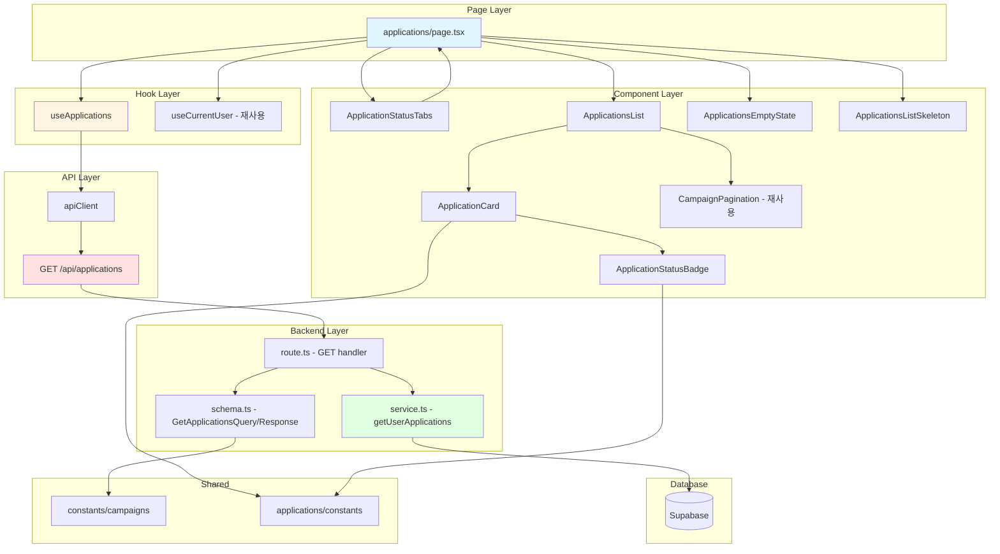

# 내 지원 목록 - 구현 계획

## 개요

### 신규 모듈

#### Backend Layer
1. **applications/backend/schema.ts (확장)**
   - 위치: `src/features/applications/backend/schema.ts`
   - 설명: GET /api/applications 요청/응답 스키마 추가
   - 의존성: zod, @/constants/campaigns

2. **applications/backend/service.ts (확장)**
   - 위치: `src/features/applications/backend/service.ts`
   - 설명: `getUserApplications` 서비스 함수 추가 (조회 + 필터링 + 페이지네이션)
   - 의존성: Supabase, HandlerResult pattern

3. **applications/backend/route.ts (확장)**
   - 위치: `src/features/applications/backend/route.ts`
   - 설명: GET /api/applications 라우트 핸들러 추가
   - 의존성: Hono, service layer

#### Frontend Data Layer
4. **applications/lib/dto.ts (확장)**
   - 위치: `src/features/applications/lib/dto.ts`
   - 설명: GET 스키마 재노출
   - 의존성: backend/schema

5. **applications/hooks/useApplications.ts (신규)**
   - 위치: `src/features/applications/hooks/useApplications.ts`
   - 설명: React Query hook for GET /api/applications
   - 의존성: @tanstack/react-query, apiClient

#### UI Components
6. **applications/components/application-status-badge.tsx (신규)**
   - 위치: `src/features/applications/components/application-status-badge.tsx`
   - 설명: 지원 상태 뱃지 (pending/selected/rejected)
   - 의존성: Badge, constants

7. **applications/components/application-status-tabs.tsx (신규)**
   - 위치: `src/features/applications/components/application-status-tabs.tsx`
   - 설명: 상태 필터 탭 (전체/대기중/선정됨/미선정)
   - 의존성: Tabs, useSearchParams

8. **applications/components/application-card.tsx (신규)**
   - 위치: `src/features/applications/components/application-card.tsx`
   - 설명: 지원 내역 카드 (체험단 정보 + 지원 정보)
   - 의존성: Card, Badge, Image, date-fns

9. **applications/components/applications-list.tsx (신규)**
   - 위치: `src/features/applications/components/applications-list.tsx`
   - 설명: 지원 목록 그리드 렌더링
   - 의존성: ApplicationCard, CampaignPagination

10. **applications/components/applications-empty-state.tsx (신규)**
    - 위치: `src/features/applications/components/applications-empty-state.tsx`
    - 설명: 빈 상태 (지원 내역 없음)
    - 의존성: Button, Link

11. **applications/components/applications-list-skeleton.tsx (신규)**
    - 위치: `src/features/applications/components/applications-list-skeleton.tsx`
    - 설명: 로딩 스켈레톤
    - 의존성: Skeleton

#### Page
12. **/applications/page.tsx (신규)**
    - 위치: `src/app/applications/page.tsx`
    - 설명: 내 지원 목록 페이지 (인증 가드, 권한 가드)
    - 의존성: useCurrentUser, useApplications, components

### 재사용 모듈
- `@/constants/campaigns`: PAGINATION_DEFAULTS 사용
- `@/features/campaigns/components/campaign-pagination`: 페이지네이션 컴포넌트 재사용
- `@/features/applications/constants`: APPLICATION_STATUS_BADGE_VARIANTS 재사용
- `@/lib/remote/api-client`: HTTP 클라이언트
- `@/features/auth/hooks/useCurrentUser`: 인증 상태 확인

---

## Diagram



---

## Implementation Plan

### Phase 1: Backend - Schema 확장

**파일**: `src/features/applications/backend/schema.ts`

**추가 내용**:
```typescript
// GET /api/applications - Query schema
export const GetApplicationsQuerySchema = z.object({
  status: ApplicationStatusSchema.optional(),
  page: z.coerce.number().int().positive().optional().default(1),
  limit: z.coerce.number().int().positive().max(100).optional().default(20),
});

// Application with campaign info
export const ApplicationWithCampaignSchema = z.object({
  id: z.string().uuid(),
  campaign_id: z.string().uuid(),
  message: z.string(),
  visit_date: z.string(),
  status: ApplicationStatusSchema,
  created_at: z.string(),
  campaign: z.object({
    id: z.string().uuid(),
    title: z.string(),
    recruitment_start_date: z.string(),
    recruitment_end_date: z.string(),
    benefits: z.string(),
    status: z.string(),
  }),
});

// GET /api/applications - Response schema
export const GetApplicationsResponseSchema = z.object({
  data: z.array(ApplicationWithCampaignSchema),
  pagination: z.object({
    page: z.number(),
    limit: z.number(),
    total: z.number(),
    totalPages: z.number(),
  }),
});
```

**Unit Tests**:
```typescript
describe('GetApplicationsQuerySchema', () => {
  it('should parse valid query with all fields', () => {
    const result = GetApplicationsQuerySchema.safeParse({
      status: 'pending',
      page: '2',
      limit: '10',
    });
    expect(result.success).toBe(true);
    expect(result.data?.page).toBe(2);
    expect(result.data?.limit).toBe(10);
  });

  it('should apply defaults when fields are missing', () => {
    const result = GetApplicationsQuerySchema.safeParse({});
    expect(result.success).toBe(true);
    expect(result.data?.page).toBe(1);
    expect(result.data?.limit).toBe(20);
  });

  it('should reject invalid status', () => {
    const result = GetApplicationsQuerySchema.safeParse({
      status: 'invalid',
    });
    expect(result.success).toBe(false);
  });

  it('should coerce string numbers to integers', () => {
    const result = GetApplicationsQuerySchema.safeParse({
      page: '3',
      limit: '15',
    });
    expect(result.success).toBe(true);
    expect(result.data?.page).toBe(3);
    expect(result.data?.limit).toBe(15);
  });
});

describe('ApplicationWithCampaignSchema', () => {
  it('should validate complete application with campaign', () => {
    const data = {
      id: '123e4567-e89b-12d3-a456-426614174000',
      campaign_id: '223e4567-e89b-12d3-a456-426614174000',
      message: 'Test message',
      visit_date: '2024-12-31',
      status: 'pending',
      created_at: '2024-01-01T00:00:00Z',
      campaign: {
        id: '223e4567-e89b-12d3-a456-426614174000',
        title: 'Test Campaign',
        recruitment_start_date: '2024-01-01',
        recruitment_end_date: '2024-12-31',
        benefits: 'Free product',
        status: 'recruiting',
      },
    };
    const result = ApplicationWithCampaignSchema.safeParse(data);
    expect(result.success).toBe(true);
  });
});
```

---

### Phase 2: Backend - Service Layer

**파일**: `src/features/applications/backend/service.ts`

**추가 내용**:
```typescript
export const getUserApplications = async (
  client: SupabaseClient,
  userId: string,
  query: GetApplicationsQuery,
): Promise<HandlerResult<GetApplicationsResponse, ApplicationErrorCode, unknown>> => {
  try {
    const { status, page, limit } = query;

    // Build query
    let dbQuery = client
      .from('applications')
      .select(`
        id,
        campaign_id,
        message,
        visit_date,
        status,
        created_at,
        campaigns:campaign_id (
          id,
          title,
          recruitment_start_date,
          recruitment_end_date,
          benefits,
          status
        )
      `)
      .eq('user_id', userId)
      .order('created_at', { ascending: false });

    // Apply status filter
    if (status) {
      dbQuery = dbQuery.eq('status', status);
    }

    // Get total count
    const { count, error: countError } = await client
      .from('applications')
      .select('*', { count: 'exact', head: true })
      .eq('user_id', userId)
      .then((result) => {
        if (status && result.data) {
          return client
            .from('applications')
            .select('*', { count: 'exact', head: true })
            .eq('user_id', userId)
            .eq('status', status);
        }
        return result;
      });

    if (countError) {
      return failure(500, applicationErrorCodes.databaseError, 'Failed to count applications', countError);
    }

    // Apply pagination
    const offset = (page - 1) * limit;
    dbQuery = dbQuery.range(offset, offset + limit - 1);

    // Execute query
    const { data, error } = await dbQuery;

    if (error) {
      return failure(500, applicationErrorCodes.databaseError, 'Failed to fetch applications', error);
    }

    // Transform data
    const applications = data.map((app) => ({
      ...app,
      campaign: Array.isArray(app.campaigns) ? app.campaigns[0] : app.campaigns,
    }));

    return success({
      data: applications,
      pagination: {
        page,
        limit,
        total: count || 0,
        totalPages: Math.ceil((count || 0) / limit),
      },
    }, 200);
  } catch (error) {
    return failure(500, applicationErrorCodes.databaseError, 'Unexpected error', error);
  }
};
```

**Unit Tests**:
```typescript
describe('getUserApplications', () => {
  it('should fetch all applications for user', async () => {
    const mockClient = createMockSupabaseClient({
      applications: [
        { id: '1', user_id: 'user1', status: 'pending', created_at: '2024-01-01' },
        { id: '2', user_id: 'user1', status: 'selected', created_at: '2024-01-02' },
      ],
    });

    const result = await getUserApplications(mockClient, 'user1', { page: 1, limit: 20 });

    expect(result.ok).toBe(true);
    expect(result.data?.data).toHaveLength(2);
    expect(result.data?.pagination.total).toBe(2);
  });

  it('should filter by status', async () => {
    const mockClient = createMockSupabaseClient({
      applications: [
        { id: '1', user_id: 'user1', status: 'pending' },
      ],
    });

    const result = await getUserApplications(mockClient, 'user1', {
      status: 'pending',
      page: 1,
      limit: 20,
    });

    expect(result.ok).toBe(true);
    expect(result.data?.data).toHaveLength(1);
    expect(result.data?.data[0].status).toBe('pending');
  });

  it('should paginate results correctly', async () => {
    const mockClient = createMockSupabaseClient({
      applications: Array.from({ length: 25 }, (_, i) => ({
        id: `${i}`,
        user_id: 'user1',
        status: 'pending',
      })),
    });

    const result = await getUserApplications(mockClient, 'user1', {
      page: 2,
      limit: 10,
    });

    expect(result.ok).toBe(true);
    expect(result.data?.data).toHaveLength(10);
    expect(result.data?.pagination.page).toBe(2);
    expect(result.data?.pagination.totalPages).toBe(3);
  });

  it('should return empty array when no applications', async () => {
    const mockClient = createMockSupabaseClient({
      applications: [],
    });

    const result = await getUserApplications(mockClient, 'user1', { page: 1, limit: 20 });

    expect(result.ok).toBe(true);
    expect(result.data?.data).toHaveLength(0);
    expect(result.data?.pagination.total).toBe(0);
  });

  it('should handle database errors', async () => {
    const mockClient = createMockSupabaseClient({
      shouldFail: true,
    });

    const result = await getUserApplications(mockClient, 'user1', { page: 1, limit: 20 });

    expect(result.ok).toBe(false);
    expect(result.error?.code).toBe(applicationErrorCodes.databaseError);
  });
});
```

---

### Phase 3: Backend - Route Handler

**파일**: `src/features/applications/backend/route.ts`

**추가 내용**:
```typescript
app.get('/applications', async (c) => {
  try {
    const supabase = c.get('supabase');

    // 1. Get authenticated user
    const { data: { user }, error: authError } = await supabase.auth.getUser();
    if (authError || !user) {
      return respond(c, failure(401, applicationErrorCodes.unauthorized, '로그인이 필요합니다.'));
    }

    // 2. Check user role (influencer only)
    const { data: userMetadata } = await supabase
      .from('users')
      .select('role')
      .eq('id', user.id)
      .single();

    if (!userMetadata || userMetadata.role !== 'influencer') {
      return respond(c, failure(403, applicationErrorCodes.forbidden, '인플루언서만 접근 가능합니다.'));
    }

    // 3. Check influencer profile
    const { data: profile } = await supabase
      .from('influencer_profiles')
      .select('id')
      .eq('user_id', user.id)
      .single();

    if (!profile) {
      return respond(c, failure(403, applicationErrorCodes.profileNotFound, '프로필을 먼저 등록해주세요.'));
    }

    // 4. Parse query params
    const queryParams = c.req.query();
    const parsedQuery = GetApplicationsQuerySchema.safeParse(queryParams);

    if (!parsedQuery.success) {
      return respond(c, failure(400, applicationErrorCodes.invalidInput, '잘못된 쿼리 파라미터입니다.', parsedQuery.error.format()));
    }

    // 5. Fetch applications
    const result = await getUserApplications(supabase, user.id, parsedQuery.data);

    return respond(c, result);
  } catch (error) {
    return respond(c, failure(500, applicationErrorCodes.databaseError, '예상치 못한 오류가 발생했습니다.', error));
  }
});
```

---

### Phase 4: Frontend Data Layer

**파일**: `src/features/applications/lib/dto.ts` (확장)
```typescript
export {
  GetApplicationsQuerySchema,
  GetApplicationsResponseSchema,
  ApplicationWithCampaignSchema,
  type GetApplicationsQuery,
  type GetApplicationsResponse,
  type ApplicationWithCampaign,
} from '../backend/schema';
```

**파일**: `src/features/applications/hooks/useApplications.ts` (신규)
```typescript
'use client';

import { useQuery } from '@tanstack/react-query';
import { apiClient } from '@/lib/remote/api-client';
import type { GetApplicationsQuery, GetApplicationsResponse } from '../lib/dto';

const fetchApplications = async (query: GetApplicationsQuery): Promise<GetApplicationsResponse> => {
  const response = await apiClient.get<{ ok: boolean; data?: GetApplicationsResponse }>('/applications', {
    params: query,
  });

  if (!response.data.ok || !response.data.data) {
    throw new Error('Failed to fetch applications');
  }

  return response.data.data;
};

export const useApplications = (query: GetApplicationsQuery) => {
  return useQuery({
    queryKey: ['applications', query],
    queryFn: () => fetchApplications(query),
    staleTime: 1 * 60 * 1000, // 1 minute
    gcTime: 5 * 60 * 1000, // 5 minutes
  });
};
```

---

### Phase 5: UI Components

#### 5-1. ApplicationStatusBadge

**파일**: `src/features/applications/components/application-status-badge.tsx`
```typescript
import { Badge } from '@/components/ui/badge';
import { APPLICATION_STATUS_BADGE_VARIANTS } from '../constants';
import type { ApplicationStatus } from '../lib/dto';

interface ApplicationStatusBadgeProps {
  status: ApplicationStatus;
}

export const ApplicationStatusBadge = ({ status }: ApplicationStatusBadgeProps) => {
  const config = APPLICATION_STATUS_BADGE_VARIANTS[status];
  return <Badge variant={config.variant}>{config.label}</Badge>;
};
```

**QA Sheet**:
- [ ] pending 상태 시 회색(secondary) 뱃지 표시
- [ ] selected 상태 시 파란색(default) 뱃지 표시
- [ ] rejected 상태 시 빨간색(outline) 뱃지 표시
- [ ] 각 상태에 맞는 한글 레이블 표시 (대기중/선정됨/미선정)

---

#### 5-2. ApplicationStatusTabs

**파일**: `src/features/applications/components/application-status-tabs.tsx`
```typescript
import { Tabs, TabsList, TabsTrigger } from '@/components/ui/tabs';
import type { ApplicationStatus } from '../lib/dto';

interface ApplicationStatusTabsProps {
  value: ApplicationStatus | 'all';
  onChange: (value: ApplicationStatus | 'all') => void;
  counts?: Record<ApplicationStatus | 'all', number>;
}

export const ApplicationStatusTabs = ({ value, onChange, counts }: ApplicationStatusTabsProps) => {
  return (
    <Tabs value={value} onValueChange={onChange}>
      <TabsList>
        <TabsTrigger value="all">
          전체 {counts?.all !== undefined && `(${counts.all})`}
        </TabsTrigger>
        <TabsTrigger value="pending">
          대기중 {counts?.pending !== undefined && `(${counts.pending})`}
        </TabsTrigger>
        <TabsTrigger value="selected">
          선정됨 {counts?.selected !== undefined && `(${counts.selected})`}
        </TabsTrigger>
        <TabsTrigger value="rejected">
          미선정 {counts?.rejected !== undefined && `(${counts.rejected})`}
        </TabsTrigger>
      </TabsList>
    </Tabs>
  );
};
```

**QA Sheet**:
- [ ] 전체/대기중/선정됨/미선정 탭 렌더링
- [ ] 선택된 탭 하이라이트 표시
- [ ] 각 탭에 개수 표시 (선택사항)
- [ ] 탭 클릭 시 onChange 콜백 호출
- [ ] 키보드 네비게이션 지원

---

#### 5-3. ApplicationCard

**파일**: `src/features/applications/components/application-card.tsx`
```typescript
import Link from 'next/link';
import Image from 'next/image';
import { Card, CardContent, CardHeader } from '@/components/ui/card';
import { ApplicationStatusBadge } from './application-status-badge';
import { Calendar, Clock } from 'lucide-react';
import { format, parseISO } from 'date-fns';
import { ko } from 'date-fns/locale';
import type { ApplicationWithCampaign } from '../lib/dto';

interface ApplicationCardProps {
  application: ApplicationWithCampaign;
}

export const ApplicationCard = ({ application }: ApplicationCardProps) => {
  const { campaign, message, visit_date, status, created_at } = application;

  return (
    <Link href={`/campaigns/${campaign.id}`}>
      <Card className="hover:shadow-lg transition-shadow cursor-pointer">
        <CardHeader className="pb-3">
          <div className="flex items-start justify-between gap-2">
            <h3 className="text-lg font-semibold line-clamp-2">{campaign.title}</h3>
            <ApplicationStatusBadge status={status} />
          </div>
        </CardHeader>
        <CardContent className="space-y-3">
          <div className="flex items-center gap-2 text-sm text-gray-600">
            <Calendar className="h-4 w-4" />
            <span>
              {format(parseISO(campaign.recruitment_start_date), 'yy.MM.dd')} -{' '}
              {format(parseISO(campaign.recruitment_end_date), 'yy.MM.dd')}
            </span>
          </div>

          <div className="flex items-center gap-2 text-sm text-gray-600">
            <Clock className="h-4 w-4" />
            <span>방문 예정: {format(parseISO(visit_date), 'yyyy.MM.dd')}</span>
          </div>

          <p className="text-sm text-gray-700 line-clamp-2">{message}</p>

          <p className="text-xs text-gray-500">
            지원일: {format(parseISO(created_at), 'yyyy.MM.dd HH:mm', { locale: ko })}
          </p>
        </CardContent>
      </Card>
    </Link>
  );
};
```

**QA Sheet**:
- [ ] 체험단 제목 표시 (2줄 말줄임)
- [ ] 지원 상태 뱃지 표시
- [ ] 모집 기간 표시
- [ ] 방문 예정일 표시
- [ ] 각오 한마디 표시 (2줄 말줄임)
- [ ] 지원일시 표시
- [ ] 카드 hover 시 shadow 효과
- [ ] 카드 클릭 시 체험단 상세 페이지로 이동
- [ ] 반응형: 모바일(1열), 태블릿(2열), 데스크톱(3열)

---

#### 5-4. ApplicationsList

**파일**: `src/features/applications/components/applications-list.tsx`
```typescript
import { ApplicationCard } from './application-card';
import type { ApplicationWithCampaign } from '../lib/dto';

interface ApplicationsListProps {
  applications: ApplicationWithCampaign[];
}

export const ApplicationsList = ({ applications }: ApplicationsListProps) => {
  return (
    <div className="grid grid-cols-1 md:grid-cols-2 lg:grid-cols-3 gap-6">
      {applications.map((application) => (
        <ApplicationCard key={application.id} application={application} />
      ))}
    </div>
  );
};
```

**QA Sheet**:
- [ ] 지원 목록 그리드 렌더링
- [ ] 반응형 그리드: 모바일(1열), 태블릿(2열), 데스크톱(3열)
- [ ] 각 카드에 고유 key 적용

---

#### 5-5. ApplicationsEmptyState

**파일**: `src/features/applications/components/applications-empty-state.tsx`
```typescript
import Link from 'next/link';
import { Button } from '@/components/ui/button';
import { FileQuestion } from 'lucide-react';

export const ApplicationsEmptyState = () => {
  return (
    <div className="flex flex-col items-center justify-center py-16 text-center">
      <FileQuestion className="h-16 w-16 text-gray-400 mb-4" />
      <h3 className="text-xl font-semibold text-gray-900 mb-2">
        아직 지원한 체험단이 없습니다
      </h3>
      <p className="text-gray-600 mb-6">
        다양한 체험단에 지원하고 특별한 경험을 시작해보세요
      </p>
      <Button asChild>
        <Link href="/">체험단 둘러보기</Link>
      </Button>
    </div>
  );
};
```

**QA Sheet**:
- [ ] 아이콘 표시
- [ ] "아직 지원한 체험단이 없습니다" 메시지
- [ ] "체험단 둘러보기" 버튼
- [ ] 버튼 클릭 시 홈으로 이동
- [ ] 중앙 정렬

---

#### 5-6. ApplicationsListSkeleton

**파일**: `src/features/applications/components/applications-list-skeleton.tsx`
```typescript
import { Skeleton } from '@/components/ui/skeleton';
import { Card, CardContent, CardHeader } from '@/components/ui/card';

export const ApplicationsListSkeleton = () => {
  return (
    <div className="grid grid-cols-1 md:grid-cols-2 lg:grid-cols-3 gap-6">
      {Array.from({ length: 6 }).map((_, i) => (
        <Card key={i}>
          <CardHeader>
            <div className="flex justify-between items-start gap-2">
              <Skeleton className="h-6 w-3/4" />
              <Skeleton className="h-6 w-16" />
            </div>
          </CardHeader>
          <CardContent className="space-y-3">
            <Skeleton className="h-4 w-full" />
            <Skeleton className="h-4 w-full" />
            <Skeleton className="h-4 w-2/3" />
            <Skeleton className="h-3 w-1/2" />
          </CardContent>
        </Card>
      ))}
    </div>
  );
};
```

**QA Sheet**:
- [ ] 6개 카드 스켈레톤 렌더링
- [ ] 카드 레이아웃과 일치하는 스켈레톤
- [ ] 그리드 레이아웃 일치

---

### Phase 6: Page Integration

**파일**: `src/app/applications/page.tsx`
```typescript
'use client';

import { useEffect, useState } from 'react';
import { useRouter } from 'next/navigation';
import { Loader2 } from 'lucide-react';
import { Alert, AlertDescription, AlertTitle } from '@/components/ui/alert';
import { Button } from '@/components/ui/button';
import { useCurrentUser } from '@/features/auth/hooks/useCurrentUser';
import { useApplications } from '@/features/applications/hooks/useApplications';
import { ApplicationStatusTabs } from '@/features/applications/components/application-status-tabs';
import { ApplicationsList } from '@/features/applications/components/applications-list';
import { ApplicationsEmptyState } from '@/features/applications/components/applications-empty-state';
import { ApplicationsListSkeleton } from '@/features/applications/components/applications-list-skeleton';
import { CampaignPagination } from '@/features/campaigns/components/campaign-pagination';
import type { ApplicationStatus } from '@/features/applications/lib/dto';

export default function ApplicationsPage() {
  const router = useRouter();
  const { isAuthenticated, user, isLoading: userLoading } = useCurrentUser();
  const userRole = user?.userMetadata?.role as 'influencer' | 'advertiser' | undefined;

  const [statusFilter, setStatusFilter] = useState<ApplicationStatus | 'all'>('all');
  const [page, setPage] = useState(1);

  const { data, isLoading, error } = useApplications({
    status: statusFilter === 'all' ? undefined : statusFilter,
    page,
    limit: 20,
  });

  // Guard: Check authentication
  useEffect(() => {
    if (!userLoading && !isAuthenticated) {
      router.push('/login?returnUrl=/applications');
    }
  }, [userLoading, isAuthenticated, router]);

  // Guard: Check user role
  useEffect(() => {
    if (!userLoading && isAuthenticated && userRole !== 'influencer') {
      router.push('/');
    }
  }, [userLoading, isAuthenticated, userRole, router]);

  // Loading state
  if (userLoading || (isAuthenticated && userRole === 'influencer' && isLoading)) {
    return (
      <div className="py-8">
        <div className="max-w-7xl mx-auto px-4 sm:px-6 lg:px-8">
          <div className="mb-8">
            <h1 className="text-3xl font-bold text-gray-900">내 지원 목록</h1>
          </div>
          <ApplicationsListSkeleton />
        </div>
      </div>
    );
  }

  // Error state
  if (error) {
    return (
      <div className="py-8">
        <div className="max-w-7xl mx-auto px-4 sm:px-6 lg:px-8">
          <Alert variant="destructive">
            <AlertTitle>오류가 발생했습니다</AlertTitle>
            <AlertDescription>
              지원 목록을 불러오는 중 오류가 발생했습니다. 다시 시도해주세요.
            </AlertDescription>
          </Alert>
          <div className="mt-4">
            <Button onClick={() => window.location.reload()}>다시 시도</Button>
          </div>
        </div>
      </div>
    );
  }

  return (
    <div className="py-8">
      <div className="max-w-7xl mx-auto px-4 sm:px-6 lg:px-8">
        {/* Header */}
        <div className="mb-8">
          <h1 className="text-3xl font-bold text-gray-900 mb-2">내 지원 목록</h1>
          <p className="text-gray-600">내가 지원한 체험단 내역을 확인할 수 있습니다</p>
        </div>

        {/* Status Tabs */}
        <div className="mb-6">
          <ApplicationStatusTabs
            value={statusFilter}
            onChange={(value) => {
              setStatusFilter(value as ApplicationStatus | 'all');
              setPage(1);
            }}
          />
        </div>

        {/* Content */}
        {data && data.data.length === 0 ? (
          <ApplicationsEmptyState />
        ) : (
          <>
            <ApplicationsList applications={data?.data || []} />
            {data && data.pagination.totalPages > 1 && (
              <div className="mt-8">
                <CampaignPagination
                  pagination={data.pagination}
                  onPageChange={setPage}
                />
              </div>
            )}
          </>
        )}
      </div>
    </div>
  );
}
```

**QA Sheet**:
- [ ] 페이지 제목 표시: "내 지원 목록"
- [ ] 비로그인 시 로그인 페이지로 리다이렉트
- [ ] 광고주 접근 시 홈으로 리다이렉트
- [ ] 상태 필터 탭 표시 (전체/대기중/선정됨/미선정)
- [ ] 필터 변경 시 목록 업데이트
- [ ] 지원 내역 없을 시 빈 상태 표시
- [ ] 지원 내역 있을 시 카드 그리드 표시
- [ ] 페이지네이션 표시 (2페이지 이상일 때)
- [ ] 로딩 중 스켈레톤 표시
- [ ] 에러 시 에러 메시지 + 재시도 버튼
- [ ] 페이지 변경 시 스크롤 최상단 이동

---

## Implementation Order

1. **Phase 1**: Backend Schema 확장
2. **Phase 2**: Backend Service Layer
3. **Phase 3**: Backend Route Handler
4. **Phase 4**: Frontend Data Layer (DTO + Hook)
5. **Phase 5**: UI Components (Badge → Tabs → Card → List → EmptyState → Skeleton)
6. **Phase 6**: Page Integration
7. **Verification**: Type check, Build, Manual QA

---

## Testing Strategy

### Backend
- Unit tests for schema validation
- Unit tests for service layer (getUserApplications)
- Integration tests for GET /api/applications route

### Frontend
- Component QA sheets for each UI component
- Page-level QA sheet for /applications page
- Manual testing for authentication guards
- Manual testing for role-based access control

---

## Notes

- **재사용**: CampaignPagination 컴포넌트 재사용 (campaigns feature)
- **공통 상수**: PAGINATION_DEFAULTS 재사용 (constants/campaigns)
- **일관성**: 기존 applications feature 패턴 유지 (error codes, schema structure)
- **성능**: React Query 캐싱 (1분), 페이지네이션 (20개/페이지)
- **접근성**: 키보드 네비게이션, aria-label, semantic HTML
