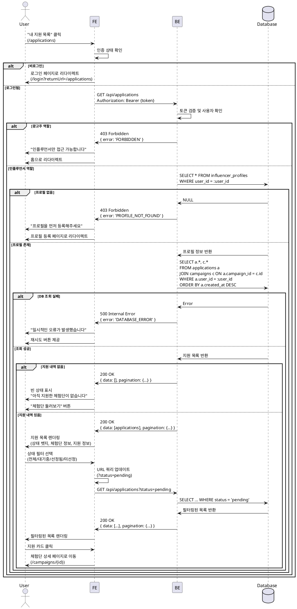

# 내 지원 목록 - 상세 유스케이스

## Use Case: 인플루언서 지원 목록 조회 및 필터링

### Primary Actor
인플루언서 (로그인 + 프로필 등록 완료)

### Precondition
- 인플루언서로 로그인되어 있음
- 인플루언서 프로필이 등록되어 있음
- 최소 1개 이상의 지원 내역이 있음 (선택사항)

### Trigger
사용자가 헤더 메뉴에서 "내 지원 목록" 클릭하여 `/applications` 페이지로 진입

### Main Scenario

1. 사용자가 헤더 메뉴에서 "내 지원 목록" 클릭
2. 시스템이 지원 목록 페이지로 이동
3. 시스템이 사용자 인증 및 권한 확인 (인플루언서만 접근 가능)
4. 시스템이 현재 사용자의 지원 내역 조회
   - 체험단 정보 (제목, 모집 기간, 혜택)
   - 지원 정보 (각오 한마디, 방문 예정일자, 지원일시)
   - 지원 상태 (pending/selected/rejected)
5. 시스템이 지원 목록을 최신순으로 렌더링
6. 사용자가 상태 필터 선택 (전체/대기중/선정됨/미선정)
7. 시스템이 필터에 맞는 지원 목록 표시
8. 사용자가 지원 상세 내역 확인 (카드 클릭 시 체험단 상세로 이동)

### Edge Cases

**E1. 지원 내역 없음**
- 4단계에서 지원 내역이 없을 경우
- 빈 상태 메시지 표시: "아직 지원한 체험단이 없습니다"
- "체험단 둘러보기" 버튼 제공 (홈으로 이동)

**E2. 비로그인 접근**
- 3단계에서 비로그인 사용자 감지
- 로그인 페이지로 리다이렉트 (returnUrl 포함)

**E3. 광고주 접근**
- 3단계에서 광고주 역할 감지
- "인플루언서만 접근 가능합니다" 에러 메시지
- 홈 페이지로 리다이렉트

**E4. 프로필 미등록**
- 3단계에서 인플루언서 프로필 없음 감지
- "프로필을 먼저 등록해주세요" 메시지
- 프로필 등록 페이지로 리다이렉트

**E5. 네트워크 에러**
- 4단계에서 DB 조회 실패
- "일시적인 오류가 발생했습니다" 에러 메시지
- 재시도 버튼 제공

**E6. 필터 상태 변경**
- 6단계에서 필터 변경
- URL 쿼리 파라미터 업데이트 (?status=pending)
- 브라우저 뒤로가기 지원

### Business Rules

**BR-001: 접근 권한**
- 인플루언서만 접근 가능
- 본인의 지원 내역만 조회 가능
- 광고주는 접근 불가

**BR-002: 정렬 순서**
- 기본 정렬: 지원일시 최신순 (created_at DESC)
- 페이지네이션: 20개씩 표시

**BR-003: 상태 필터**
- 전체: 모든 지원 내역
- 대기중 (pending): 선정 대기 중
- 선정됨 (selected): 광고주가 선정한 지원
- 미선정 (rejected): 광고주가 반려한 지원

**BR-004: 지원 상세**
- 각 지원 카드에 체험단 정보와 지원 정보 함께 표시
- 체험단 상태 (모집중/모집종료/완료) 함께 표시
- 지원 상태에 따라 뱃지 색상 구분

**BR-005: 취소 불가**
- 지원 후 취소 기능 없음 (향후 확장 가능)
- 지원 내역은 조회만 가능

---

## Sequence Diagram



---

## API Specification

### GET /api/applications

**Request Headers**
```
Authorization: Bearer {access_token}
```

**Query Parameters**
```
status?: 'pending' | 'selected' | 'rejected'
page?: number (default: 1)
limit?: number (default: 20)
```

**Response (Success - 200)**
```json
{
  "ok": true,
  "data": [
    {
      "id": "uuid",
      "campaign_id": "uuid",
      "message": "각오 한마디 내용",
      "visit_date": "2024-12-31",
      "status": "pending",
      "created_at": "2024-01-01T10:00:00Z",
      "campaign": {
        "id": "uuid",
        "title": "체험단 제목",
        "recruitment_start_date": "2024-01-01",
        "recruitment_end_date": "2024-01-31",
        "benefits": "혜택 내용",
        "status": "recruiting"
      }
    }
  ],
  "pagination": {
    "page": 1,
    "limit": 20,
    "total": 5,
    "totalPages": 1
  }
}
```

**Response (Error - 403)**
```json
{
  "ok": false,
  "error": {
    "code": "FORBIDDEN",
    "message": "인플루언서만 접근 가능합니다."
  }
}
```

**Error Codes**
- `UNAUTHORIZED`: 로그인 필요
- `FORBIDDEN`: 권한 없음 (광고주, 프로필 미등록)
- `DATABASE_ERROR`: 데이터베이스 오류

---

## UI/UX Notes

### 페이지 레이아웃
- 상단: 페이지 제목 + 상태 필터 탭
- 중간: 지원 목록 카드 그리드
- 하단: 페이지네이션

### 상태 필터 탭
- 전체 / 대기중 / 선정됨 / 미선정
- 선택된 탭 하이라이트
- 각 탭에 개수 표시 (예: 대기중 (3))

### 지원 카드
- 체험단 이미지 (썸네일)
- 체험단 제목
- 모집 기간
- 지원 상태 뱃지 (색상 구분)
- 지원일시
- 각오 한마디 (2줄 말줄임)
- 방문 예정일자
- 클릭 시 체험단 상세로 이동

### 빈 상태
- 아이콘 + "아직 지원한 체험단이 없습니다"
- "체험단 둘러보기" 버튼 (Primary)

### 상태 뱃지 색상
- 대기중 (pending): 회색 (secondary)
- 선정됨 (selected): 파란색 (default)
- 미선정 (rejected): 빨간색 (destructive)

### 반응형
- 모바일: 1열
- 태블릿: 2열
- 데스크톱: 3열

---

## Performance Considerations

- 지원 목록 캐싱: React Query (1분)
- 이미지 최적화: Next.js Image
- 무한 스크롤 고려 (향후)
- 필터 변경 시 부드러운 전환

---

## Security Considerations

- 인증 토큰 검증 (서버 사이드)
- 본인 지원 내역만 조회 가능
- SQL Injection 방지 (ORM 사용)
- Rate limiting (동일 사용자 반복 요청 방지)
