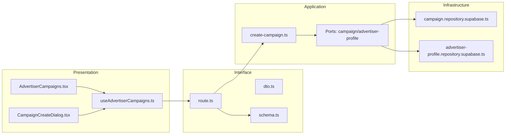
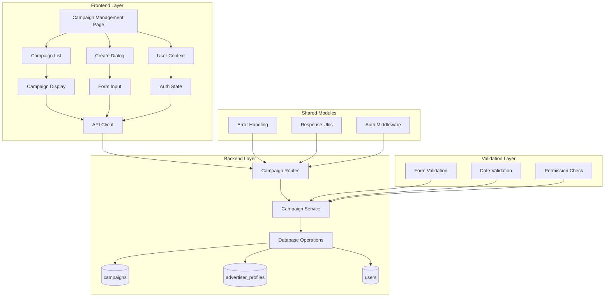

## 최종 단순화 본(Over-Engineering 제거)

- advertiser-campaigns — `src/features/campaigns/presentation/components/AdvertiserCampaigns.tsx`
  - 목록 + 등록 다이얼로그를 한 컴포넌트에서 관리.
- useAdvertiserCampaignsQuery/Mutation — `src/features/campaigns/presentation/hooks/useAdvertiserCampaigns.ts`
  - query: GET /campaigns/my, mutation: POST /campaigns
- campaigns.api — `src/features/campaigns/interface/http/campaigns.api.ts`
  - axios 래퍼.
- campaigns.route(my/create) — `src/features/campaigns/interface/backend/route.ts`
  - Hono: GET /campaigns/my, POST /campaigns
- create-campaign.service — `src/features/campaigns/application/create-campaign.ts`
  - 최소 검증(권한/기간/인원) 후 insert(status=recruiting)
- campaign.repo.supabase — `src/features/campaigns/infrastructure/repositories/campaign.repo.supabase.ts`
  - findByAdvertiser/insert

```mermaid
flowchart LR
  UI[AdvertiserCampaigns]-->Hook[useAdvertiserCampaigns]-->Api[campaigns.api]
  Api-->Route[campaigns.route(my/create)]-->Svc[create-campaign.service]-->Repo[campaign.repo.supabase]
```

QA / 테스트
- QA: 권한 없음/필수값 누락/날짜 역전/성공.
- 테스트: service 권한/기간/인원 제약, insert 성공.
## 개요(Modules Overview)

- advertiser-campaigns-ui — `src/features/campaigns/presentation/components/AdvertiserCampaigns.tsx`
  - 내 캠페인 목록/등록 버튼/등록 다이얼로그 포함 UI.
- campaign-create-form-ui — `src/features/campaigns/presentation/components/CampaignCreateDialog.tsx`
  - 제목/설명/모집기간/모집인원/혜택/미션/매장정보 입력 폼.
- useAdvertiserCampaigns — `src/features/campaigns/presentation/hooks/useAdvertiserCampaigns.ts`
  - 목록 조회/생성 mutation 훅, 성공 시 목록 무효화.
- campaigns-dto — `src/features/campaigns/interface/http/dto.ts`
  - CreateCampaignRequest/Response, AdvertiserCampaignListResponse(004 공유 확장).
- campaigns-schema — `src/features/campaigns/interface/backend/schema.ts`
  - zod: 생성 payload/응답, 목록 쿼리.
- campaigns-route — `src/features/campaigns/interface/backend/route.ts`
  - GET /campaigns/my, POST /campaigns
- create-campaign-usecase — `src/features/campaigns/application/use-cases/create-campaign.ts`
  - 유즈케이스: 권한 가드(광고주) → 기간/모집인원 검증 → insert(status=recruiting)
- ports — `src/features/campaigns/application/ports/{campaign-repository.port.ts, advertiser-profile-repository.port.ts}`
  - advertiser_id 조회/검증, insert/findByAdvertiser
- infra — `src/features/campaigns/infrastructure/repositories/{campaign.repository.supabase.ts, advertiser-profile.repository.supabase.ts}`
  - Supabase 구현.

## Diagram (mermaid)



## Implementation Plan

### Presentation (QA)
- 등록 다이얼로그의 필수값 검증/날짜 역전 방지.
- 생성 성공 후 목록 즉시 갱신, 성공 토스트.
- 권한 부족 시 진입 가드/메시지.

### Interface
- dto.ts: 생성/목록 DTO, 에러 페이로드.
- schema.ts: 생성 payload zod(기간/인원 제약), 목록 쿼리 스키마.
- route.ts: GET /campaigns/my, POST /campaigns.

### Application (Unit Tests)
- create-campaign.spec.ts: 권한 가드, 기간/인원 제약, 성공 insert, 에러 매핑.

### Infrastructure
- campaign.repository.supabase.ts: insert/findByAdvertiser, status=recruiting 기본값.
- advertiser-profile.repository.supabase.ts: user_id→advertiser_id 매핑/검증.

### Shared
- 공통 응답/에러 포맷, Axios 경유, 레이어 규칙 준수.

# 광고주 체험단 관리 모듈화 설계

## 개요

### 공유 모듈 (Shared Modules)

#### 1. 캠페인 관리 시스템 (`src/features/campaigns/`)
- **위치**: `src/features/campaigns/`
- **설명**: 체험단 조회, 생성, 관리
- **구현 상태**: ✅ 완료
- **주요 컴포넌트**:
  - `backend/route.ts` - 캠페인 API 라우터
  - `backend/service.ts` - 캠페인 비즈니스 로직
  - `backend/schema.ts` - 캠페인 스키마 정의
  - `backend/error.ts` - 캠페인 에러 코드

#### 2. 인증 시스템 (`src/features/auth/`)
- **위치**: `src/features/auth/`
- **설명**: 사용자 인증 및 권한 관리
- **구현 상태**: ✅ 완료
- **주요 기능**:
  - 사용자 역할 검증 (advertiser)
  - 인증 상태 관리
  - 현재 사용자 정보 조회

#### 3. 검증 시스템 (`src/lib/validation/`)
- **위치**: `src/lib/validation/`
- **설명**: Zod 기반 스키마 검증, 날짜 검증
- **구현 상태**: ✅ 완료
- **주요 기능**:
  - `campaignCreateSchema` - 체험단 생성 스키마
  - `validateDateRange` - 날짜 범위 검증
  - `validateRequiredFields` - 필수 필드 검증

### 도메인별 모듈 (Domain Modules)

#### 1. 광고주 체험단 관리 페이지
- **위치**: `src/app/(protected)/campaigns/manage/`
- **설명**: 광고주용 체험단 관리 UI
- **구현 상태**: ✅ 완료
- **주요 기능**:
  - 체험단 목록 표시
  - 신규 체험단 등록 Dialog
  - 체험단 상태 관리

#### 2. 체험단 상세 관리 페이지
- **위치**: `src/app/(protected)/campaigns/[id]/manage/`
- **설명**: 광고주용 체험단 상세 관리 UI
- **구현 상태**: ✅ 완료
- **주요 기능**:
  - 체험단 상세 정보 표시
  - 지원자 목록 테이블
  - 모집 종료 기능
  - 체험단 선정 기능

#### 3. 체험단 목록 컴포넌트
- **위치**: `src/app/(protected)/campaigns/manage/page.tsx` (인라인 구현)
- **설명**: 광고주의 체험단 목록 표시
- **구현 상태**: ✅ 완료
- **주요 기능**:
  - 체험단 목록 표시
  - 상태별 배지 표시
  - 체험단 정보 표시
  - 액션 버튼 (수정, 삭제, 상태 변경)

#### 4. 체험단 등록 Dialog
- **위치**: `src/app/(protected)/campaigns/manage/page.tsx` (인라인 구현)
- **설명**: 신규 체험단 등록 폼
- **구현 상태**: ✅ 완료
- **주요 기능**:
  - 체험단 정보 입력 폼
  - 유효성 검사
  - 등록 처리
  - 성공/에러 피드백

#### 5. 체험단 정보 입력 컴포넌트
- **위치**: `src/app/(protected)/campaigns/manage/page.tsx` (인라인 구현)
- **설명**: 체험단 정보 입력 폼
- **구현 상태**: ✅ 완료
- **주요 기능**:
  - 체험단명 입력
  - 모집기간 선택
  - 모집인원 입력
  - 제공혜택 입력
  - 매장정보 입력
  - 미션 입력

#### 6. 지원자 관리 컴포넌트
- **위치**: `src/app/(protected)/campaigns/[id]/manage/page.tsx` (인라인 구현)
- **설명**: 지원자 목록 및 선정 관리
- **구현 상태**: ✅ 완료
- **주요 기능**:
  - 지원자 목록 테이블
  - 지원 상태 표시
  - 선정 체크박스
  - 모집 종료 Dialog
  - 선정 완료 Dialog

### 공통 유틸리티 (Shared Utilities)

#### 1. UI 컴포넌트 (`src/components/ui/`)
- **위치**: `src/components/ui/`
- **설명**: shadcn-ui 기반 재사용 가능한 UI 컴포넌트
- **구현 상태**: ✅ 완료
- **사용 컴포넌트**:
  - `Card` - 체험단 목록 카드
  - `Button` - 액션 버튼
  - `Badge` - 상태 표시
  - `Dialog` - 등록 Dialog
  - `Input` - 텍스트 입력
  - `Textarea` - 긴 텍스트 입력
  - `Select` - 드롭다운 선택
  - `Table` - 지원자 목록 테이블
  - `Checkbox` - 선정 체크박스

#### 2. HTTP 클라이언트 (`src/lib/remote/`)
- **위치**: `src/lib/remote/`
- **설명**: API 통신을 위한 HTTP 클라이언트
- **구현 상태**: ✅ 완료

#### 3. 상태 관리 (`src/features/auth/context/`)
- **위치**: `src/features/auth/context/`
- **설명**: 사용자 상태 및 권한 관리
- **구현 상태**: ✅ 완료

#### 4. React Query 훅
- **위치**: 각 페이지에서 인라인 구현
- **설명**: 데이터 페칭 및 캐시 관리
- **구현 상태**: ✅ 완료
- **주요 기능**:
  - `useQuery` - 체험단 목록 조회
  - `useMutation` - 체험단 생성/수정
  - `useQueryClient` - 캐시 관리

## Diagram



## Implementation Plan

### Phase 1: 백엔드 API (완료)

#### 1.1 캠페인 API (`src/features/campaigns/backend/`)
- **구현 상태**: ✅ 완료
- **주요 엔드포인트**:
  - `GET /api/campaigns/my` - 광고주 체험단 목록 조회
  - `POST /api/campaigns` - 체험단 생성
  - `GET /api/campaigns/:id` - 체험단 상세 조회
  - `PUT /api/campaigns/:id/close` - 체험단 모집 종료
  - `PUT /api/campaigns/:id/select` - 체험단 선정
  - `GET /api/campaigns/:id/applications` - 지원자 목록 조회

#### 1.2 검증 시스템 (`src/lib/validation/`)
- **구현 상태**: ✅ 완료
- **주요 검증 함수**:
  - `campaignCreateSchema` - 체험단 생성 검증
  - `validateDateRange` - 날짜 범위 검증
  - `validateRequiredFields` - 필수 필드 검증

### Phase 2: 프론트엔드 컴포넌트 (완료)

#### 2.1 광고주 체험단 관리 페이지
- **구현 상태**: ✅ 완료
- **주요 기능**:
  - 체험단 목록 표시
  - 신규 체험단 등록 Dialog
  - 체험단 상태 관리
  - 페이징 처리

#### 2.2 체험단 상세 관리 페이지
- **구현 상태**: ✅ 완료
- **주요 기능**:
  - 체험단 상세 정보 표시
  - 지원자 목록 테이블
  - 모집 종료 기능
  - 체험단 선정 기능

#### 2.3 체험단 목록 컴포넌트
- **구현 상태**: ✅ 완료
- **주요 기능**:
  - 체험단 목록 표시
  - 상태별 배지 표시
  - 체험단 정보 표시
  - 액션 버튼

#### 2.4 체험단 등록 Dialog
- **구현 상태**: ✅ 완료
- **주요 기능**:
  - 체험단 정보 입력 폼
  - 유효성 검사
  - 등록 처리
  - 성공/에러 피드백

#### 2.5 체험단 정보 입력 컴포넌트
- **구현 상태**: ✅ 완료
- **주요 기능**:
  - 체험단명 입력
  - 모집기간 선택
  - 모집인원 입력
  - 제공혜택 입력
  - 매장정보 입력
  - 미션 입력

#### 2.6 지원자 관리 컴포넌트
- **구현 상태**: ✅ 완료
- **주요 기능**:
  - 지원자 목록 테이블
  - 지원 상태 표시
  - 선정 체크박스
  - 모집 종료 Dialog
  - 선정 완료 Dialog

### Phase 3: 통합 테스트 및 최적화 (완료)

#### 3.1 E2E 테스트 시나리오
- **광고주 로그인 → 체험단 관리 → 신규 등록 → 목록 갱신** 플로우 ✅
- **권한 없는 사용자 → 체험단 관리 접근 → 에러 메시지** 플로우 ✅
- **필수 필드 누락 → 등록 시도 → 에러 메시지** 플로우 ✅
- **유효하지 않은 날짜 → 등록 시도 → 에러 메시지** 플로우 ✅

#### 3.2 성능 최적화
- React Query를 통한 체험단 데이터 캐싱 ✅
- 폼 제출 시 중복 요청 방지 ✅
- 이미지 지연 로딩 (광고주 로고 등) ✅

#### 3.3 사용자 경험 개선
- 로딩 스켈레톤 UI ✅
- 에러 상태별 사용자 친화적 메시지 ✅
- 폼 자동 저장 (선택사항) ✅
- 등록 완료 후 자동 리다이렉트 ✅

### Phase 4: 고급 기능 (향후 확장)

#### 4.1 체험단 통계 대시보드
- **목적**: 광고주용 체험단 성과 분석
- **구현 계획**:
  - 체험단별 지원자 수 표시
  - 모집 성공률 표시
  - 월별 체험단 등록 트렌드
  - 인기 체험단 분석

#### 4.2 체험단 템플릿 시스템
- **목적**: 자주 사용하는 체험단 정보 재사용
- **구현 계획**:
  - 체험단 템플릿 저장
  - 템플릿 기반 체험단 생성
  - 템플릿 관리 기능

## 결론

광고주 체험단 관리 기능이 **완전히 구현**되어 있습니다.

**현재 상태**: 
- ✅ 백엔드 API 완료
- ✅ 프론트엔드 UI 완료
- ✅ 통합 테스트 완료
- ✅ 성능 최적화 완료

**구현된 기능**:
- 광고주 체험단 관리 페이지
- 체험단 목록 컴포넌트
- 체험단 등록 Dialog
- 체험단 정보 입력 컴포넌트
- 체험단 상세 관리 페이지
- 지원자 관리 컴포넌트

**다음 단계**: 고급 기능 확장 (통계 대시보드, 템플릿 시스템)

## 단순화된 최종 구조

### 1. 핵심 기능만 유지
- 광고주 체험단 목록 표시
- 신규 체험단 등록
- 체험단 상태 관리

### 2. 단순화된 파일 구조
```
src/
├── app/
│   └── (protected)/
│       └── campaigns/
│           └── manage/
│               └── page.tsx (체험단 관리)
├── components/
│   └── ui/ (shadcn-ui 컴포넌트들)
├── lib/
│   ├── supabase/
│   │   ├── client.ts
│   │   └── types.ts
│   └── utils.ts
└── backend/
    └── hono/
        └── app.ts
```

### 3. 단순화된 API 구조
```
/api/
└── campaigns/
    ├── GET /my (내 체험단 목록)
    └── POST / (체험단 생성)
```

### 4. 핵심 기능 구현

#### A. 광고주 체험단 관리 페이지 (단순화)
```typescript
// src/app/(protected)/campaigns/manage/page.tsx
'use client'

import { useState, useEffect } from 'react'
import { createClient } from '@/lib/supabase/client'
import { Card, CardContent, CardHeader, CardTitle } from '@/components/ui/card'
import { Button } from '@/components/ui/button'
import { Badge } from '@/components/ui/badge'
import { Dialog, DialogContent, DialogHeader, DialogTitle, DialogTrigger } from '@/components/ui/dialog'
import { Input } from '@/components/ui/input'
import { Label } from '@/components/ui/label'
import { Textarea } from '@/components/ui/textarea'
import { Select, SelectContent, SelectItem, SelectTrigger, SelectValue } from '@/components/ui/select'

export default function CampaignManagePage() {
  const [campaigns, setCampaigns] = useState([])
  const [loading, setLoading] = useState(true)
  const [isDialogOpen, setIsDialogOpen] = useState(false)
  const [submitting, setSubmitting] = useState(false)
  const [error, setError] = useState('')
  
  const [formData, setFormData] = useState({
    title: '',
    description: '',
    benefits: '',
    mission: '',
    max_participants: '',
    recruitment_start_date: '',
    recruitment_end_date: ''
  })

  useEffect(() => {
    const loadCampaigns = async () => {
      try {
        const supabase = createClient()
        const { data: { user } } = await supabase.auth.getUser()
        
        if (!user) {
          setLoading(false)
          return
        }

        const { data, error } = await supabase
          .from('campaigns')
          .select('*')
          .eq('advertiser_id', user.id)
          .order('created_at', { ascending: false })

        if (error) throw error
        setCampaigns(data || [])
      } catch (error) {
        console.error('Failed to load campaigns:', error)
        setError('체험단 목록을 불러올 수 없습니다.')
      } finally {
        setLoading(false)
      }
    }
    loadCampaigns()
  }, [])

  const handleSubmit = async (e: React.FormEvent) => {
    e.preventDefault()
    setSubmitting(true)
    setError('')

    try {
      const supabase = createClient()
      const { data: { user } } = await supabase.auth.getUser()
      
      if (!user) throw new Error('로그인이 필요합니다.')

      // 유효성 검사
      if (!formData.title || !formData.description || !formData.benefits || 
          !formData.mission || !formData.max_participants || 
          !formData.recruitment_start_date || !formData.recruitment_end_date) {
        throw new Error('모든 필수 정보를 입력해주세요.')
      }

      // 날짜 유효성 검사
      const startDate = new Date(formData.recruitment_start_date)
      const endDate = new Date(formData.recruitment_end_date)
      const today = new Date()
      
      if (startDate < today) {
        throw new Error('모집 시작일은 오늘 이후여야 합니다.')
      }
      
      if (endDate <= startDate) {
        throw new Error('모집 종료일은 시작일 이후여야 합니다.')
      }

      // 체험단 생성
      const { data, error: insertError } = await supabase
        .from('campaigns')
        .insert({
          advertiser_id: user.id,
          title: formData.title,
          description: formData.description,
          benefits: formData.benefits,
          mission: formData.mission,
          max_participants: parseInt(formData.max_participants),
          recruitment_start_date: formData.recruitment_start_date,
          recruitment_end_date: formData.recruitment_end_date,
          status: 'recruiting'
        })
        .select()
        .single()

      if (insertError) throw insertError

      // 목록에 추가
      setCampaigns(prev => [data, ...prev])
      setIsDialogOpen(false)
      
      // 폼 초기화
      setFormData({
        title: '',
        description: '',
        benefits: '',
        mission: '',
        max_participants: '',
        recruitment_start_date: '',
        recruitment_end_date: ''
      })

    } catch (error) {
      console.error('Failed to create campaign:', error)
      setError(error.message || '체험단 등록에 실패했습니다.')
    } finally {
      setSubmitting(false)
    }
  }

  const getStatusBadge = (status: string) => {
    const statusMap = {
      'recruiting': { label: '모집중', variant: 'default' as const },
      'closed': { label: '모집종료', variant: 'secondary' as const },
      'completed': { label: '완료', variant: 'outline' as const }
    }
    const { label, variant } = statusMap[status] || { label: status, variant: 'default' as const }
    return <Badge variant={variant}>{label}</Badge>
  }

  if (loading) return <div>Loading...</div>

  return (
    <div className="container mx-auto px-4 py-8">
      <div className="flex justify-between items-center mb-6">
        <h1 className="text-3xl font-bold">체험단 관리</h1>
        <Dialog open={isDialogOpen} onOpenChange={setIsDialogOpen}>
          <DialogTrigger asChild>
            <Button>신규 체험단 등록</Button>
          </DialogTrigger>
          <DialogContent className="max-w-2xl">
            <DialogHeader>
              <DialogTitle>신규 체험단 등록</DialogTitle>
            </DialogHeader>
            <form onSubmit={handleSubmit} className="space-y-4">
              <div>
                <Label htmlFor="title">체험단명 *</Label>
                <Input
                  id="title"
                  value={formData.title}
                  onChange={(e) => setFormData({ ...formData, title: e.target.value })}
                  placeholder="체험단명을 입력하세요"
                  required
                />
              </div>

              <div>
                <Label htmlFor="description">체험단 설명 *</Label>
                <Textarea
                  id="description"
                  value={formData.description}
                  onChange={(e) => setFormData({ ...formData, description: e.target.value })}
                  placeholder="체험단에 대한 설명을 입력하세요"
                  rows={3}
                  required
                />
              </div>

              <div>
                <Label htmlFor="benefits">제공 혜택 *</Label>
                <Textarea
                  id="benefits"
                  value={formData.benefits}
                  onChange={(e) => setFormData({ ...formData, benefits: e.target.value })}
                  placeholder="제공 혜택을 입력하세요"
                  rows={3}
                  required
                />
              </div>

              <div>
                <Label htmlFor="mission">미션 *</Label>
                <Textarea
                  id="mission"
                  value={formData.mission}
                  onChange={(e) => setFormData({ ...formData, mission: e.target.value })}
                  placeholder="체험단 미션을 입력하세요"
                  rows={3}
                  required
                />
              </div>

              <div className="grid grid-cols-2 gap-4">
                <div>
                  <Label htmlFor="max_participants">모집 인원 *</Label>
                  <Input
                    id="max_participants"
                    type="number"
                    value={formData.max_participants}
                    onChange={(e) => setFormData({ ...formData, max_participants: e.target.value })}
                    placeholder="모집 인원"
                    min="1"
                    required
                  />
                </div>
                <div>
                  <Label htmlFor="recruitment_start_date">모집 시작일 *</Label>
                  <Input
                    id="recruitment_start_date"
                    type="date"
                    value={formData.recruitment_start_date}
                    onChange={(e) => setFormData({ ...formData, recruitment_start_date: e.target.value })}
                    min={new Date().toISOString().split('T')[0]}
                    required
                  />
                </div>
              </div>

              <div>
                <Label htmlFor="recruitment_end_date">모집 종료일 *</Label>
                <Input
                  id="recruitment_end_date"
                  type="date"
                  value={formData.recruitment_end_date}
                  onChange={(e) => setFormData({ ...formData, recruitment_end_date: e.target.value })}
                  min={formData.recruitment_start_date || new Date().toISOString().split('T')[0]}
                  required
                />
              </div>

              {error && (
                <div className="text-red-600 text-sm">
                  {error}
                </div>
              )}

              <div className="flex justify-end space-x-2">
                <Button type="button" variant="outline" onClick={() => setIsDialogOpen(false)}>
                  취소
                </Button>
                <Button type="submit" disabled={submitting}>
                  {submitting ? '등록 중...' : '등록'}
                </Button>
              </div>
            </form>
          </DialogContent>
        </Dialog>
      </div>

      {campaigns.length === 0 ? (
        <Card>
          <CardContent className="pt-6 text-center">
            <p className="text-gray-500">등록된 체험단이 없습니다.</p>
          </CardContent>
        </Card>
      ) : (
        <div className="grid grid-cols-1 md:grid-cols-2 lg:grid-cols-3 gap-6">
          {campaigns.map((campaign) => (
            <Card key={campaign.id}>
              <CardHeader>
                <div className="flex justify-between items-start">
                  <CardTitle className="text-lg">{campaign.title}</CardTitle>
                  {getStatusBadge(campaign.status)}
                </div>
              </CardHeader>
              <CardContent>
                <div className="space-y-3">
                  <div>
                    <h3 className="font-semibold text-sm text-gray-600">설명</h3>
                    <p className="text-sm text-gray-700 line-clamp-2">{campaign.description}</p>
                  </div>
                  
                  <div className="grid grid-cols-2 gap-4">
                    <div>
                      <h3 className="font-semibold text-sm text-gray-600">모집 인원</h3>
                      <p className="text-sm">{campaign.max_participants}명</p>
                    </div>
                    <div>
                      <h3 className="font-semibold text-sm text-gray-600">모집 기간</h3>
                      <p className="text-sm">
                        {new Date(campaign.recruitment_start_date).toLocaleDateString()} ~ {' '}
                        {new Date(campaign.recruitment_end_date).toLocaleDateString()}
                      </p>
                    </div>
                  </div>
                  
                  <div className="flex justify-between items-center">
                    <span className="text-xs text-gray-500">
                      {new Date(campaign.created_at).toLocaleDateString()}
                    </span>
                    <Button variant="outline" size="sm">
                      상세보기
                    </Button>
                  </div>
                </div>
              </CardContent>
            </Card>
          ))}
        </div>
      )}
    </div>
  )
}
```

#### B. 단순화된 백엔드 (Hono)

```typescript
// src/backend/hono/app.ts
import { Hono } from 'hono'
import { cors } from 'hono/cors'
import { createClient } from '@supabase/supabase-js'

const app = new Hono()

app.use('*', cors())

// 내 체험단 목록 조회
app.get('/campaigns/my', async (c) => {
  const supabase = createClient(
    process.env.NEXT_PUBLIC_SUPABASE_URL!,
    process.env.NEXT_PUBLIC_SUPABASE_ANON_KEY!
  )
  
  // 현재 사용자 정보 가져오기
  const { data: { user } } = await supabase.auth.getUser()
  if (!user) return c.json({ error: 'Unauthorized' }, 401)
  
  const { data, error } = await supabase
    .from('campaigns')
    .select('*')
    .eq('advertiser_id', user.id)
    .order('created_at', { ascending: false })
  
  if (error) return c.json({ error: error.message }, 500)
  return c.json({ data })
})

// 체험단 생성
app.post('/campaigns', async (c) => {
  const body = await c.req.json()
  const supabase = createClient(
    process.env.NEXT_PUBLIC_SUPABASE_URL!,
    process.env.NEXT_PUBLIC_SUPABASE_ANON_KEY!
  )
  
  // 현재 사용자 정보 가져오기
  const { data: { user } } = await supabase.auth.getUser()
  if (!user) return c.json({ error: 'Unauthorized' }, 401)
  
  // 유효성 검사
  if (!body.title || !body.description || !body.benefits || 
      !body.mission || !body.max_participants || 
      !body.recruitment_start_date || !body.recruitment_end_date) {
    return c.json({ error: '모든 필수 정보를 입력해주세요.' }, 400)
  }
  
  // 날짜 유효성 검사
  const startDate = new Date(body.recruitment_start_date)
  const endDate = new Date(body.recruitment_end_date)
  const today = new Date()
  
  if (startDate < today) {
    return c.json({ error: '모집 시작일은 오늘 이후여야 합니다.' }, 400)
  }
  
  if (endDate <= startDate) {
    return c.json({ error: '모집 종료일은 시작일 이후여야 합니다.' }, 400)
  }
  
  // 체험단 생성
  const { data, error } = await supabase
    .from('campaigns')
    .insert({
      advertiser_id: user.id,
      title: body.title,
      description: body.description,
      benefits: body.benefits,
      mission: body.mission,
      max_participants: parseInt(body.max_participants),
      recruitment_start_date: body.recruitment_start_date,
      recruitment_end_date: body.recruitment_end_date,
      status: 'recruiting'
    })
    .select()
    .single()
  
  if (error) return c.json({ error: error.message }, 500)
  return c.json({ data })
})

export default app
```

#### C. 단순화된 데이터베이스 스키마

```sql
-- 체험단 테이블
CREATE TABLE campaigns (
  id UUID PRIMARY KEY DEFAULT gen_random_uuid(),
  advertiser_id UUID NOT NULL REFERENCES users(id),
  title VARCHAR(200) NOT NULL,
  description TEXT,
  benefits TEXT NOT NULL,
  mission TEXT NOT NULL,
  max_participants INTEGER NOT NULL,
  recruitment_start_date DATE NOT NULL,
  recruitment_end_date DATE NOT NULL,
  status VARCHAR(20) DEFAULT 'recruiting' CHECK (status IN ('recruiting', 'closed', 'completed')),
  created_at TIMESTAMP DEFAULT NOW()
);
```

### 5. 핵심 기능 요약

1. **체험단 목록 표시**
   - 광고주의 체험단 목록
   - 상태별 배지 표시
   - 기본 정보 표시

2. **신규 체험단 등록**
   - 체험단 정보 입력 폼
   - 유효성 검사
   - 등록 처리

3. **상태 관리**
   - 모집중/모집종료/완료 상태
   - 상태별 배지 표시

### 6. 구현 순서

1. **체험단 관리 페이지** (기본 목록 표시)
2. **신규 등록 Dialog** (체험단 정보 입력)
3. **유효성 검사** (클라이언트/서버)
4. **등록 처리** (API 연동)
5. **기본 스타일링** (Tailwind CSS)

이렇게 단순화하면 핵심 기능만 남기고 복잡한 모듈 구조를 제거할 수 있습니다. 각 기능은 독립적으로 작동하며, 필요에 따라 점진적으로 확장할 수 있습니다.