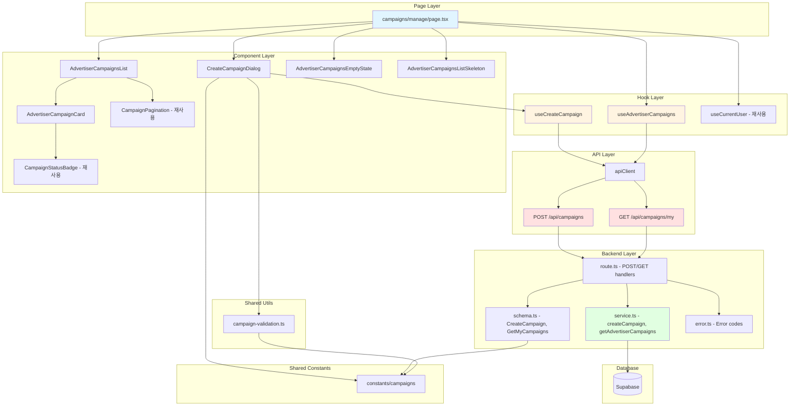

# 광고주 체험단 관리 - 구현 계획

## 개요

### 신규 모듈

#### Backend Layer
1. **campaigns/backend/schema.ts (확장)**
   - 위치: `src/features/campaigns/backend/schema.ts`
   - 설명: POST /api/campaigns 요청/응답 스키마, GET /api/campaigns/my 스키마 추가
   - 의존성: zod, @/constants/campaigns

2. **campaigns/backend/service.ts (확장)**
   - 위치: `src/features/campaigns/backend/service.ts`
   - 설명: `createCampaign`, `getAdvertiserCampaigns` 서비스 함수 추가
   - 의존성: Supabase, HandlerResult pattern

3. **campaigns/backend/route.ts (확장)**
   - 위치: `src/features/campaigns/backend/route.ts`
   - 설명: POST /api/campaigns, GET /api/campaigns/my 라우트 핸들러 추가
   - 의존성: Hono, service layer

4. **campaigns/backend/error.ts (확장)**
   - 위치: `src/features/campaigns/backend/error.ts`
   - 설명: 체험단 생성 관련 에러 코드 추가
   - 의존성: 없음

#### Frontend Data Layer
5. **campaigns/lib/dto.ts (확장)**
   - 위치: `src/features/campaigns/lib/dto.ts`
   - 설명: POST/GET 스키마 재노출
   - 의존성: backend/schema

6. **campaigns/hooks/useCreateCampaign.ts (신규)**
   - 위치: `src/features/campaigns/hooks/useCreateCampaign.ts`
   - 설명: React Query mutation hook for POST /api/campaigns
   - 의존성: @tanstack/react-query, apiClient

7. **campaigns/hooks/useAdvertiserCampaigns.ts (신규)**
   - 위치: `src/features/campaigns/hooks/useAdvertiserCampaigns.ts`
   - 설명: React Query hook for GET /api/campaigns/my
   - 의존성: @tanstack/react-query, apiClient

#### Shared Utils
8. **lib/utils/campaign-validation.ts (신규)**
   - 위치: `src/lib/utils/campaign-validation.ts`
   - 설명: 체험단 입력 검증 유틸 (날짜 범위, 필드 길이 등)
   - 의존성: date-fns

#### UI Components
9. **campaigns/components/create-campaign-dialog.tsx (신규)**
   - 위치: `src/features/campaigns/components/create-campaign-dialog.tsx`
   - 설명: 체험단 등록 Dialog + Form
   - 의존성: Dialog, Form, Input, Textarea, react-hook-form

10. **campaigns/components/advertiser-campaign-card.tsx (신규)**
    - 위치: `src/features/campaigns/components/advertiser-campaign-card.tsx`
    - 설명: 광고주용 체험단 카드 (지원 현황, 관리 버튼 포함)
    - 의존성: Card, Badge, Button

11. **campaigns/components/advertiser-campaigns-list.tsx (신규)**
    - 위치: `src/features/campaigns/components/advertiser-campaigns-list.tsx`
    - 설명: 광고주 체험단 목록 그리드
    - 의존성: AdvertiserCampaignCard

12. **campaigns/components/advertiser-campaigns-empty-state.tsx (신규)**
    - 위치: `src/features/campaigns/components/advertiser-campaigns-empty-state.tsx`
    - 설명: 빈 상태 (등록 내역 없음)
    - 의존성: Button

13. **campaigns/components/advertiser-campaigns-list-skeleton.tsx (신규)**
    - 위치: `src/features/campaigns/components/advertiser-campaigns-list-skeleton.tsx`
    - 설명: 로딩 스켈레톤
    - 의존성: Skeleton, Card

#### Page
14. **/campaigns/manage/page.tsx (신규)**
    - 위치: `src/app/campaigns/manage/page.tsx`
    - 설명: 광고주 체험단 관리 페이지 (인증 가드, 권한 가드)
    - 의존성: useCurrentUser, useAdvertiserCampaigns, components

### 재사용 모듈
- `@/constants/campaigns`: PAGINATION_DEFAULTS, CAMPAIGN_STATUS 사용
- `@/features/campaigns/components/campaign-pagination`: 페이지네이션 컴포넌트 재사용
- `@/features/campaigns/components/campaign-status-badge`: 상태 뱃지 재사용
- `@/lib/remote/api-client`: HTTP 클라이언트
- `@/features/auth/hooks/useCurrentUser`: 인증 상태 확인
- `@/components/ui/dialog`: shadcn Dialog 컴포넌트

---

## Diagram



---

## Implementation Plan

### Phase 1: Backend - Error Codes 확장

**파일**: `src/features/campaigns/backend/error.ts`

**추가 내용**:
```typescript
export const campaignErrorCodes = {
  // ... 기존 코드
  createError: 'CAMPAIGN_CREATE_ERROR',
  invalidInput: 'INVALID_INPUT',
  unauthorized: 'UNAUTHORIZED',
  forbidden: 'FORBIDDEN',
  advertiserNotFound: 'ADVERTISER_NOT_FOUND',
} as const;
```

**Unit Tests**:
```typescript
describe('campaignErrorCodes', () => {
  it('should have createError code', () => {
    expect(campaignErrorCodes.createError).toBe('CAMPAIGN_CREATE_ERROR');
  });

  it('should have all required error codes', () => {
    expect(campaignErrorCodes).toHaveProperty('invalidInput');
    expect(campaignErrorCodes).toHaveProperty('unauthorized');
    expect(campaignErrorCodes).toHaveProperty('forbidden');
  });
});
```

---

### Phase 2: Backend - Schema 확장

**파일**: `src/features/campaigns/backend/schema.ts`

**추가 내용**:
```typescript
// POST /api/campaigns - Request schema
export const CreateCampaignSchema = z.object({
  title: z.string().min(5, '제목은 5자 이상이어야 합니다.').max(100, '제목은 100자 이하여야 합니다.'),
  description: z.string().max(2000, '설명은 2000자 이하여야 합니다.').optional(),
  benefits: z.string().min(10, '혜택은 10자 이상이어야 합니다.').max(500, '혜택은 500자 이하여야 합니다.'),
  mission: z.string().min(10, '미션은 10자 이상이어야 합니다.').max(1000, '미션은 1000자 이하여야 합니다.'),
  store_info: z.string().min(5, '매장 정보는 5자 이상이어야 합니다.').max(500, '매장 정보는 500자 이하여야 합니다.'),
  recruitment_count: z.number().int().min(1, '모집 인원은 1명 이상이어야 합니다.').max(1000, '모집 인원은 1000명 이하여야 합니다.'),
  recruitment_start_date: z.string().refine(
    (date) => {
      const startDate = new Date(date);
      const today = new Date();
      today.setHours(0, 0, 0, 0);
      return startDate >= today;
    },
    { message: '시작일은 오늘 이후여야 합니다.' }
  ),
  recruitment_end_date: z.string(),
}).refine(
  (data) => {
    const start = new Date(data.recruitment_start_date);
    const end = new Date(data.recruitment_end_date);
    return end > start;
  },
  { message: '종료일은 시작일 이후여야 합니다.', path: ['recruitment_end_date'] }
).refine(
  (data) => {
    const start = new Date(data.recruitment_start_date);
    const end = new Date(data.recruitment_end_date);
    const diffDays = Math.ceil((end.getTime() - start.getTime()) / (1000 * 60 * 60 * 24));
    return diffDays <= 90;
  },
  { message: '모집 기간은 최대 90일입니다.', path: ['recruitment_end_date'] }
);

export type CreateCampaignRequest = z.infer<typeof CreateCampaignSchema>;

// POST /api/campaigns - Response schema
export const CreateCampaignResponseSchema = z.object({
  id: z.string().uuid(),
  title: z.string(),
  status: z.string(),
  created_at: z.string(),
});

export type CreateCampaignResponse = z.infer<typeof CreateCampaignResponseSchema>;

// GET /api/campaigns/my - Query schema
export const GetAdvertiserCampaignsQuerySchema = z.object({
  status: z.enum(['recruiting', 'closed', 'completed'] as const).optional(),
  page: z.coerce.number().int().positive().optional().default(1),
  limit: z.coerce.number().int().positive().max(100).optional().default(20),
});

export type GetAdvertiserCampaignsQuery = z.infer<typeof GetAdvertiserCampaignsQuerySchema>;

// Campaign with applications count
export const AdvertiserCampaignSchema = z.object({
  id: z.string().uuid(),
  title: z.string(),
  description: z.string().nullable(),
  benefits: z.string(),
  mission: z.string(),
  store_info: z.string(),
  recruitment_count: z.number(),
  recruitment_start_date: z.string(),
  recruitment_end_date: z.string(),
  status: z.string(),
  created_at: z.string(),
  applications_count: z.number(),
});

export type AdvertiserCampaign = z.infer<typeof AdvertiserCampaignSchema>;

// GET /api/campaigns/my - Response schema
export const GetAdvertiserCampaignsResponseSchema = z.object({
  data: z.array(AdvertiserCampaignSchema),
  pagination: PaginationMetaSchema,
});

export type GetAdvertiserCampaignsResponse = z.infer<typeof GetAdvertiserCampaignsResponseSchema>;
```

**Unit Tests**:
```typescript
describe('CreateCampaignSchema', () => {
  it('should validate correct campaign data', () => {
    const data = {
      title: 'Test Campaign',
      description: 'Test description',
      benefits: 'Free product',
      mission: 'Write a review',
      store_info: 'Test store',
      recruitment_count: 10,
      recruitment_start_date: '2025-01-01',
      recruitment_end_date: '2025-01-31',
    };
    const result = CreateCampaignSchema.safeParse(data);
    expect(result.success).toBe(true);
  });

  it('should reject title shorter than 5 characters', () => {
    const data = {
      title: 'Test',
      benefits: 'Free product',
      mission: 'Write a review',
      store_info: 'Test store',
      recruitment_count: 10,
      recruitment_start_date: '2025-01-01',
      recruitment_end_date: '2025-01-31',
    };
    const result = CreateCampaignSchema.safeParse(data);
    expect(result.success).toBe(false);
  });

  it('should reject end date before start date', () => {
    const data = {
      title: 'Test Campaign',
      benefits: 'Free product',
      mission: 'Write a review',
      store_info: 'Test store',
      recruitment_count: 10,
      recruitment_start_date: '2025-01-31',
      recruitment_end_date: '2025-01-01',
    };
    const result = CreateCampaignSchema.safeParse(data);
    expect(result.success).toBe(false);
  });

  it('should reject recruitment period longer than 90 days', () => {
    const data = {
      title: 'Test Campaign',
      benefits: 'Free product',
      mission: 'Write a review',
      store_info: 'Test store',
      recruitment_count: 10,
      recruitment_start_date: '2025-01-01',
      recruitment_end_date: '2025-05-01', // > 90 days
    };
    const result = CreateCampaignSchema.safeParse(data);
    expect(result.success).toBe(false);
  });
});

describe('GetAdvertiserCampaignsQuerySchema', () => {
  it('should apply defaults', () => {
    const result = GetAdvertiserCampaignsQuerySchema.safeParse({});
    expect(result.success).toBe(true);
    expect(result.data?.page).toBe(1);
    expect(result.data?.limit).toBe(20);
  });

  it('should validate status enum', () => {
    const result = GetAdvertiserCampaignsQuerySchema.safeParse({ status: 'invalid' });
    expect(result.success).toBe(false);
  });
});
```

---

### Phase 3: Shared Utils - Campaign Validation

**파일**: `src/lib/utils/campaign-validation.ts`

**내용**:
```typescript
import { differenceInDays, isAfter, isBefore, parseISO, startOfDay } from 'date-fns';

/**
 * 모집 기간이 유효한지 확인
 */
export const isValidRecruitmentPeriod = (
  startDate: string,
  endDate: string,
): { valid: boolean; error?: string } => {
  const start = parseISO(startDate);
  const end = parseISO(endDate);
  const today = startOfDay(new Date());

  // 시작일이 과거인지 확인
  if (isBefore(start, today)) {
    return { valid: false, error: '시작일은 오늘 이후여야 합니다.' };
  }

  // 종료일이 시작일보다 이른지 확인
  if (!isAfter(end, start)) {
    return { valid: false, error: '종료일은 시작일 이후여야 합니다.' };
  }

  // 기간이 90일을 초과하는지 확인
  const days = differenceInDays(end, start);
  if (days > 90) {
    return { valid: false, error: '모집 기간은 최대 90일입니다.' };
  }

  // 최소 1일 이상인지 확인
  if (days < 1) {
    return { valid: false, error: '모집 기간은 최소 1일 이상이어야 합니다.' };
  }

  return { valid: true };
};

/**
 * 모집 인원이 유효한지 확인
 */
export const isValidRecruitmentCount = (count: number): { valid: boolean; error?: string } => {
  if (count < 1) {
    return { valid: false, error: '모집 인원은 1명 이상이어야 합니다.' };
  }

  if (count > 1000) {
    return { valid: false, error: '모집 인원은 1000명 이하여야 합니다.' };
  }

  return { valid: true };
};
```

---

### Phase 4: Backend - Service Layer

**파일**: `src/features/campaigns/backend/service.ts`

**추가 내용**:
```typescript
import type { CreateCampaignRequest, CreateCampaignResponse, GetAdvertiserCampaignsQuery, GetAdvertiserCampaignsResponse } from './schema';

/**
 * 체험단 생성
 */
export const createCampaign = async (
  client: SupabaseClient,
  advertiserId: string,
  data: CreateCampaignRequest,
): Promise<HandlerResult<CreateCampaignResponse, CampaignServiceError, unknown>> => {
  try {
    const { data: campaign, error } = await client
      .from('campaigns')
      .insert({
        advertiser_id: advertiserId,
        title: data.title,
        description: data.description || null,
        benefits: data.benefits,
        mission: data.mission,
        store_info: data.store_info,
        recruitment_count: data.recruitment_count,
        recruitment_start_date: data.recruitment_start_date,
        recruitment_end_date: data.recruitment_end_date,
        status: 'recruiting',
      })
      .select('id, title, status, created_at')
      .single();

    if (error || !campaign) {
      return failure(
        500,
        campaignErrorCodes.createError,
        '체험단 생성 중 오류가 발생했습니다.',
        error,
      );
    }

    return success(campaign, 201);
  } catch (error) {
    return failure(
      500,
      campaignErrorCodes.databaseError,
      '체험단 생성 중 예상치 못한 오류가 발생했습니다.',
      error,
    );
  }
};

/**
 * 광고주의 체험단 목록 조회
 */
export const getAdvertiserCampaigns = async (
  client: SupabaseClient,
  advertiserId: string,
  query: GetAdvertiserCampaignsQuery,
): Promise<HandlerResult<GetAdvertiserCampaignsResponse, CampaignServiceError, unknown>> => {
  try {
    const { status, page, limit } = query;
    const offset = (page - 1) * limit;

    let dbQuery = client
      .from('campaigns')
      .select('*, applications(count)', { count: 'exact' })
      .eq('advertiser_id', advertiserId)
      .order('created_at', { ascending: false });

    if (status) {
      dbQuery = dbQuery.eq('status', status);
    }

    const { data, error, count } = await dbQuery.range(offset, offset + limit - 1);

    if (error) {
      return failure(
        500,
        campaignErrorCodes.databaseError,
        '체험단 목록 조회 중 오류가 발생했습니다.',
        error,
      );
    }

    const campaigns = (data || []).map((c) => ({
      ...c,
      applications_count: Array.isArray(c.applications) ? c.applications.length : 0,
    }));

    return success(
      {
        data: campaigns,
        pagination: {
          page,
          limit,
          total: count || 0,
          total_pages: Math.ceil((count || 0) / limit),
        },
      },
      200,
    );
  } catch (error) {
    return failure(
      500,
      campaignErrorCodes.databaseError,
      '체험단 목록 조회 중 예상치 못한 오류가 발생했습니다.',
      error,
    );
  }
};
```

**Unit Tests**:
```typescript
describe('createCampaign', () => {
  it('should create campaign successfully', async () => {
    const mockClient = createMockSupabaseClient();
    const data = {
      title: 'Test Campaign',
      benefits: 'Free product',
      mission: 'Write review',
      store_info: 'Test store',
      recruitment_count: 10,
      recruitment_start_date: '2025-01-01',
      recruitment_end_date: '2025-01-31',
    };

    const result = await createCampaign(mockClient, 'advertiser-id', data);

    expect(result.ok).toBe(true);
    expect(result.data).toHaveProperty('id');
    expect(result.data?.status).toBe('recruiting');
  });

  it('should handle database errors', async () => {
    const mockClient = createMockSupabaseClient({ shouldFail: true });
    const data = { /* ... */ };

    const result = await createCampaign(mockClient, 'advertiser-id', data);

    expect(result.ok).toBe(false);
    expect(result.error?.code).toBe(campaignErrorCodes.createError);
  });
});

describe('getAdvertiserCampaigns', () => {
  it('should fetch all campaigns for advertiser', async () => {
    const mockClient = createMockSupabaseClient({
      campaigns: [
        { id: '1', advertiser_id: 'adv1', title: 'Campaign 1', status: 'recruiting' },
        { id: '2', advertiser_id: 'adv1', title: 'Campaign 2', status: 'closed' },
      ],
    });

    const result = await getAdvertiserCampaigns(mockClient, 'adv1', { page: 1, limit: 20 });

    expect(result.ok).toBe(true);
    expect(result.data?.data).toHaveLength(2);
  });

  it('should filter by status', async () => {
    const mockClient = createMockSupabaseClient();

    const result = await getAdvertiserCampaigns(mockClient, 'adv1', {
      status: 'recruiting',
      page: 1,
      limit: 20,
    });

    expect(result.ok).toBe(true);
  });
});
```

---

### Phase 5: Backend - Route Handlers

**파일**: `src/features/campaigns/backend/route.ts`

**추가 내용**:
```typescript
/**
 * POST /api/campaigns
 * 체험단 생성
 */
app.post('/campaigns', async (c) => {
  try {
    const supabase = c.get('supabase');

    // 1. 인증 확인
    const { data: { user }, error: authError } = await supabase.auth.getUser();
    if (authError || !user) {
      return respond(c, failure(401, campaignErrorCodes.unauthorized, '로그인이 필요합니다.'));
    }

    // 2. 광고주 역할 확인
    const { data: userMetadata } = await supabase
      .from('users')
      .select('role')
      .eq('id', user.id)
      .single();

    if (!userMetadata || userMetadata.role !== 'advertiser') {
      return respond(c, failure(403, campaignErrorCodes.forbidden, '광고주만 접근 가능합니다.'));
    }

    // 3. 광고주 프로필 확인
    const { data: advertiser } = await supabase
      .from('advertiser_profiles')
      .select('id')
      .eq('user_id', user.id)
      .single();

    if (!advertiser) {
      return respond(
        c,
        failure(403, campaignErrorCodes.advertiserNotFound, '광고주 프로필을 먼저 등록해주세요.'),
      );
    }

    // 4. 요청 바디 검증
    const body = await c.req.json();
    const parsedBody = CreateCampaignSchema.safeParse(body);

    if (!parsedBody.success) {
      return respond(
        c,
        failure(400, campaignErrorCodes.invalidInput, '잘못된 입력값입니다.', parsedBody.error.format()),
      );
    }

    // 5. 체험단 생성
    const result = await createCampaign(supabase, advertiser.id, parsedBody.data);

    return respond(c, result);
  } catch (error) {
    return respond(
      c,
      failure(500, campaignErrorCodes.databaseError, '예상치 못한 오류가 발생했습니다.', error),
    );
  }
});

/**
 * GET /api/campaigns/my
 * 내 체험단 목록 조회
 */
app.get('/campaigns/my', async (c) => {
  try {
    const supabase = c.get('supabase');

    // 1. 인증 확인
    const { data: { user }, error: authError } = await supabase.auth.getUser();
    if (authError || !user) {
      return respond(c, failure(401, campaignErrorCodes.unauthorized, '로그인이 필요합니다.'));
    }

    // 2. 광고주 역할 확인
    const { data: userMetadata } = await supabase
      .from('users')
      .select('role')
      .eq('id', user.id)
      .single();

    if (!userMetadata || userMetadata.role !== 'advertiser') {
      return respond(c, failure(403, campaignErrorCodes.forbidden, '광고주만 접근 가능합니다.'));
    }

    // 3. 광고주 프로필 확인
    const { data: advertiser } = await supabase
      .from('advertiser_profiles')
      .select('id')
      .eq('user_id', user.id)
      .single();

    if (!advertiser) {
      return respond(
        c,
        failure(403, campaignErrorCodes.advertiserNotFound, '광고주 프로필을 먼저 등록해주세요.'),
      );
    }

    // 4. 쿼리 파라미터 검증
    const queryParams = c.req.query();
    const parsedQuery = GetAdvertiserCampaignsQuerySchema.safeParse(queryParams);

    if (!parsedQuery.success) {
      return respond(
        c,
        failure(400, campaignErrorCodes.invalidInput, '잘못된 쿼리 파라미터입니다.', parsedQuery.error.format()),
      );
    }

    // 5. 체험단 목록 조회
    const result = await getAdvertiserCampaigns(supabase, advertiser.id, parsedQuery.data);

    return respond(c, result);
  } catch (error) {
    return respond(
      c,
      failure(500, campaignErrorCodes.databaseError, '예상치 못한 오류가 발생했습니다.', error),
    );
  }
});
```

---

### Phase 6: Frontend Data Layer

**파일**: `src/features/campaigns/lib/dto.ts` (확장)
```typescript
export {
  // ... 기존 export
  CreateCampaignSchema,
  CreateCampaignResponseSchema,
  GetAdvertiserCampaignsQuerySchema,
  AdvertiserCampaignSchema,
  GetAdvertiserCampaignsResponseSchema,
  type CreateCampaignRequest,
  type CreateCampaignResponse,
  type GetAdvertiserCampaignsQuery,
  type AdvertiserCampaign,
  type GetAdvertiserCampaignsResponse,
} from '../backend/schema';
```

**파일**: `src/features/campaigns/hooks/useCreateCampaign.ts` (신규)
```typescript
'use client';

import { useMutation, useQueryClient } from '@tanstack/react-query';
import { apiClient } from '@/lib/remote/api-client';
import type { CreateCampaignRequest, CreateCampaignResponse } from '../lib/dto';

const createCampaign = async (data: CreateCampaignRequest): Promise<CreateCampaignResponse> => {
  const response = await apiClient.post<{ ok: boolean; data?: CreateCampaignResponse }>('/campaigns', data);

  if (!response.data.ok || !response.data.data) {
    throw new Error('체험단 생성에 실패했습니다.');
  }

  return response.data.data;
};

export const useCreateCampaign = () => {
  const queryClient = useQueryClient();

  return useMutation({
    mutationFn: createCampaign,
    onSuccess: () => {
      queryClient.invalidateQueries({ queryKey: ['advertiser-campaigns'] });
    },
    retry: false,
  });
};
```

**파일**: `src/features/campaigns/hooks/useAdvertiserCampaigns.ts` (신규)
```typescript
'use client';

import { useQuery } from '@tanstack/react-query';
import { apiClient } from '@/lib/remote/api-client';
import type { GetAdvertiserCampaignsQuery, GetAdvertiserCampaignsResponse } from '../lib/dto';

const fetchAdvertiserCampaigns = async (query: GetAdvertiserCampaignsQuery): Promise<GetAdvertiserCampaignsResponse> => {
  const response = await apiClient.get<{ ok: boolean; data?: GetAdvertiserCampaignsResponse }>('/campaigns/my', {
    params: query,
  });

  if (!response.data.ok || !response.data.data) {
    throw new Error('체험단 목록 조회에 실패했습니다.');
  }

  return response.data.data;
};

export const useAdvertiserCampaigns = (query: GetAdvertiserCampaignsQuery) => {
  return useQuery({
    queryKey: ['advertiser-campaigns', query],
    queryFn: () => fetchAdvertiserCampaigns(query),
    staleTime: 1 * 60 * 1000,
    gcTime: 5 * 60 * 1000,
  });
};
```

---

### Phase 7: UI Components

#### 7-1. CreateCampaignDialog

**파일**: `src/features/campaigns/components/create-campaign-dialog.tsx`

**QA Sheet**:
- [ ] Dialog 열기/닫기 작동
- [ ] 모든 필드 렌더링 (제목, 설명, 혜택, 미션, 매장정보, 모집인원, 시작일, 종료일)
- [ ] 필수 필드 검증 (제목, 혜택, 미션, 매장정보, 모집인원, 날짜)
- [ ] 제목 5~100자 검증
- [ ] 모집 인원 1~1000 검증
- [ ] 시작일 오늘 이후 검증
- [ ] 종료일 시작일 이후 검증
- [ ] 모집 기간 90일 이내 검증
- [ ] 인라인 에러 메시지 표시
- [ ] 제출 중 버튼 비활성화
- [ ] 제출 성공 시 Dialog 닫기
- [ ] 제출 실패 시 에러 메시지
- [ ] 취소 버튼 작동

#### 7-2. AdvertiserCampaignCard

**파일**: `src/features/campaigns/components/advertiser-campaign-card.tsx`

**QA Sheet**:
- [ ] 제목 표시
- [ ] 상태 뱃지 표시 (모집중/모집종료/완료)
- [ ] 모집 기간 표시 (YYYY.MM.DD 형식)
- [ ] 모집 인원 / 지원 현황 표시 (예: 10명 모집 / 5명 지원)
- [ ] 등록일시 표시
- [ ] "상세보기" 버튼
- [ ] 클릭 시 상세 페이지로 이동
- [ ] Hover 효과
- [ ] 반응형 레이아웃

#### 7-3. AdvertiserCampaignsList

**파일**: `src/features/campaigns/components/advertiser-campaigns-list.tsx`

**QA Sheet**:
- [ ] 카드 그리드 렌더링 (3열)
- [ ] 각 카드에 고유 key
- [ ] 반응형: 모바일(1열), 태블릿(2열), 데스크톱(3열)

#### 7-4. AdvertiserCampaignsEmptyState

**파일**: `src/features/campaigns/components/advertiser-campaigns-empty-state.tsx`

**QA Sheet**:
- [ ] 아이콘 표시
- [ ] "아직 등록한 체험단이 없습니다" 메시지
- [ ] "첫 체험단 등록하기" 버튼
- [ ] 버튼 클릭 시 Dialog 열기
- [ ] 중앙 정렬

#### 7-5. AdvertiserCampaignsListSkeleton

**파일**: `src/features/campaigns/components/advertiser-campaigns-list-skeleton.tsx`

**QA Sheet**:
- [ ] 6개 카드 스켈레톤
- [ ] 카드 레이아웃 일치
- [ ] 그리드 레이아웃 일치

---

### Phase 8: Page Integration

**파일**: `src/app/campaigns/manage/page.tsx`

**QA Sheet**:
- [ ] 페이지 제목: "체험단 관리"
- [ ] 비로그인 시 로그인 페이지 리다이렉트
- [ ] 인플루언서 접근 시 홈 리다이렉트
- [ ] 프로필 미등록 시 프로필 등록 페이지 리다이렉트
- [ ] "신규 체험단 등록" 버튼 표시
- [ ] 버튼 클릭 시 Dialog 열기
- [ ] 등록 내역 없을 시 빈 상태 표시
- [ ] 등록 내역 있을 시 카드 그리드 표시
- [ ] 페이지네이션 표시 (21개 이상)
- [ ] 로딩 중 스켈레톤
- [ ] 에러 시 에러 메시지 + 재시도
- [ ] 체험단 등록 성공 시 목록 갱신

---

## Implementation Order

1. **Phase 1**: Backend Error Codes 확장
2. **Phase 2**: Backend Schema 확장
3. **Phase 3**: Shared Utils - Campaign Validation
4. **Phase 4**: Backend Service Layer
5. **Phase 5**: Backend Route Handlers
6. **Phase 6**: Frontend Data Layer (DTO + Hooks)
7. **Phase 7**: UI Components (Dialog → Card → List → EmptyState → Skeleton)
8. **Phase 8**: Page Integration
9. **Verification**: Type check, Build, Manual QA

---

## Testing Strategy

### Backend
- Unit tests for schema validation
- Unit tests for service layer
- Integration tests for POST/GET routes

### Frontend
- Component QA sheets
- Page-level QA sheet
- Manual testing for auth/role guards
- Form validation testing

---

## Notes

- **재사용**: CampaignPagination, CampaignStatusBadge 재사용
- **공통 상수**: PAGINATION_DEFAULTS 재사용
- **일관성**: 기존 campaigns feature 패턴 유지
- **성능**: React Query 캐싱, 페이지네이션
- **접근성**: 키보드 네비게이션, aria-label, semantic HTML
- **Form**: react-hook-form + zod resolver 사용
- **Dialog**: shadcn Dialog 컴포넌트 사용
