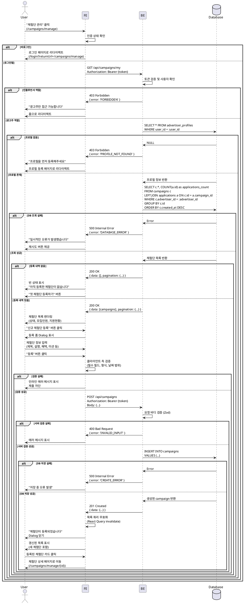

# 광고주 체험단 관리 - 상세 유스케이스

## Use Case: 광고주 체험단 등록 및 관리

### Primary Actor
광고주 (로그인 + 프로필 등록 완료)

### Precondition
- 광고주로 로그인되어 있음
- 광고주 프로필이 등록되어 있음
- 사업자 정보가 검증되어 있음

### Trigger
광고주가 "체험단 관리" 메뉴를 클릭하여 `/campaigns/manage` 페이지로 진입

### Main Scenario

1. 광고주가 "체험단 관리" 메뉴 클릭
2. 시스템이 체험단 관리 페이지로 이동
3. 시스템이 사용자 인증 및 권한 확인 (광고주만 접근 가능)
4. 시스템이 현재 광고주가 등록한 체험단 목록 조회
   - 체험단 정보 (제목, 모집 기간, 모집 인원, 지원 현황)
   - 체험단 상태 (모집중/모집종료/완료)
5. 시스템이 체험단 목록을 최신순으로 렌더링
6. 광고주가 "신규 체험단 등록" 버튼 클릭
7. 시스템이 등록 폼 Dialog 표시
8. 광고주가 체험단 정보 입력
   - 제목, 설명, 혜택, 미션, 매장 정보
   - 모집 인원, 모집 기간 (시작일, 종료일)
9. 광고주가 "등록" 버튼 클릭
10. 시스템이 입력값 검증 및 DB 저장
11. 시스템이 체험단 목록 갱신 (상태: 모집중)
12. 광고주가 등록된 체험단 확인

### Edge Cases

**E1. 체험단 등록 내역 없음**
- 4단계에서 등록 내역이 없을 경우
- 빈 상태 메시지 표시: "아직 등록한 체험단이 없습니다"
- "첫 체험단 등록하기" 버튼 제공

**E2. 비로그인 접근**
- 3단계에서 비로그인 사용자 감지
- 로그인 페이지로 리다이렉트 (returnUrl 포함)

**E3. 인플루언서 접근**
- 3단계에서 인플루언서 역할 감지
- "광고주만 접근 가능합니다" 에러 메시지
- 홈 페이지로 리다이렉트

**E4. 프로필 미등록**
- 3단계에서 광고주 프로필 없음 감지
- "프로필을 먼저 등록해주세요" 메시지
- 프로필 등록 페이지로 리다이렉트

**E5. 필드 검증 실패**
- 10단계에서 필수 필드 누락, 날짜 형식 오류, 모집 인원 범위 초과 등
- 해당 필드에 인라인 에러 메시지 표시
- 폼 제출 차단

**E6. 모집 기간 검증 실패**
- 시작일이 종료일보다 늦음
- 시작일이 과거 날짜
- "유효한 모집 기간을 입력해주세요" 에러 메시지

**E7. 네트워크 에러**
- 10단계에서 DB 저장 실패
- "일시적인 오류가 발생했습니다" 에러 메시지
- 재시도 버튼 제공 또는 자동 재시도

**E8. 중복 제출 방지**
- 10단계에서 제출 중 추가 클릭
- 버튼 비활성화 및 로딩 표시
- 중복 등록 차단

### Business Rules

**BR-001: 접근 권한**
- 광고주만 접근 가능
- 본인이 등록한 체험단만 관리 가능
- 인플루언서는 접근 불가

**BR-002: 체험단 등록 제한**
- 제목: 5~100자
- 설명: 최대 2000자
- 혜택: 필수, 최대 500자
- 미션: 필수, 최대 1000자
- 매장 정보: 필수, 최대 500자
- 모집 인원: 1~1000명
- 모집 기간: 최소 1일, 최대 90일

**BR-003: 모집 기간 규칙**
- 시작일은 오늘 이후 (또는 오늘 포함)
- 종료일은 시작일 이후
- 종료일 자정까지 모집
- 등록 후 시작일 변경 불가

**BR-004: 초기 상태**
- 신규 등록 시 자동으로 "모집중(recruiting)" 상태
- 지원 현황 0명으로 초기화
- 등록일시 자동 기록

**BR-005: 정렬 순서**
- 기본 정렬: 등록일시 최신순 (created_at DESC)
- 상태별 필터 가능 (모집중/모집종료/완료)
- 페이지네이션: 20개씩 표시

**BR-006: 수정 및 삭제**
- 모집중인 체험단만 수정 가능
- 지원자가 있는 경우 삭제 불가
- 모집 종료 후 수정 불가

---

## Sequence Diagram



---

## API Specification

### GET /api/campaigns/my

**Request Headers**
```
Authorization: Bearer {access_token}
```

**Query Parameters**
```
status?: 'recruiting' | 'closed' | 'completed'
page?: number (default: 1)
limit?: number (default: 20)
```

**Response (Success - 200)**
```json
{
  "ok": true,
  "data": [
    {
      "id": "uuid",
      "title": "체험단 제목",
      "description": "상세 설명",
      "benefits": "제공 혜택",
      "mission": "미션 내용",
      "store_info": "매장 정보",
      "recruitment_count": 10,
      "recruitment_start_date": "2024-01-01",
      "recruitment_end_date": "2024-01-31",
      "status": "recruiting",
      "created_at": "2024-01-01T00:00:00Z",
      "applications_count": 5
    }
  ],
  "pagination": {
    "page": 1,
    "limit": 20,
    "total": 5,
    "totalPages": 1
  }
}
```

**Response (Error - 403)**
```json
{
  "ok": false,
  "error": {
    "code": "FORBIDDEN",
    "message": "광고주만 접근 가능합니다."
  }
}
```

---

### POST /api/campaigns

**Request Headers**
```
Authorization: Bearer {access_token}
Content-Type: application/json
```

**Request Body**
```json
{
  "title": "체험단 제목",
  "description": "상세 설명",
  "benefits": "제공 혜택",
  "mission": "미션 내용",
  "store_info": "매장 정보",
  "recruitment_count": 10,
  "recruitment_start_date": "2024-01-01",
  "recruitment_end_date": "2024-01-31"
}
```

**Response (Success - 201)**
```json
{
  "ok": true,
  "data": {
    "id": "uuid",
    "title": "체험단 제목",
    "status": "recruiting",
    "created_at": "2024-01-01T00:00:00Z"
  }
}
```

**Response (Error - 400)**
```json
{
  "ok": false,
  "error": {
    "code": "INVALID_INPUT",
    "message": "잘못된 입력값입니다.",
    "details": {
      "title": "제목은 5자 이상이어야 합니다."
    }
  }
}
```

**Error Codes**
- `UNAUTHORIZED`: 로그인 필요
- `FORBIDDEN`: 권한 없음 (인플루언서, 프로필 미등록)
- `INVALID_INPUT`: 입력값 검증 실패
- `CREATE_ERROR`: 체험단 생성 실패
- `DATABASE_ERROR`: 데이터베이스 오류

---

## UI/UX Notes

### 페이지 레이아웃
- 상단: 페이지 제목 + "신규 체험단 등록" 버튼
- 중간: 체험단 목록 카드 또는 테이블
- 하단: 페이지네이션

### 체험단 카드/테이블
- 제목
- 상태 뱃지 (모집중: 파란색, 모집종료: 회색, 완료: 초록색)
- 모집 기간 (YYYY.MM.DD ~ YYYY.MM.DD)
- 모집 인원 / 지원 현황 (10명 모집 / 5명 지원)
- 등록일시
- 액션 버튼 (상세보기, 수정, 삭제)

### 등록 폼 Dialog
- 제목: "신규 체험단 등록"
- 필드:
  - 제목 (텍스트, 필수)
  - 설명 (Textarea, 선택)
  - 혜택 (Textarea, 필수)
  - 미션 (Textarea, 필수)
  - 매장 정보 (Textarea, 필수)
  - 모집 인원 (숫자, 필수, 1~1000)
  - 모집 시작일 (날짜, 필수, 오늘 이후)
  - 모집 종료일 (날짜, 필수, 시작일 이후)
- 버튼: 취소, 등록

### 빈 상태
- 아이콘 + "아직 등록한 체험단이 없습니다"
- "첫 체험단 등록하기" 버튼 (Primary)

### 상태 뱃지 색상
- 모집중 (recruiting): 파란색 (default)
- 모집종료 (closed): 회색 (secondary)
- 완료 (completed): 초록색 (success/outline)

### 반응형
- 모바일: 카드 리스트 (1열)
- 태블릿: 카드 그리드 (2열) 또는 테이블
- 데스크톱: 카드 그리드 (3열) 또는 테이블

### 폼 검증 피드백
- 실시간 검증 (입력 중)
- 인라인 에러 메시지 (필드 아래)
- 제출 버튼 활성화/비활성화
- 제출 중 로딩 표시

---

## Performance Considerations

- 체험단 목록 캐싱: React Query (1분)
- 이미지 최적화: Next.js Image (썸네일)
- 폼 검증: 클라이언트 + 서버 이중 검증
- Dialog lazy loading (필요 시에만 로드)

---

## Security Considerations

- 인증 토큰 검증 (서버 사이드)
- 본인 체험단만 관리 가능
- SQL Injection 방지 (ORM 사용)
- XSS 방지 (입력값 sanitize)
- Rate limiting (연속 등록 방지)
- CSRF 토큰 검증

---

## Validation Rules

### 제목 (title)
- 필수
- 최소 5자, 최대 100자
- HTML 태그 제거

### 설명 (description)
- 선택
- 최대 2000자
- 마크다운 지원 고려

### 혜택 (benefits)
- 필수
- 최소 10자, 최대 500자

### 미션 (mission)
- 필수
- 최소 10자, 최대 1000자

### 매장 정보 (store_info)
- 필수
- 최소 5자, 최대 500자

### 모집 인원 (recruitment_count)
- 필수
- 정수, 1 이상 1000 이하

### 모집 기간
- 시작일: 오늘 이후 (또는 오늘 포함)
- 종료일: 시작일 이후, 최대 90일 이내
- ISO 8601 형식 (YYYY-MM-DD)
