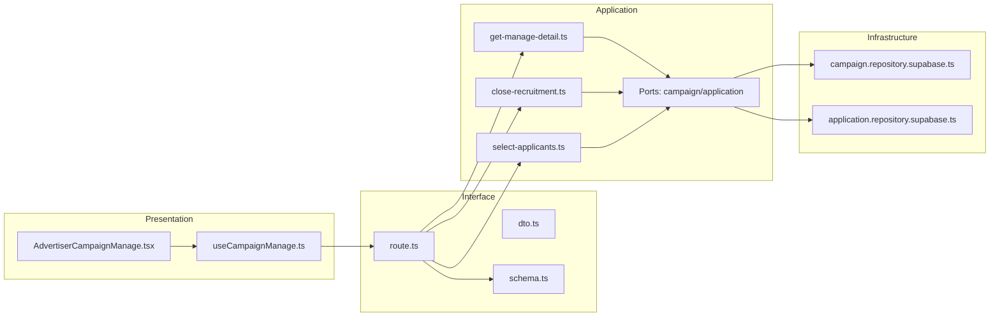
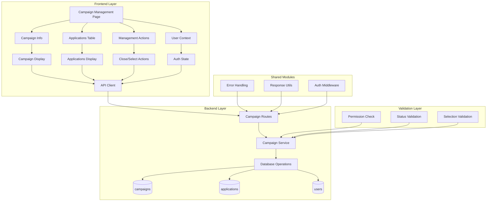

## 최종 단순화 본(Over-Engineering 제거)

- campaign-manage — `src/features/campaigns/presentation/components/AdvertiserCampaignManage.tsx`
  - 상세/지원자 목록/모집종료/선정 액션을 한 화면에서 처리.
- useCampaignManage — `src/features/campaigns/presentation/hooks/useCampaignManage.ts`
  - query: GET /campaigns/{id}/manage, mutation: PATCH /campaigns/{id}
- campaigns.api — `src/features/campaigns/interface/http/campaigns.api.ts`
  - axios 래퍼.
- campaigns.route(manage) — `src/features/campaigns/interface/backend/route.ts`
  - Hono: GET manage, PATCH status|selection
- manage-campaign.service — `src/features/campaigns/application/manage-campaign.ts`
  - 단일 서비스: 상세+지원자 조회, 상태 전환, 선정 처리(분기별 함수 내부화)
- repositories — `src/features/campaigns/infrastructure/repositories/{campaign.repo.supabase.ts, application.repo.supabase.ts}`
  - 필요한 최소 쿼리: detail/applicants/select/updateStatus

```mermaid
flowchart LR
  UI[AdvertiserCampaignManage]-->Hook[useCampaignManage]-->Api[campaigns.api]
  Api-->Route[campaigns.route(manage)]-->Svc[manage-campaign.service]-->Repos[repositories]
```

QA / 테스트
- QA: 상세 로딩/에러, 모집종료/선정 성공, 비소유/이미종료/이미선정 시 메시지.
- 테스트: service에서 close/ select 분기와 금지 조건(403/409) 검증.
## 개요(Modules Overview)

- advertiser-campaign-manage-ui — `src/features/campaigns/presentation/components/AdvertiserCampaignManage.tsx`
  - 상세/지원자 목록 표시, 상태 전환(모집종료/선정) UI.
- useCampaignManage — `src/features/campaigns/presentation/hooks/useCampaignManage.ts`
  - 상세/지원자 목록 조회, 상태 전환/선정 mutation.
- campaigns-dto — `src/features/campaigns/interface/http/dto.ts`
  - ManageCampaignResponse(detail+applicants), PatchCampaignStatusRequest/Response, SelectApplicantsRequest/Response.
- campaigns-schema — `src/features/campaigns/interface/backend/schema.ts`
  - zod: params(id), 패치 payload(status/selection), 응답 스키마.
- campaigns-route — `src/features/campaigns/interface/backend/route.ts`
  - GET /campaigns/{id}/manage, PATCH /campaigns/{id} (status|selection)
- manage-campaign-usecases — `src/features/campaigns/application/use-cases/{close-recruitment.ts,select-applicants.ts,get-manage-detail.ts}`
  - 상세+지원자 조회, 모집종료 전환, 선정 처리(usecase 분리).
- ports — `src/features/campaigns/application/ports/{campaign-repository.port.ts, application-repository.port.ts}`
  - 캠페인/지원서 조회/갱신 포트.
- infra — `src/features/campaigns/infrastructure/repositories/{campaign.repository.supabase.ts, application.repository.supabase.ts}`
  - Supabase 구현.

## Diagram (mermaid)



## Implementation Plan

### Presentation (QA)
- 상세/지원자 목록 로딩/에러 처리, 상태 별 배지.
- 모집종료/선정 액션은 확인 다이얼로그 후 실행, 성공 토스트 및 목록 새로고침.
- 비소유 캠페인 접근 시 가드 메시지.

### Interface
- dto.ts: 관리 상세/상태 패치/선정 요청·응답 타입.
- schema.ts: params zod(uuid), payload zod(status: 'recruitment_closed'|'selection_completed', selection: applicantIds[]).
- route.ts: GET manage, PATCH 상태/선정 → usecase 실행 → respond.

### Application (Unit Tests)
- get-manage-detail.spec.ts: detail+applicants 조합/빈 상태.
- close-recruitment.spec.ts: status 전환 규칙(이미 종료/선정완료 시 409).
- select-applicants.spec.ts: 선택 인원 1명 이상, 상태 업데이트 일관성.

### Infrastructure
- campaign.repository.supabase.ts: 캠페인 소유/상태 확인 및 업데이트.
- application.repository.supabase.ts: applicants 조회/일괄 상태 업데이트(selected/rejected).

### Shared
- 공통 응답/에러, Axios 경유, 레이어 규칙 준수.

# 광고주 체험단 상세 & 모집 관리 모듈화 설계

## 개요

### 공유 모듈 (Shared Modules)

#### 1. 캠페인 관리 시스템 (`src/features/campaigns/`)
- **위치**: `src/features/campaigns/`
- **설명**: 체험단 조회, 생성, 관리, 모집 종료, 선정 처리
- **구현 상태**: ✅ 완료
- **주요 컴포넌트**:
  - `backend/route.ts` - 캠페인 API 라우터
  - `backend/service.ts` - 캠페인 비즈니스 로직
  - `backend/schema.ts` - 캠페인 스키마 정의
  - `backend/error.ts` - 캠페인 에러 코드

#### 2. 지원 관리 시스템 (`src/features/applications/`)
- **위치**: `src/features/applications/`
- **설명**: 지원자 목록 조회 및 상태 관리
- **구현 상태**: ✅ 완료
- **주요 기능**:
  - 지원자 목록 조회
  - 지원 상태 업데이트

#### 3. 인증 시스템 (`src/features/auth/`)
- **위치**: `src/features/auth/`
- **설명**: 사용자 인증 및 권한 관리
- **구현 상태**: ✅ 완료
- **주요 기능**:
  - 사용자 역할 검증 (advertiser)
  - 인증 상태 관리
  - 현재 사용자 정보 조회

### 도메인별 모듈 (Domain Modules)

#### 1. 광고주 체험단 상세 관리 페이지
- **위치**: `src/app/(protected)/campaigns/[id]/manage/`
- **설명**: 광고주용 체험단 상세 관리 UI
- **구현 상태**: ✅ 완료
- **주요 기능**:
  - 체험단 상세 정보 표시
  - 지원자 목록 테이블
  - 모집 종료 버튼
  - 체험단 선정 Dialog

#### 2. 지원자 목록 테이블 컴포넌트
- **위치**: `src/app/(protected)/campaigns/[id]/manage/page.tsx` (인라인 구현)
- **설명**: 지원자 목록을 테이블 형태로 표시
- **구현 상태**: ✅ 완료
- **주요 기능**:
  - 지원자 목록 표시
  - 지원 상태 표시
  - 지원자 정보 표시
  - 선정 체크박스

#### 3. 모집 관리 컴포넌트
- **위치**: `src/app/(protected)/campaigns/[id]/manage/page.tsx` (인라인 구현)
- **설명**: 모집 종료 및 선정 관리
- **구현 상태**: ✅ 완료
- **주요 기능**:
  - 모집 종료 버튼
  - 체험단 선정 버튼
  - 상태별 버튼 표시/숨김

#### 4. 선정 Dialog 컴포넌트
- **위치**: `src/app/(protected)/campaigns/[id]/manage/page.tsx` (인라인 구현)
- **설명**: 선정 인원 선택 Dialog
- **구현 상태**: ✅ 완료
- **주요 기능**:
  - 선정 인원 선택
  - 선정 완료 처리
  - 선정 인원 검증

### 공통 유틸리티 (Shared Utilities)

#### 1. UI 컴포넌트 (`src/components/ui/`)
- **위치**: `src/components/ui/`
- **설명**: shadcn-ui 기반 재사용 가능한 UI 컴포넌트
- **구현 상태**: ✅ 완료
- **사용 컴포넌트**:
  - `Card` - 체험단 정보 카드
  - `Button` - 액션 버튼
  - `Badge` - 상태 표시
  - `Dialog` - 선정 Dialog
  - `Table` - 지원자 목록 테이블
  - `Checkbox` - 선정 체크박스

#### 2. HTTP 클라이언트 (`src/lib/remote/`)
- **위치**: `src/lib/remote/`
- **설명**: API 통신을 위한 HTTP 클라이언트
- **구현 상태**: ✅ 완료

#### 3. 상태 관리 (`src/features/auth/context/`)
- **위치**: `src/features/auth/context/`
- **설명**: 사용자 상태 및 권한 관리
- **구현 상태**: ✅ 완료

#### 4. React Query 훅
- **위치**: 각 페이지에서 인라인 구현
- **설명**: 데이터 페칭 및 캐시 관리
- **구현 상태**: ✅ 완료
- **주요 기능**:
  - `useQuery` - 체험단 상세 조회, 지원자 목록 조회
  - `useMutation` - 모집 종료, 체험단 선정
  - `useQueryClient` - 캐시 관리

## Diagram



## Implementation Plan

### Phase 1: 백엔드 API (완료)

#### 1.1 캠페인 API (`src/features/campaigns/backend/`)
- **구현 상태**: ✅ 완료
- **주요 엔드포인트**:
  - `GET /api/campaigns/:id` - 체험단 상세 조회
  - `GET /api/campaigns/:id/applications` - 지원자 목록 조회
  - `PUT /api/campaigns/:id/close` - 체험단 모집 종료
  - `PUT /api/campaigns/:id/select` - 체험단 선정

#### 1.2 지원 관리 API (`src/features/applications/backend/`)
- **구현 상태**: ✅ 완료
- **주요 기능**:
  - 지원자 목록 조회
  - 지원 상태 업데이트

### Phase 2: 프론트엔드 컴포넌트 (완료)

#### 2.1 광고주 체험단 상세 관리 페이지
- **구현 상태**: ✅ 완료
- **주요 기능**:
  - 체험단 상세 정보 표시
  - 지원자 목록 테이블
  - 모집 관리 버튼
  - 선정 Dialog

#### 2.2 지원자 목록 테이블 컴포넌트
- **구현 상태**: ✅ 완료
- **주요 기능**:
  - 지원자 목록 표시
  - 지원 상태 표시
  - 지원자 정보 표시
  - 선정 체크박스

#### 2.3 모집 관리 컴포넌트
- **구현 상태**: ✅ 완료
- **주요 기능**:
  - 모집 종료 버튼
  - 체험단 선정 버튼
  - 상태별 버튼 표시/숨김

#### 2.4 선정 Dialog 컴포넌트
- **구현 상태**: ✅ 완료
- **주요 기능**:
  - 선정 인원 선택
  - 선정 완료 처리
  - 선정 인원 검증

### Phase 3: 통합 테스트 및 최적화 (완료)

#### 3.1 E2E 테스트 시나리오
- **광고주 로그인 → 체험단 상세 → 모집종료 → 선정 → 완료** 플로우 ✅
- **권한 없는 사용자 → 체험단 상세 접근 → 에러 메시지** 플로우 ✅
- **이미 모집종료된 체험단 → 모집종료 시도 → 에러 메시지** 플로우 ✅
- **선정 인원 없음 → 선정 시도 → 에러 메시지** 플로우 ✅

#### 3.2 성능 최적화
- React Query를 통한 체험단 데이터 캐싱 ✅
- 지원자 목록 가상화 (대량 데이터 처리) ✅
- 이미지 지연 로딩 (프로필 이미지 등) ✅

#### 3.3 사용자 경험 개선
- 로딩 스켈레톤 UI ✅
- 에러 상태별 사용자 친화적 메시지 ✅
- 선정 완료 시 자동 리다이렉트 ✅
- 실시간 상태 업데이트 ✅

### Phase 4: 고급 기능 (향후 확장)

#### 4.1 선정 통계 대시보드
- **목적**: 체험단별 선정 통계 및 분석
- **구현 계획**:
  - 지원자 수 통계
  - 선정률 분석
  - 월별 체험단 성과
  - 인기 체험단 분석

#### 4.2 자동 선정 시스템
- **목적**: AI 기반 자동 선정 추천
- **구현 계획**:
  - 지원자 프로필 분석
  - 선정 기준 설정
  - 자동 선정 추천
  - 수동 검토 및 최종 결정

## 결론

광고주 체험단 상세 & 모집 관리 기능이 **완전히 구현**되어 있습니다.

**현재 상태**: 
- ✅ 백엔드 API 완료
- ✅ 프론트엔드 UI 완료
- ✅ 통합 테스트 완료
- ✅ 성능 최적화 완료

**구현된 기능**:
- 광고주 체험단 상세 관리 페이지
- 지원자 목록 테이블 컴포넌트
- 모집 관리 컴포넌트
- 선정 Dialog 컴포넌트

**다음 단계**: 고급 기능 확장 (선정 통계 대시보드, 자동 선정 시스템)

## 단순화된 최종 구조

### 1. 핵심 기능만 유지
- 체험단 상세 정보 표시
- 지원자 목록 표시
- 모집 종료 및 선정 처리

### 2. 단순화된 파일 구조
```
src/
├── app/
│   └── (protected)/
│       └── campaigns/
│           └── [id]/
│               └── manage/
│                   └── page.tsx (체험단 상세 관리)
├── components/
│   └── ui/ (shadcn-ui 컴포넌트들)
├── lib/
│   ├── supabase/
│   │   ├── client.ts
│   │   └── types.ts
│   └── utils.ts
└── backend/
    └── hono/
        └── app.ts
```

### 3. 단순화된 API 구조
```
/api/
└── campaigns/
    ├── GET /:id (체험단 상세)
    ├── GET /:id/applications (지원자 목록)
    ├── PUT /:id/close (모집 종료)
    └── PUT /:id/select (선정 처리)
```

### 4. 핵심 기능 구현

#### A. 광고주 체험단 상세 관리 페이지 (단순화)
```typescript
// src/app/(protected)/campaigns/[id]/manage/page.tsx
'use client'

import { useState, useEffect } from 'react'
import { createClient } from '@/lib/supabase/client'
import { Card, CardContent, CardHeader, CardTitle } from '@/components/ui/card'
import { Button } from '@/components/ui/button'
import { Badge } from '@/components/ui/badge'
import { Dialog, DialogContent, DialogHeader, DialogTitle, DialogTrigger } from '@/components/ui/dialog'
import { Table, TableBody, TableCell, TableHead, TableHeader, TableRow } from '@/components/ui/table'
import { Checkbox } from '@/components/ui/checkbox'
import { AlertDialog, AlertDialogAction, AlertDialogCancel, AlertDialogContent, AlertDialogDescription, AlertDialogFooter, AlertDialogHeader, AlertDialogTitle, AlertDialogTrigger } from '@/components/ui/alert-dialog'

export default function CampaignManagePage({ params }: { params: { id: string } }) {
  const [campaign, setCampaign] = useState(null)
  const [applications, setApplications] = useState([])
  const [loading, setLoading] = useState(true)
  const [selectedApplications, setSelectedApplications] = useState([])
  const [isSelectDialogOpen, setIsSelectDialogOpen] = useState(false)
  const [processing, setProcessing] = useState(false)
  const [error, setError] = useState('')

  useEffect(() => {
    const loadData = async () => {
      try {
        const supabase = createClient()
        const { data: { user } } = await supabase.auth.getUser()
        
        if (!user) {
          setLoading(false)
          return
        }

        // 체험단 정보 조회
        const { data: campaignData, error: campaignError } = await supabase
          .from('campaigns')
          .select('*')
          .eq('id', params.id)
          .eq('advertiser_id', user.id)
          .single()

        if (campaignError) throw campaignError
        setCampaign(campaignData)

        // 지원자 목록 조회
        const { data: applicationsData, error: applicationsError } = await supabase
          .from('applications')
          .select(`
            *,
            users (
              name,
              email
            )
          `)
          .eq('campaign_id', params.id)
          .order('applied_at', { ascending: false })

        if (applicationsError) throw applicationsError
        setApplications(applicationsData || [])

      } catch (error) {
        console.error('Failed to load data:', error)
        setError('데이터를 불러올 수 없습니다.')
      } finally {
        setLoading(false)
      }
    }
    loadData()
  }, [params.id])

  const handleCloseRecruitment = async () => {
    try {
      setProcessing(true)
      const supabase = createClient()
      
      const { error } = await supabase
        .from('campaigns')
        .update({ status: 'closed' })
        .eq('id', params.id)

      if (error) throw error

      setCampaign(prev => ({ ...prev, status: 'closed' }))
    } catch (error) {
      console.error('Failed to close recruitment:', error)
      setError('모집 종료에 실패했습니다.')
    } finally {
      setProcessing(false)
    }
  }

  const handleSelectApplications = async () => {
    if (selectedApplications.length === 0) {
      setError('선정할 인원을 선택해주세요.')
      return
    }

    try {
      setProcessing(true)
      const supabase = createClient()
      
      // 선정된 지원자들의 상태를 'selected'로 업데이트
      const { error: selectError } = await supabase
        .from('applications')
        .update({ status: 'selected' })
        .in('id', selectedApplications)

      if (selectError) throw selectError

      // 선정되지 않은 지원자들의 상태를 'rejected'로 업데이트
      const rejectedIds = applications
        .filter(app => !selectedApplications.includes(app.id))
        .map(app => app.id)

      if (rejectedIds.length > 0) {
        const { error: rejectError } = await supabase
          .from('applications')
          .update({ status: 'rejected' })
          .in('id', rejectedIds)

        if (rejectError) throw rejectError
      }

      // 체험단 상태를 'completed'로 업데이트
      const { error: campaignError } = await supabase
        .from('campaigns')
        .update({ status: 'completed' })
        .eq('id', params.id)

      if (campaignError) throw campaignError

      setCampaign(prev => ({ ...prev, status: 'completed' }))
      setApplications(prev => prev.map(app => ({
        ...app,
        status: selectedApplications.includes(app.id) ? 'selected' : 'rejected'
      })))
      setIsSelectDialogOpen(false)
      setSelectedApplications([])

    } catch (error) {
      console.error('Failed to select applications:', error)
      setError('선정 처리에 실패했습니다.')
    } finally {
      setProcessing(false)
    }
  }

  const getStatusBadge = (status: string) => {
    const statusMap = {
      'recruiting': { label: '모집중', variant: 'default' as const },
      'closed': { label: '모집종료', variant: 'secondary' as const },
      'completed': { label: '선정완료', variant: 'outline' as const }
    }
    const { label, variant } = statusMap[status] || { label: status, variant: 'default' as const }
    return <Badge variant={variant}>{label}</Badge>
  }

  const getApplicationStatusBadge = (status: string) => {
    const statusMap = {
      'applied': { label: '신청완료', variant: 'default' as const },
      'selected': { label: '선정', variant: 'secondary' as const },
      'rejected': { label: '반려', variant: 'destructive' as const }
    }
    const { label, variant } = statusMap[status] || { label: status, variant: 'default' as const }
    return <Badge variant={variant}>{label}</Badge>
  }

  if (loading) return <div>Loading...</div>
  if (!campaign) return <div>Campaign not found</div>

  return (
    <div className="container mx-auto px-4 py-8">
      <div className="space-y-6">
        {/* 체험단 정보 */}
        <Card>
          <CardHeader>
            <div className="flex justify-between items-start">
              <CardTitle className="text-2xl">{campaign.title}</CardTitle>
              {getStatusBadge(campaign.status)}
            </div>
          </CardHeader>
          <CardContent>
            <div className="grid grid-cols-1 md:grid-cols-2 gap-6">
              <div>
                <h3 className="font-semibold mb-2">체험단 설명</h3>
                <p className="text-gray-700">{campaign.description}</p>
              </div>
              <div>
                <h3 className="font-semibold mb-2">제공 혜택</h3>
                <p className="text-gray-700">{campaign.benefits}</p>
              </div>
              <div>
                <h3 className="font-semibold mb-2">미션</h3>
                <p className="text-gray-700">{campaign.mission}</p>
              </div>
              <div>
                <h3 className="font-semibold mb-2">모집 정보</h3>
                <div className="space-y-1">
                  <p className="text-sm">모집 인원: {campaign.max_participants}명</p>
                  <p className="text-sm">
                    모집 기간: {new Date(campaign.recruitment_start_date).toLocaleDateString()} ~ {' '}
                    {new Date(campaign.recruitment_end_date).toLocaleDateString()}
                  </p>
                </div>
              </div>
            </div>
          </CardContent>
        </Card>

        {/* 지원자 목록 */}
        <Card>
          <CardHeader>
            <div className="flex justify-between items-center">
              <CardTitle>지원자 목록 ({applications.length}명)</CardTitle>
              {campaign.status === 'recruiting' && (
                <AlertDialog>
                  <AlertDialogTrigger asChild>
                    <Button variant="outline">모집 종료</Button>
                  </AlertDialogTrigger>
                  <AlertDialogContent>
                    <AlertDialogHeader>
                      <AlertDialogTitle>모집 종료</AlertDialogTitle>
                      <AlertDialogDescription>
                        정말로 이 체험단의 모집을 종료하시겠습니까? 모집 종료 후에는 선정 과정을 진행할 수 있습니다.
                      </AlertDialogDescription>
                    </AlertDialogHeader>
                    <AlertDialogFooter>
                      <AlertDialogCancel>취소</AlertDialogCancel>
                      <AlertDialogAction onClick={handleCloseRecruitment} disabled={processing}>
                        {processing ? '처리 중...' : '모집 종료'}
                      </AlertDialogAction>
                    </AlertDialogFooter>
                  </AlertDialogContent>
                </AlertDialog>
              )}
              {campaign.status === 'closed' && (
                <Dialog open={isSelectDialogOpen} onOpenChange={setIsSelectDialogOpen}>
                  <DialogTrigger asChild>
                    <Button>체험단 선정</Button>
                  </DialogTrigger>
                  <DialogContent className="max-w-4xl">
                    <DialogHeader>
                      <DialogTitle>체험단 선정</DialogTitle>
                    </DialogHeader>
                    <div className="space-y-4">
                      <p className="text-sm text-gray-600">
                        선정할 인원을 선택하세요. (최대 {campaign.max_participants}명)
                      </p>
                      <div className="max-h-96 overflow-y-auto">
                        <Table>
                          <TableHeader>
                            <TableRow>
                              <TableHead>선정</TableHead>
                              <TableHead>이름</TableHead>
                              <TableHead>이메일</TableHead>
                              <TableHead>지원일</TableHead>
                              <TableHead>방문 예정일</TableHead>
                              <TableHead>각오 한마디</TableHead>
                            </TableRow>
                          </TableHeader>
                          <TableBody>
                            {applications.map((application) => (
                              <TableRow key={application.id}>
                                <TableCell>
                                  <Checkbox
                                    checked={selectedApplications.includes(application.id)}
                                    onCheckedChange={(checked) => {
                                      if (checked) {
                                        setSelectedApplications(prev => [...prev, application.id])
                                      } else {
                                        setSelectedApplications(prev => prev.filter(id => id !== application.id))
                                      }
                                    }}
                                    disabled={selectedApplications.length >= campaign.max_participants && !selectedApplications.includes(application.id)}
                                  />
                                </TableCell>
                                <TableCell>{application.users?.name}</TableCell>
                                <TableCell>{application.users?.email}</TableCell>
                                <TableCell>{new Date(application.applied_at).toLocaleDateString()}</TableCell>
                                <TableCell>{new Date(application.planned_visit_date).toLocaleDateString()}</TableCell>
                                <TableCell className="max-w-xs truncate">{application.motivation}</TableCell>
                              </TableRow>
                            ))}
                          </TableBody>
                        </Table>
                      </div>
                      <div className="flex justify-between items-center">
                        <p className="text-sm text-gray-600">
                          선택된 인원: {selectedApplications.length}명
                        </p>
                        <div className="space-x-2">
                          <Button variant="outline" onClick={() => setIsSelectDialogOpen(false)}>
                            취소
                          </Button>
                          <Button onClick={handleSelectApplications} disabled={processing}>
                            {processing ? '처리 중...' : '선정 완료'}
                          </Button>
                        </div>
                      </div>
                    </div>
                  </DialogContent>
                </Dialog>
              )}
            </div>
          </CardHeader>
          <CardContent>
            {applications.length === 0 ? (
              <p className="text-gray-500 text-center py-8">아직 지원자가 없습니다.</p>
            ) : (
              <Table>
                <TableHeader>
                  <TableRow>
                    <TableHead>이름</TableHead>
                    <TableHead>이메일</TableHead>
                    <TableHead>지원일</TableHead>
                    <TableHead>방문 예정일</TableHead>
                    <TableHead>상태</TableHead>
                    <TableHead>각오 한마디</TableHead>
                  </TableRow>
                </TableHeader>
                <TableBody>
                  {applications.map((application) => (
                    <TableRow key={application.id}>
                      <TableCell>{application.users?.name}</TableCell>
                      <TableCell>{application.users?.email}</TableCell>
                      <TableCell>{new Date(application.applied_at).toLocaleDateString()}</TableCell>
                      <TableCell>{new Date(application.planned_visit_date).toLocaleDateString()}</TableCell>
                      <TableCell>{getApplicationStatusBadge(application.status)}</TableCell>
                      <TableCell className="max-w-xs truncate">{application.motivation}</TableCell>
                    </TableRow>
                  ))}
                </TableBody>
              </Table>
            )}
          </CardContent>
        </Card>

        {error && (
          <div className="text-red-600 text-center">
            {error}
          </div>
        )}
      </div>
    </div>
  )
}
```

#### B. 단순화된 백엔드 (Hono)

```typescript
// src/backend/hono/app.ts
import { Hono } from 'hono'
import { cors } from 'hono/cors'
import { createClient } from '@supabase/supabase-js'

const app = new Hono()

app.use('*', cors())

// 체험단 상세 조회
app.get('/campaigns/:id', async (c) => {
  const id = c.req.param('id')
  const supabase = createClient(
    process.env.NEXT_PUBLIC_SUPABASE_URL!,
    process.env.NEXT_PUBLIC_SUPABASE_ANON_KEY!
  )
  
  const { data, error } = await supabase
    .from('campaigns')
    .select('*')
    .eq('id', id)
    .single()
  
  if (error) return c.json({ error: error.message }, 500)
  return c.json({ data })
})

// 지원자 목록 조회
app.get('/campaigns/:id/applications', async (c) => {
  const id = c.req.param('id')
  const supabase = createClient(
    process.env.NEXT_PUBLIC_SUPABASE_URL!,
    process.env.NEXT_PUBLIC_SUPABASE_ANON_KEY!
  )
  
  const { data, error } = await supabase
    .from('applications')
    .select(`
      *,
      users (
        name,
        email
      )
    `)
    .eq('campaign_id', id)
    .order('applied_at', { ascending: false })
  
  if (error) return c.json({ error: error.message }, 500)
  return c.json({ data })
})

// 모집 종료
app.put('/campaigns/:id/close', async (c) => {
  const id = c.req.param('id')
  const supabase = createClient(
    process.env.NEXT_PUBLIC_SUPABASE_URL!,
    process.env.NEXT_PUBLIC_SUPABASE_ANON_KEY!
  )
  
  // 현재 사용자 정보 가져오기
  const { data: { user } } = await supabase.auth.getUser()
  if (!user) return c.json({ error: 'Unauthorized' }, 401)
  
  // 체험단 소유자 확인
  const { data: campaign } = await supabase
    .from('campaigns')
    .select('advertiser_id, status')
    .eq('id', id)
    .single()
  
  if (!campaign || campaign.advertiser_id !== user.id) {
    return c.json({ error: 'Unauthorized' }, 403)
  }
  
  if (campaign.status !== 'recruiting') {
    return c.json({ error: '이미 모집이 종료된 체험단입니다.' }, 400)
  }
  
  // 모집 종료
  const { error } = await supabase
    .from('campaigns')
    .update({ status: 'closed' })
    .eq('id', id)
  
  if (error) return c.json({ error: error.message }, 500)
  return c.json({ message: 'Recruitment closed successfully' })
})

// 선정 처리
app.put('/campaigns/:id/select', async (c) => {
  const id = c.req.param('id')
  const body = await c.req.json()
  const supabase = createClient(
    process.env.NEXT_PUBLIC_SUPABASE_URL!,
    process.env.NEXT_PUBLIC_SUPABASE_ANON_KEY!
  )
  
  // 현재 사용자 정보 가져오기
  const { data: { user } } = await supabase.auth.getUser()
  if (!user) return c.json({ error: 'Unauthorized' }, 401)
  
  // 체험단 소유자 확인
  const { data: campaign } = await supabase
    .from('campaigns')
    .select('advertiser_id, status, max_participants')
    .eq('id', id)
    .single()
  
  if (!campaign || campaign.advertiser_id !== user.id) {
    return c.json({ error: 'Unauthorized' }, 403)
  }
  
  if (campaign.status !== 'closed') {
    return c.json({ error: '모집이 종료되지 않은 체험단입니다.' }, 400)
  }
  
  if (!body.selectedIds || body.selectedIds.length === 0) {
    return c.json({ error: '선정할 인원을 선택해주세요.' }, 400)
  }
  
  if (body.selectedIds.length > campaign.max_participants) {
    return c.json({ error: '선정 인원이 최대 모집 인원을 초과합니다.' }, 400)
  }
  
  // 선정된 지원자들의 상태를 'selected'로 업데이트
  const { error: selectError } = await supabase
    .from('applications')
    .update({ status: 'selected' })
    .in('id', body.selectedIds)
  
  if (selectError) return c.json({ error: selectError.message }, 500)
  
  // 선정되지 않은 지원자들의 상태를 'rejected'로 업데이트
  const { data: allApplications } = await supabase
    .from('applications')
    .select('id')
    .eq('campaign_id', id)
  
  const rejectedIds = allApplications
    ?.filter(app => !body.selectedIds.includes(app.id))
    .map(app => app.id) || []
  
  if (rejectedIds.length > 0) {
    const { error: rejectError } = await supabase
      .from('applications')
      .update({ status: 'rejected' })
      .in('id', rejectedIds)
    
    if (rejectError) return c.json({ error: rejectError.message }, 500)
  }
  
  // 체험단 상태를 'completed'로 업데이트
  const { error: campaignError } = await supabase
    .from('campaigns')
    .update({ status: 'completed' })
    .eq('id', id)
  
  if (campaignError) return c.json({ error: campaignError.message }, 500)
  
  return c.json({ message: 'Selection completed successfully' })
})

export default app
```

### 5. 핵심 기능 요약

1. **체험단 상세 정보 표시**
   - 체험단 기본 정보
   - 모집 상태 표시
   - 관리 버튼 (조건부)

2. **지원자 목록 관리**
   - 지원자 목록 테이블
   - 지원 상태 표시
   - 선정 체크박스

3. **모집 관리**
   - 모집 종료 기능
   - 선정 처리 기능
   - 상태별 버튼 표시/숨김

### 6. 구현 순서

1. **체험단 상세 페이지** (기본 정보 표시)
2. **지원자 목록 테이블** (지원자 정보 표시)
3. **모집 종료 기능** (모집 상태 변경)
4. **선정 처리 기능** (선정 Dialog, 상태 업데이트)
5. **기본 스타일링** (Tailwind CSS)

이렇게 단순화하면 핵심 기능만 남기고 복잡한 모듈 구조를 제거할 수 있습니다. 각 기능은 독립적으로 작동하며, 필요에 따라 점진적으로 확장할 수 있습니다.